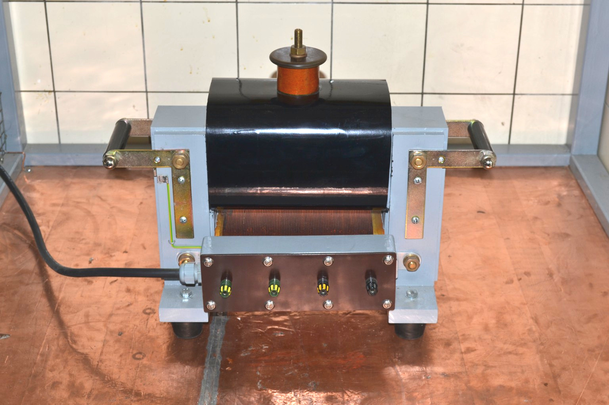
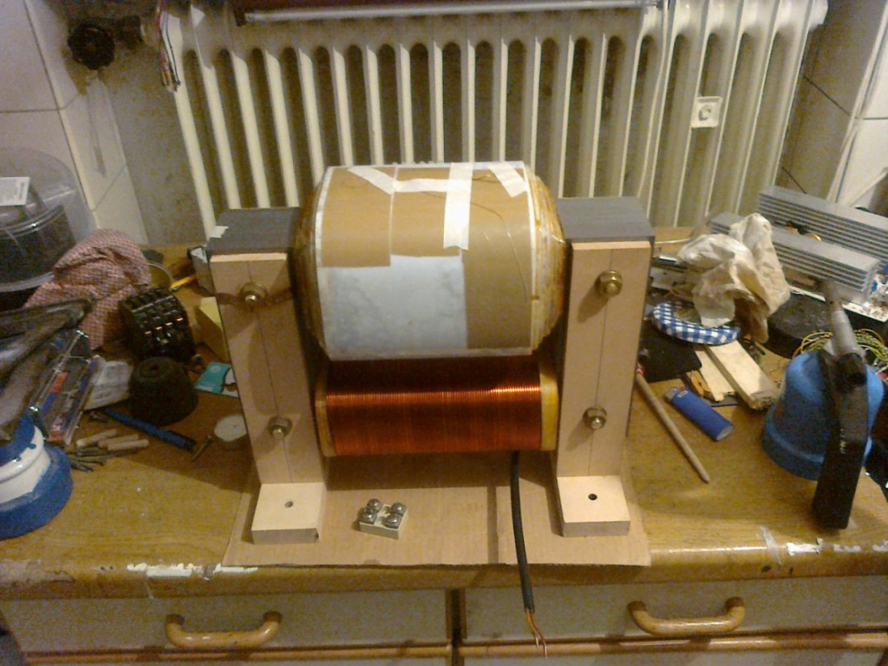
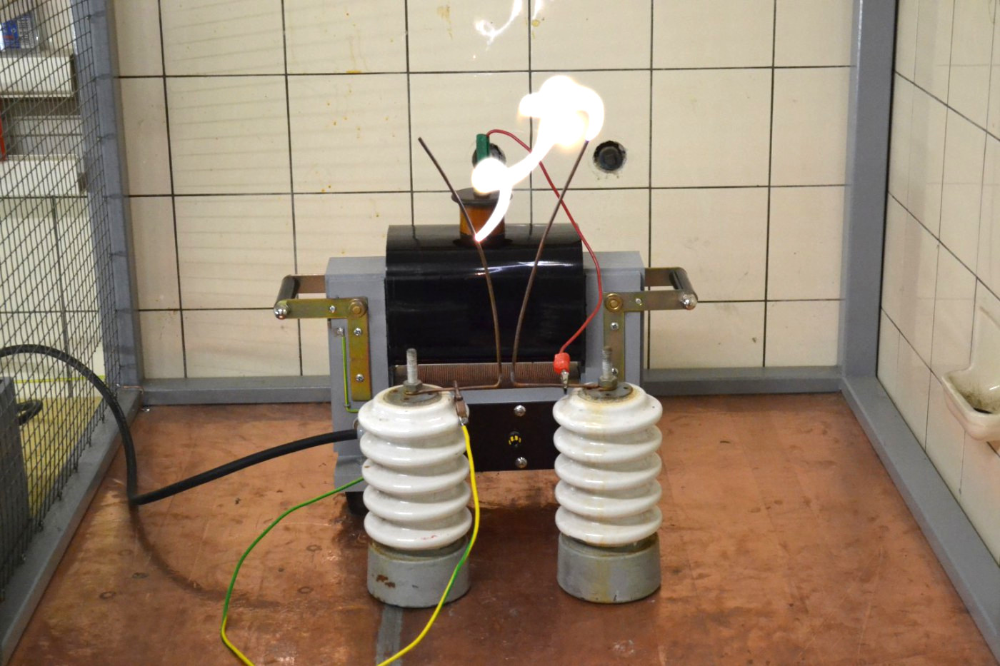
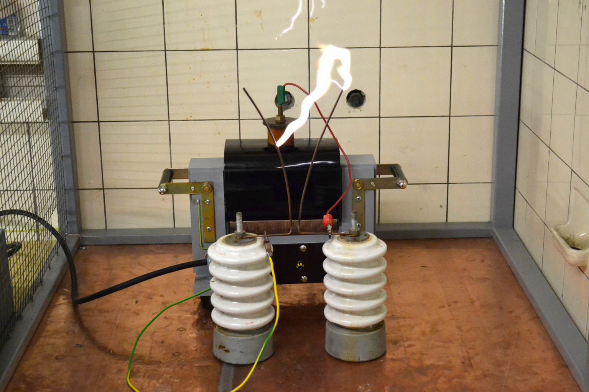

## 25kV transformer

I keep reading how "impossible" and "not doable with home means" the
construction of a high-voltage transformer supposedly is.
I'd therefore like to present the construction of my 25 kV / 2.4 kVA
transformer here.
I built it with the friendly support of an engineer at Ostfalia in
Wolfenbuettel, where I was living at the time, in the period from
December 2010 to about March 2011.

Here it is:

The technical data are as follows:

   Parameter           | Value
-----------------------|------------
Primary voltage        | 250 V
Primary winding        | 177 turns (2.0 mm enamelled copper)
Secondary voltage      | 25 kV, single-side grounded
Secondary winding      | 17466 turns (0.224 mm enamelled copper)
Rated power            | 2.4 kVA
Core                   | UI210, 141 laminations of 0.5 mm
   
The primary and secondary windings are wound on different limbs.
The advantage is that you can draw arcs without needing a current-limiting
choke as you would with an instrument transformer.
When operated as the mains transformer of a spark-gap-driven Tesla coil
(SGTC, as most call it), the resonance with the primary capacitor also
nicely produces a voltage rise -- which, with a "tightly wound" transformer
(primary and secondary on top of each other) would feed back to the mains
much more strongly.

## Core

The core is a UI210, i.e. with a winding window of 70x210 mm. With 141
laminations of 0.5 mm thickness this gives a core cross-section of about
7x7 cm = 49 cm^2. A rule of thumb lets you estimate the achievable
power: take the core cross-section in cm^2, square it, and you get the
approximate rated power in VA -- in this case 49^2 = 2401 VA ~ 2.4 kVA.
The core was later interleaved, tapped flat with a wooden mallet, and
clamped between beech battens with screws. You have to make sure no
electrical contact occurs between the threaded rods/screws and the core,
to avoid eddy currents. I also had to make sure not to create a
short-circuit turn with the handles. The black handles are therefore
solid material, into which I cut an M10 thread on each side on the lathe.
The cap nuts are then secured with short threaded studs.

The company I got the core laminations from is called Bausch; its
website is here: http://www.bausch.de

## Primary winding

The primary voltage was to be 250 V, since this is the maximum output
voltage of my variac.
At a rated power of 2.4 kVA this means a current of about 10 A.
With a maximum current of 3 A per mm^2 of wire cross-section, a 2 mm wire
can handle 1^2 * pi * 3 A = 9.5 A. I think that should be sufficient,
since the transformer is not meant for continuous operation.

The number of turns I calculated using the formula
<tex>$$
N = \frac{\sqrt{2} \cdot U}{2 \pi f \cdot A \cdot B}
$$</tex>
with U the primary voltage, B = 1.3 T the flux density in the core,
A = 0.0049 m^2 and f = 50 Hz the mains frequency.

This means the wire can be wound in two layers, which is also better
for heat dissipation.
For the winding I built a sturdy winding rig from two trestles that could
be turned with a 6-spoke wooden wheel about 40 cm in diameter. A ball-bearing
shaft drove a hardwood block that exactly matched the dimensions of the
core. On a sunny day I tied the rig to a tree in the garden, secured the
wire, and laid down the primary winding against the weight of a helper
who was hanging on the wire.

## Bobbin

The hardwood block mentioned above was oiled so no adhesive would stick
to it. I then sawed plates from 1 mm Pertinax and glued them around the
block with Uhu Endfest 300. After drying, the wooden block could be
removed with a firm tap.
To keep the wire from being kinked when winding, I glued balsa-wood
cheeks of about 30 mm to the sides that aren't in the winding window or
underneath the transformer.
I then filed and sanded those down so the wire would lie nicely against
them.
While winding, the wire was also fixed in place with double-sided tape
on the balsa wood and (on the second layer) on the previous layer. Since
two layers were wound, the winding ended on the same side where it had
started.

A piece of insulating sleeving over both wire ends prevents the wire
from springing back.
I then potted the un-wound edge (yellow-tinted in the photo) with epoxy:
a strip of packing tape on the winding, the primary coil laid on its
side, and the resin could be poured in. The whole winding was then
varnished with shellac.

## Secondary coil

I wanted a transformer for 25 kV, so by the formula above the turn count
was already fixed at about 17000.
A layer should be 1 mm thick, leaving about 0.75 mm for the insulation.
This was made up of three layers of 0.19 mm PE insulating film with a
dielectric strength of about 100 kV/mm.
The film is sold under the name Hostaphan.
The exact film I used is RN 190 and is available from W. Bath GmbH:
http://www.bathgmbh.de/polyesterf.htm
A dielectric strength of 100 kV/mm is specified.
I had a roll of 50 m at 600 mm width, weighing 8.4 kg.
You can't really tell how much was used by looking at the roll; I'd guess
about 6 m ended up on the transformer.

The bobbin was built analogously to the primary one, except that the
balsa cheeks here were only about 10 mm wide.
The inner secondary terminal is implemented as a strip of copper foil
glued to the bobbin before winding started, sitting between the hardwood
block and the bobbin during winding. That way I prevented anything from
getting tangled up.

The wire was then soldered to that strip and the winding was started.
For this transformer I followed this procedure:
1. Wind one layer.
2. Lock the bobbin in place; here I cut an M10 thread into the hardwood
   block, into which a screw could be driven through a hole in the
   flange plate of the rig.
3. Brush on shellac (possibly before step 2, depending on access in the rig).
4. Wrap insulating film around it.
5. Pull the film tight by hand and "smooth it on".
   The shellac makes the film stick to the winding. Once you've wrapped
   the film around the winding three times, you can press it tighter
   with the flat of your hands using friction. Only this way does most
   of the air get squeezed out of the winding!
6. Tape the film down with Tesa or similar and cut a small slit on the
   side (about 3 mm wide) all the way to the start of the winding.
   This slit must really be cut out, because otherwise the wire could
   be sheared off when tightening. Then loosen the locking screw again
   and start the next layer.

I used shellac because I was confident that, given its natural origin,
it would not attack the wire enamel and that, once the solvent had
evaporated, it would become so sticky that it would adhere properly
to the PE film and not bead off.

## Winding rig

* All shafts should be (and for the secondary winding: must be) on
  ball bearings. I made the shafts from M10 threaded rod and used
  6000-2RS bearings. You have to be painstakingly careful that all
  shafts are parallel to each other and don't wobble! Otherwise the
  wire can jump and the winding becomes faulty / has to be unwound again.
* The wire spool must be braked. At the time I used a paint brush
  pressed firmly against the spool with lab clamps, which braked it.
* The wire has to run over a guide pulley. Here's how that works:
  take a plastic cable conduit, e.g. 25 mm in diameter, and wrap it
  with exactly the wire that is to go onto the bobbin later.
  The wire is fixed at both ends. The wound length should be about
  5 cm more than the largest winding width of the coil to be wound.
  Paper rings are slipped onto this guide pulley (best glued *onto*,
  not *with*, it) and can be slid sideways.
  These rings later serve as "stops" and are pushed to the winding
  width using a ruler.
  The guide pulley sits about 20 cm from the bobbin on two
  "outriggers" / "ears" on the rig and is also ball-bearing-mounted.
  It is driven synchronously with the bobbin via a belt -- for this,
  highly flexible measurement cable soldered into a ring works well.
  It is important that the belt does not stretch, otherwise winding
  errors will occur!
* The shellac should be dissolved in warm spirit. That takes about three
  days for the necessary quantity (about 200 g) and produces fewer
  lumps than trying it with cold spirit. Even so, it should be filtered
  before use, e.g. through a tea strainer.
* Forget about cordless drills, motors, etc. for turning the rig.
  My engineer friend and I cranked the 17000 turns of the secondary
  by hand over three days around New Year's Eve 2010. With the thin
  wire and the large supply spool you have to do it very gently!
  In total, about 2 kg of wire ended up on the secondary.

## Assembly and potting

The layer insulation of the secondary protrudes about 1 cm beyond each side.
The winding width tapers by about 1 cm every 5 layers.
For the connection point of the secondary I made a brass turning,
essentially a disc with a knob on it that has an M10 thread.
The wire is soldered to the disc (after a large loop, so that if the
connection point should accidentally tear off there's still something
left to solder onto). The disc is then glued to the layer insulation
with double-sided tape.
Last came another insulation layer over the whole width with a hole
above each layer for the knob to poke through. This created
"castle moats" with a triangular cross-section on each side, which
were later filled with potting compound once the runaway shellac was
no longer sticky and the core was crated up.
The copper strip (inner secondary terminal) was clamped between the
core and the (beech-wood) core holder and soldered to a Rampa nut.
An M4 screw threads into that, and you can clamp wires directly to it.
An installation wire soldered to the strip leads to the terminal box.

Here is another picture of the transformer:

You can see the copper strip still wrapped around the bolts on the
outside (before being trimmed). The strip has already been laid through
underneath the wood once! You can also see the insulating sleeving on
the primary leads and the converging secondary winding.
Once the transformer was assembled this far, the terminal mentioned
above went on top, followed by the last layer of insulation.
The potting compound also flowed between the core and the bobbin
(and undesirably leaked out the bottom). This is very important,
because no air must remain between core and winding -- otherwise (at
least on the side opposite the ground terminal, where the full layer
voltage is already present) corona discharges form, which severely
damage the insulation.
For the same reason the "castle moat" must be filled.

## Cost

Here is a rough cost breakdown:

Component        | Price
-----------------|------------------
core laminations | EUR80
insulation film  | EUR200, with plenty left over
primary wire     | EUR10
secondary wire   | EUR50
total            | ca. EUR350

## Experiments

And this (and much more) is what such a transformer can do:

A tabular overview of the transformer measurements is here:
[WickeldatenUndMesswerte.ods](WickeldatenUndMesswerte.ods)

