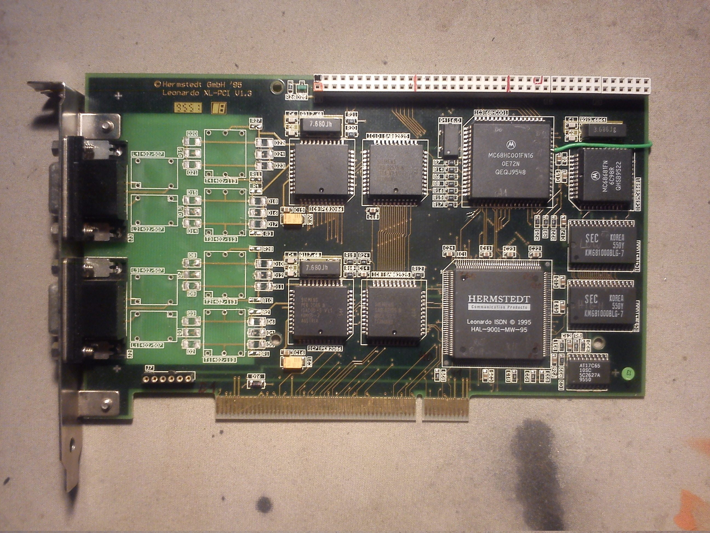
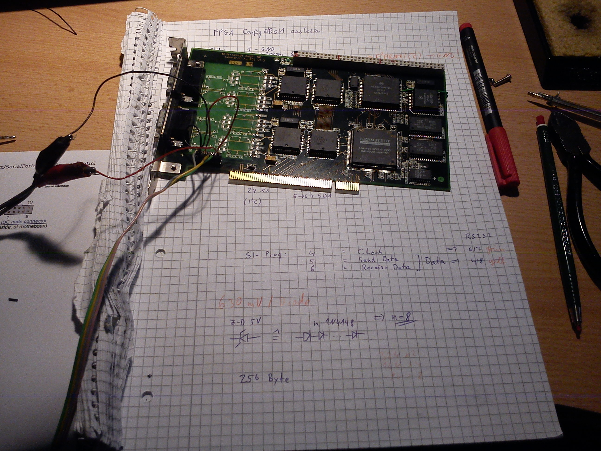
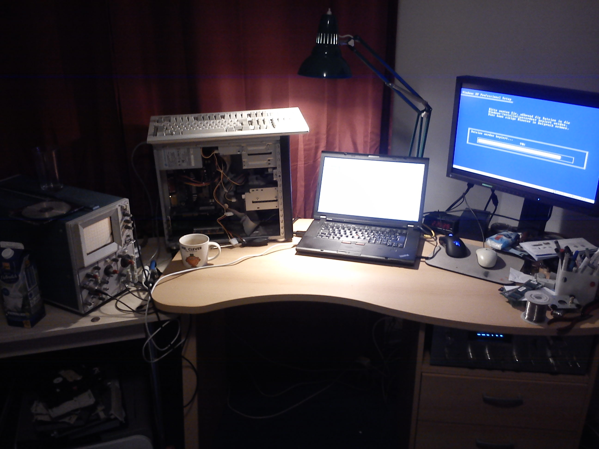

# Leonardo XL PCI

Older Mac users will probably remember them: the Leonardo ISDN cards from
the (now-defunct) company Hermstedt.

By chance I came across a Leonardo XL-PCI V1.3 in an eBay auction that
apparently contained a 68000. That had to be looked into right away!

So I quickly ordered the card for a few euros, together with a Pentium I
PC-Compatibility Card for PowerMacs, and started analysing it:

In this picture the ISDN transformers have already been desoldered so the
Sub-D sockets can be reused for other purposes. A precision-socket section
has also been soldered in for J7, to allow reading out the config EEPROM,
and you can see the green wire that connects the previously unused pin on
the expansion port to pin A23 of the 68HC001, so that the full 16 MB
address range is available on the expansion port.

It is a complete 68k system with the following components:

Component      |         Function                          | Designation on the card
---------------|-------------------------------------------|--------------------------
HAL-9001-MW-95 | FPGA for PCI interface                    | IC1
AT17C65        | I^2C EEPROM (24Cxx-compatible) for FPGA config | IC2
MC68HC001FN16  | 16 MHz 68000 with 8/16-bit bus            | IC3
KM681000BLG-7  | 2 pcs: 128kx16 SRAM                       | IC4 (ODD), IC5 (EVEN)
MC68681FN      | DUART with 3.686 MHz crystal              | IC6
PEB2086N       | ISAC (ISDN controller)                    | IC7, IC9
SAB82525N      | HSCX (SCC)                                | IC8, IC10
green LED      | a green LED on pin OP6 of IC6             | D25

Beyond that, the card has an expansion bus that resembles the PDS of the older Macs.

As far as I have measured it, it has the pinout recorded in [this Calc spreadsheet](Pinout_Expansion.ods).

Then, by means of a session with PonyProg and a flying-wire build of
the SI-Prog hardware, the config EEPROM was opened up and the following
configuration file was extracted:

* [FPGA config EEPROM as binary](fpga_config.bin)
* [FPGA config EEPROM as a text bitstream](fpga_config_bitstream.txt)

Unfortunately I have no idea what kind of FPGA this is, and my enquiries
to GAFICON -- the company that handles the German distribution for
Pro2Col, the buyer of Hermstedt -- have so far gone unanswered.

Then it was time to play around with the software a little.
You can still grab the original drivers via the Wayback Machine from
a backup of the Hermstedt site.
I downloaded and unpacked the Windows 95 driver. There are a few
unimportant files, but also some binaries, e.g. [HermWAN.sys](HermWAN.sys)
and [LeoFW.bin](LeoFW.bin).

The name of the latter file in particular triggered some heavy associations
:-). So, off to the hex editor:
in the first two 32-bit words you find the values 0x400 and 0x4AC,
and the actual code in the file starts at 0x400. As one knows from the
68000 user manual, those are the Initial Program Counter and the
Supervisor Stack Pointer!
That alone makes it clear that this file is obviously loaded "low" into
the on-board RAM and started directly from there.
It is also known that the Exception Table sits at addresses 0x8 to 0x3FC.
It therefore lies entirely in RAM and can be modified arbitrarily when
using one's own firmware! Very handy...

So I ran the firmware through IDA Pro, and lo and behold -- they had
forgotten to strip the debug symbols before shipping the driver :-).
That makes it easy to identify the functions and produce an annotated
listing: [firmware disassembly](LeoFW.bin.asm).

The Windows driver HermWAN.sys was also not stripped of its debug symbols,
so it too is helpless against IDA Pro. Since this is x86 code, the HexRays
Decompiler even works, allowing pseudocode to be produced :-).

The most interesting thing about the Windows driver is that, using SoftICE
(a Windows debugger), you can hook into the driver as it loads at boot
time and watch with an oscilloscope on the reset pin of the 68HC001 to
see what gets written into which registers in order to deassert the reset
and start the 68HC001.
Since the reset pin is also routed to the expansion port, you don't even
have to solder anything to the card itself for this :-).

Then, with `lspci` from Linux you find out that the card occupies 1 MByte
of PCI address space, and that the control registers sit in the upper
512 kByte -- more precisely from 0x80000 in the card's address space.

That alone is enough to write a Linux kernel module that releases the
reset on load and re-asserts it on unload: [leodrv](leodrv.tar.gz).
The source code also gives the exact register positions.

That's where things stand at the moment; more will follow as soon as
there's time again for this interesting project.

