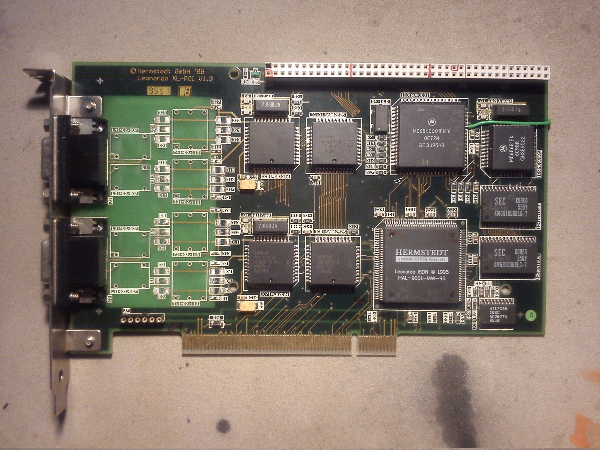
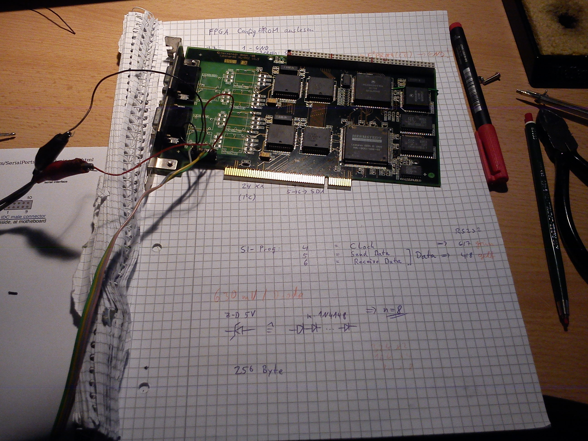
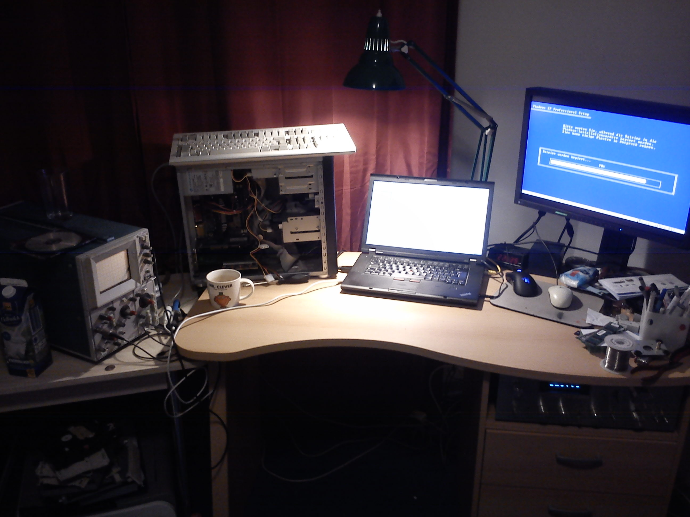

# Leonardo XL PCI

Sie werden den älteren Mac-Benutzern wohl bekannt sein:
die Leonardo-ISDN-Karten der (inzwischen insolventen) Firma Hermstedt.

Durch Zufall entdeckte ich in einer eBay-Auktion eine
Leonardo XL-PCI V1.3, die augenscheinlich einen 68000er
enthielt. Das musste sofort untersucht werden!

Also flugs das Teil für ein paar Euro zusammen mit einer 
Pentium I-PC-Compatibility-Card für PowerMacs geordert und analysiert:

In diesem Bild sind die ISDN-Übertrager bereits heruntergelötet, um die Sub-D-Buchsen
für andere Zwecke verwenden zu können. Ebenfalls wurde bereits ein Stück
Präzisionssockel für J7 eingelötet, um das Config-EEPROM auslesen zu können
und man kann das grüne Kabel sehen, dass den ehemals unbelegten Pin am Erweiterungsport
mit dem Pin A23 des 68HC001 verbindet, um den gesamten Addressraum
von 16MB am Erweiterungsport zur Verfügung zu haben.

Es handelt sich dabei um ein komplettes 68k-System mit folgenden Komponenten:

Komponente     |         Funktion                         | Bezeichnung auf der Karte
---------------|------------------------------------------|--------------------------
HAL-9001-MW-95 | FPGA für PCI-Interface                   | IC1
AT17C65        | I²C-EEPROM (24Cxx-komp.) für FPGA-Config | IC2
MC68HC001FN16  | 16MHz-68000er mit 8/16-Bit Bus           | IC3
KM681000BLG-7  | 2 Stk: 128kx16 SRAM                      | IC4(ODD), IC5(EVEN)
MC68681FN      | DUART mit Quarz 3.686MHz                 | IC6
PEB2086N       | ISAC (ISDN-Controller)                   | IC7, IC9
SAB82525N      | HSCX (SCC)                               |IC8, IC10
grüne LED      | eine grüne LED am Pin OP6 von IC6        | D25

Des weiteren verfügt die Karte über einen Erweiterungsbus, der dem PDS der älteren Macs ähnelt.

Soweit ich ihn ausgemessen habe, hat er die in [diesem Calc-Dokument](Pinout_Expansion.ods) hinterlegte Belegung.

Dann hat sich mittels einer Sitzung mit PonyProg und einem fliegenden Aufbau
der SI-Prog-Hardware das Config-EEPROM geöffnet und folgende Konfigurationsdatei ausgespuckt:

* [FPGA-Config-EEPROM als Binary](fpga_config.bin)
* [FPGA-Config-EEPROM als Textzeile](fpga_config_bitstream.txt)

Leider ist mir völlig unklar, um was für ein FPGA es sich hierbei handeln könnte
und meine diesbezüglichen Anfragen an die Firma GAFICON, die in DE den Vertrieb für
die Firma Pro2Col, den Aufkäufer von Hermstedt, übernimmt, blieben noch unbeantwortet.

Dann war es an der Zeit, mal ein bisschen mit der Software herumzuspielen.
Die Originaltreiber bekommt man immer noch mittels der Wayback Machine von
einem Backup der Hermstedt-Seite.
Ich habe mir dann den Windows 95-Treiber heruntergeladen und mal entpackt.
Es finden sich ein paar unwichtige Dateien, aber auch ein paar Binaries,
z.B. die Dateien [HermWAN.sys](HermWAN.sys) und [LeoFW.bin](LeoFW.bin).

Insbesondere der Name der letzten Datei hat bei mir heftigste Assoziationen
hervorgerufen :-). Also mal im Hex-Editor angeschaut: 
In den ersten beiden 32-Bit-Worten stehen die Werte 0x400 und 0x4AC,
wobei in der Datei ab 0x400 der Code losgeht. Wie man aus dem 68000-User-Manual weiß,
sind das der Initial Program Counter und Supervisor Stack Pointer!
Damit ist schon mal klar, dass diese Datei offensichtlich "unten" in das On-Board-RAM
geladen und von dort direkt gestartet wird. 
Ausserdem ist bekannt, dass an den Adressen von 0x8 bis 0x3FC die Exception Table steht.
Sie liegt somit vollständig im RAM und kann daher bei Verwendung eigener Firmware
beliebig verändert werden! Sehr praktisch...

Also habe ich die Firmware mal durch IDA Pro gejagt, und siehe da, man hat vor dem Hochladen
des Treiber vergessen, die Debug-Symbole in der Firmware zu entfernen :-).
Also ist es ein leichtes, die Funktionen zuzuordnen und ein kommentiertes Listing zu erstellen:
[Firmware-Disassembly](LeoFW.bin.asm).

Ebenfalls der Windows-Treiber HermWAN.sys wurde nicht von den Debug-Symbolen bereinigt,
sodass dieser ebenfalls gegenüber IDA Pro machtlos ist. Da es sich hierbei um
x86-Code handelt, funktioniert sogar HexRays Decompiler, um Pseudocode zu erstellen :-).

Das Interessanteste an dem Windows-Treiber ist die Möglichkeit, mittels SoftICE, einem Windows-Debugger,
sich dann beim Laden des Treibers beim Rechnerstart einzuklinken und mit einem Oszilloskop
am Reset-Pin des 68HC001 zu schauen, was in welche Register geschrieben werden muss,
um den Reset zu deaktivieren und den 68HC001 zu starten.
Da der Reset-Pin auf den Erweiterungsport geführt ist, muss man dazu nicht mal
an der Karte selbst rumlöten :-).

So und mittels lspci von Linux findet man dann raus, dass die Karte 1MByte des PCI-Adressraums belegt
und die Control-Register in den oberen 512kByte, genauer ab 0x80000 im Karten-Adressraum, liegen.

Damit lässt sich schon mal ein Linux-Kernel-Modul schreiben, dass beim Laden
den Reset deaktiviert und beim Entladen ihn wieder aktiviert: [leodrv](leodrv.tar.gz).
Im Quellcode finden sich auch Angaben zu der genauen Position der Register.

Das ist im Moment der Stand der Dinge; Weiteres folgt sobald wieder Zeit für
dieses interessante Projekt vorhanden ist.

