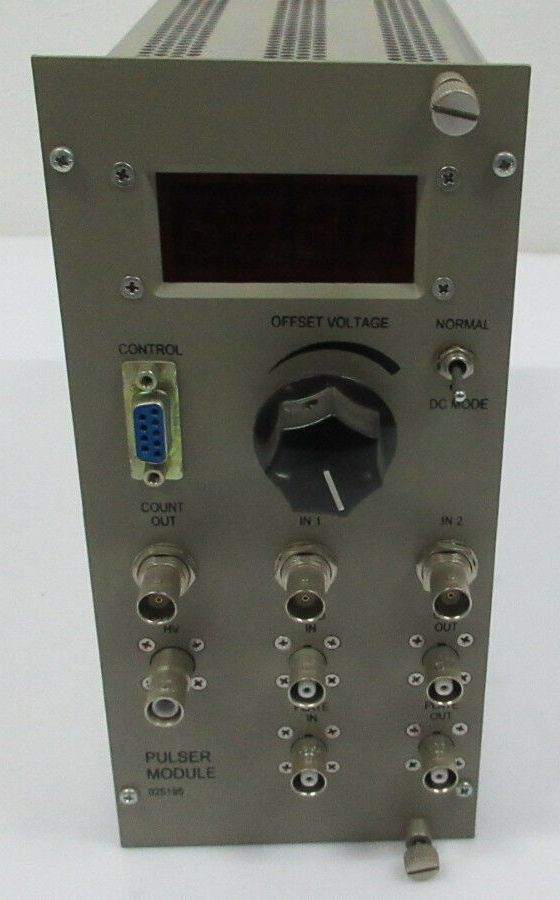
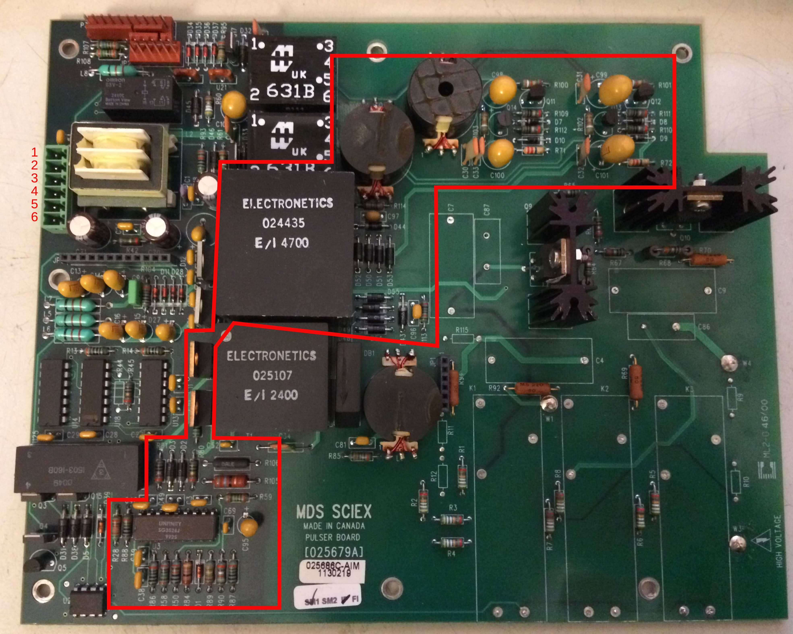
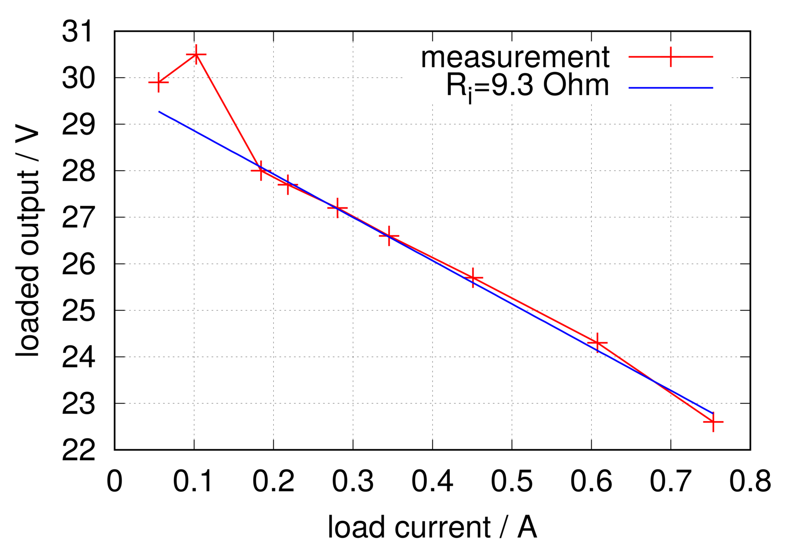

From an old Sciex QStar XL time-of-flight mass spectrometer I was able to salvage a pulser module:

Alongside some nice components -- MHV and SHV connectors, high-voltage relays and MOSFETs, and an [OPA541](http://www.ti.com/product/OPA541) power op-amp -- it also contains a switch-mode power supply that drives the gate drivers for the HV MOSFETs.

This page is about the area outlined in red on the two boards:

The controller IC used here is the [SG3526J](https://www.microsemi.com/existing-parts/parts/55269).
The larger of the two transformers, labelled 024435, was made by [Electronetics](https://www.electronetics.us/) and is probably a custom part commissioned by Sciex.

The table below shows the wiring from the power-supply connector at the top left (pins 1-6) to the
[NIM connector](http://www-bd.gsi.de/dokuwiki/lib/exe/fetch.php?media=misc:nim-standard.pdf):

Pin on board | Wire colour | NIM pin | Function
-------------|-------------|---------|------------------
1            |   yellow    |   16    |   +12V
2            |   white     |   17    |   -12V
3            |   red       |   10    |   +6V
4            |   blue      |   28    |   +24V
5            |   black     |   34    |  power GND
6            |   grey      |   42    | high-quality GND

If you now connect a 12V supply between pin 1 and pin 5, the switch-mode supply at least comes to life.
It delivers a symmetric +/-15V for each of two gate drivers.
For further testing, the gate-driver sections of the circuit were disconnected.
Various load resistors were placed between +15V and -15V across the paralleled outputs.
The resulting [load curve](Belastungskurve.dat) is shown here:

The model assumed is an ideal voltage source with a series (internal) resistance.
The [fit](plot_smps_load.sh) to the measurements (points with I&lt;0.15A were ignored)
gives an internal resistance of about 9.3 ohm at an open-circuit voltage of 29.7 V.
A measurement under no load, however, yields an open-circuit voltage of around 70 V.
The likely reason is that the SMPS topology used here has no feedback
from the secondary side to the primary-side control.

The supply is interesting because its construction is fairly simple (= robust, easy to repair)
and the isolation between the secondary and primary should be reasonably high-voltage-rated.
Together with its usable rated output current, it might be suitable
for driving the gates in a DRSSTC... ?
