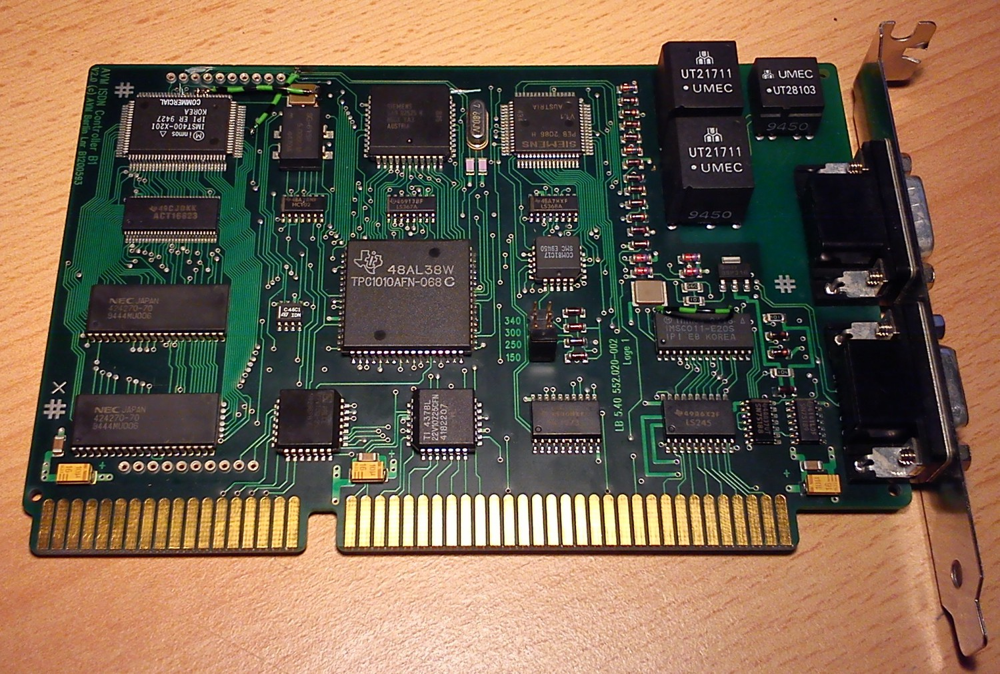
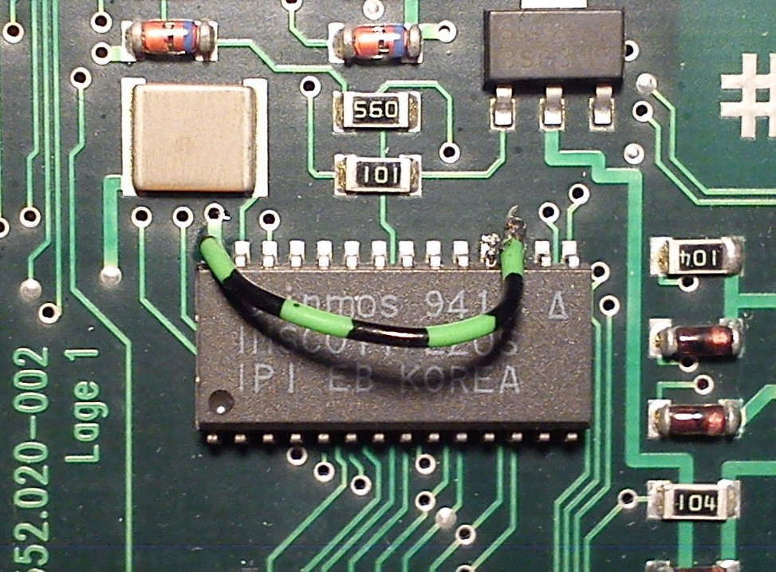
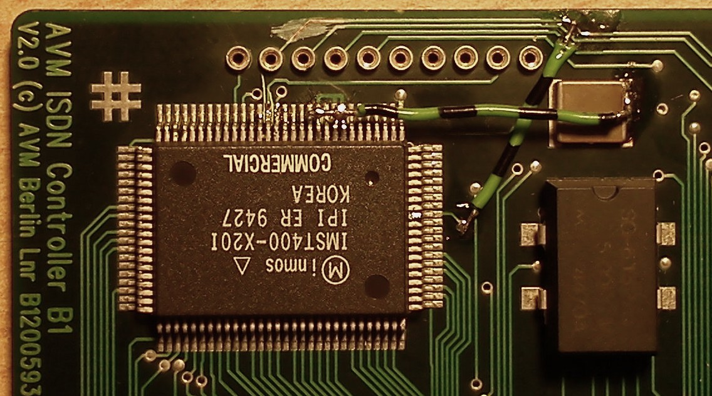
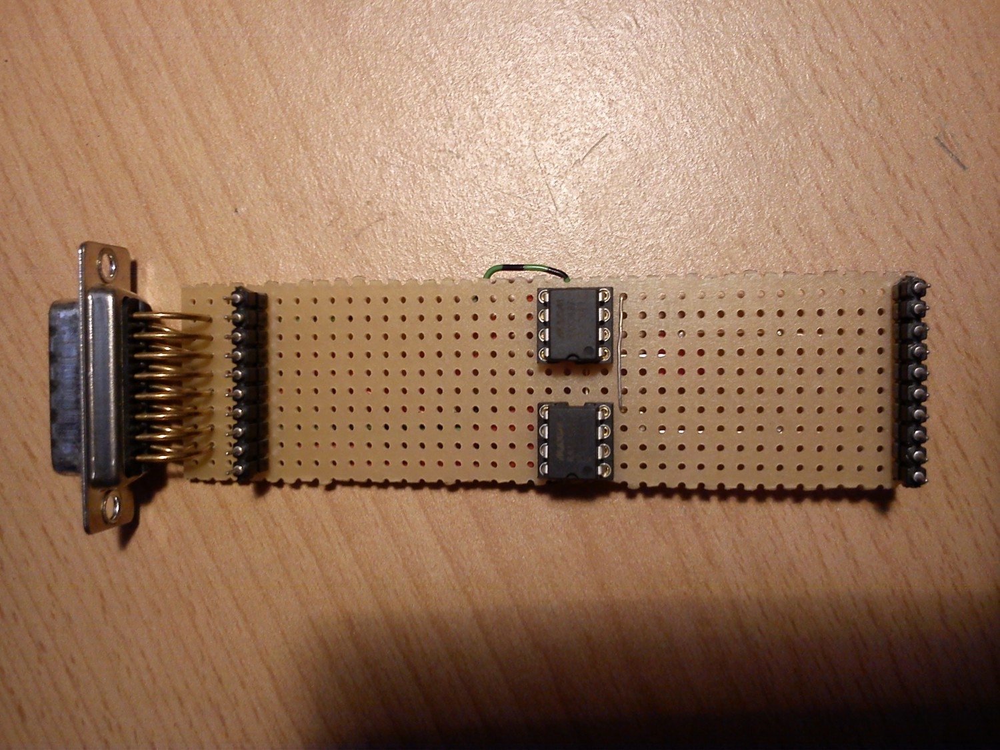
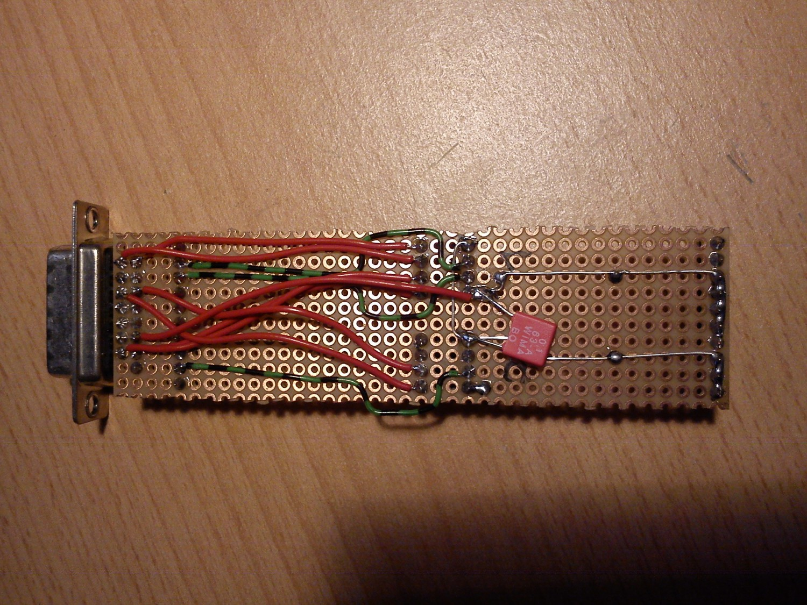

# AVM B1

The AVM B1 is an active ISDN controller and was built for the ISA bus up to version 2.0.
Up to version 3.0 it uses a T400 transputer.

On the left side of the card sits a small transputer system with 1 MB of RAM
and a TRAM-like expansion interface. At the bottom right is the C011, which
can be addressed from the ISA bus on one of four jumper-selectable addresses.
On the B1 the C011 is hard-wired to link 0 of the T400. AVM has wired
the links on the board for 10 Mbit/s.

I have made a few modifications to this B1:

First, the link speed of the C011 was raised to 20 Mbit/s:

For this, pin 17 is bent up using a fine tool -- I used a sharp probe tip --
and wired to +5V, e.g. pin 28 of the C011.
Now of course the link speed of the T400 has to be adjusted as well:

This is unfortunately a bit fiddlier, as the T400 has an even tighter pin
pitch than the C011. Pins 8, 9 and 11 have to be bent up and tied to +5V,
e.g. on the 1 uF capacitor that is soldered right next to the T400 and
serves to buffer the internal supply voltage of the T400's link interface.

It is also handy, as will become apparent later, to have the RESET pin
present on the expansion bus. Pin 2 is not used by the B1's normal
operation and can therefore be cut at the marked location and wired with
a piece of wire to pin 92 of the T400, or to a nearby via.

The pinout of the expansion bus, as far as I have measured it, is then as follows:

Pin | Meaning   | Pin | Meaning
----|-----------|-----|---------
1   | ?         |  11 | ? (PAL)
2   | RESET     |  12 | ? (PAL)
3   | ? (82525) |  13 |   GND
4   | ? (82525) |  14 |   GND
5   | ? (82525) |  15 |   GND
6   | ?         |  16 |   GND
7   | ?         |  17 |   GND
8   | Link1Out  |  18 |   +5V
9   | Link1In   |  19 |   +5V
10  | ?         |  20 |   +5V

At the latest at this point you should use [ispy](http://www.wizzy.com/wizzy/ispy.html)
to check whether the card still works correctly, and if not, start troubleshooting.

You may now wonder what these modifications are for.
Since the B1 is addressable at 0x150 and behaves there like an Inmos B004
transputer development board, it makes for a very cheap and direct
transputer entry-level card.
If link 1, which is brought out to the expansion bus (see above), now
leads "outside", you can hook up further transputer(s) (or transputer
networks) -- for example the [AVM T1 (-B if you have one)](../avm_t1).

For that you need an RS-422 converter, which is plugged onto the B1:

Maxim gives you two MAX3467 chips for free as samples. They are RS-422
converters good for up to 40 Mbit/s -- more than enough for the transputer
links. They are wired up according to the schematic below, ideally on a
piece of perfboard. The 15-pin D-Sub connector is not strictly necessary,
but since I use the original cable for the connection to the T1 I have
used one here. The pinout of that cable, along with further information
about the T1, can be found on the [corresponding page](../avm_t1).

