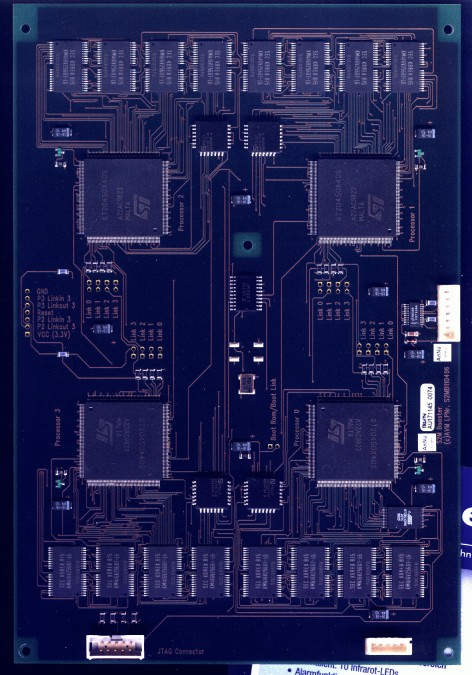
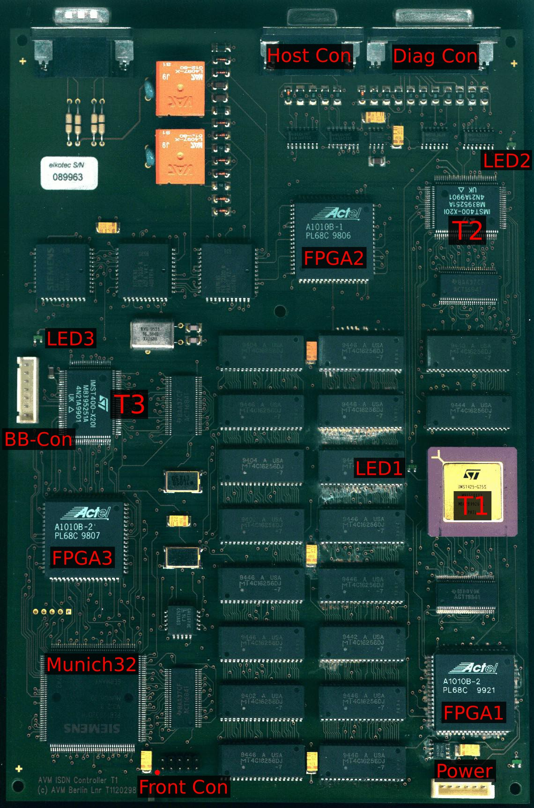
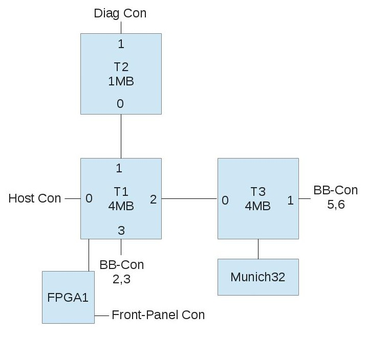
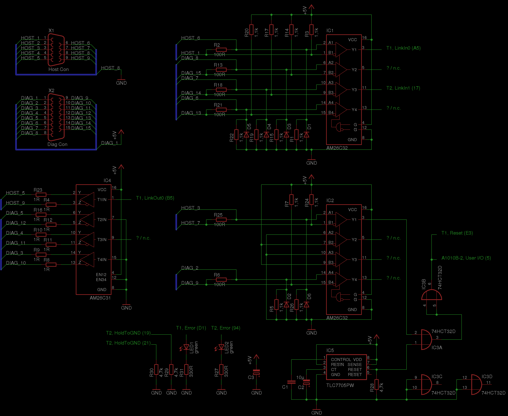
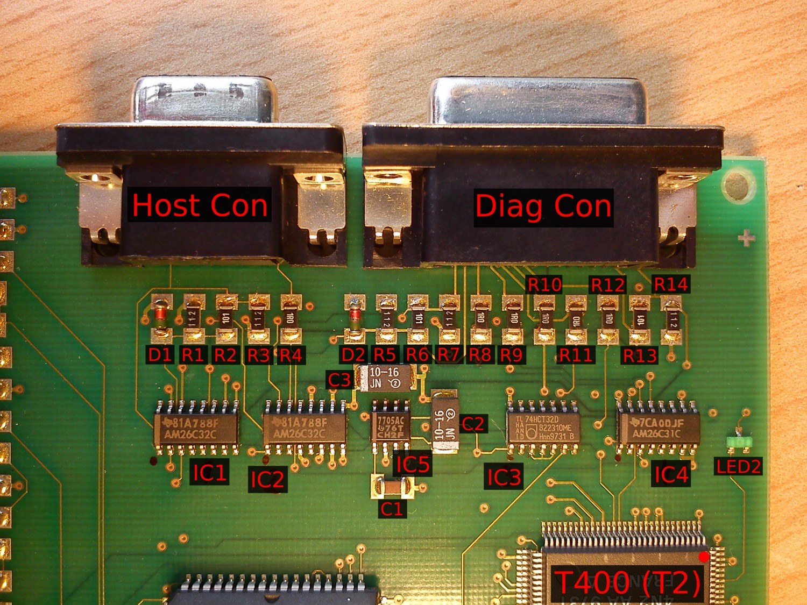
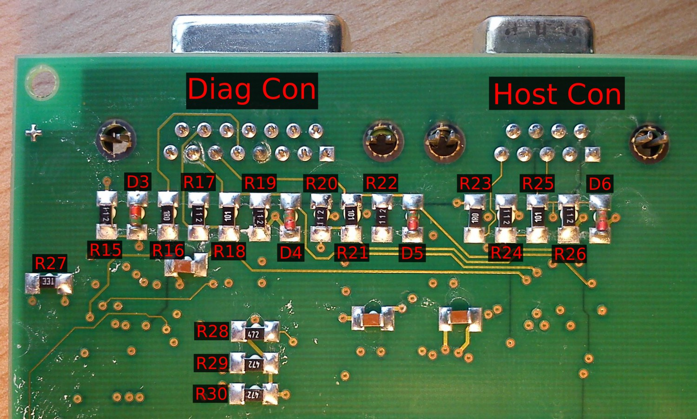
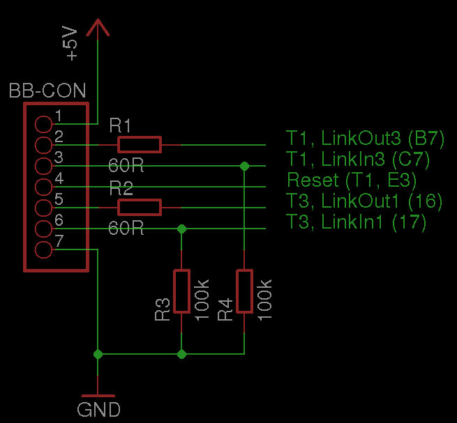
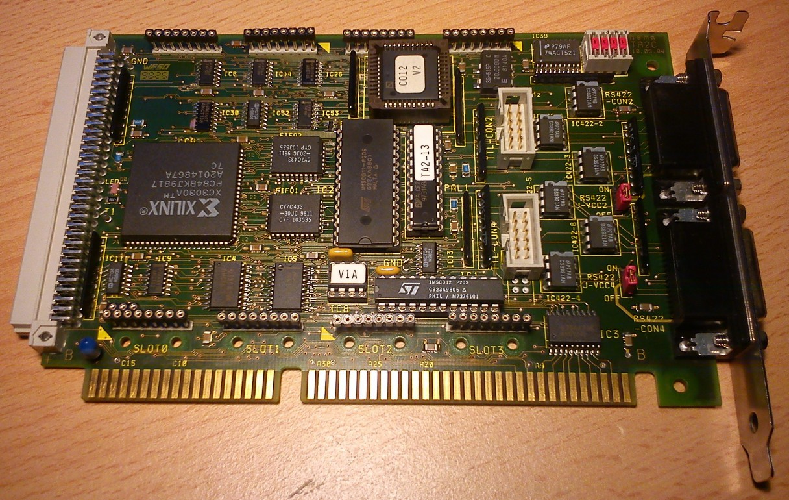
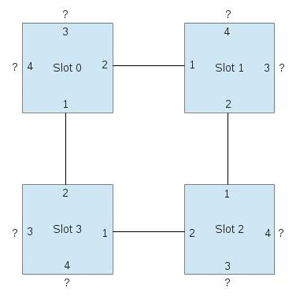

# AVM T1

The AVM T1 is an ISDN controller that, in the 1990s, served to relieve
servers with an ISDN connection from the burden of ISDN management.
Other companies, such as Hermstedt and Eicon, made similar boxes or PC
cards. What all these "interesting" devices have in common is that
they carry one or more dedicated mini-computers on board -- each with
its own processor, RAM and peripherals. At the time, this approach
was probably cheaper than spinning a custom ASIC for each individual
product.

When the host machine booted up, the embedded processor was usually
held in reset so the host PC could access the mini-computer's RAM
unhindered. The driver then loaded the firmware into the card's RAM
and started the processor. Communication and data exchange between
host and mini-computer were then handled e.g. via dual-ported RAM.

In its base configuration ("T1") the AVM T1 uses 3 transputers (two
T400s and one T425) with a total of 9 MB of DRAM, plus a Munich32 ISDN
controller. The "T1-B" -- where "B" stands for Booster Board -- adds
4 more transputers of type ST20450, each with 2 MB of DRAM, bringing
the total to 7 transputers with 17 MB of DRAM.

When I read about the T1 on the excellent site
[www.geekdot.com](http://www.geekdot.com), my interest was piqued.
I had heard of the transputer concept before, but what I saw there
promised an experience similar to the [Leonardo XL](../../leonardo_xl).

When my first T1 arrived from eBay, I opened the case and inspected
the boards. The component designators match the ones Axel Muhr uses
on [his T1 page](https://www.geekdot.com/category/hardware/transputer/avm-t1/).

The transputers on the board are wired up as shown in the following diagram:

Each box is a transputer or a larger chip, and the numbers along the edges
of the transputers identify the link.

The interface circuitry around the "Host Con" and "Diag Con" is shown in
the drawing below.
[Here](files/elektrotechnik/computerbasteln/transputer/avm_t1/t1_interface/t1_interface.sch)
is the EAGLE schematic from which the picture was generated, and
[here](files/elektrotechnik/computerbasteln/transputer/avm_t1/t1_interface/AM26C3x.lbr)
is the corresponding EAGLE library with AM26C31 and AM26C32.

The designators of the resistors and diodes in the schematic follow these pictures:

According to my measurements, a small green LED is connected from each
transputer's Error output to ground.
The pinout of the "BB-Con" -- the connection to the booster board -- is shown here:

and [here](files/elektrotechnik/computerbasteln/transputer/avm_t1/t1_bb_con/t1_bb_con.sch) is the corresponding EAGLE schematic.

A long PCB sits in the front panel of the T1 carrying the front LEDs
and a few shift registers -- five 74HC595 chips. The board has two
connectors, one for power and one for the data going through. The pinout
of the power connector is:

Pin | Meaning
----|----------
1   | n.c.
2   | +5V
3   | GND
4   | n.c.

The Power LED is connected directly to +5V via a 470 ohm resistor.
The pinout of the data connector is:

Pin |          Meaning             | Target | Pin
----|------------------------------|--------|----
1   | n.c.                         |        |
2   | n.c.                         |        |
3   | n.c.                         | FPGA1  | 17
4   | /OE of all HC595             | FPGA1  | 67
5   | n.c.                         | FPGA1  | 20
6   | Data In, order see below     | FPGA1  | 30
7   | Storage Clock (STCP)         | FPGA1  | 46
8   | Shift Clock (SHCP)           | FPGA1  | 33
9   | n.c.                         |        |
10  | n.c.                         |        |

The pattern to be displayed is first shifted serially into "Data In"
(pin 6), with pin 8 (Shift Clock) acting as the clock. A rising edge
on pin 7 (Storage Clock) then transfers the shifted-in pattern to the
output registers. When /OE (pin 4) is pulled low, the pattern is displayed.
The order of the LEDs is as follows:
first LEDs 1 through 30, then the System LED, then the D-Channel LED, and
finally the Sync LED.
What's still left to figure out is how the data gets from one of the
transputers to the front-panel interface.

After a while I spotted another T1 on eBay, this time sold with the PC
interface card. It changed hands for not much money, and here you see
a picture of the ISA interface card for the T1:

This is clearly a card that wasn't designed by AVM itself.
Rather, hema Elektronik GmbH appears to have had a hand in it: searching
for "hema TA2" (see the upper right corner of the board) turns up
references to an "ISA-to-RS422 link adapter card".
The interesting thing about the card is that, alongside an Inmos C011
and C012, it carries a Xilinx CPLD that is evidently in charge of
managing the "Linkbus" (per the silkscreen on the underside).
Let's see what's behind that...

There are also four TRAM sockets on the card, though I haven't yet
mapped out how they are interconnected and how they relate to the C011/C012.

The 8-pin DIL IC labelled "V1A" contains a Two-Wire PROM from Xilinx,
which presumably holds the configuration of the XC3030A CPLD. If one
could decode that, it would probably be possible to understand the
structure of the Linkbus and find a use for it...

## 21.03.2013: Update

The pinout of the cable between the T1 and the host card is as follows:

Pin no. T1 (D-Sub 9) | Pin no. TA2 (D-Sub 15)
---------------------|-----------------------
1                    | 15
2                    | n.c.
3                    | 11
4                    | n.c.
5                    | 1
6                    | 7
7                    | 3
8                    | 6
9                    | 9
shield               | shield, 2
n.c.                 | 4
n.c.                 | 5
n.c.                 | 8
n.c.                 | 12
n.c.                 | 13

The DOS driver for the AVM T1 contains a program called `CTA2.EXE` that
is of interest in this context.
The name alone gives away its function: Control TA2.
Through it I found out that this card can do quite a bit more than I
first suspected:
there's the C011 and the C012. The C011 is referred to as the "Fast Link"
and is buffered through the two FIFO RAMs. The C012 is referred to as
the "Slow Link" and has no FIFO.
The "Slow Link" is hard-wired to the lower 15-pin D-Sub socket, labelled
"CON4". The upper socket, labelled "CON2", can be switched in software
to connect either to the TRAMs/the Linkbus or to the C011. The link
speeds of the C011/C012 and the TRAMs can also be set in software.
On top of that, CTA2.EXE provides a way to test the external connections.
That's of course excellent for verifying the guessed pinout:

Pin | Meaning
----|----------
1   | pos. RS-422 LinkIn
9   | neg. RS-422 LinkIn
7   | pos. RS-422 LinkOut
15  | neg. RS-422 LinkOut
3   | pos. RS-422 /Reset Out
11  | neg. RS-422 /Reset Out
4   | pos. RS-422 /Error In
12  | neg. RS-422 /Error In
5   | pos. RS-422 /Analyse Out
13  | neg. RS-422 /Analyse Out
8   | +5V if J-VCC2/4 is "ON", n.c. if "OFF"
2   | GND
6   | GND
10  | GND
14  | GND

For this you need a 15-pin connector wired as follows:

Test no. |       Connection      |   Pins
---------|-----------------------|---------
1        | LinkIn  <-> LinkOut    | 1 -- 7
1        | LinkIn  <-> LinkOut    | 9 -- 15
2        | /Reset  <-> /Error     | 3 -- 4
2        | /Reset  <-> /Error     | 11 -- 12
3        | /Analyse <-> /Error    | 5 -- 4
3        | /Analyse <-> /Error    | 13 -- 12

This also lets us pin down the pinout of the TTL CON connectors on the card:

Pin | Meaning
----|-----------
1   | LinkIn
2   | GND
3   | GND
4   | LinkOut
5   | /Error In
6   | /Analyse Out
7   | GND
8   | /Reset Out
9   | +5V
10  | +5V

Next I started measuring out how the TRAM sockets are interconnected,
though that work isn't finished yet.
The blue boxes are the slots, and the numbers on the edges mark the link
number of the corresponding connection.

