## GYS PROTIG 201 AC/DC

Kürzlich ist bei mir ein GYS PROTIG 201 AC/DC eingezogen:

Ich spielte schon länger mit dem Gedanken, mir ein WIG-Schweißgerät für Schweißarbeiten an Vakuumanlagenteilen, für den Haus- und Hofgebrauch und weil's lustig ist, mit flüssigem Metall herumzuklecksen, zuzulegen.
Neulich kam dann einer meiner Mitbewohner auf mich zu, der für ein Kunstprojekt ebenfalls ein WIG-Schweißgerät brauchte.
Der Entschluss war schnell gefasst, aber die nächste Frage lautete dann natürlich, welches Gerät kaufen?

## Modellauswahl

Ich hatte vor längerer Zeit schon mal das Welbach AMPERO 225 ins Auge gefasst, weil es im Vergleich zu den üblichen Billiggeräten marginal besser verarbeitet zu sein schien.
Es stellte sich leider heraus, dass es dieses Gerät scheinbar nirgendwo mehr zu kaufen gibt.
Bei der Suche nach einer Alternative, während derer mir auch etliche Billiggeräte über den Bildschirm flimmerten, reifte mehr und mehr die Entscheidung, dass es in diesem Fall sinnvoll wäre, doch etwas mehr Geld als geplant auszugeben.
Die Verarbeitungsqualität der billigeren Alternativen, insbesondere die der Stecker für Brennertaster und/oder Fußpedal, schreckte mich mehr und mehr ab.

Fündig wurde ich schließlich bei der französichen Firma [GYS](https://www.gys-welding.com/).
Ich bestellte das TIG 200 AC/DC HF über den Online-Shop [https://www.ach-shop.com](https://www.ach-shop.com/) und bekam (nach einer Woche und ein paar Telefonaten) das [PROTIG 201 AC/DC](https://www.gys-welding.com/spip.php?page=produit&reference=063945&lang=de) geliefert.
Scheinbar war das "TIG 200 AC/DC HF FV" zum Zeitpunkt der Bestellung bereits ein Auslaufmodell, bloß der Online-Shop über den ich bestellte, hatte es noch nicht aus dem Programm genommen.
Anyway, das "PROTIG 201 AC/DC" ist das designierte Nachfolgemodell und wer würde sich dagegenstellen, zum gleichen Preis ein moderneres Gerät zu erhalten...?
Kurz noch zur Übersicht und Einordnung die wichtigsten Daten aus der [Bedienungsanleitung](https://www.gys-welding.com/pdf/manual/de/063945.pdf):
 - unterstützte Schweißverfahren: Elektrode-Hand (MMA), WIG DC, WIG DC Pulse, WIG AC, uvm.
 - Strom WIG AC: 200A (13%), 90A (60%), 80A (100%)
 - Strom WIG DC: 160A (23%), 110A (60%), 90A (100%)
 - Strom MMA: 160A (22%), 110A (60%), 95A (100%)
Die %-Zahlen in Klammern sind die jeweilige Einschaltdauer.
 - Netzanschluss: 2.5m 1.5mm² mit Schuko-Stecker
 - aktive PFC, Betrieb von 85 bis 265V Netzspannung
 - "Lüfter: beim E-Hand (MMA)-Schweissen läuft der Lüfter in Dauerbetrieb. Im WIG-Modus ist der Lüfter nur in den Schweissphasen in Betrieb und schaltet sich ab nach der Abkühlung."
 - HF- oder Lift-Zündung für WIG
 - Pinbelegung des Brennertasters und des Fußpedals sind im Handbuch abgedruckt

## Unboxing

Letzte Woche war es dann soweit und GLS brachte ein paar große Pakete vorbei:

Beim Außpacken dann die große Ernüchterung: Da ist ja nur Papier drin!

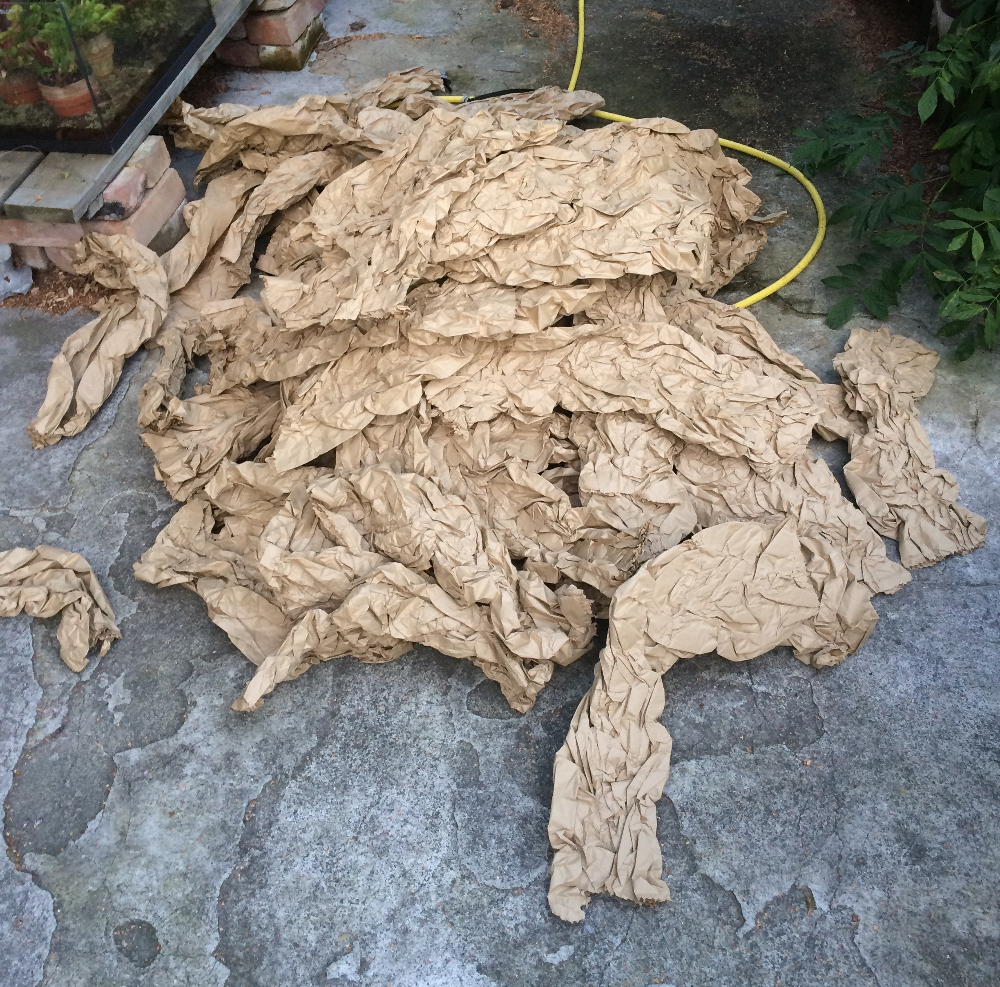

Zwischen all dem Stopfmaterial (lies: GYS hat die bestellten Sachen ordentlich verpackt) fand sich dann doch noch ein Schweißgerät samt Zubehör:

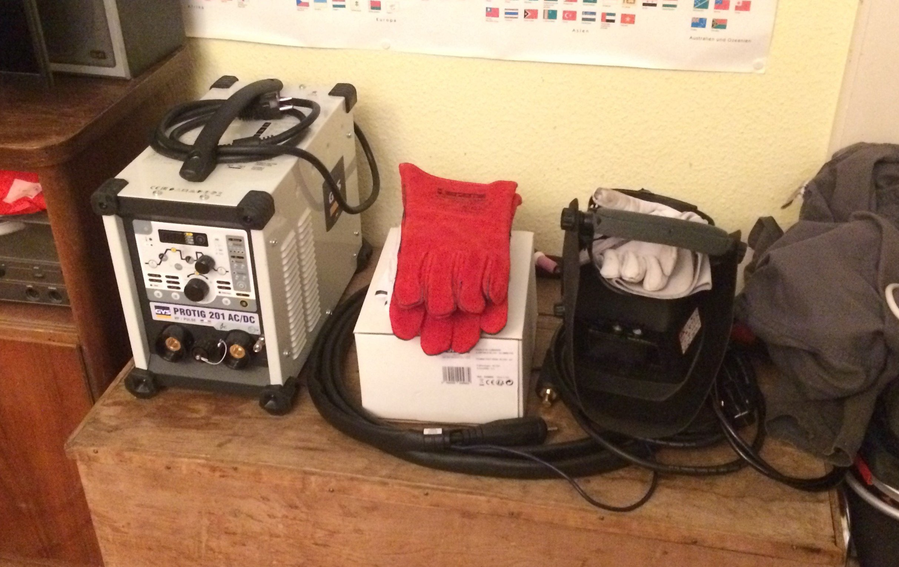

Das Frontpanel besteht aus einer Folientastatur und zwei Inkrementalgebern.
Zwischen den beiden Dinse-35 Buchsen (links "+", rechts "-") findet sich der Anschluss für den Brennertaster.
Rechts neben der "-"-Buchse ist der Gasanschluss angeordnet.
Die Tastatur lässt sich mit (dünnen) Schweißhandschuhen ordentlich bedienen.

Auf der Oberseite des Geräts sind die wichtigsten Kenndaten aufgedruckt:

Auf der Rückseite des Geräts finden sich von links nach rechts der Netzanschluss, der Gasanschluss (G1/4" RH) und ein MIL-Stecker ( :-D ) für Fußpedal oder Fernsteuerung.
Ganz ehrlich, als ich gesehen habe, dass dieses Gerät gerade noch für mich bezahlbar wäre und solche Stecker eingebaut hat, war ich verloren.

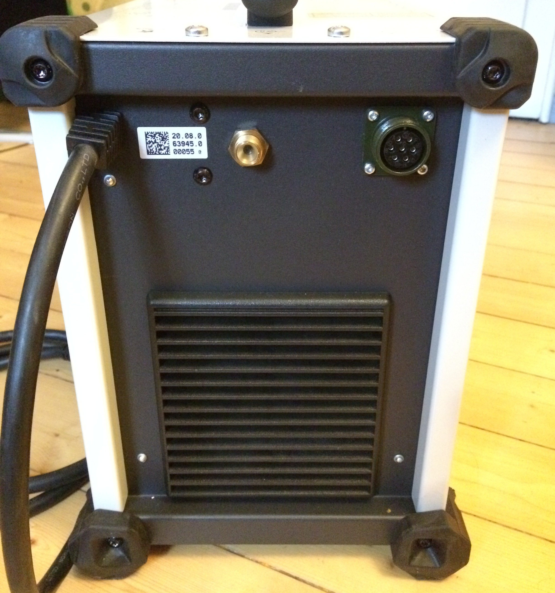

Massekabel und Elektrodenhalter waren gleich mit dabei:

Ich hab zwar von "Ningbo Dabu Electric Applicance Co.,Ltd" noch nie etwas gehört, aber ordentliche Schweißkabel können die schon herstellen:

Weiterhin war ein WIG-Brenner (ABITIG 26 von Binzel) dabei:

Auch hier wieder ordentliche Stecker und eine Schnellkupplung.
Die Schnellkupplung fürs Gas hat einen Außendurchmesser von 5mm und auf der Kupplung am Gerät lässt sich entdecken, dass es sich um die [Serie 20-Verbinder von legris](https://www.legris.com/jahia/webdav/site/legris/shared/BP/Documentation/CAT_3800_LEGRIS_EN.pdf) (ab S. 20) handelt.
Und fragt mich bitte nicht, warum die Schnellkupplungen im legris-Katalog "Rectus" heißen...

Weiterhin waren ein kleines Set an Brennerzubehör, ein Roh-Stecker für den Brennertaster, eine zusätzliche Schlauchtülle für den Brenner-Gasanschluss, ein G1/4"-Schlauchnippel samt 2m passendem Gasschlauch sowie vier Crimp-Schlauchschellen dabei.

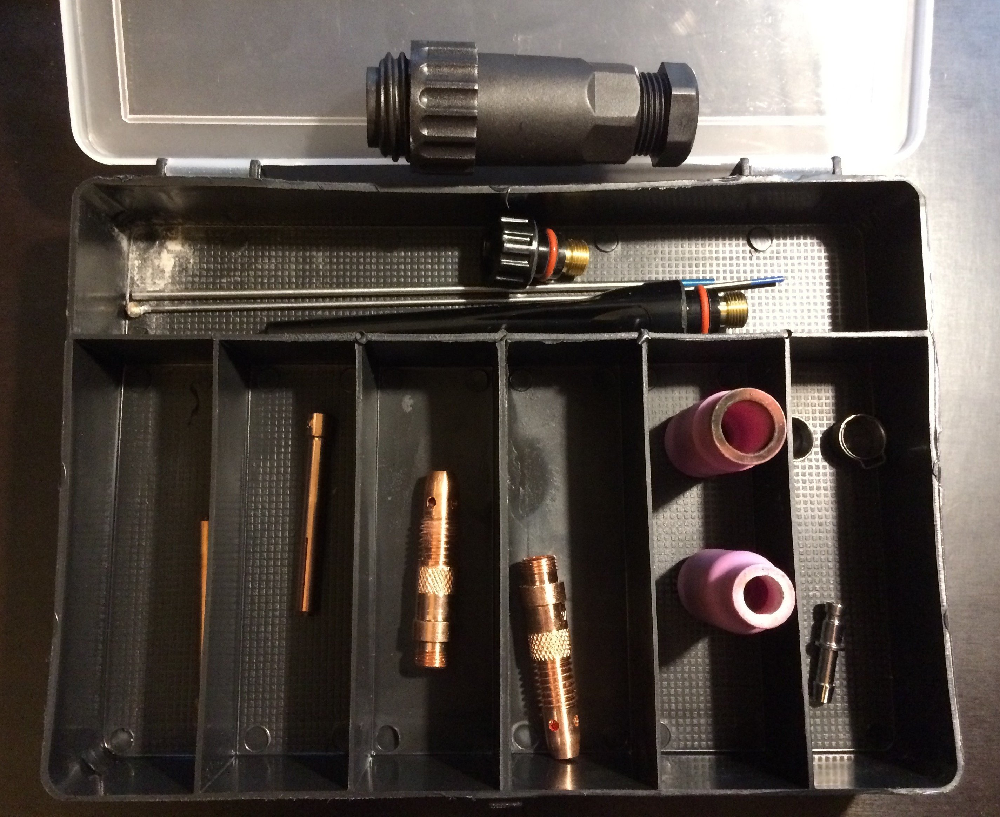

## Druckminderer

Einen Druckminderer mit Schutzkorb hatte ich auch noch dazu bestellt.
Hier stellte sich leider heraus, dass der Schlauchnippel für 6mm-Schlauch gedacht war; der mitgelieferte Schlauch hatte jedoch 4mm Innendurchmesser.
Mit einen Heißluftföhn konnte ich den Schlauch jedoch gefügig machen, sodass ich doch noch am gleichen Abend loslegen konnte.

Das Manometer am Ausgang des Druckminderers besitzt eine Skala in L/min.
Diese beginnt bei 6 L/min, was ja (soweit ich bisher mitbekommen habe) dem üblichen Durchfluss für normale Arbeiten entspricht...
Na ja, wird sich schon hinfummeln lassen.

Es war mir jetzt bloß noch ein Rätsel, wie man auf ein Manometer (was ja bloß den Druck misst) eine Durchflussskala schreiben kann.
Im laminaren Strömungsfall sind ja Druck und Durchfluss proportional zueinander, aber für welchen Strömungswiderstand ist diese Skala geeicht?
Wenn ich jetzt 10m Schlauch anschließe, ist ja der Strömungswiderstand und damit die Durchflussmenge für einen gegebenen Druck eine ganz andere als wenn ich bloß mit 2m Schlauch arbeite...

In einem Druckminderer-Prospekt von Air Liquide fand sich dann (versteckt im Fließtext) die Erklärung:
"Beim Druckminderer mit Manometer-Mengenanzeige wird mittels der Einstellschraube und einer *im Abgangsstutzen eingebauten Messblende* die Entnahmemenge (L/min) bestimmt."

Mal nachschauen am Druckminderer:

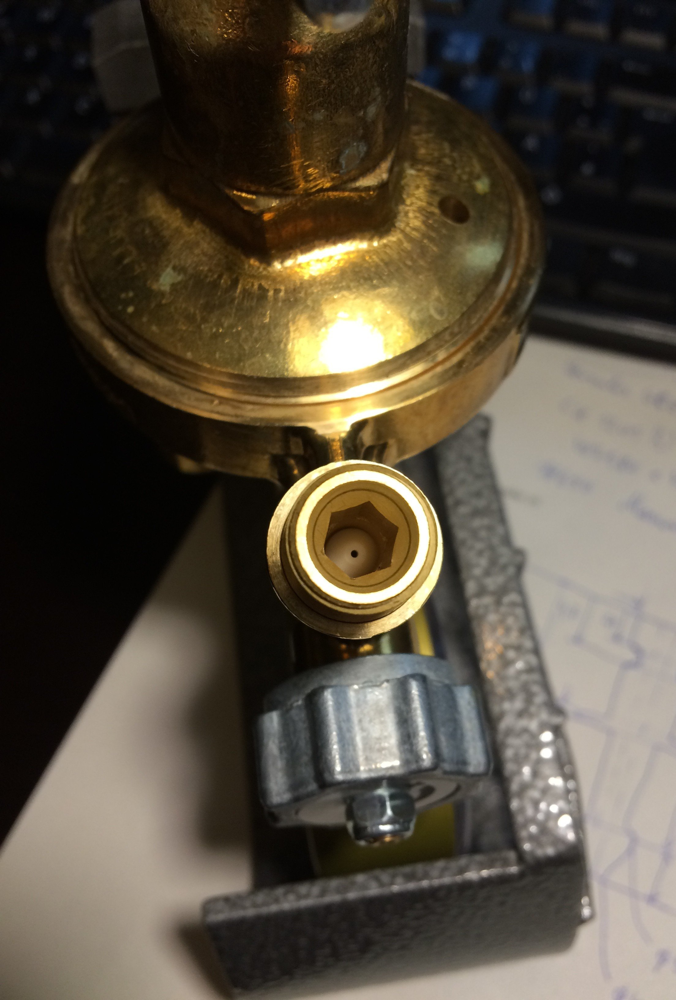

Das weiße (Plastik?) Teil mit dem kleinen Löchlein drin ist dann wohl die Messblende.
Aha, also baut sich vor der Messblende ein gegebener Druck auf (den das Manometer sieht) und weil der Hersteller diese Messblende selbst konstruiert hat, ist die Bohrung in der Blende so bemessen, dass sich also die auf dem Manometer aufgedruckte Durchflussmenge ergibt.
Ich kenne jetzt nicht die genauen Testvorschriften für diese Konstruktion, aber ich vermute mal, dass die Kalibration ohne Gegendruck (d.h. ohne angeschlossenen Schlauch, WIG-Brenner, Gaslinse, etc.) stattfindet.
Jeder weitere Strömungswiderstand beeinflusst nämlich eine derart kalibrierte Anzeige, da der notwendige Staudruck für eine vorgegebene Durchflussmenge zunimmt.
Wenn ich also den Schlauch zum Brenner nur lang genug und dünn genug mache, komme ich für einen effektive Gasdurchfluss von 6 L/min vielleicht auf eine (dafür notwendige) Ablesung am Manometer von vielleicht 10 L/min?
Für reproduzierbare Ergebnisse muss man sich also noch ein Flowmeter besorgen, welches auf den WIG-Brenner aufgesteckt werden kann und somit den tatsächlichen Durchfluss bei fest eingstelltem Druck anzeigt.
Alternativ (was ich wohl machen werde) besorgt man sich einen Massendurchflussregler (engl. "mass flow controller" (MFC), siehe z.B. [https://www.mksinst.com/c/mass-flow-controllers](https://www.mksinst.com/c/mass-flow-controllers)), der den Durchfluss misst und selbstständig den Druck nachregelt.
Gebrauchte MFCs gibt es bei eBay für ca. 100€. Dazu aber später mehr...

## Fußpedal

Das passende Fußpedal ["Fußfernregler" RC-FA1, 045682](https://www.gys-welding.com/spip.php?page=produit&reference=045682&lang=de) hatte ich der Einfachheit halber gleich mitbestellt.
Würde ich nicht wieder machen; für das, was geliefert wird, ist mir das *deutlich* zu teuer.

Scheinbar wird es von GYS bei "toparc" zugekauft:

Yeah, ein solider Stecker :-D

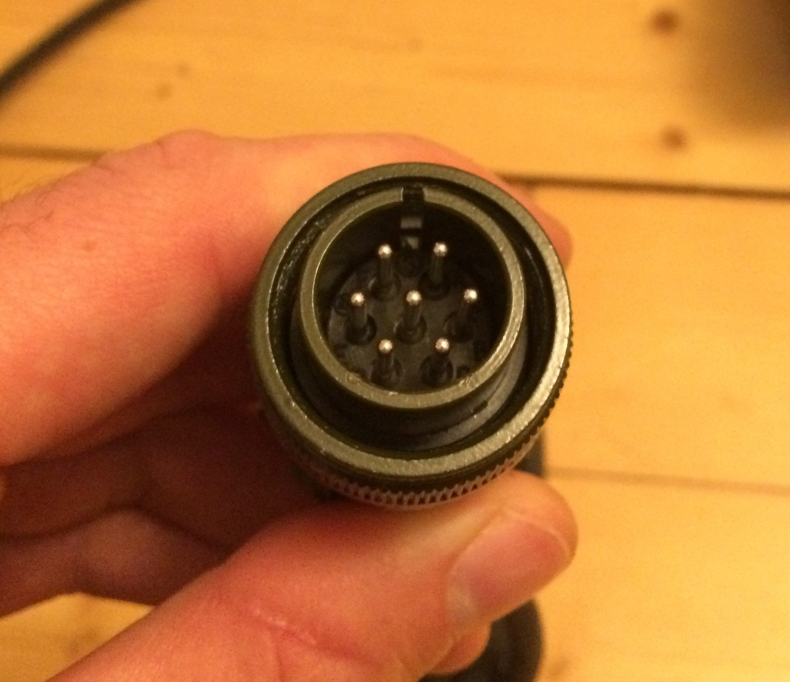

Der MIL-Stecker wird von GYS ja auch einzeln angeboten, wobei deren Bild nicht zum tatsächlichen Stecker passt.
Deshalb steht da wohl auch ["not contractual" klein im Bild](https://www.gys.fr/spip.php?page=produit&reference=045699&lang=de).

Die tatsächliche Bezeichnung scheint "16S-1S" zu sein:

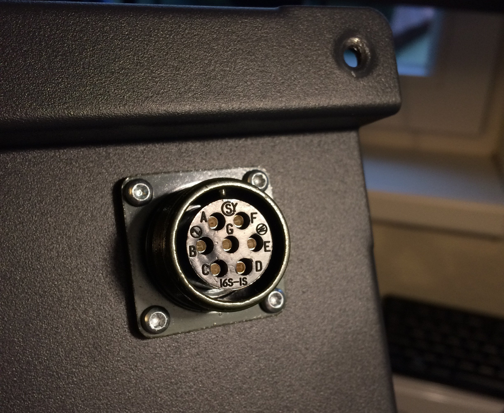

16S ist dabei die Gehäusegröße und 1 bezieht sich auf die Pinanzahl und -ordnung (siehe auch [RS](https://docs.rs-online.com/4214/0900766b81488a33.pdf)).

Der passende Stecker sollte also z.B. von Amphenol MS3106A-16S-1P (298-2421 bei RS) mit der Kabelklemme MS3057-8A (298-2617 oder 546-9971 bei RS) sein.

Nebenbei bemerkt, gibt es für den Fernbedienungsstecker auch unter der Bezeichnung MS25043-16D (z.B. 546-9858 bei RS) eine Schutzkappe zum Aufschrauben bei Nichtbenutzung.

Durch Eindrücken der Nupsel hier...

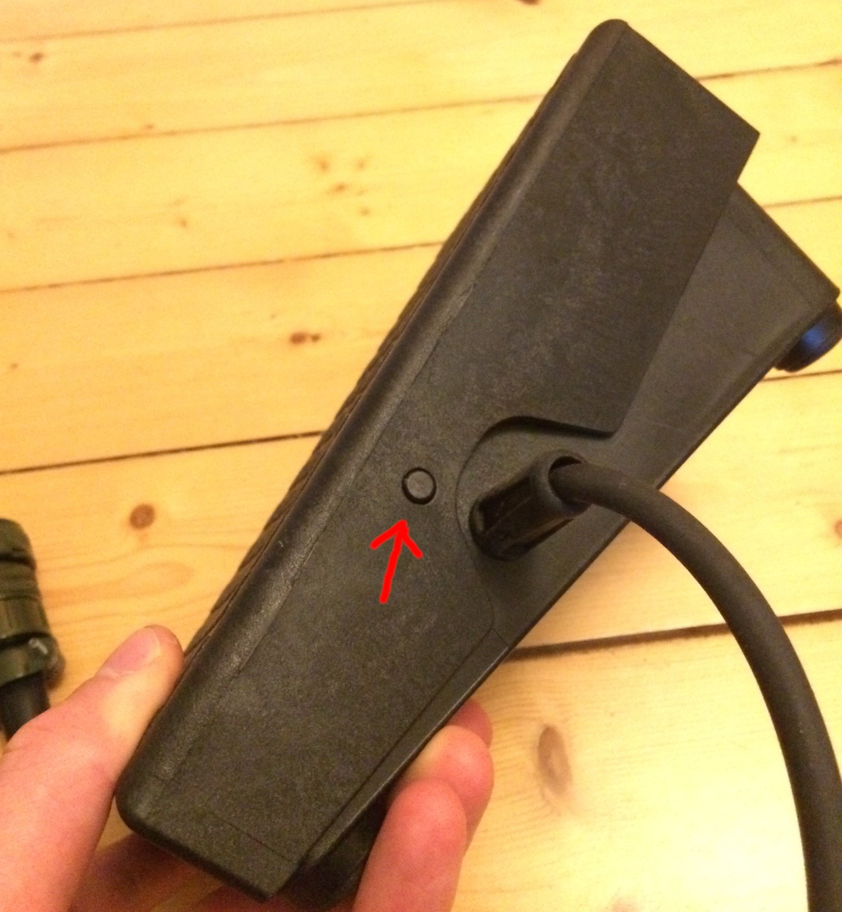

... und hier lässt sich die Wippe abnehmen...

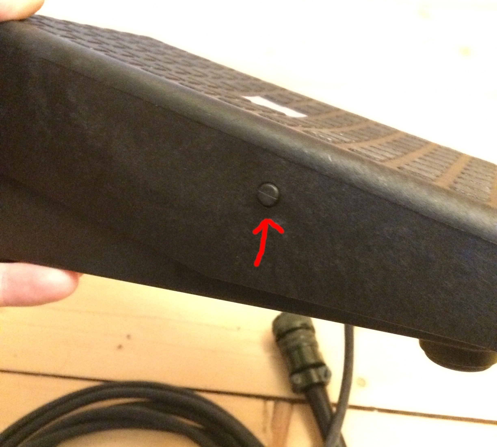

... und man erhält Einblick in die Innereien des Fußpedals:

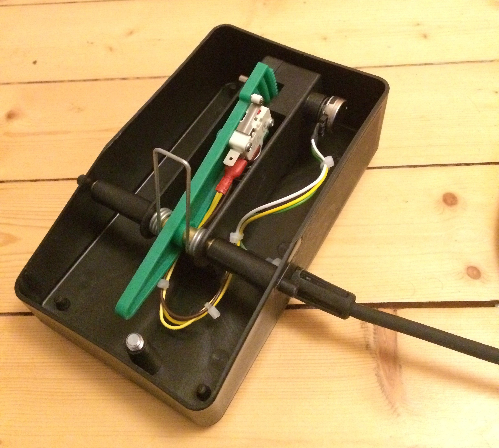

Notwendig wurde dies, weil das Fußpedal beim Anschließen an das Schweißgerät nicht erkannt wurde.
Wenn ein Poti am Fernregleranschluss erkann wird, wird man gefragt, ob man das "PEd"al, ein "Pot"entiometer oder keinen ("no") Fernregler verwenden möchte.
Schlussendlich stellte sich heraus, dass (wohl beim Zulieferer?) die zuständige Elektro-Fachkraft beim Anlöten der Adern an den Steckern mit der Pinbelegung um einen Pin nach hinten verrutscht ist.
Korrekt wäre also (A --> weiß), (B --> grün), (C --> gelb), (D --> braun).

Na ja, einfach zu reparieren, aber einen etwas komischen Nachgeschmack hinterlässt das schon.
Immerhin funktioniert das Pedal jetzt einwandfrei.
Ich gehe einfach mal davon aus, dass diese Verwechslung beim Zulieferer passiert ist und dass das Schweißgerät selbst in Ordnung ist.

## Innenleben

In der Bedienungsanleitung fand sich dann noch folgender Satz, der auch einer der Gründe war, weswegen es am Ende ein GYS geworden ist:
" Nehmen Sie regelmäßig (mindestens 2 bis 3 Mal im Jahr) das Gehäuse ab und reinigen Sie das Innere des Gerätes mit Pressluft."
Okay, also der Hersteller empfiehlt mir ausdrücklich, das Gerät selbst zu öffnen und darin Staub zu saugen?

Ich hab das dumpfe Gefühl, dass es dort ganz schön dreckig sein könnte; da muss man sicherlich ganz dringend mal nachschauen... ;-)
Beginnen wir mal mit den Gummi-Schutzecken an der Oberseite.
Die Alu-Einlagen haben mich positiv überrascht:

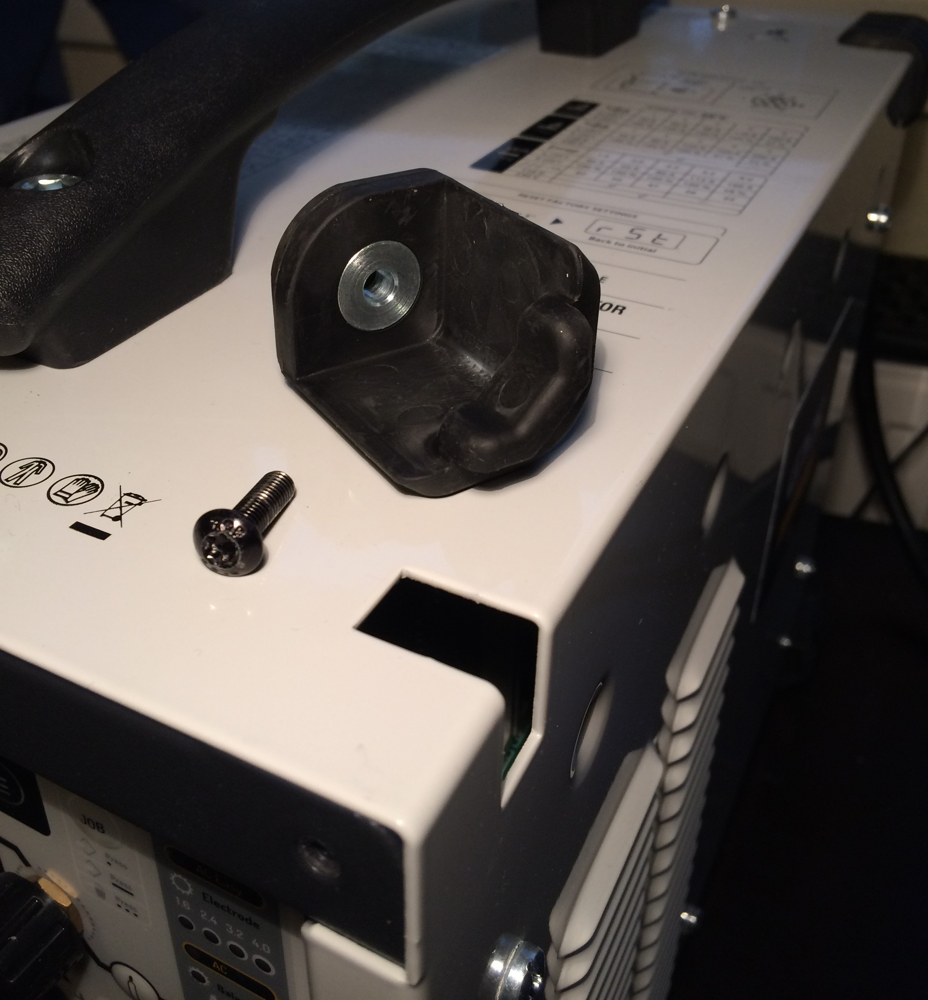

Weiter geht es mit den Gehäuseschrauben oben und rechts (von vorn gesehen).
Diese haben kleine Nupsel dran, die sich in das (Alu-)Gehäuseblech graben.
Dies hat wahrscheinlich EMV-Gründe und hilft, dass sich die Schrauben nicht selbst losrütteln...?

Der Deckel und die rechte Gehäusewand sind ein Blechteil und lassen sich nun abheben.

Analog kommt die linke Gehäusewand ab.

Drinnen erwarten den interessierten Beobachter sauber gefertige Platinen, die über solide Silikonkabel miteinander verdrahtet sind.
Die Leitungsführung des Leistungsteils ist nicht wahnsinnig intuitiv, aber dafür gibt es ja ein Blockschaltbild in der Bedienungsanleitung (ganz hinten auf S. 115).
Der einzige Wehrmutstropfen für mich ist die Verwendung von ISA-Slots für die Digitalelektronik-Platinen.
Der Rest des Geräts ist doch so wertig aufgebaut; warum mussten hier die letzten paar Euro gespart werden?

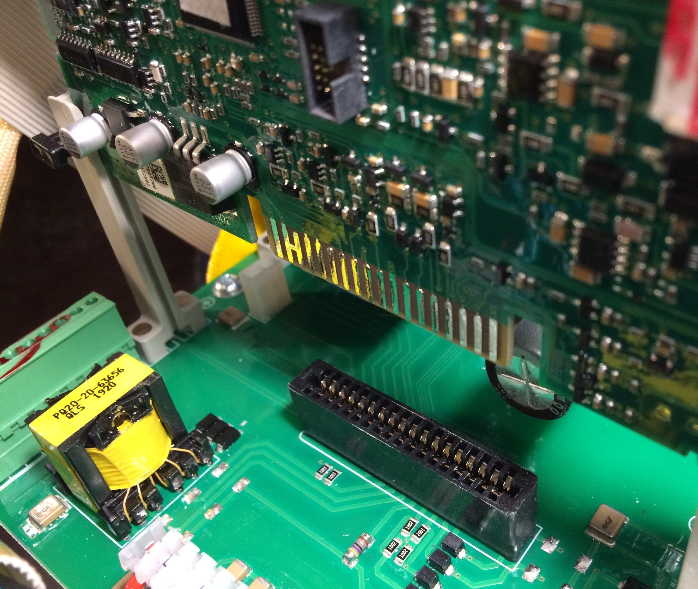

Lustigerweise werkelt auf dem Prozessorboard ein [STM32F072 V8T6](https://www.st.com/resource/en/datasheet/stm32f072c8.pdf):

Weiterhin sind gleich zwei (?) USB-Anschlüsse vorhanden.

Im Betrieb blinken zwar ein paar LEDs, aber 'lsusb' zeigt keine gefundenen Geräte an... schade.
Vielleicht sind das aber auch gar keine USB-Schnittstellen, sondern GYS hat einfach die Stecker verwendet und transportiert Debug-Nachrichten etc. z.B. per RS232.
Ich stimme zu, dass es etwas blauäugig ist, interne Schnittstellen in einem Schweißinverter einfach so an einen PC anzuschließen, ohne vorher mit einem Oszilloskop zu checken, was für Signalpegel dort anliegen und ob Daten gesendet oder empfangen werden.
Ich hab's trotzdem gemacht, weil auf der Platine zu sehen war, dass differentielle Signale von den Buchsen in Richtung MCU geroutet sind und ich daraus geschlossen habe, dass diese Stecker zumindest nicht dafür vorhanden sein werden, den Schweißstrom direkt zu messen.

## Schweißversuche

Als erster Test standen dann Versuche zum Elektrodenschweißen an.
Ich habe nie eine Schweißausbildung, einen Lehrgang o.ä. absolviert, sondern bloß vor Jahren zum Einstieg von einem guten Freund die absoluten Grundlagen erklärt und gezeigt bekommen.
Seitdem irre ich mich empor.
Dies als Warnung an die Leser mit schwachem Kreislauf; kippt mir nicht um, wenn ihr mein Gebrate gleich seht ;-)

Als Elektroden hab ich mir eine Packung Oerlikon FINCORD 2,5mm Drm. mit 350mm Länge besorgt.
Diese wurden mit 80A auf ein paar Schrottteilen verschweißt.

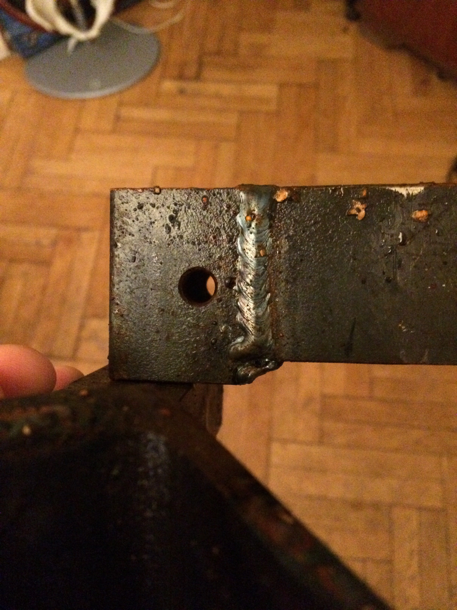

Gleich weiter:

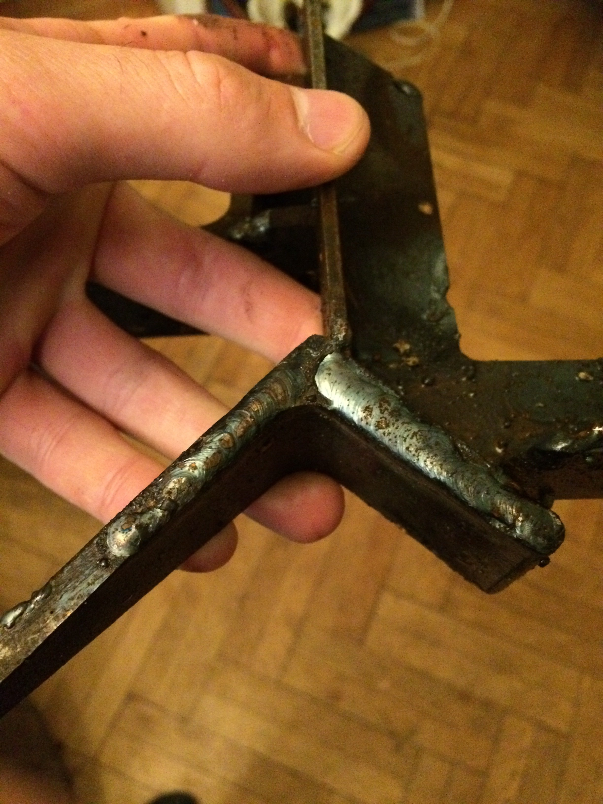

Der Lichtbogen zündet traumhaft einfach und brennt sagenhaft stabil.
Ich hab bisher nur mit Trafo-Elektrodenschweißgeräten gearbeitet und das Arbeiten mit dem Inverter hier im Vergleich dazu eine Offenbarung :-)

Eine 20L-Flasche Argon 4.6 hatte mein Mitbewohner schon vor einiger Zeit besorgt:

Als nächstes stand dann Edelstahl auf dem Programm.
Erstmal hab ich geübt, den Brenner überhaupt halbwegs gleichmäßig über das Werk-/Schrottstück zu führen.

Dann mal ein bisschen mit dem Gasdurchfluss gespielt:

Edelstahl-Zusatzwerkstoff hatte ich mir auch schon mal vorsorglich bestellt...

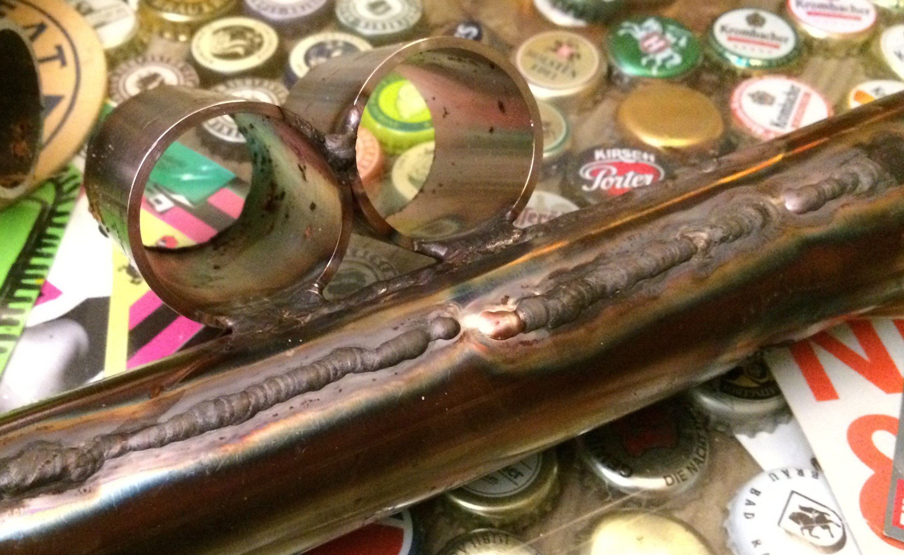

... sowie ein bisschen Siliziumbronze fürs WIG-Löten:

Fazit bisher: Es ist noch kein Meister vom Himmel gefallen.
Hier wird noch einiges an Übung und Einstellarbeit am Gerät nötig sein, bis saubere Nähte herauspurzeln.
Dafür hab ich mir einen Restposten Edelstahl-Bleche bei eBay-Kleinanzeigen besorgt und sehe zu, dass ich die nächsten Tage und Wochen mal ein bisschen Fingerspitzengefühl fürs WIG-Schweißen bekomme...

