## new old lathe acquired (2021-04-03)

A few days ago I had the great fortune of winning my first own lathe
on eBay. Up to now I have only been able to work on machines belonging
to others, in companies where I did internships.

I'll get to the details of the machine in the course of this article.

Here is a picture of the machine, as it was offered on eBay:

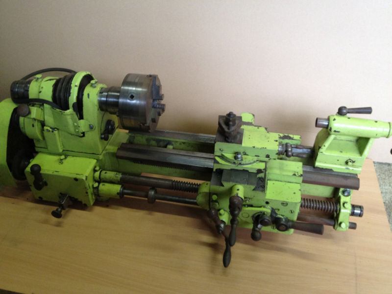

Included with the machine was a 0.37 kW motor from Georgii-Kobold,
visible in this picture:

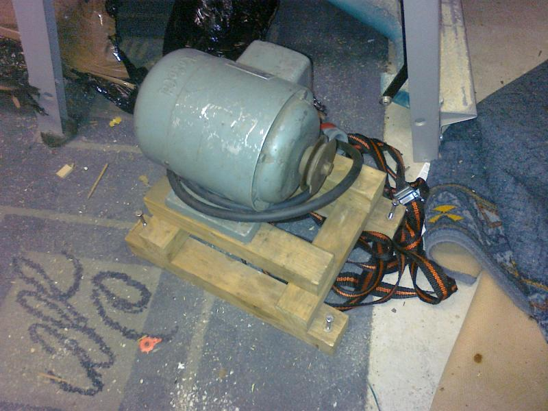

Today the gentleman from the freight forwarder arrived and dropped off
a pallet with the machine and the motor.

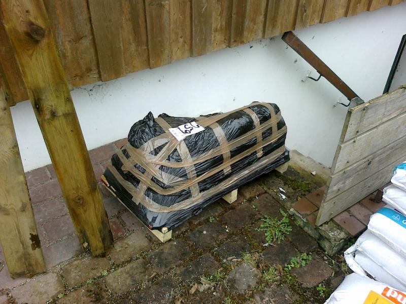

The pallet then had to come down the cellar stairs over a couple of
wooden planks... but one is still young :-)

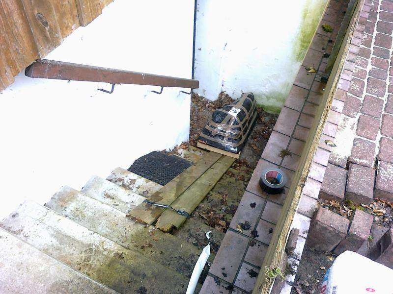

A short test run was then started, to assess the condition of the machine.

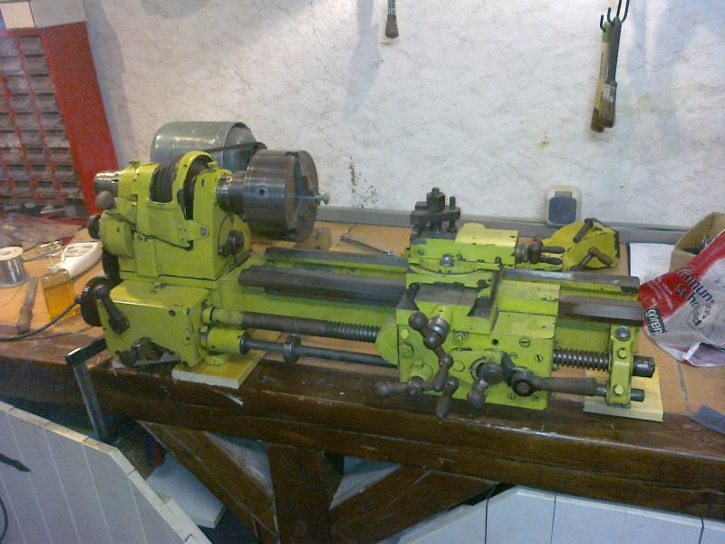

I was able to determine the following:

 * The spindle bearings are reasonably OK.
 * The back gear works.
 * The cross slide moves smoothly.
 * The tailstock is set strongly off-centre (several mm).
 * The 3-jaw chuck (135 mm) doesn't run true.
 * The supplied V-belt doesn't fit the headstock pulleys.
 * The feed train (including the tumbler reverse) works up to the gearbox.
 * The gears in the gearbox at the front of the headstock are sadly
   largely worn.
 * The lead and feed shafts can still be turned.
 * On the feedshaft sits a stop that, when the saddle drives against
   it, automatically disengages the feedshaft (very handy :-).
 * In the apron the gear that should sit on the cross-feed lead screw
   to drive the automatic cross feed is missing.
 * The half-nut for the leadscrew is still intact and engages /
   disengages smoothly.
 * The Morse taper in the tailstock should be re-reamed. A matching
   MT2 reamer is, however, on hand.
 * The bed is in good condition and has already been cleaned of
   surface rust.

I think this is a basis from which the machine can be restored.

Here are some detail shots.

The apron:

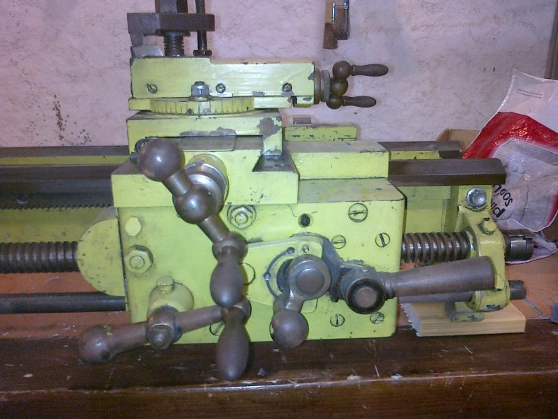

The lever with the knob switches between (top) longitudinal feed,
(bottom) cross feed via the feedshaft, and (middle) leadscrew.

The headstock:

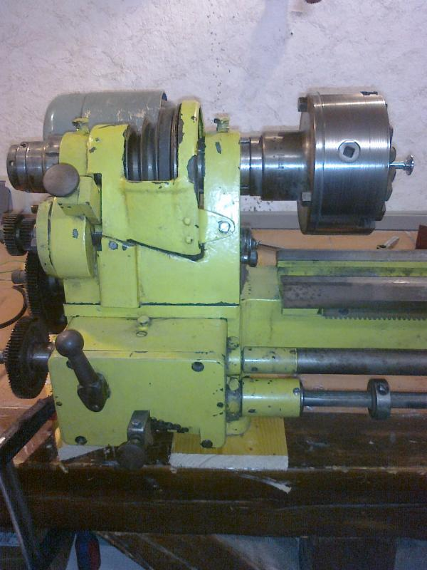

The change gears:

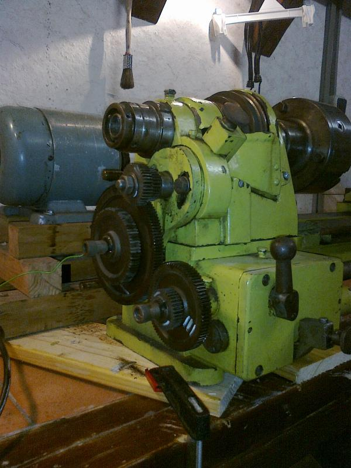

Sadly there weren't any more :-(

Then the disassembly already began.
I didn't photograph the individual steps in much detail, because I was
too busy admiring the machine... :-)

The bed (still with the headstock):

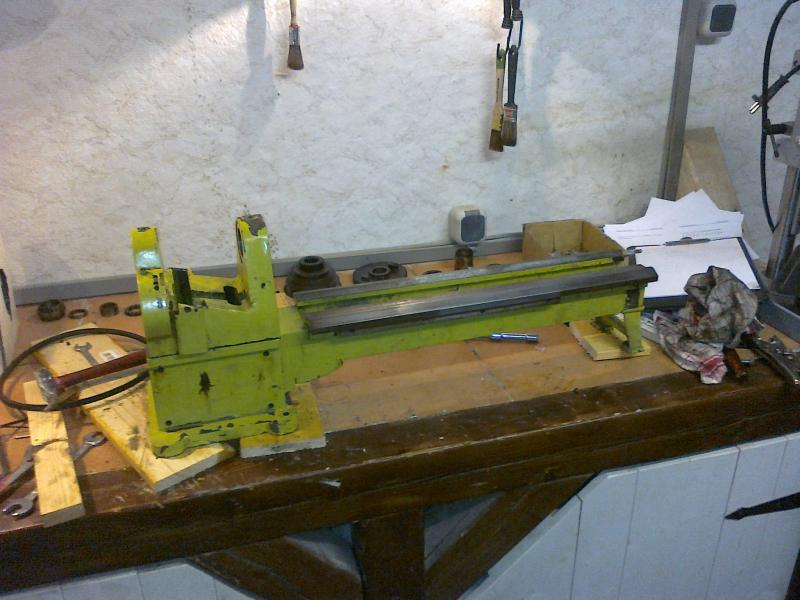

The first batch of parts, including leadscrew/feedshaft, gearbox,
3-jaw chuck, cross slide, tailstock, change gears:

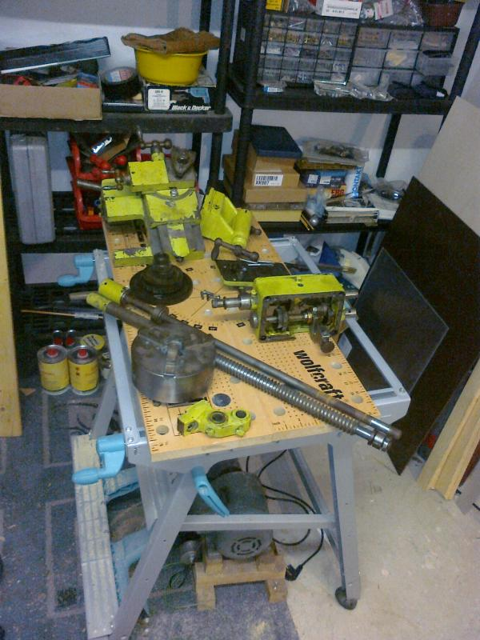

The second batch of parts: as above plus back gear, tumbler reverse,
back-gear cover:

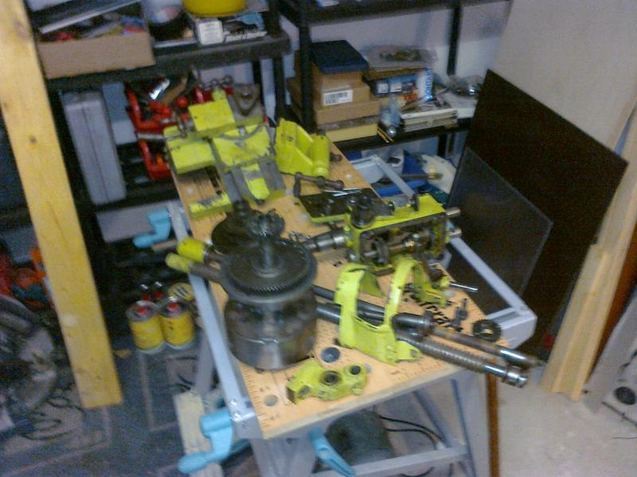

Inside view of the apron:

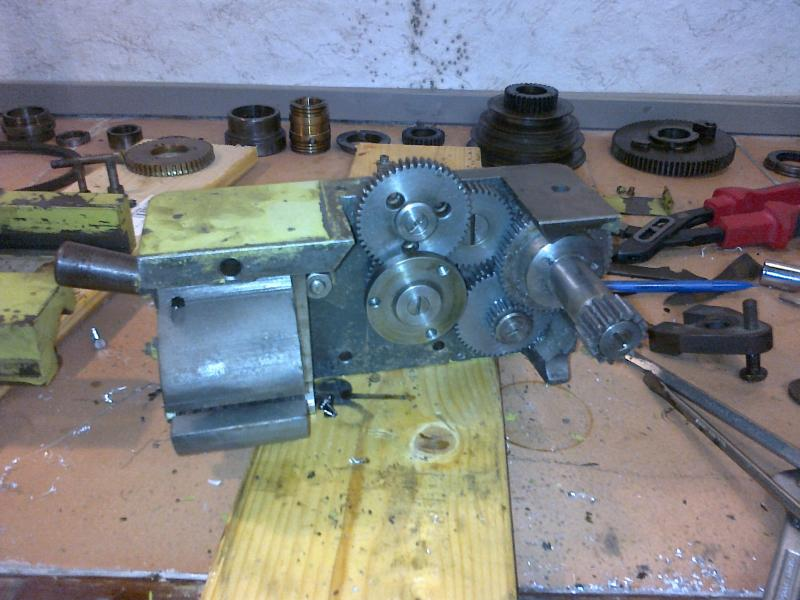

The rear gear (with the big slotted screw) is swung up, middle, or
down by the knob lever and thereby drives either the longitudinal feed
or the cross feed.
The lever on the left is for closing the half-nut.
In the background (against the wall) you can see the parts of the
spindle bearing assembly.

To finish, some general info:

Parameter                              | Value
---------------------------------------|--------------------------------------
centre distance                        | ~400 mm
centre height                          | ~110 mm
saddle travel                          | ~230 mm
cross-slide travel                     | ~100 mm
compound-slide travel                  | ~75 mm (should suffice for turning an MT2)
back-gear reduction                    | 32/76 x 32/76 (i.e. about 250 rpm at 1400 rpm pulley)
leadscrew pitch                        | ??? mm (module 2)
automatic feed                         | ??? mm/rev (3x6 steps in the gearbox + change gears)
spindle bore                           | ~20 mm
tailstock quill stroke                 | ~60 mm
overall machine size (WxHxD)           | ~ 900 x 400 x 400 mm
overall machine weight                 | ~50 kg (could be lifted onto the table by one person...)

Unfortunately I found no manufacturer information on the machine.
It does seem to once have been painted grey with red primer, before
someone inflicted this awful green on it.
Grey (RAL 7031) is what it'll become again!

I have never seen a machine of this size before with this kind of
specification (lead and feed shafts, speed gearbox, back gear,
automatic longitudinal and cross feed, separate ways for saddle and
tailstock, etc.).
That was also why I bought it on the spur of the moment, in defiance
of all the other ongoing projects.

I'll document the restoration here as I get to it.

I paid about EUR400 plus shipping for the machine.
The machine comes from the Black Forest and was delivered by freight.
I think that's appropriate.
I know I could have bought a Chinese lathe for that money. But I
wanted a machine with character.

The ways don't yet look very worn -- in places you can still see the
traces of the original scraping.

The spindle bearings also leave a good to very good impression.
You can see that the machine has been used, but no major scoring such
as you'd expect from a bearing seizure is visible. The oil felts(?)
under the spindle bearings were also still well saturated with oil.
I don't think I'll have to do much there.

The gears in the apron are module 1 with common tooth counts; I think
I'll replace most of them.
The gears in the gearbox I still have to measure; my guess is module
0.7 or 0.5. Those should also be obtainable.

## Headstock and paint choice (2012-04-05)

I have meanwhile managed to separate the upper part of the headstock
from the lower, and to unbolt the bed from the headstock.

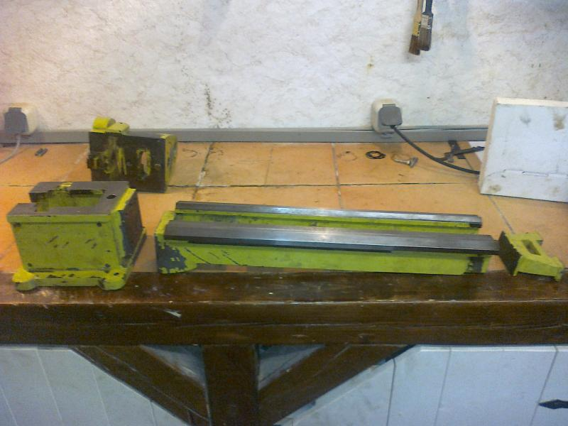

In the process I noticed an interesting solution for headstock alignment:

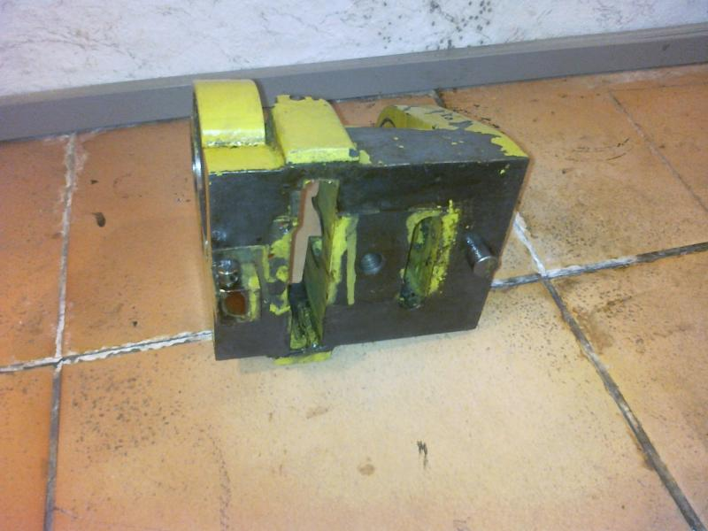

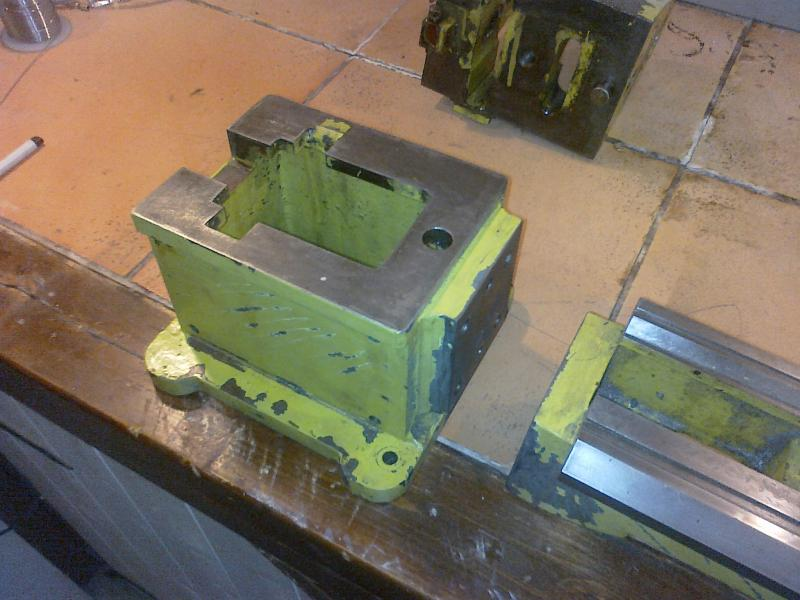

In the upper part of the headstock there's a peg sitting at the level
of the right spindle bearing in the lower part.
At the level of the left spindle bearing, in contrast, there is a slot
in the lower part with a screw running through a boss on the upper part.
By turning that screw, the parallelism of the spindle to the bed can
be set very precisely.

Next up: stripping the paint.
The light-green paint comes off relatively well with a putty knife;
the older grey paint underneath can simply be washed off with acetone.

In the meantime I'm thinking about what to repaint with.
I'll probably orient myself on this thread from another forum:

http://www.diy-community.de/showthread.php?24682-Restauration-einer-Weiler-LZ-280/page6

The colour (RAL 6011) appeals to me more than the original grey
(probably RAL 7031).

I have so far stripped the headstock and a few small parts.
Tomorrow the bed gets its turn, and then I'll already start painting
the first parts.
For the stripping I mixed roughly 4 parts nitro thinner, 5 parts
acetone and 1 part white spirit substitute, decanted into an old jam
jar with the parts dropped in.
After a few hours the paint peeled off beautifully and the last
remnants could be brushed off with a steel wire brush.
A respirator is, of course, mandatory.

For the larger parts (headstock, saddle, apron) I poured the toxic mix
into a flowerpot lined with paint, then covered it with a plastic bag
that -- surprisingly -- did not dissolve. Apparently the fumes alone
were enough to soften the paint, since the paint on the parts above
the "toxic line" came loose as well.

For the larger surfaces I then cleaned off the paint residues with a
hand wire brush; in the corners my Dremel with a round wire brush
helped a lot.

I just saw the following picture on eBay:

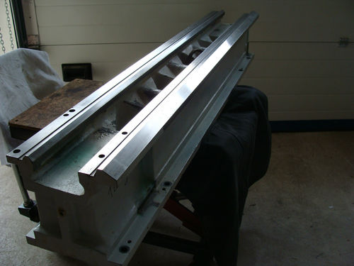

On my machine too, the front prismatic way (on which the saddle runs)
is shallower in front and deeper in back. Likewise the inner way (for
the tailstock) is "normal" -- i.e. the prismatic part is symmetric.
Does anyone know other machines whose ways are asymmetric, apart from
those by Weiler?
I know that's not yet proof that mine is a Weiler, but it's a clue.

I have meanwhile discovered that this design was apparently common for
machines of this age, for the following reason:
since the beds were not yet hardened, the surface that has to take
the most pressure from the cutting force (and that is also moved
under that load with automatic feed) had to be as large as possible.
That's why the prismatic way is tilted. So it does seem to be normal...

The bed and the bulk of the small parts are now ready for painting.

## Preparation for painting (2012-04-14)

After spending a long time stripping paint, today there are some
pictures from the lathe project again.

Here you can see the parts that will soon be painted.
I've already masked them and put them in the boiler room so they can
warm up a little (the workshop is cold enough).

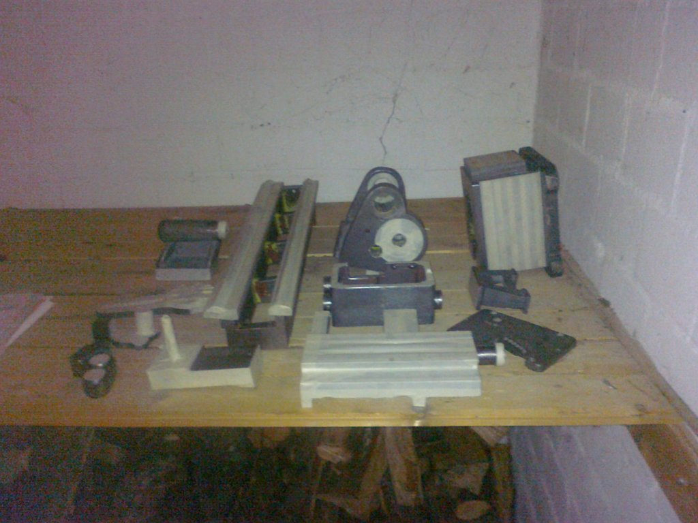

I went back and decided on Mipa 2K-EP paint after all.
So the machine will be painted RAL 6011.

I also tackled the 3-jaw chuck.
Inside there were some chips and it was time for a fresh oiling.

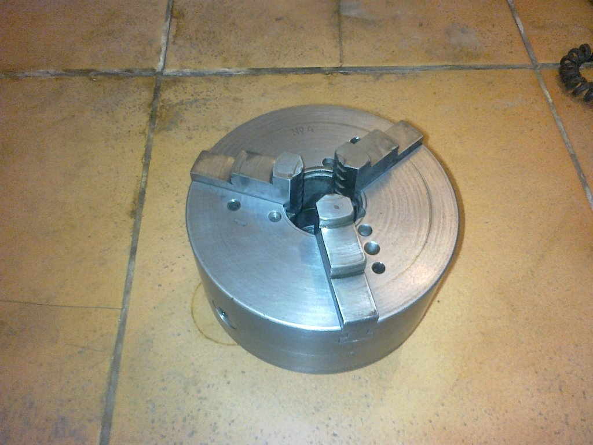

Apart from that I tackled the numerous small parts and sorted them,
partially de-rusted them and re-oiled them.

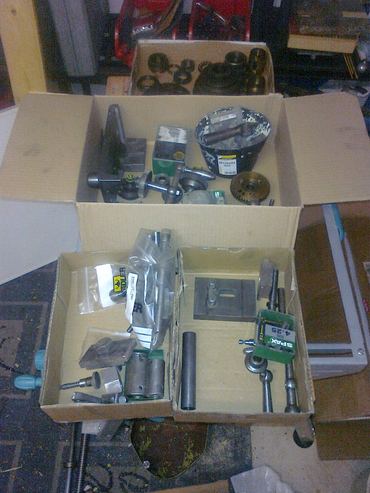

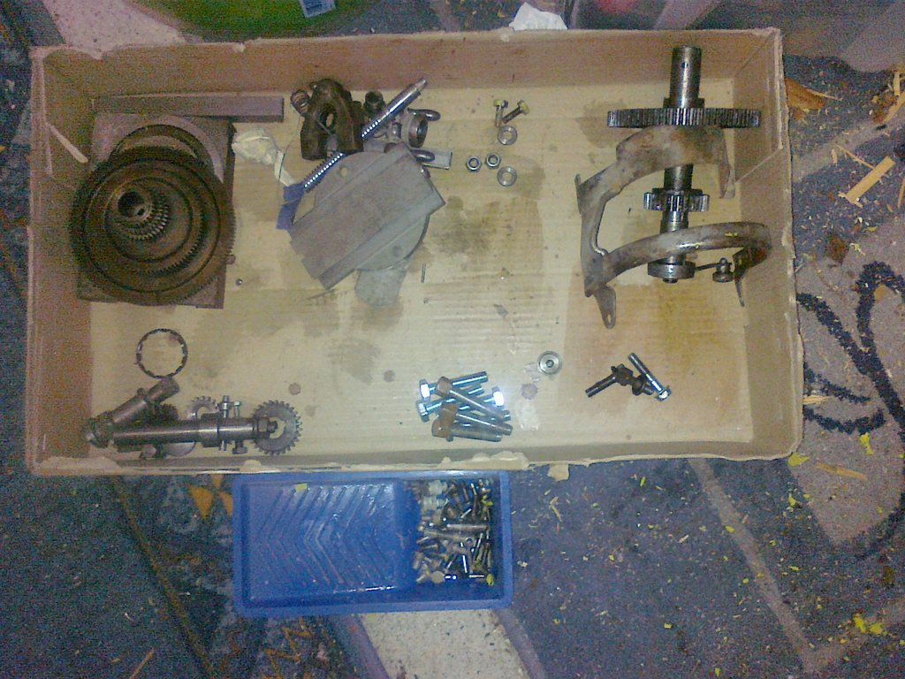

## Painting (2012-04-17)

With Mipa EP primer-filler:

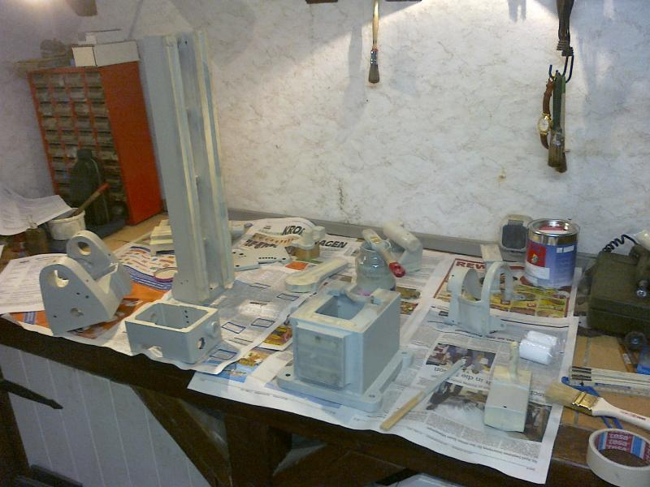

The machine column in this picture belongs to my first big mechanical
engineering project, a small milling machine:

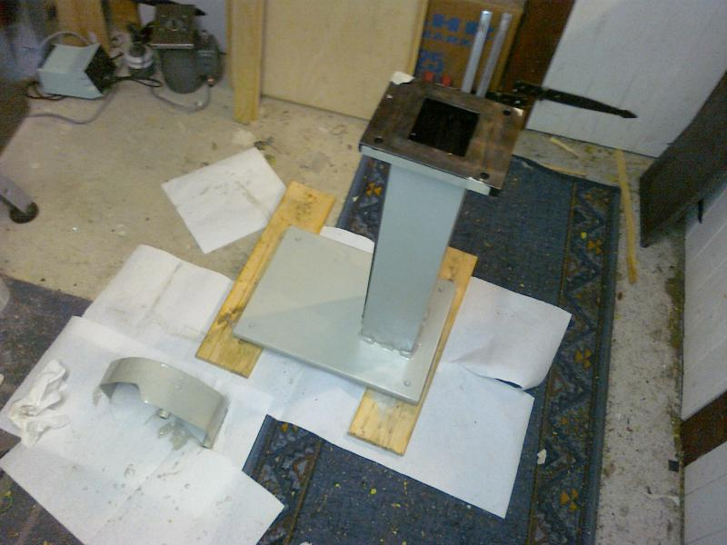

The whole thing in green (Mipa EP semi-gloss top coat in RAL 6011):

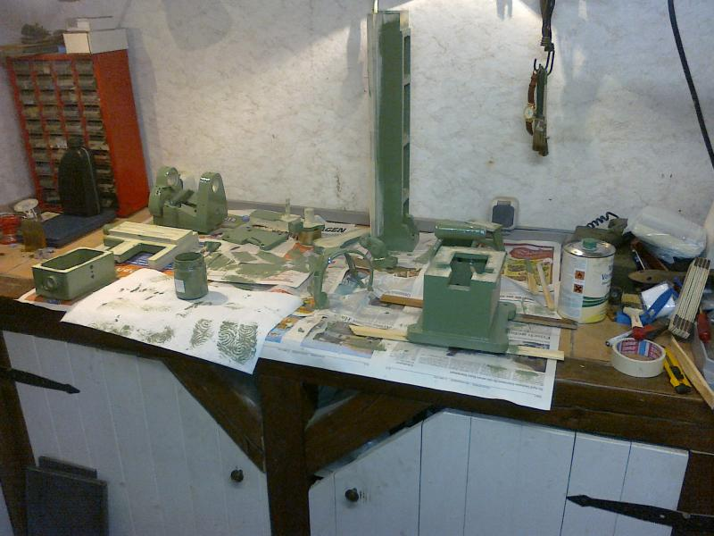

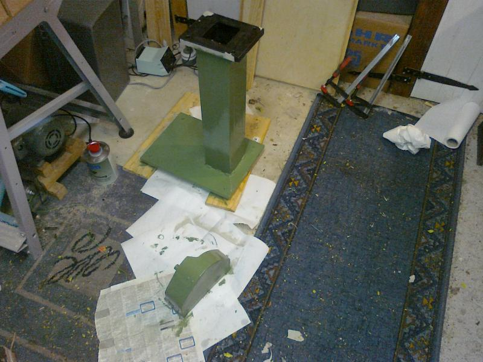

## Wobbly saddle (2012-04-30)

I have meanwhile reassembled the machine far enough that you can
already make first chips. In the feed gearbox, a few gears still have
to be replaced; I hope I can do that "by hand" with this machine.

A few problems have, however, also become apparent:

1.)
The saddle has noticeable play on the bed:

Here the saddle is drawn in red and the gib (?) in green.
My idea would be to mill a few tenths off the saddle underneath.
Then with shim foils between gib and saddle the play could be set
very precisely.

2.)
The spindle bearings are adjustable.
If I set them so the spindle can still be driven by the motor (0.37 kW),
it has more than 3/10 of play.

If I set them so I have less than 1/10 of play, the motor can no
longer turn the spindle.
I measured the bearing play by clamping a steel rod in the chuck,
running a dial indicator against it, and pressing on the end of the rod.
Of course the rod also bends, but it can clearly be seen and felt that
the spindle wobbles in the bearing.
While the play in the x direction (front-back) can be set to a few
hundredths, the spindle clatters with side-to-side wiggling in the
y direction (up-down).
There I measured a play of ~12/100.

In the process I also noticed problem 3.):
The chuck only grips at the back; at the front there's up to 2/10
clearance between workpiece and jaw. That should be fixable by grinding,
though.

## Reassembly (2012-05-24)

At the moment the project is treading water a bit, because I just
can't get the spindle bearings adjusted properly. Either it sits so
loose that at low speeds excessive play occurs and the machine chatters
like crazy at 1/10 mm depth of cut, or I set it too tight and the
spindle locks up when the motor is switched off.
A difficult undertaking...

Anyway, here are a few pictures of the current state:

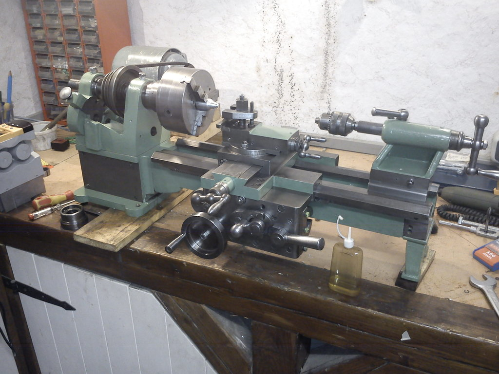

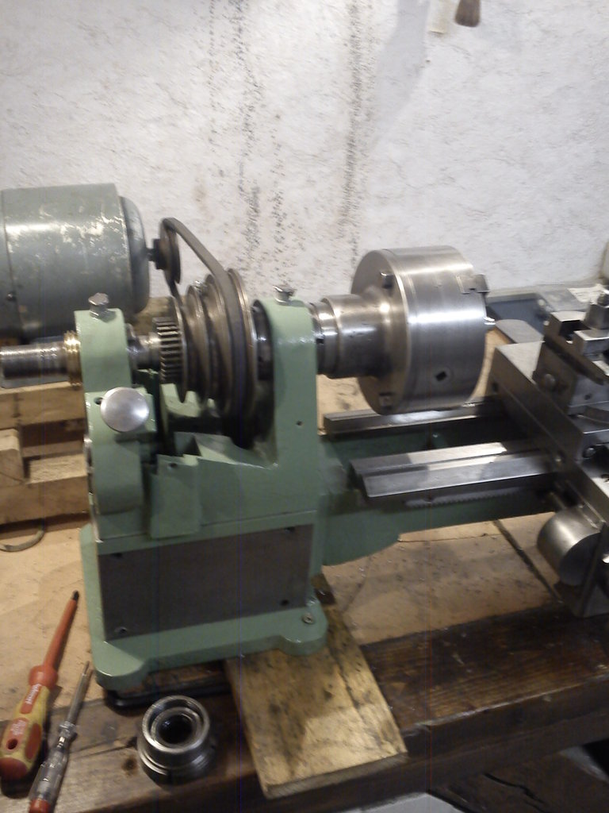

When turning the spindle I have the feeling it must be bent, since it
visibly drags in one area and runs lightly otherwise.
I suspect that's also one of the reasons the front bearing was so
worn out. Should I now turn a new spindle? In terms of material and
machining that wouldn't be a problem, but maybe you have other ideas...

The saddle now (after the milling) runs butter-smooth, and thanks to
a shim orgy with aluminium foil strips it's also pretty much play-free.
Unfortunately it binds at the front section (where currently the
chuck sits over it). When working with collets that could become a problem.
At the moment, however, the spindle bearings are more important.

I re-bearinged the motor with SKF 6002-ZZ. The old bearings were open
and so caked with a metal-dust/grease/dirt layer that the motor sounded
quite unpleasant in operation.
With the new bearings and the VFD it now purrs like a (large) kitten :-)

Since the old bronze bearings could not be set play-free (<1/10 mm)
even after re-boring, I have now decided to fit tapered roller bearings
-- a 32006 (30x55x17) as the front and a 30205 (25x52x16.25) as the
rear spindle bearing.

Furthermore, the V-pulley that previously ran on the main spindle when
using back gear will now be supported on the spindle by HK3016
(30x37x16) needle bearings.

I mainly opted for the conversion because, for direct indexing on the
lathe, a plain bearing is in principle unsuitable, since it is only
play-free at sufficient speed via the oil film.

The axial support of the old spindle is by a friction bearing of the
collar on the spindle nose against the adjoining bearing-adjustment
nut (odd word...). Modifying that while keeping the plain bearings is
too complicated for me. Better do it properly.

## Motor mount (2012-06-21)

Unfortunately the motor doesn't shed any further light on the machine's
origin, since it's not the original motor. The supplied belt and the
motor pulley do match each other but not the lathe.
Furthermore, on delivery the motor was bolted to a wooden frame that
certainly is not original.

To dispose of that wooden frame, I built further today: a new motor
mount it is.

It all begins simply with an old plate that I had once removed from
some scrap machine:

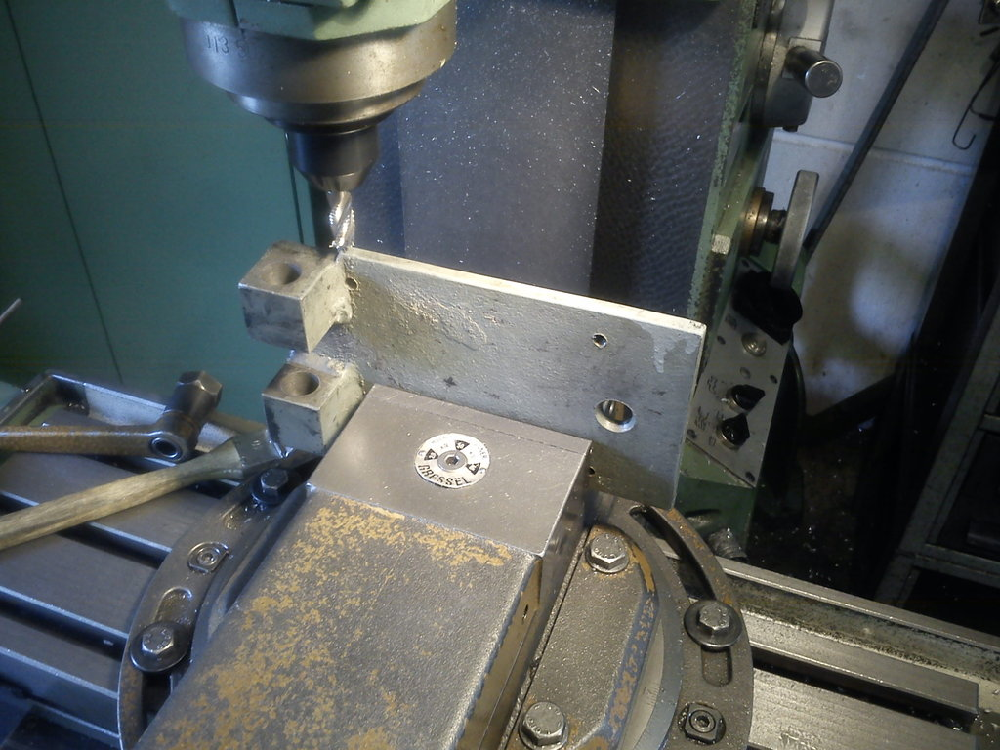

That gets quickly milled parallel so I can clamp it flat in the vise
and mill the gap between the "bearing" blocks parallel as well.

Said and done, and we move on to the raw stock for the bracket that
gets bolted to the machine.

First, cut some raw stock to length and face it:

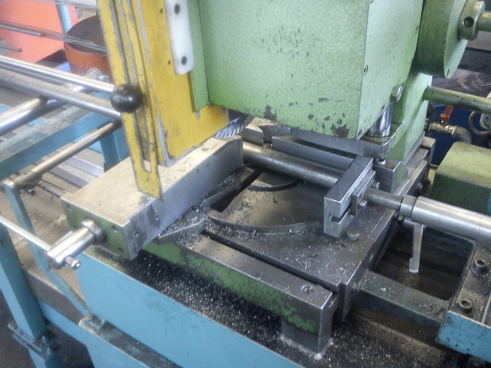

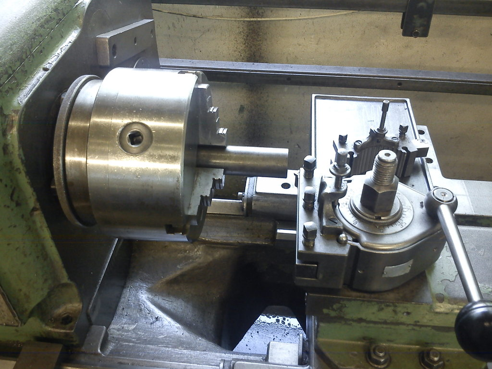

Then part it off:

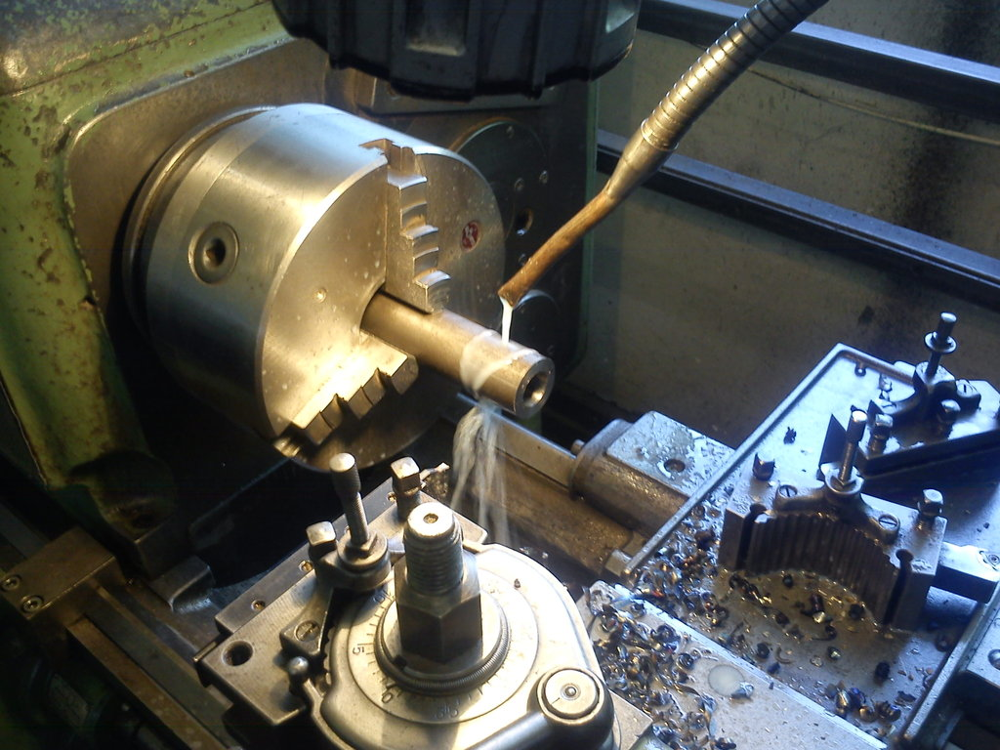

A bit of facing in the mill:

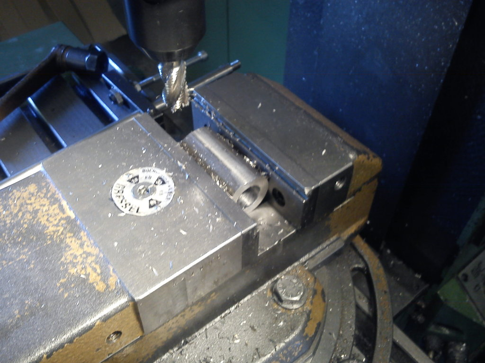

And weld it to two pieces of steel:

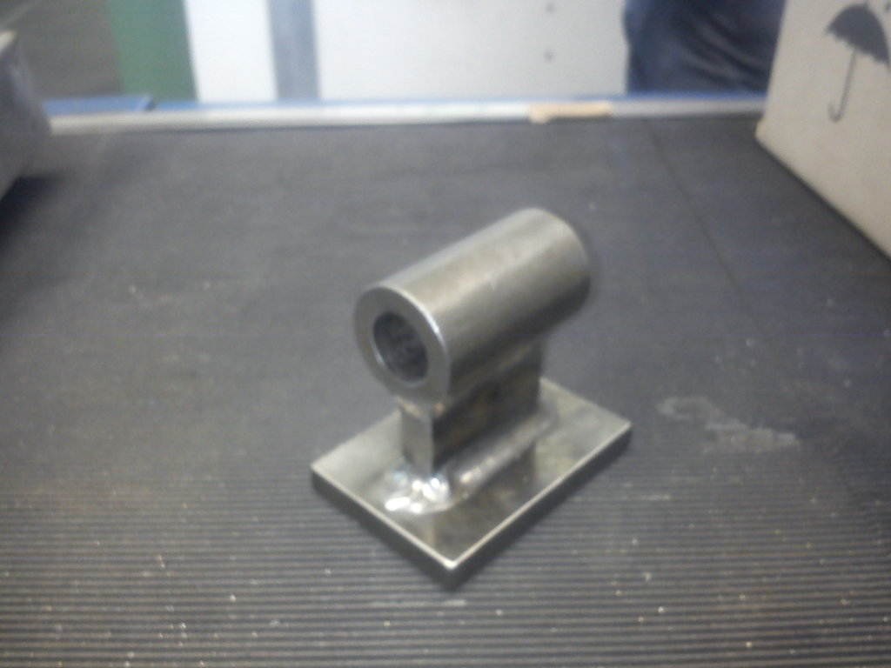

I then drilled four 8.5 mm holes in the corners of the base plate for
mounting, and cut two M5 threads into the upper sleeve to lock the rod
that you'll see below.

Without pictures, I also made a small bushing that can be fixed on the
rod by an M5 cross-bore and that fits exactly into the parallel-milled
slot between the bearing blocks on the motor plate.

Assembled on the machine, it looks like this:

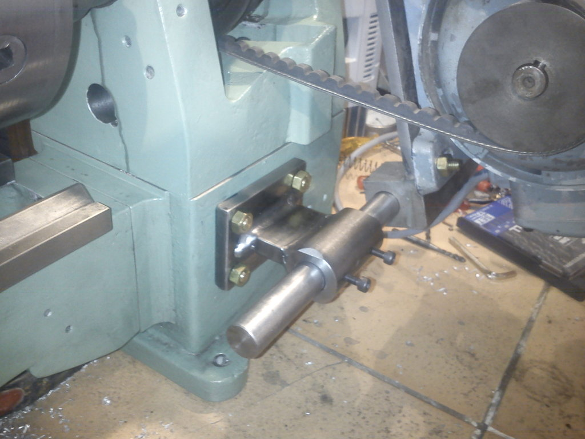

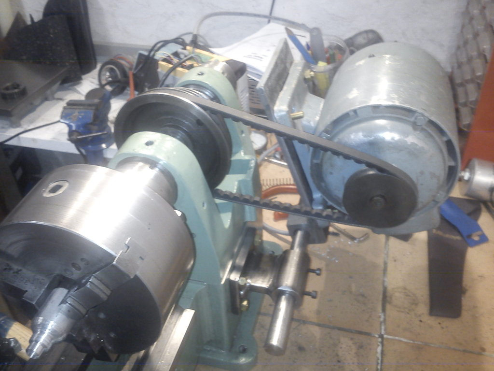

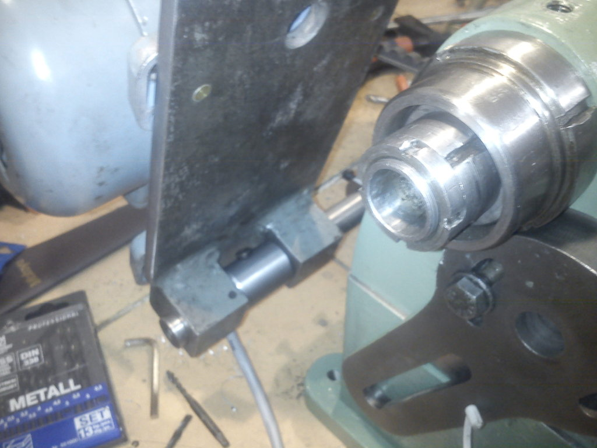

The belt is currently tensioned by the weight of the motor; when I
keep building this will be changed.
I'm thinking of the following:
between the hole in the motor plate at the top and a tab that I bolt
to the headstock, I put a tensioning screw;
this screw has a ball as its head that sits in the hole on the motor
mount, and the thread goes through a hole in the tab against which
the screw is supported by a nut (possibly with a rubber washer for
damping).
If that's unclear, I can make a drawing.

## Spindle-bearing conversion (2012-08-13)

Today I finally got around to machining the new bearing seats into the
headstock.
As I wrote above, I'm using these bearings:
32006 as the front bearing and 30205 as the rear bearing.

Unfortunately the new spindle isn't finished yet, so for now a couple
of pictures of the headstock with the bearing seats:

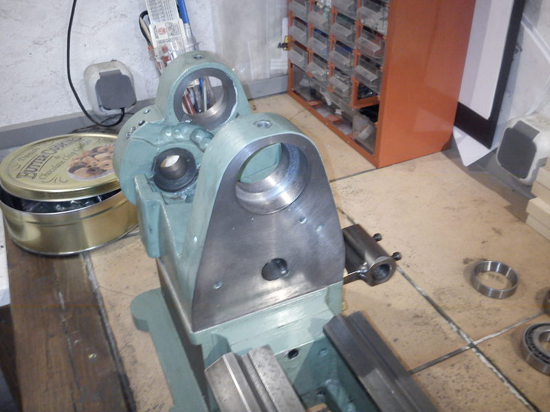

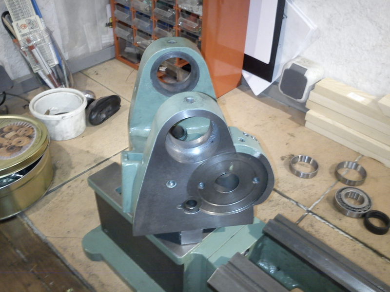

A small note on the manufacturing:
the headstock was clamped to the faceplate of a large lathe and bored
out there. Once it was clamped, I also faced the front and rear faces
of the headstock, which is why the paint there is gone again.

The new spindle is to receive a short-taper 3 spindle nose and an MT3
internally for everything else. With a rear bearing-seat diameter of
25 mm, an 18 mm spindle bore should still be possible.

I also want to add an indexing fixture with interchangeable index
plates, although I'm not yet entirely clear on its design.
The only place where, in my opinion, you can sensibly mount such a
thing on this machine is outside, next to the rear spindle bearing.

I sent an illustrated email to Tony at lathes.co.uk, but as of today
I haven't had a reply. If anyone has hints or ideas about the origin
of this machine, I would be very grateful.

## First turning trials (2012-09-13)

Yesterday I had the chance to abuse the old spindle a bit so it would
fit the new bearings:

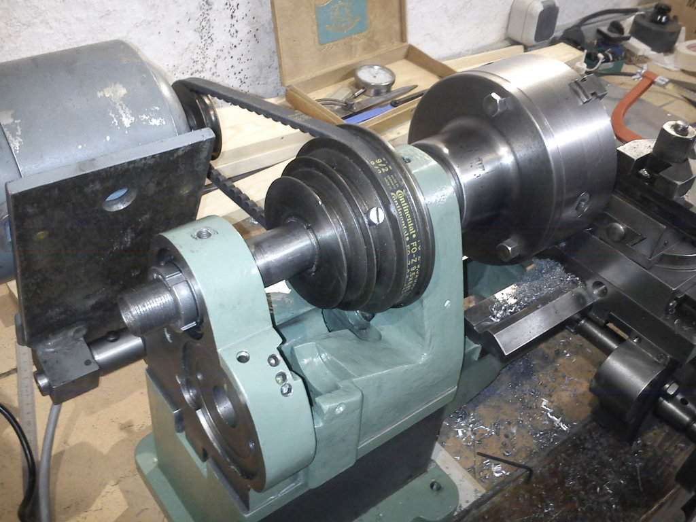

Well, what can I say: I'm absolutely delighted with the new bearings:
8 mm chip width on aluminium, plunging on the OD: no chatter
1 mm depth of cut on St37, "roughing" along the OD: no chatter
Roughing and finishing bronze on the OD: no problem, mirror-smooth surface.

Here's a picture of a finished steel surface:

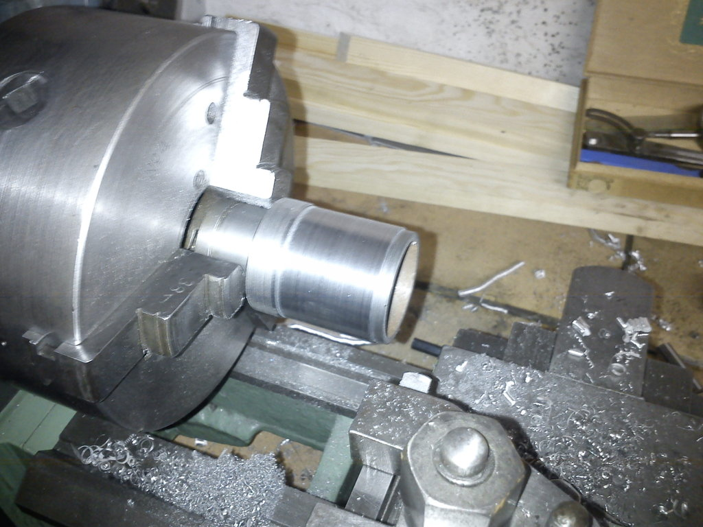

With the old bearings that was definitely not possible, in my opinion.

You can also make chips with the machine:

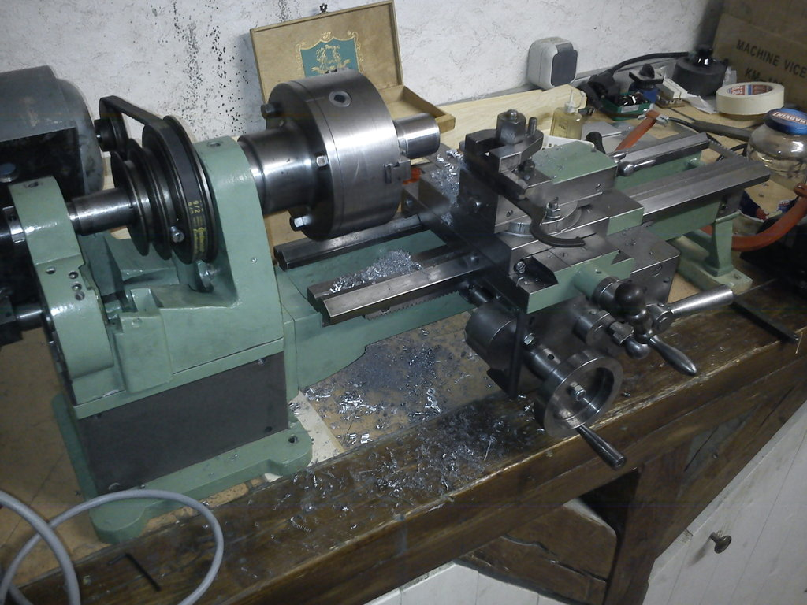

Since I am now in a position to turn steel at home, I can finally (!!!)
make the small parts so badly needed for the feed-gearbox reassembly.
In the workshop where I restored the Klopp, somehow there was never
time for it...

Hehe, I'm excited!!!

## Move (2012-11-16)

Since I had to move a few weeks ago, my "Little One" has gone back to
my original workshop in my parents' basement, so things will only
continue over Christmas when I'm there.

Before the move, however, I had done a few things:
With a dial indicator on the saddle, it was possible to turn a precise
fit on a sleeve from the feed gearbox.
On that I press-fit a suitably bored gear, and reassembled the feed gearbox.
Unfortunately the module 0.75 of the new gear didn't quite match the
existing gears in the Norton gearbox, so the feed unfortunately
doesn't work yet...

My plan is now to design and build a new feed gearbox that's also less
clattery and imprecise to shift than the current one;
even if the gears matched, the ratchet has so much play that the gears
might jump :-(

It will also be necessary to turn a new main spindle, since the current
one has no centring fit at the end of the thread, so the chuck sits
0.5-1 mm off-centre.

In any case, with the new spindle bearings it has been possible to
turn really nice, chatter-free surfaces at the end :-D

## Use (2013-11-06)

The photos are a bit older; here are a few more recent ones:

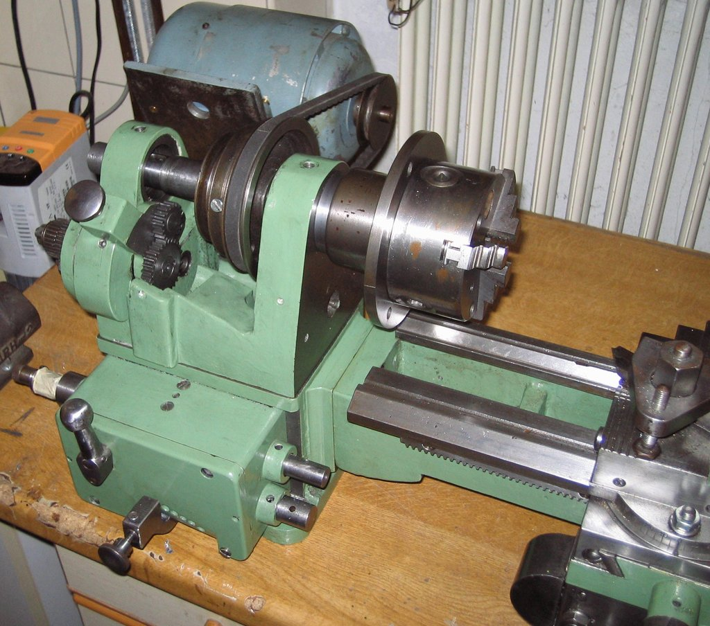

A 100 mm Roehm chuck is now mounted, which I've obtained in the meantime.
Since the spindle is to be replaced anyway, I just "quickly" reduced
the centring boss on the old flange and didn't do an elaborate rework.

A new headstock is being planned.
I'll just let the CAD speak:

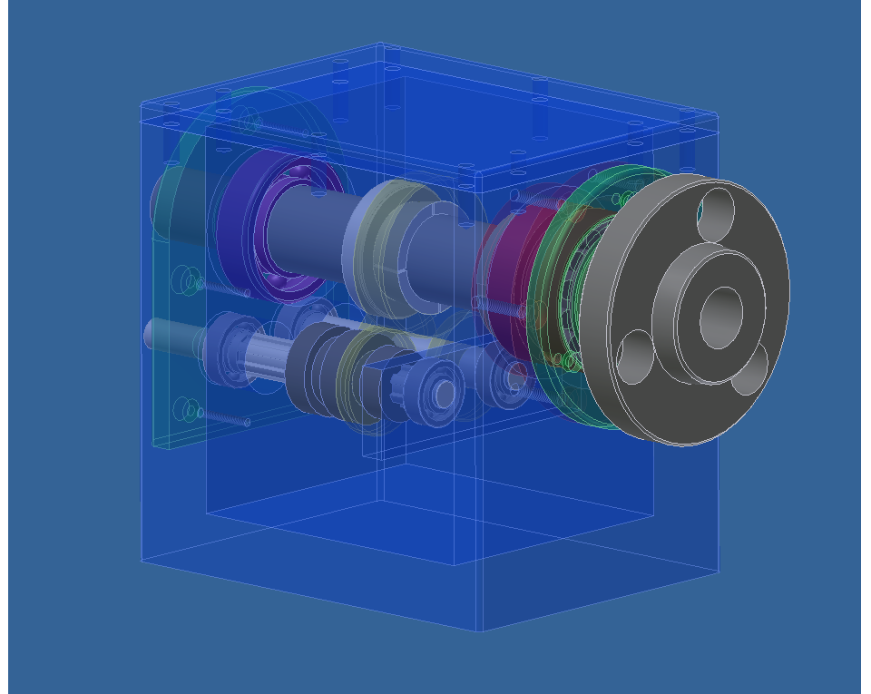

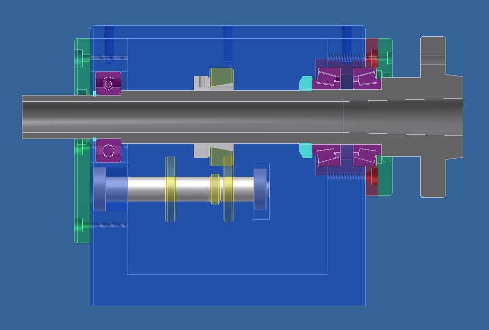

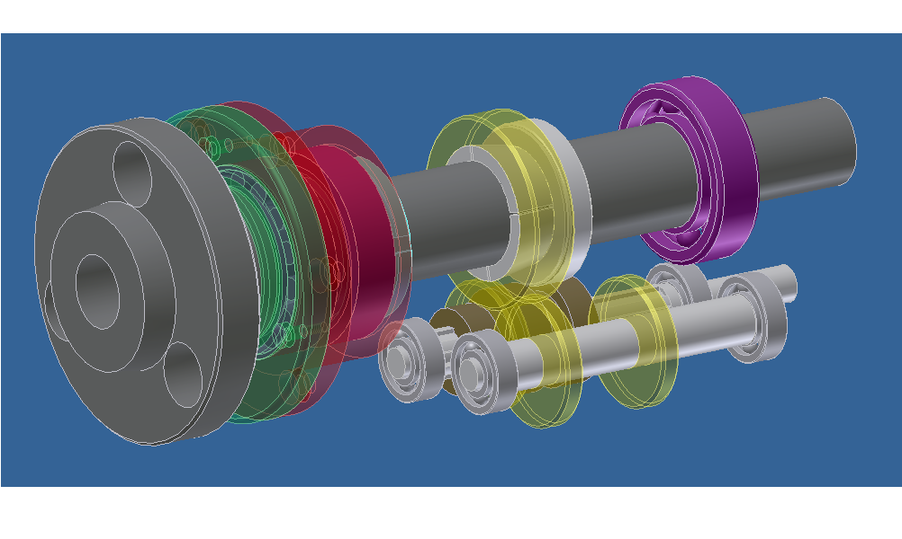

Various improvements:
1. Main-spindle bearing arrangement: tapered roller bearings in
   X-arrangement as fixed, deep-groove ball bearings as floating.
2. No tumbler reverse, but a sliding-gear gearbox with splined shaft.
3. Sump lubrication, also for the bearings.
4. Indexing via a 60-tooth gear on the main spindle (originally for
   the feed) with a detent pin.
5. Short-taper 3 as the spindle nose.
6. MT3 internal taper for further fixtures/tooling.
7. Box shape -> with side walls the headstock takes the cutting forces
   better than a U-shaped casting (where only the front leg conducts
   the force; in addition the bearing preload bends the legs together
   -> bearings get loaded at an angle -> die (faster)).
8. New spindle, hardened and ground -> a bit more accurate and
   wear-resistant (chuck changes etc.) and so on.

If anyone is interested in the drawings (Inventor 2009):

[Spindelstock_2013-10-25.zip](Spindelstock_2013-10-25.zip)

The lead screws have trapezoidal threads -- left for cross feed, right
for the compound. I'll leave them for now, since I'd want to redo the
whole apron at the same time. They're also still reasonably OK; if
precision is critical, I'll just clamp a dial indicator to the saddle.

Since the change-gear train is getting a new ratio off the main spindle,
I also have to redesign the feed gearbox (it's broken anyway) to get
sensible feed rates and thread pitches out of it. And while I'm at it,
I'll do the apron, because I really don't like the detent on the
longitudinal/cross feed (it pinches your fingers very easily).
With the new lead screws, I can also calculate the ratios properly.
For the dials I'm thinking of something a la Schaublin -- really nice
big ones, matt-chromed...

"More to come..."

## Compound: scraping in and re-bearing (2014-04-08)

After yesterday successfully completing the last math exam in my degree,
I treated myself to a few hours of scraping today.

I set myself the goal of overhauling the compound slide of my small lathe.
Here once more a picture of the starting state:

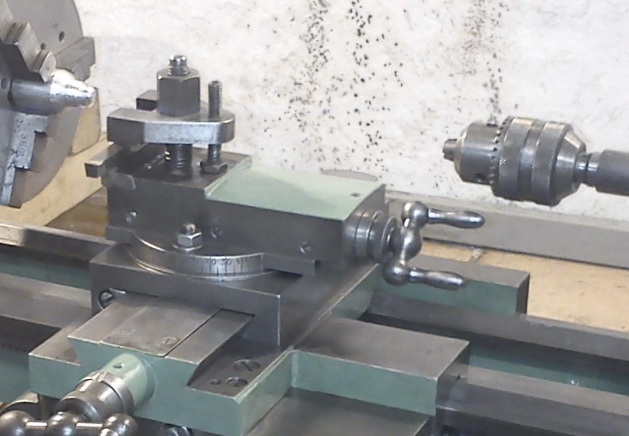

While disassembling, I was reminded of two pins that hold the bearing
block and that had since been hidden under the paint:

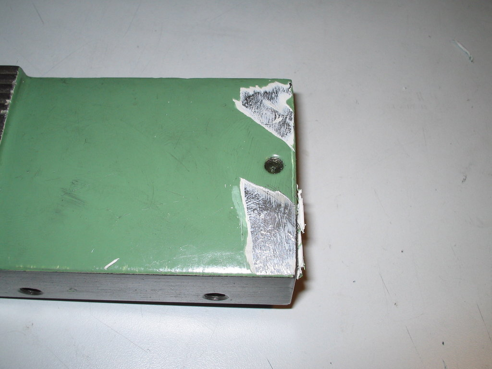

I drilled them out with the small bench drill press:

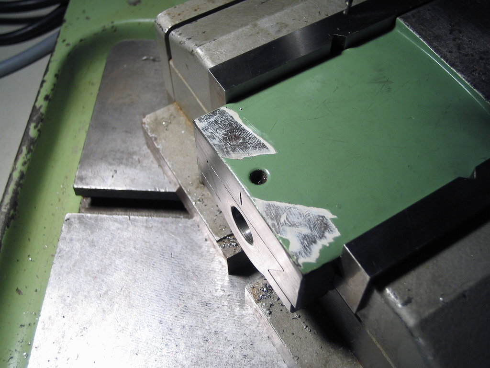

The compound could then be fully disassembled:

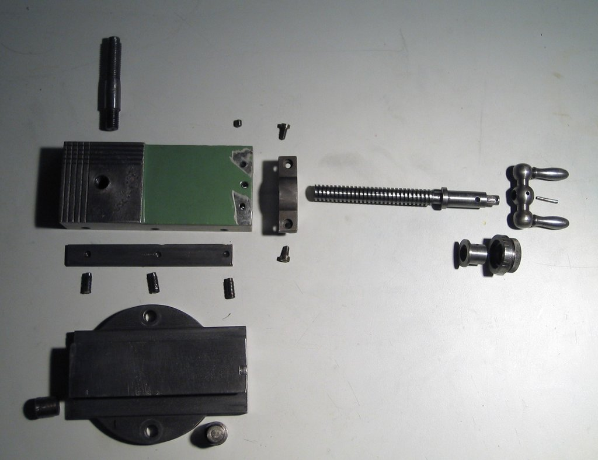

The flat surfaces blued up -- there's definitely work to be done:

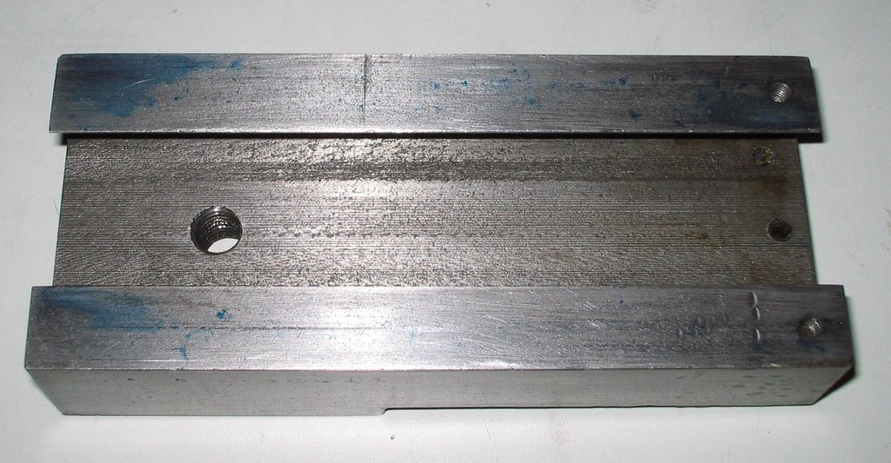

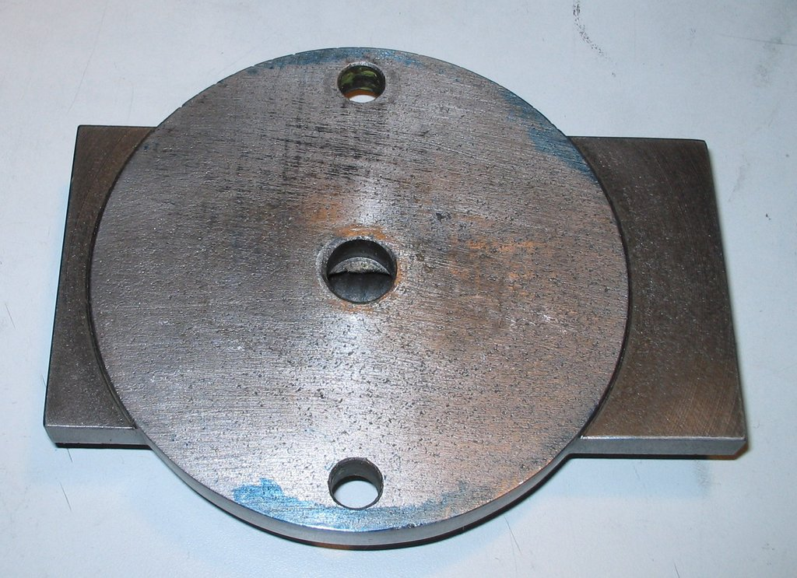

The reason for this work was an attempt to turn a taper using the
compound. The grooved surface that came off, plus the stiff hand crank,
convinced me that something has to happen.

First the lower part:
I clamped a few wooden battens to my desk to hold the workpiece somewhat
securely, and got going.


A small time skip:


That's how I left it for now:


Then the underside of the upper part:


I then drastically reduced the amount of bluing paste on the plate:


The plan is to use this surface to blue the surfaces of the lower part
that are parallel to its underside, and then scrape them in together
with a small straight edge.
Then the angled surfaces of the lower part -- parallel to each other --
then the angled surfaces of the upper part.

I'm thinking about whether to fit a gib into the upper part. The
compound isn't that big after all (overall length 140 mm, width 60 mm)
and that would be an interesting job for the shaper ;-)

When the compound is scraped in, I want to make a new bearing block
with radial ball and axial needle bearings, which should also give me
a few more mm of travel. I definitely want to be able to turn an MT2
on this machine, which needs about 80 mm of stroke...

For bluing paste I use the standard one from Diamant, available from
the local tool dealer.
About my scraping tools I once wrote here:
[Thread #9160](https://forum.zerspanungsbude.net/viewtopic.php?t=9160)

Parallelism and squareness I'll measure with a height stand, cylindrical
gauge pins, dial indicator and micrometer.

I'll re-work the underside a bit more.
When bluing the underside of the upper part, I applied a bit more paste
for the photo; this is really hard to photograph ;-) Regarding
lubrication, I plan to mill oil grooves into the ways, which together
with funnel-type oilers on the sides should give a reliable oil supply...

Today (2014-04-10) I made the relief cuts for the next surface to be scraped:


One more thing is noticeable in this picture: the leadscrew nut thread
is cut directly into the lower part.
Now neither the nut thread nor the lead screw is so worn that they need
replacing, but I'd somehow feel better if the nut were of bronze.
Especially since I'd actually like 2 mm per turn rather than 3 mm. The
current spindle thread is Tr 12x3; I'm leaning towards converting to
Tr 12x2, together with a nice dial from Ganter with 0.02 mm graduations.

Today (2014-04-23) not scraping news but a bit of shaping.
Following [Christoph's suggestion](https://forum.zerspanungsbude.net/viewtopic.php?f=10&t=11248#p117238)
I reworked the relief cuts. I also realised that even with my thinnest
scraper blade I couldn't get into the saw cuts.

So I clamped the lower part in the Klopp and aligned it:


In the utility tool holder is a self-ground grooving tool, slot width
about 2 mm:


The ram-head slide is set on its scale to 30° to plunge precisely into
the corner.

I then prepared the upper part for scraping the tool-holder face.
The shaper tool here is a huge HSS blank that someone once brought me.
It's ground with a radius of about 10 mm, 0° rake, about 20° clearance.
That gives pretty good surfaces in cast iron.


There's plenty of stock and the existing dings and gouges would be
more than annoying when scraping. In total 1 mm has come off, in
0.3 / 0.4 / 0.3 mm steps. I was surprised at how deep the dents from
the clamp adjustment screw really were.

Then I planed up a matching master straight edge. From the leftovers
of my 450 mm straight edge I had also made a small one of about 230 mm
and even scraped it in, but the angle didn't match this compound.
Before I started tipping the straight edge (which apparently some do
successfully...) I'd rather have one with the exact angle.
This I took off the lower part with a test indicator and aligned the
slide on the ram accordingly.


I took the angle when setting up the Klopp with the test indicator off
the lower part of the compound, and shaped accordingly. Of course there
will be tiny deviations, which you'll certainly see at first bluing.
But it's primarily about creating a flat surface;
the angles change minimally over the length of the straight edge.
The straight edge should therefore be made as accurately to the
existing angle as possible, but the angle that ultimately results
during scraping then follows the straight edge.
The dimensional deviations that result are, by my feel, in the 1/100
mm range and can therefore be ignored, since the slide can later be
adjusted play-free via the gib.

The surfaces to be scraped now all have nice relief cuts:


On the upper part I then wiped off the paint and roughed in the
tool-holder face:


Together with the straight edge, the parts are now waiting for me to
feel like having blue-grey fingers:


First, the master straight edge. I blued it after shaping at the new angle:


Then with plenty of bluing paste on the plate and Biax assistance,
roughly scraped to remove the shaping marks:


I then gradually reduced the amount of paste on the plate. That changes
the bearing pattern quite drastically -- in particular, it gets
progressively harder to read:


After scraping, I always honed the surface with an Arkansas stone and
thin oil to take down the burrs etc. before going to the surface plate.
That left, as I then noticed, a grey-blue haze on the surface, since
I was only wiping with a rag.
A difference that flattened me was achieved by wiping the surface with
acetone before each bluing pass, until nothing showed on the rag and
no haze remained on the surface. Suddenly, even with almost no paint
applied to the plate, the bearing pattern with tiny dots stood out
clearly again:


I then refined this a bit more:


Just for fun I counted the points per square inch -- looks about right:


The underside hardly distorted under the work, so only a few points
were retouched:


Now we move on to the lower part of the compound:


Slowly, with machine assistance via the Biax, I removed the central strip:


It's getting better:


Now I begin refining the bearing pattern:


Less and less bluing paste:


I think that should do it for now.

Continuing (2014-05-01).

To start, I checked the underside of the lower part once more to make
sure nothing else had distorted:


Then the underside of the upper part for the second time, which had
also distorted from shaping the relief cuts:


That became too little paint or too thinly-spread a pattern, so I
spread a generous layer of bluing paste on the plate again:


From about now on I wiped the surfaces with acetone before each bluing
pass to the point that no haze remained. Otherwise, with the Diamant
paste I could still see the dots, but couldn't scrape towards them
purposefully (sounds odd; some others here may know the feeling -- the
contrast just becomes too poor...).


That's where I left it for now: scraped fine enough?
With this surface I "quickly" blued the next surfaces in line:
the horizontal surfaces of the dovetail on the lower part:


I made sure the master is positioned without the surfaces to be blued
contacting the paste, and then only moved the master far enough that
it always rested fully.
If the bearing pattern is then correct, there's clearly still work to
do here too :-)

I'm honestly amazed at how much could still be done with the warped
part. Looking at the bearing patterns now... well, it'll get better ;-)

So far the surfaces have only been ones that needed simple flat
scraping. The next surfaces have to satisfy further conditions for
the first time:
1. flat
2. parallel to the underside of the lower part
3. no streak from insufficient bluing in the angle in which the gib
   later sits

A lot to do, but the (somewhat) finished surfaces already look so good
that motivation comes back.
