## Johannes Tittel BM6

The object of interest today is a small bench drill press from
"Johannes Tittel Praezisionsmaschinen" of Oberschlottwitz, near Glashuette
in Saxony -- model BM6.

Since I have for some time been etching my own PCBs (photo-positive plus
sodium persulfate, in case anyone is interested...) and naturally want to
drill them too, I was on the hunt for a small, high-speed bench drill press.
It also had to handle the rougher kind of model-making work, so Proxxon,
Dremel and the like were already out of the question. Green and heavy --
those are the good machines!
In November of last year I struck gold on eBay. It was the small drill press
mentioned above, with enough restoration potential to keep me happy.

Here are the auction photos:

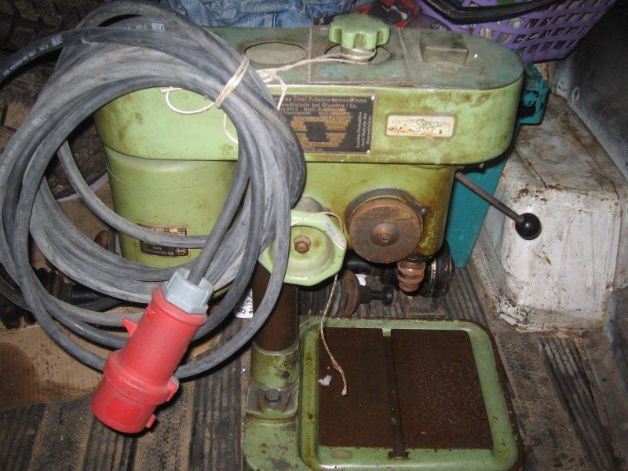

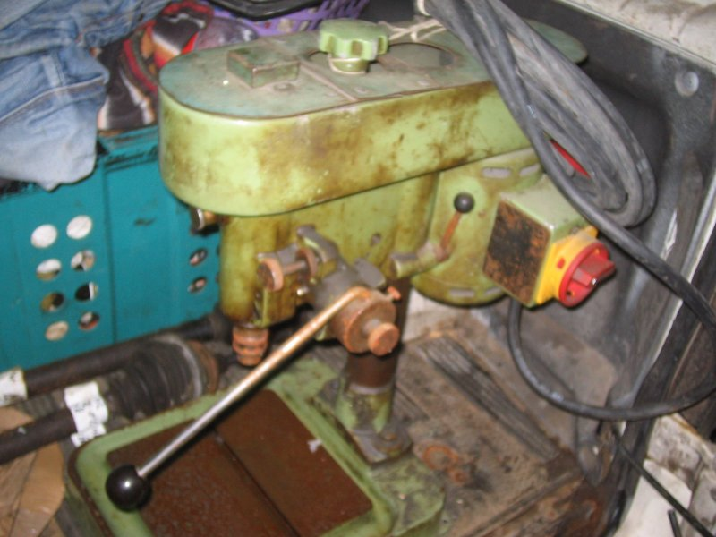

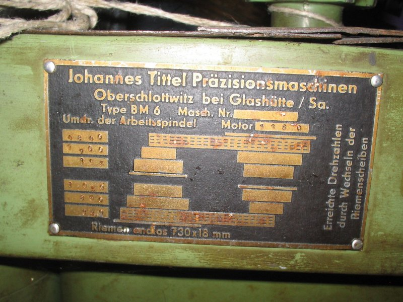

For just over EUR100 it became mine, and a few days later it was delivered
(lovingly packed in a wooden frame):

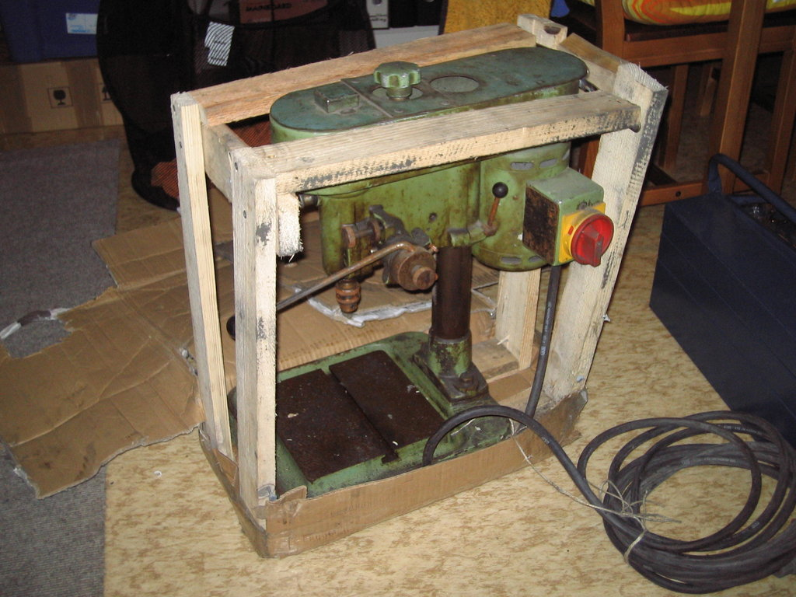

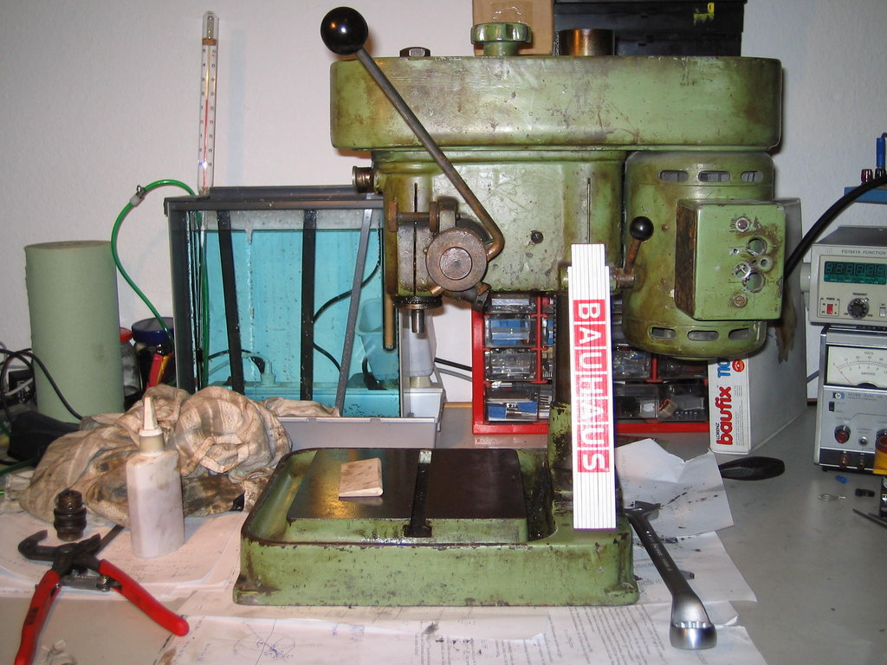

In the last picture you have a folding ruler for size comparison; cute,
isn't it? Even so, the technical data of this little gem aren't to be
sniffed at:
chuck taper: B12
throat: 120 mm
max chuck-to-table distance: 220 mm
motor: 1400 rpm, 160 VA
6 belt-drive steps, flat belt 730x18 mm, swappable pulleys
spindle speeds at 1400 rpm motor: 4840, 2700, 1650, 1050, 850, 390
quill stroke: 50 mm with scale and depth stop

Other niceties:
the quill lever can be re-indexed to whichever position is most comfortable.
The depth stop has a fine adjustment that lets you set the drilling depth
to almost 1/10 mm.
The quill fit is adjustable.

The next goal was to take the machine apart and clean the pieces.
Luckily, all the bearings were standard and could be replaced without
trouble. The spindle runs in two angular-contact ball bearings that can
be set up zero-clearance.
The upper front pulley and the motor sit on deep-groove ball bearings.

Here is the machine after disassembly and cleaning:

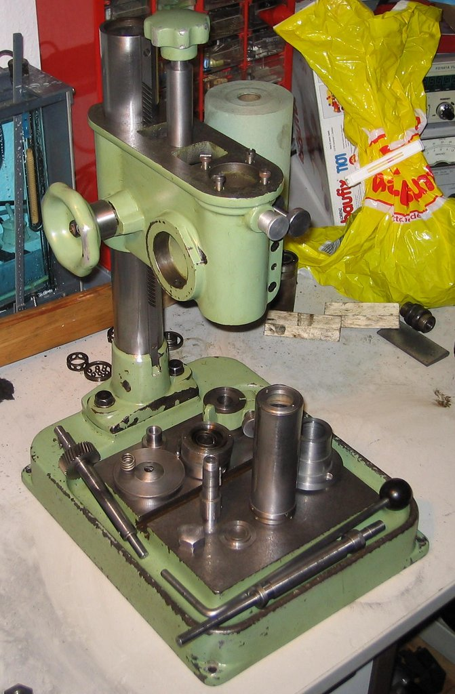

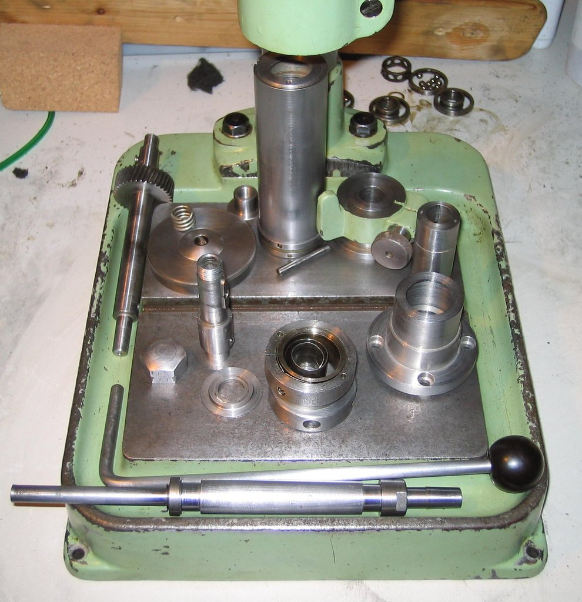

For the drill chuck I'm currently using a 0-5 mm Albrecht that I had
lying around and that happens to fit this machine perfectly.

After that, nothing happened for a long time -- I had a few exams to write
and only occasionally got back to the machine.
Anyway, somehow it eventually came back together piece by piece:

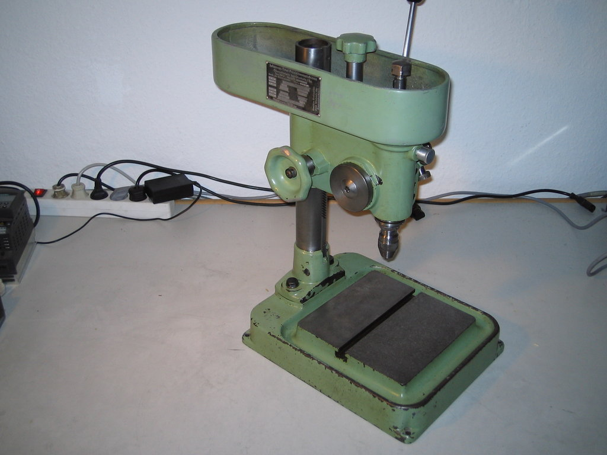

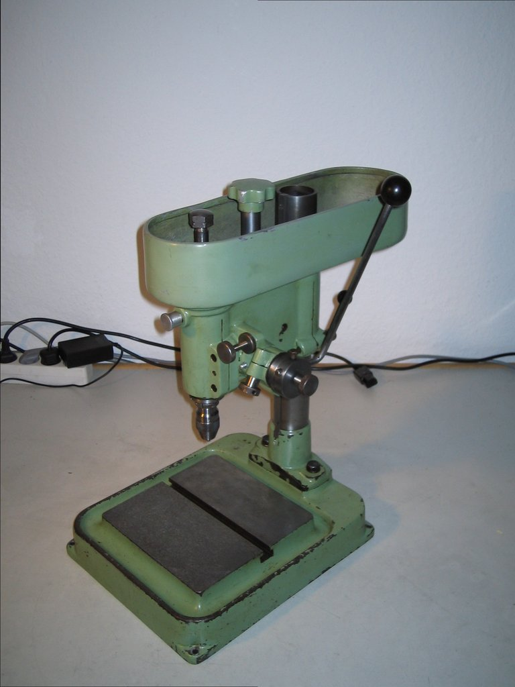

Recently I picked up a small Siemens Micromaster 410 VFD for EUR30,
good for motors up to 0.37 kW and 0-650 Hz.
It of course went onto the drill press, and with a piece of masking tape
as a belt I did a test drilling: works splendidly!

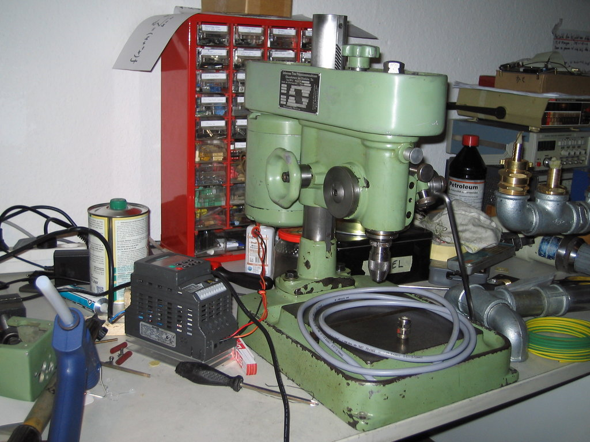

The wiring is now of course done with the Oelflex cable lying on the bench,
and the VFD will go into a small electrical cabinet that is still waiting
to be put into service.

In place of the masking tape I bought a [proper flat belt](http://www.riemen-profi.de/Flachriemen/Flachriemen-Esband-det.251200730.html).

I still need to re-align the motor and pulleys; the belt is rubbing
somewhere. Soon...

With the VFD I easily reach the speeds I need for carbide PCB drills.
Noise levels are quite reasonable (apart from the rubbing belt).
Mass and stability really do pay off...

Conclusion: another lovely little machine restored, and one that will
hopefully serve me faithfully for many years to come.
There's plenty of work to be done.

Since I've already had a few queries about it, here are the bearing
sizes once more:

motor: 2x 6201
front pulley: 2x 6202
quill: 2x 7202

I went with the 2Z variant in each case, so the rubber lip doesn't
get worn down at the high speeds...

There are also pictures of the height adjustment, which for whatever
reason I had been holding back:

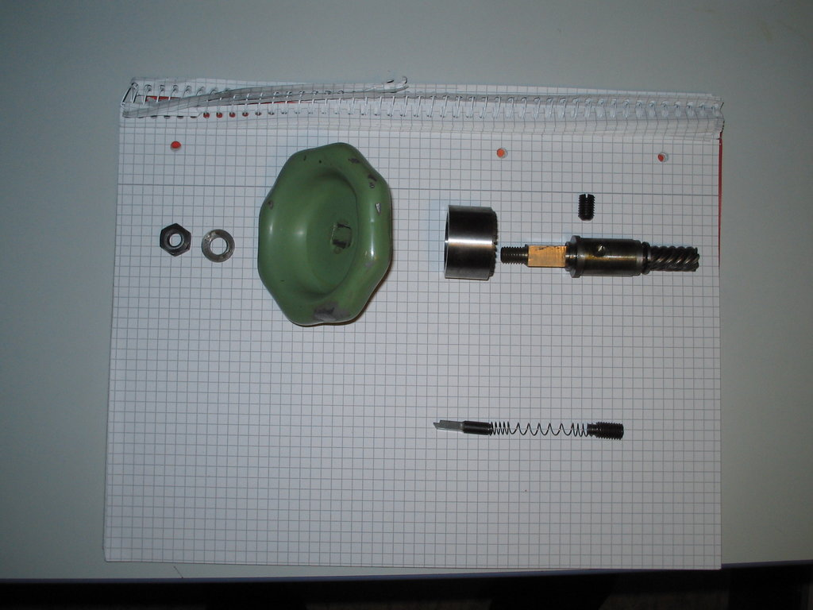

From left to right:
1. M8 nut
2. Washer
3. Handwheel with internal square and a taper at the back
4. Brake cup: internal taper matching the handwheel on the left,
   sawtooth ratchet on the right
5. Height-adjustment shaft: M8 on the left, then square for the handwheel,
   then bushing seat, then 7-tooth helical gearing,
   pitch angle (by eye) 45°

The bushing is fixed by the grub screw from behind (in the housing).

Next row:

6. Ratchet pawl, engages the ratchet teeth of the brake cup so that
   when cranking up the ratchet slips, while when cranking down the
   brake cone brakes the motion of the head.
7. Spring that pushes the pawl against the brake cup, and so also
   provides the contact force of the cup against the handwheel.
8. Grub screw that retains the spring from the right.

And here is the height-adjustment shaft on its own:

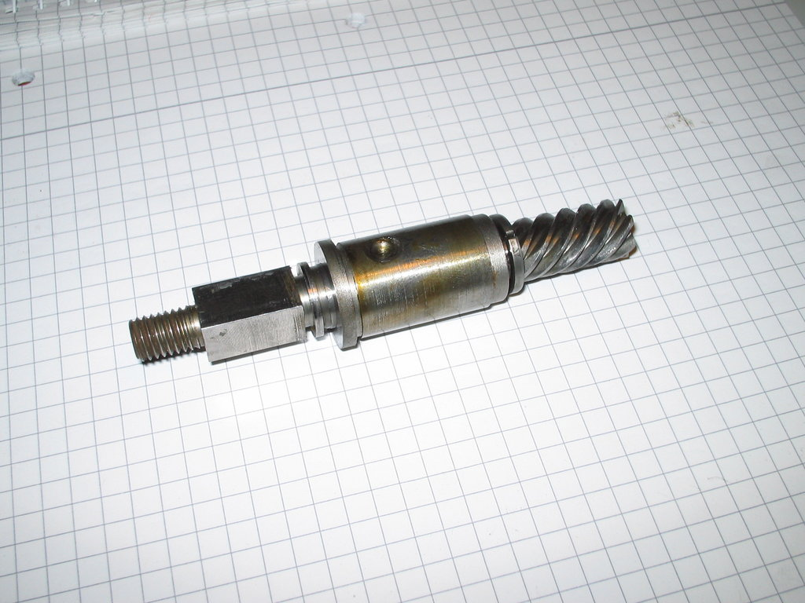

## Disassembling the quill

As far as I remember, the quill pinion gear -- to which the lever is
attached -- has to be pulled out sideways first. Then you can pull the
quill out downward.

I don't recall any left-hand threads off the top of my head (other than
on the pulleys).

So first remove the return spring on the left, then on the right remove
a grub screw that holds a bearing bushing, and pull/tap the pinion shaft out.

You can then open the quill with a pin spanner at the bottom and (if I
remember correctly) a face pin spanner at the top, and remove the shaft
together with its bearings.
Bearing clearance is set via the lower bearing retainer.
