## Johannes Tittel BM6

Das Objekt von Interesse ist heute eine kleine Tischbohrmaschine des Herstellers
"Johannes Tittel Präzisionsmaschinen" aus Oberschlottwitz bei Glashütte in Sachsen vom Typ BM6.

Da ich seit einiger Zeit auch selber Platinen ätze (photo-postiv und Natriumpersulfat, falls es jemanden interessiert...)
und diese natürlich auch bohren möchte, war ich auf der Suche nach einer kleinen, hochtourigen Tischbohrmaschine.
Sie sollte jedoch auch für den anderen, "robusteren" Modellbau-Kram herhalten, also kam Proxxon, Dremel etc. schon mal nicht in Frage. Grün und schwer, das sind gute Maschinen!
Im November letzten Jahres wurde ich dann auf eBay fündig. Es handelte sich um besagte kleine Bohrmaschine,
die auch genügend Restaurationspotential für mich zu bieten hatte.

Hier seht ihr die Bilder aus der Auktion:

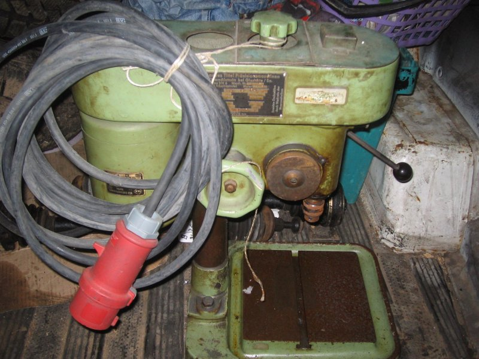

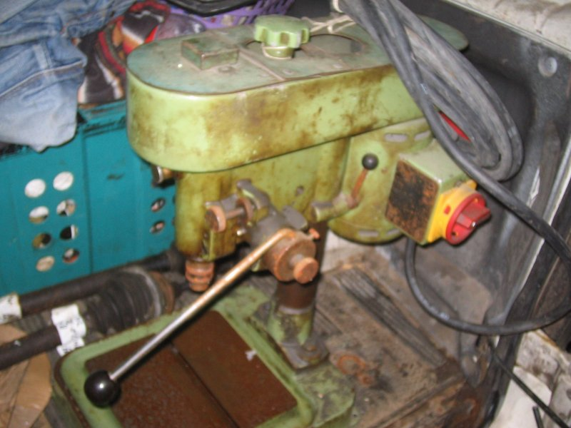

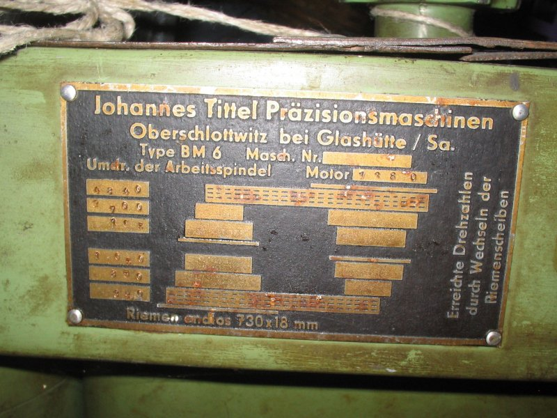

Für etwas über 100€ wurde sie dann mein, und ein paar Tage später wurde sie
(liebevoll in einem Holzgestell verpackt) mir geliefert:

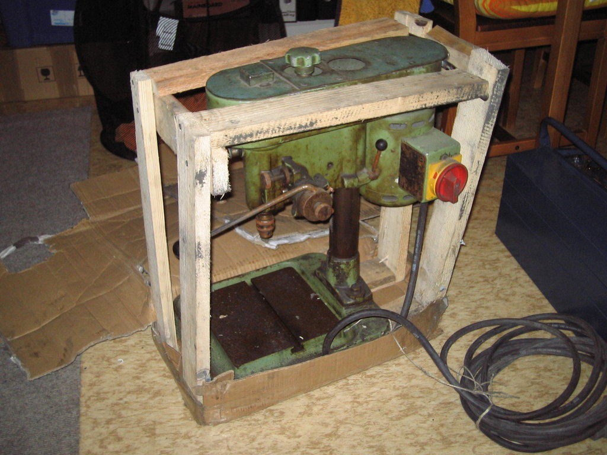

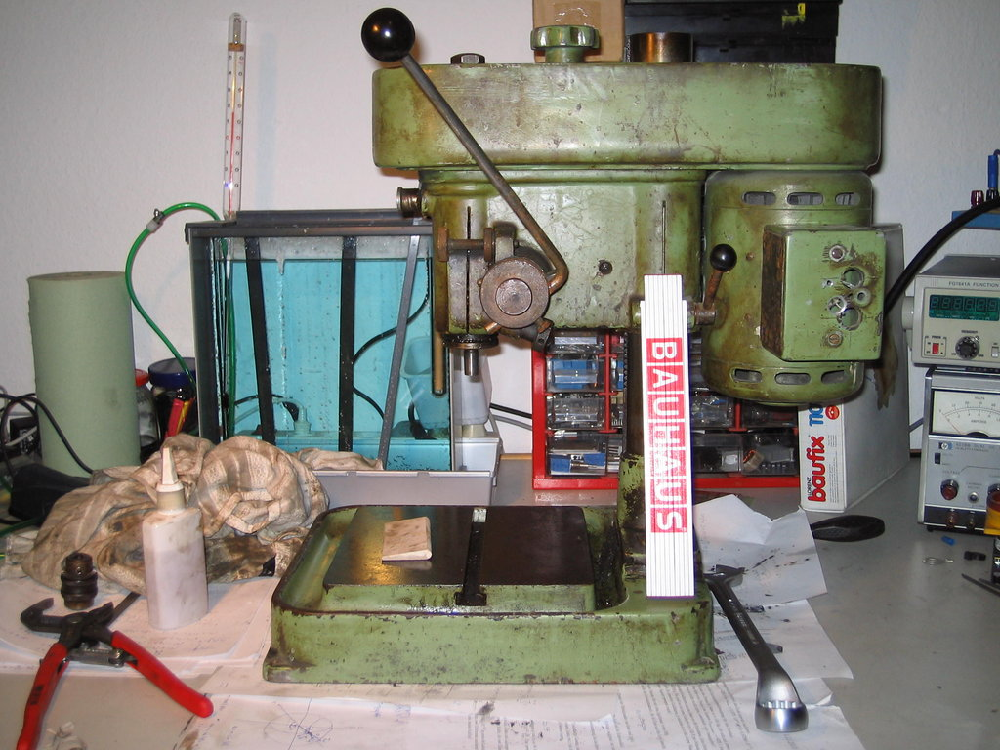

Im letzten Bild habt ihr mit dem Zollstock mal einen Größenvergleich; putzig, nicht wahr ?
Trotzdem sind die technischen Daten dieses Schätzchens auch nicht zu verachten:
Futterkegel: B12
Ausladung: 120mm
max. Abstand Futter-Tisch: 220mm
Motor: 1400 Upm, 160VA
6 Riemengetriebestufen, Flachriemen 730x18mm, austauschbare Riemenscheiben
Drehzahlen bei 1400Upm des Motors: 4840, 2700, 1650, 1050, 850, 390
Pinolenhub: 50mm mit Skala und Tiefenanschlag

Sonstige Nettigkeiten:
Der Pinolenhebel lässt sich in Rastungen verstellen, jenachdem, welche Position die angenehmste ist.
Der Tiefenanschlag verfügt über eine Feinverstellung, mit der sich die Bohrtiefe fast auf 1/10mm genau festlegen lässt.
Die Pinolenführung ist nachstellbar.

Das nächste Ziel war dann, die Maschine in ihre Einzelteile zu zerlegen und diese zu reinigen.
Die Lager waren glücklicherweise allesamt Standardlager und konnten problemlos ersetzt werden.
Die Spindel ist in zwei Schrägkugellagern gelagert, die spielfrei eingestellt werden können.
Die obere Riemenscheibe vorn und der Motor sind mit Rillenkugellagern gelagert.

Hier seht ihr die Maschine nach dem Zerlegen und Reinigen:

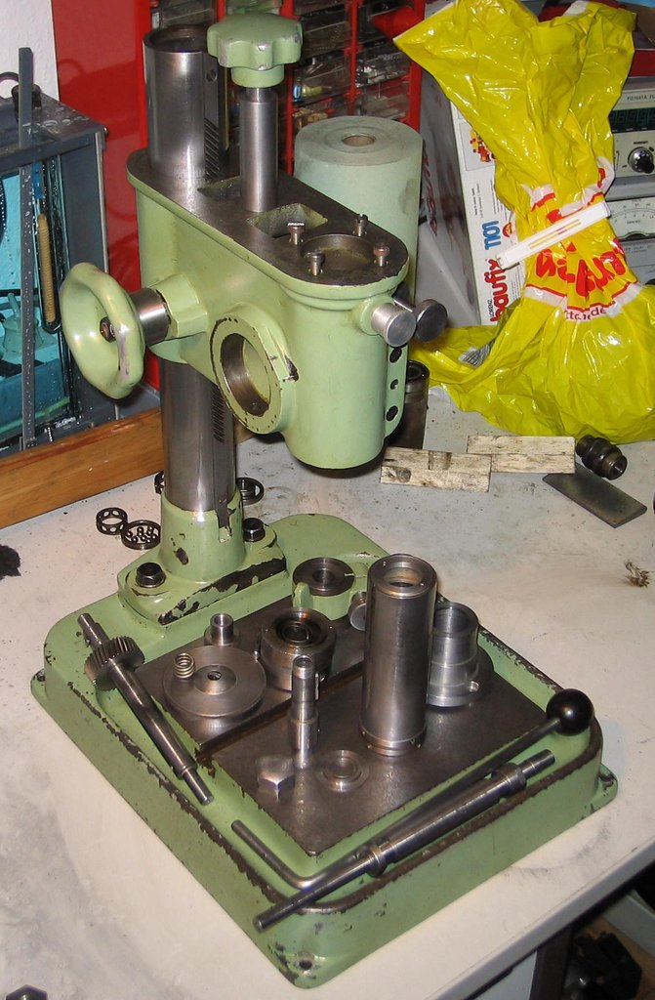

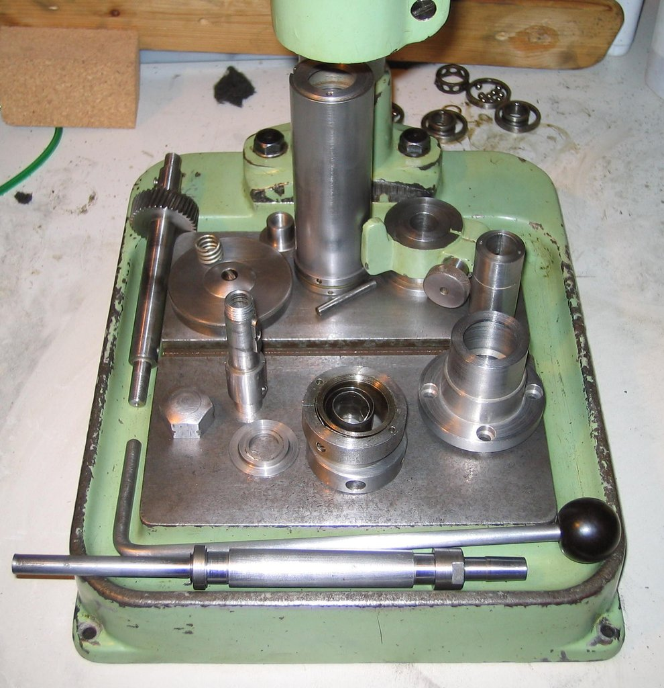

Als Bohrfutter verwende ich momentan ein 0-5mm Albrecht, das ich noch rumliegen hatte und das
zufälligerweise perfekt an diese Maschine passt.

Dann ist erstmal lange nichts passiert, ich habe ein paar Prüfungen geschrieben
und hin und wieder mal an der Maschine weitergearbeitet.
Na ja, irgendwie ist sie dann wieder Stück für Stück zusammengekommen:

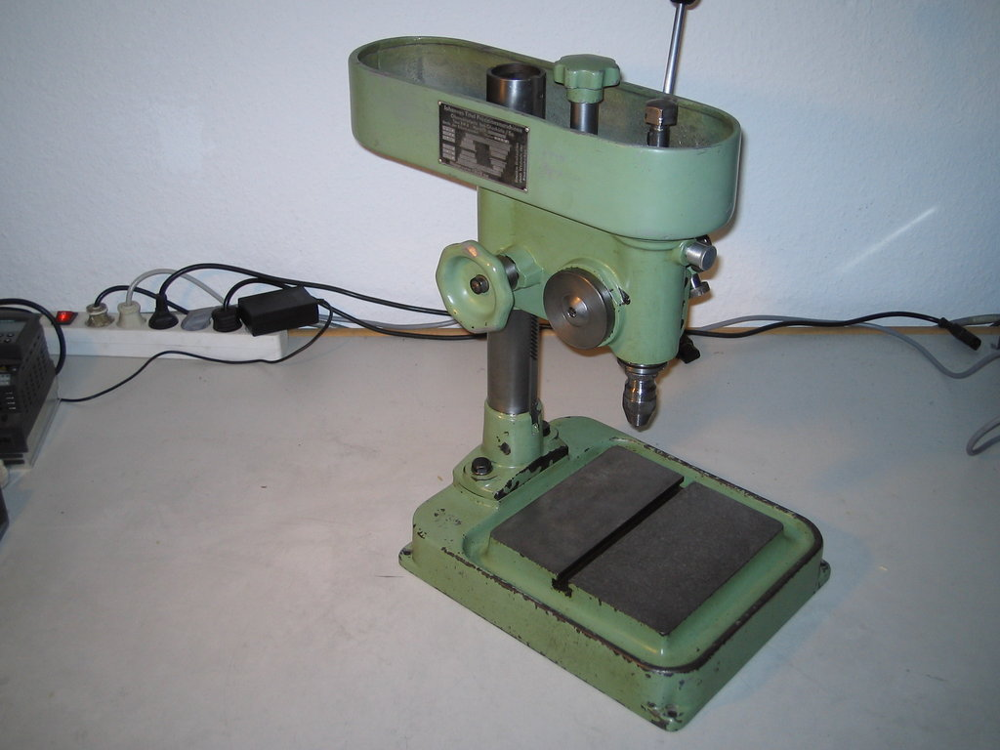

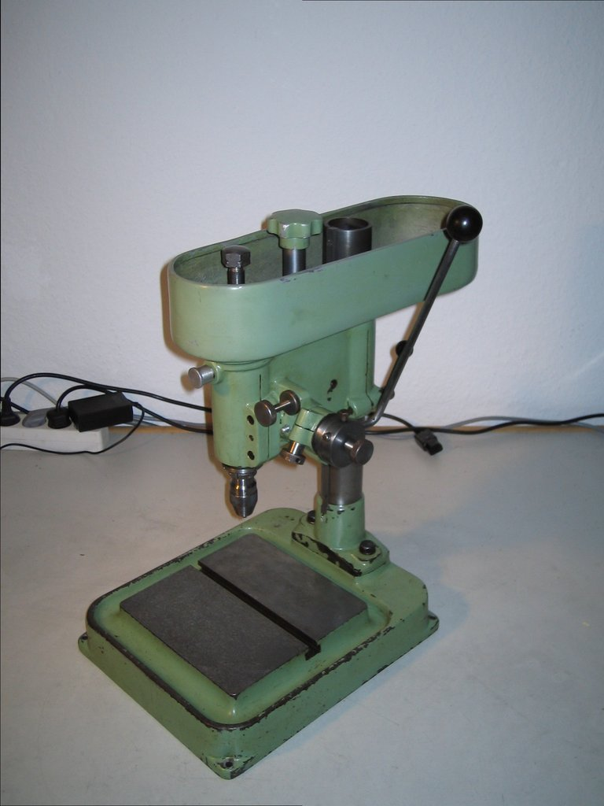

Neulich ergatterte ich dann für 30€ einen kleinen Siemens Micromaster 410 Frequenzumrichter
für Motoren bis 0.37kW und 0 - 650Hz.
Der kam dann natürlich an die Bohrmaschine und mit einem Stück Tesakrepp als Riemen
habe ich dann mal probegebohrt: funktioniert astrein!

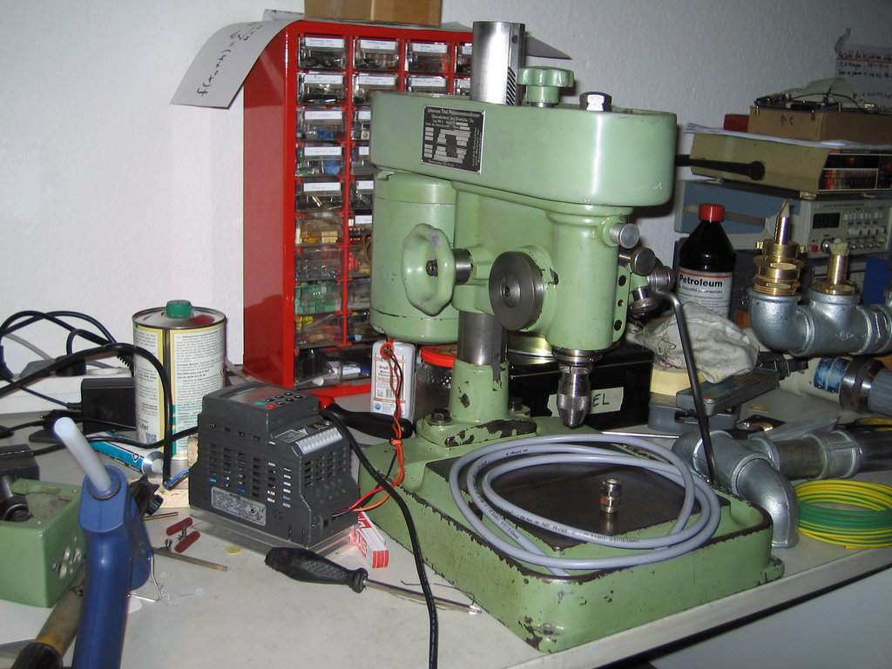

Die Verkabelung ist inzwischen natürlich mit der auf dem Tisch liegenden Ölflex-Leitung ausgeführt und der FU kommt noch
in einen kleinen Schaltschrank, der noch auf seine Verwendung wartet.

Statt des Tesakrepp habe ich mir dann noch einen [anständigen Flachriemen](http://www.riemen-profi.de/Flachriemen/Flachriemen-Esband-det.251200730.html) gekauft.

Die Ausrichtung vom Motor und den Riemenscheiben muss ich nochmal korrigieren;
irgendwo schleift da der Riemen noch. Kommt noch...

Mit dem FU komme ich locker auf die Drehzahlen, die ich für die HM-Platinenbohrer brauche.
Die Geräuschentwicklung hält sich dabei (bis auf den schleifenden Riemen) stark in Grenzen.
Masse und Stabilität zahlt sich halt doch aus...

Fazit: Wieder mal eine schnuckelige Maschine aufgearbeitet,
die mir nun hoffentlich viele Jahre treu zur Seite stehen wird.
Arbeit ist genug zu tun.

Weil ich dazu schon ein paar Nachfragen erhalten habe sind hier nochmal für alle die Lagerbezeichnungen:

Motor: 2 Stk. 6201
vordere Riemenscheibe: 2 Stk. 6202
Pinole: 2 Stk. 7202

Ich hab jeweils die 2Z-Ausführung genommen, damit die Gummilippe sich bei den hohen Drehzahlen nicht aufreibt...

Außerdem gibts noch Bilder von der Höhenverstellung,
die ich bisher aus welchen Gründen auch immer vorenthalten hatte:

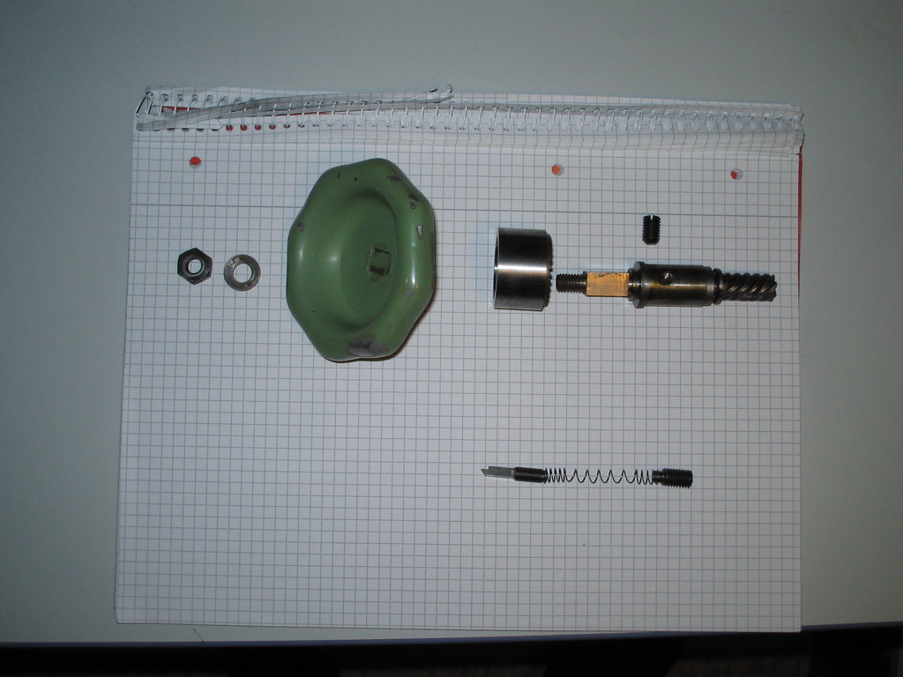

Von links nach rechts:
1. Mutter M8
2. Unterlegscheibe
3. Handrad mit Innenvierkant und hinten einem Konus
4. Bremsglocke: Innenkonus, passend zu Handrad links, rechts Sägezahnverzahnung
5. Höhenverstellwelle: links M8, dann Vierkant für Handrad, dann Gleitlagerhülse,
   dann 7-zahnige Schrägverzahung, Steigungswinkel (per Augenmaß) 45°

Die Gleitlagerhülse wird mit der Madenschraube von hinten (im Gehäuse) befestigt.

nächste Zeile:

6. Ratschenstift, greift in die Ratschenverzahnung der Bremsglocke, sodass
   beim Hochdrehen die Ratsche durchrutscht, beim Runterkurbeln der Bremskonus die Bewegung der Maschine bremst.
7. Feder, die die Ratsche gegen die Bremsglocke drückt und damit auch die Anpresskraft für die
   Glocke gegen das Handrad erzeugt.
8. Madenschraube, die die Feder von rechts fixiert.

Hier nochmal die Höhenverstellschraube einzeln:

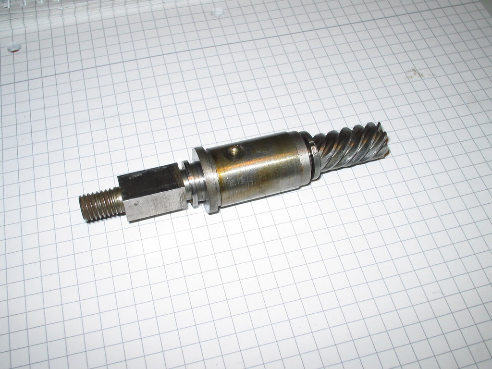

## Zerlegung der Pinole

Soweit ich mich erinnere, muss das Pinolenzahnrad, an dem der Hebel befestigt ist,
zuerst zur Seite herausgezogen werden. Dann kann man die Pinole nach unten rausziehen.

An Linksgewinde kann ich mich spontan (außer bei den Riemenscheiben) nicht erinnern.

Also zuerst links die Rückholfeder abbauen, dann rechts eine Madenschraube, die eine Lagerbuchse hält,
entfernen und die Zahnradwelle rausziehen/-klopfen.

Die Pinole kann man dann mit einem Zapfenschlüssel unten und (wenn ich mich richtig erinnere) einem
Stirnlochschlüssel oben öffnen und die Welle samt Lagern entnehmen.
Das Lagerspiel wird über die untere Lagerbefestigung eingestellt.
