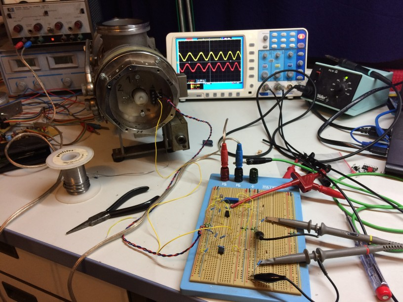

## Pfeiffer TVP250 (2016-11-06)

I am currently building a controller for my good old Pfeiffer TVP250:

The motor is a four-phase brushless DC type, with a permanent magnet on the shaft.
Thus, by applying a DC voltage to any of the phases with respect to the center tap, the rotor
rotates into a well-defined position. As it turns out, to accellerate the rotor, a constant phase
shift of 45 degrees has to be maintained between the driving magnetic field and the magnet on the rotor.

The old controller died (this is how I got this pump in the first place),
but I was able to get [some information from Pfeiffer](PM0012BD.pdf):
* User's Manual "PM 800 012 BD" resp. "B 400 000 C d"
* Schematics "S 400 000 C"
* Spare Parts List "E 400 000"

Yesterday evening I was able to test the new driver electronics for the first time.
The L6203 run pretty hot given that they used to be mosfets, but nothing a nice heatsink could not cope with.
Here are the EAGLE schematics again: [TMP_Controller.zip](TMP_Controller.zip)

A video of the first run can be found on YouTube: https://youtu.be/dmyyyMA9du0

The oscillation is due to the rotor locking on the driving field, being accellerated, then the phase shift
(and thus the driving force) vanishes and the rotor deccellerates again.

Next step are:
* Attach a Hall sensor (TLE 4905L) in the vicinity of the shaft end which has a magnet already attached.
  The original drive circuit also used Hall sensors, but in an all-analog approach.
* The bearings have to be replaced, they sound really bad.
* The motor for the oil pump has to be brought back to working condition.
* A cooling water supply is needed.
* I need to turn some ISO K and KF flanges for connecting the turbo to my forepump (Alcatel 2012) and to some pressure gauge(s).

## Driver Circuit (2017-02-19)

The motor is for the bearing lubrication pump which turns out to be a faily straigtforward worm pump.
Bearing are EL8 wich could be replaced by a modern 608 in P5 precision, maybe P4 if it is affordable...
Since all the rubber rings are ca. 30 years old, I will disassemble the whole unit and replace them too.

Here is an image of the driver circuit:

and a PDF of the board layout as a 300dpi PDF: [TMP_Driver.pdf](TMP_Driver.pdf)

The current setup constists of my usual ATmega32 development board and some crude wiring,
but the rotor accelerates up to some speed, where defined by the current code on the µC some limit is reached :-)

Next steps:
* add LCD display to µC circuit for enhanced debugging capabilities
* find out wether 608P5 or 608P4 bearings are affordable
* turn an adapter ISO-K 65 <--> KF 40 on the lathe

## Hall Sensors (2017-03-03)

Today I had some time to go on building my new driver circuit for the Pfeiffer TVP-250.

This is a view on the motor signals when I started today.
The inductivity of the motor strongly distorts the signal and makes it hard to debug the driver circuit.

Therefore, I build a star of four 30 ohms resistors which are attached to the driver instead of the TMP motor.
Now the signal looks as intended and allows to verify the correct signal generation.
Two opposite phases are shown, therefore the phase shift is 180°.

For a precise control of the acceleration phase of the motor, I need information on at which position the rotor
is currently located. I already had a single unipolar Hall switch, which gives me one defined pulse per revolution,
but I did not like that anymore.
So I decided to go for linear Hall sensors (SS 56 ET) which produce a voltage linearly dependent on the
surrounding magnetic field.

 	

The single sensors are mounted via one strong wire and thus can be bent to stay in place without having to
fiddle with bending more that one strong wire at a time.

Here you can see the sensor board attached to the pump body.
In order to get a strong signal, I positioned the sensors as close to the magnet as possible.

However, this turned out to be not optimal. The waveform is quite distorted and one can imagine
that I was not willing to use this as an input to my circuit.

Therefore, I moved the Hall sensors some millimeters away from the magnet and obtained a much nicer
sine-like waveform; due to the larger distance the amplitude has also fallen to about 10% of the original one.
Since the main controller should be an ATmega8 with an integrated ADC with an input voltage range of 0 ... 2.56V,
I needed a level shifter which did as well some amplification to utilize as much of the ADC range as possible.
The LT1006 was specifically designed to operate on 5V, so it was a nice choice (apart from the fact that I had one of them lying arround ;-) )

I was just about to order some new LT1006s when I took a second thougt on the circuit and wether the
goal can be reached as well with some more common opamp like the LF411...

Here is what I came up with:  
The LF411 form two difference amplifiers, just as in the LT1006 version.
The AD580 and 1k pot are used to supply the offset voltage, which is subtracted from the input signal from the Hall sensors.
The trick lies in the two diodes (1N4148) and the 2k7 resistor at the LF411 output.
Using these, the output is DC-wise downshifted by about 1.2V (2x600mV) and thus, the opamp output
can operate comforably high above ground. The only noticable side effect so far is that the offset pot has to be set
to another voltage to compensate for the voltage drop at the output diodes.
One could argue that the diode characteristic is going to put a nonlinear term into the amplifier,
but since the diode is biased at ~0.4mA, I do not expect the forward voltage to change much.

Here is the realisation of the circuit on the breadboard:

Below you see the final waveforms to get digitized. The shape is not exactly sinusoidal which I belive
is a geometric effect resulting from the shape of the magnets dipole field rotating aside the Hall sensors.
At first, I worried about the kind-of saturation of the signals at the top and bottom.
However, these seem to stem from the specific magnetic field configuration and could not easily be eliminated.
It is definetely on an opamp effect. I thought about the uniqueness of each set of the two voltage levels
and wether I could always determine the exact rotor position from that.
However, when (e.g.) signal 1 is at its top level, signal 2 has a strong slope and so I can identify
the position of the rotor for each set of the two voltages :-)

The plan is now to attach these signals to the ATmega and write some sort of look-up-table to identify the rotor position.
Then, the controller can decide which current patten to apply to the coils depending on the current operating mode:
power-down (no signal), acceleration (45° leading phase), decceleration (45° lagging phase) or idle (0° phase shift).

## New Controller Board (2017-05-20)

After moving to Greifswald, I have now set up my lab again and did some progress on the TVP250 controller.

First step was to actually build the preamp circuit I mentioned in my last post on a circuit board.

Then, I modified an old microcontroller develmopment board to
* calculate the rotor position from the two digitized Hall sensor voltages
* set the driver input signals accordingly to synchronosly drive the motor in the pump and
* handle user interaction via an LCD and two pushbuttons (start and halt).

After some fiddling with a proper algorithm which is both capable of semi-realtime control of the drivers
and handling user interaction with the slow LCD interface, the pump nicely accelerates and decelerates on user request.

Here is a short video of the operation: https://www.youtube.com/watch?v=7gtoqjd_-4Y

Now, I have to get my forepump running and see if the pump really accelerates up to 500Hz.
At that point, I will also need to implement the hold-mode in the source code which limits the maximum frequency of the driver.

The source code (written for AVRGCC in AVRstudio 4.18) can be found in this zip file: [tmp_controller_20170520.zip](tmp_controller_20170520.zip).

