## KF40/CF40 Adapter Flanges

Over the Christmas break I once again had a bit of time to turn a few
adapter flanges in the workshop of a good friend.
You can of course [also buy these](http://just-vacuum.de/index.php/de/uebergaenge/kf-cf-gerade/cf040xkf40),
but then there'd be nothing to write about...

Here are the finished pieces:

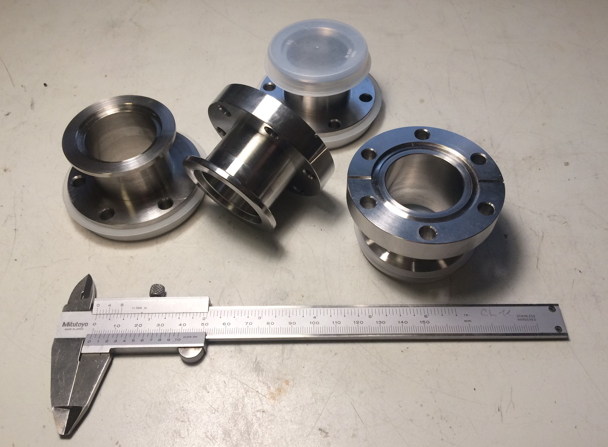

The abbreviations stand for KleinFlansch (an invention by Leybold) and ConFlat (Varian).
The 40 refers in each case to the maximum bore size that fits in a flange of that size.
KF flanges are typically used only down to high vacuum, because the rubber sealing
rings don't seal well enough and outgas themselves.
For lower pressures (ultra-high vacuum) you therefore move to CF flanges with a
knife edge that bites into a copper gasket.
A properly mounted CF flange (bolts torqued correctly in a star pattern, brand-new
gasket) is normally tight for several generations of researchers. The KF system,
on the other hand, has the advantage that it can be reconfigured very quickly
using clamping rings.

I needed these adapter pieces in order to integrate a CF-flanged gate valve into
a vacuum setup that uses KF flanges.

For raw stock I had ordered some 1.4305 remnants on eBay.
It became apparent from the very first chips, however, that this could not
possibly be free-machining stainless. At the end of one of the offcuts I eventually
found a sticker identifying the material as 1.4404...
Frankly that's even fine by me, since 1.4404 is a commonly-used material for
vacuum equipment; the machining was just a bit more tedious.

First, the roughly-sawn pieces were turned to length with a 0.5 mm finishing allowance:

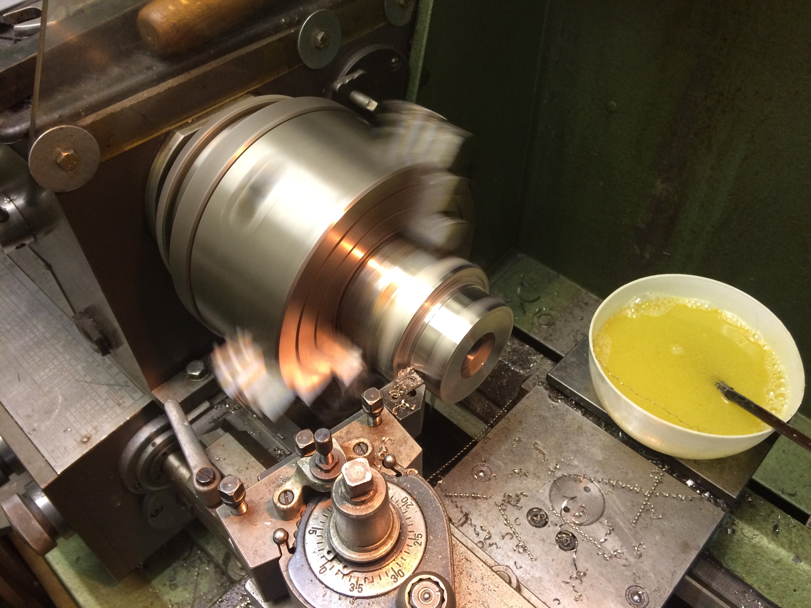

The pieces were also drilled through to 30 mm with a twist drill and bored out to 35 mm
[unfortunately no picture of this].

For the rest of the work I made an arbor. Tightening the clamping screw drives the
clamping insert outward against the prongs, gripping the workpiece very firmly with
good concentricity:

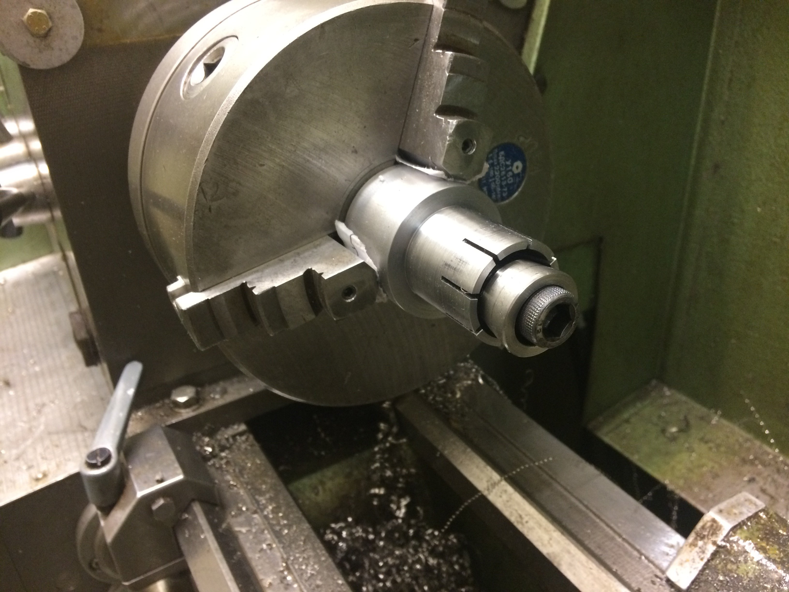

The bore for the clamping insert also includes a jacking thread, so that the often
tightly-seated insert can be pressed back out:

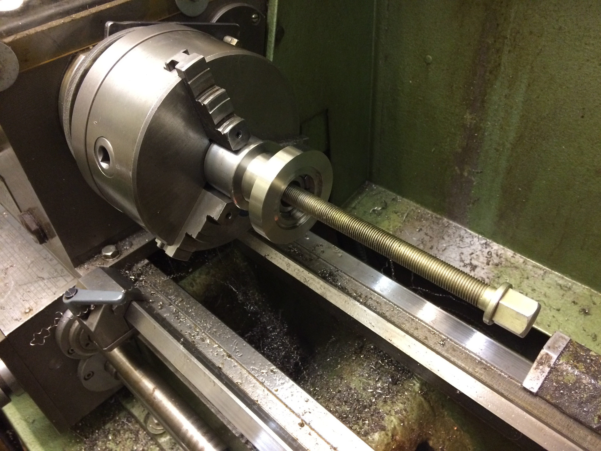

After being clamped on the arbor, the rough pieces were turned down to the outer
diameter of the CF flange (70 mm). The shoulder was also rough-turned to the
outer diameter of the KF flange (55 mm):

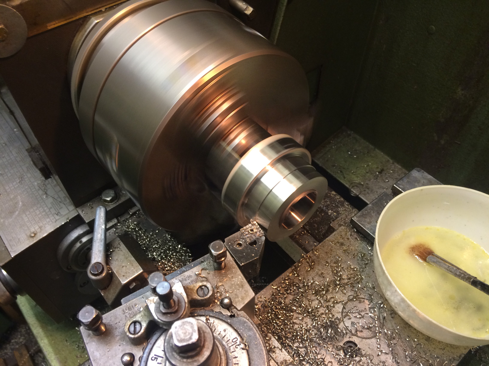

Next comes the recess for the inner-centring seal on the KF side:

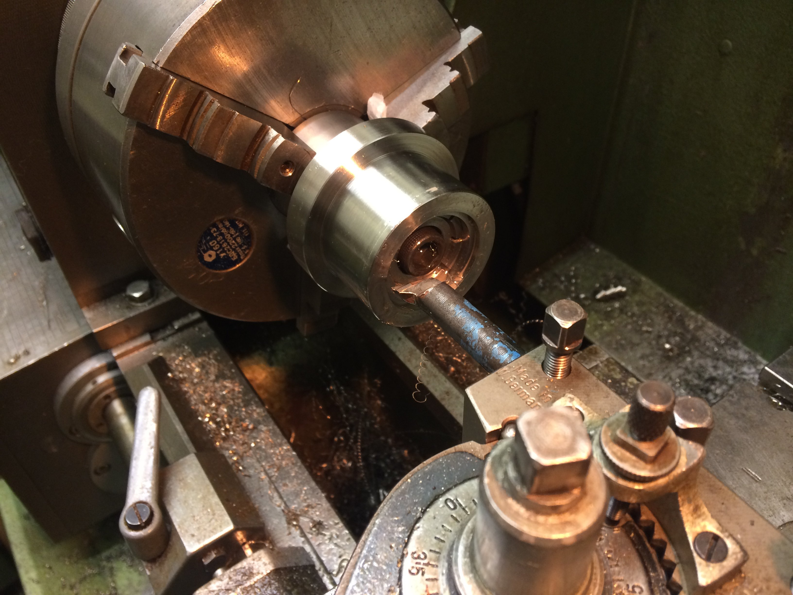

To chamfer the inside edges I used the same boring bar with the spindle running
in reverse:

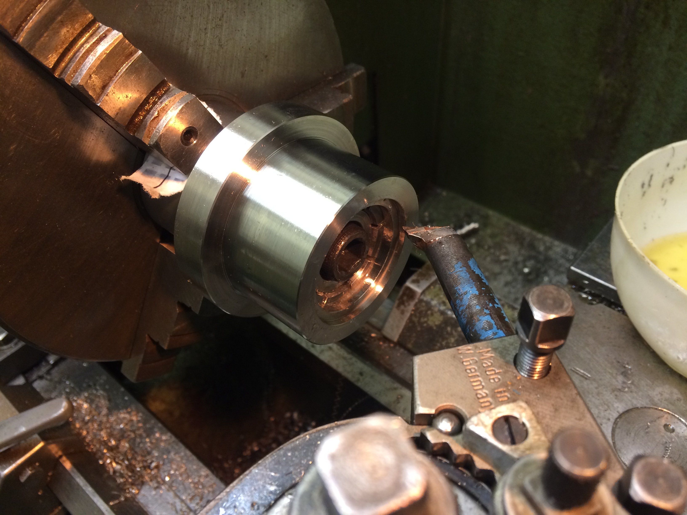

A VCGT insert was then used to cut the relief between the two flanges.
I had first tried it with a parting tool, but because of the nasty material this
turned out not to be practical.

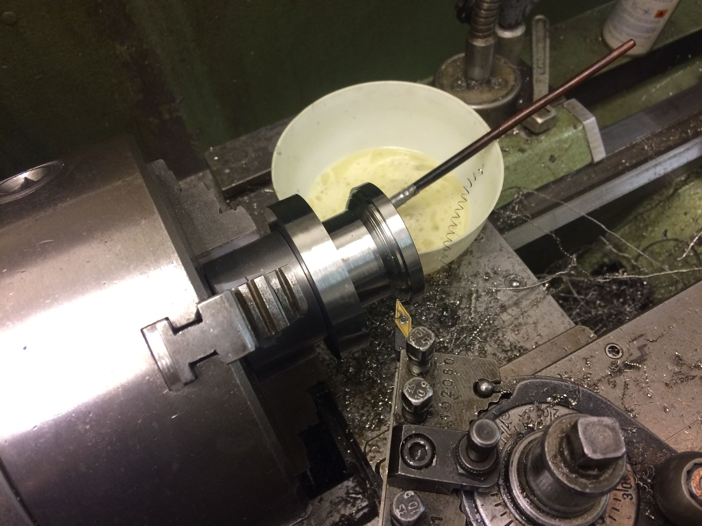

The 15-degree taper of the KF flange was turned with the compound rest set
at an angle, and the radius at the outer edge produced by chamfering and
rounding off with a file.
This side fits as expected:

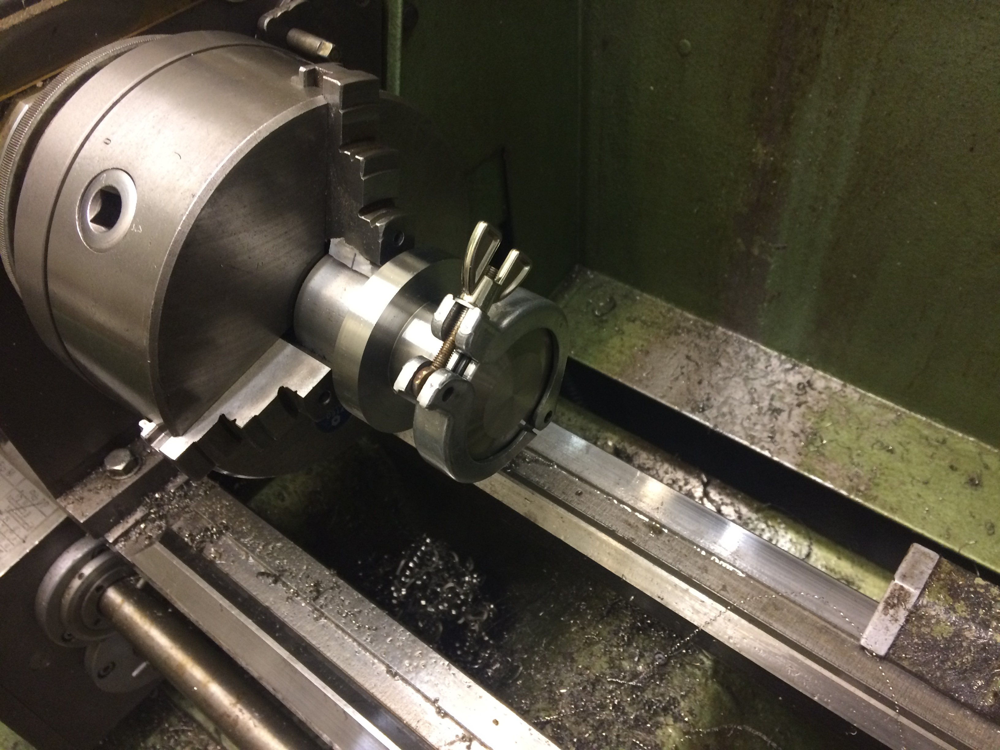

The workpiece was then flipped on the arbor and the CF side was tackled.
The adapter was now finished to its correct length and the knife edge was turned.

For this I plunged in diagonally with a VCGT insert for aluminium, with the
saddle locked and the compound rest swung over by 20 degrees.
Of course you can't do the entire knife edge in one pass. So I gradually
moved the saddle towards the headstock (in steps of about 0.2 mm).
Since you are working from inside outward, (almost) no burr forms on the knife edge.

Here is an intermediate step where about half of the depth is done:

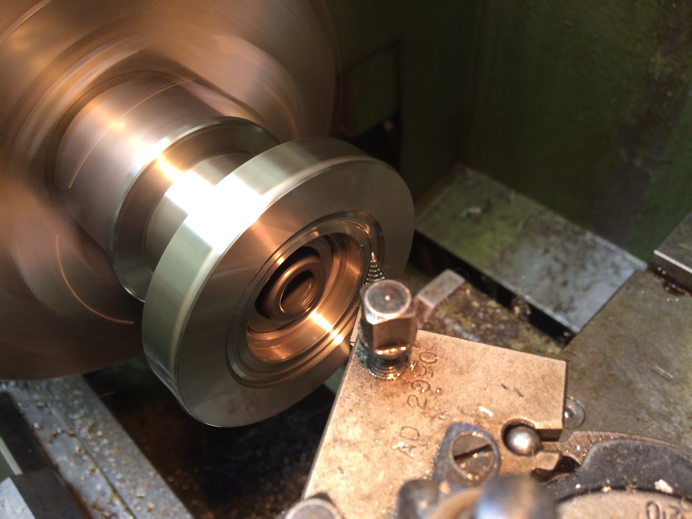

And eventually it's done:

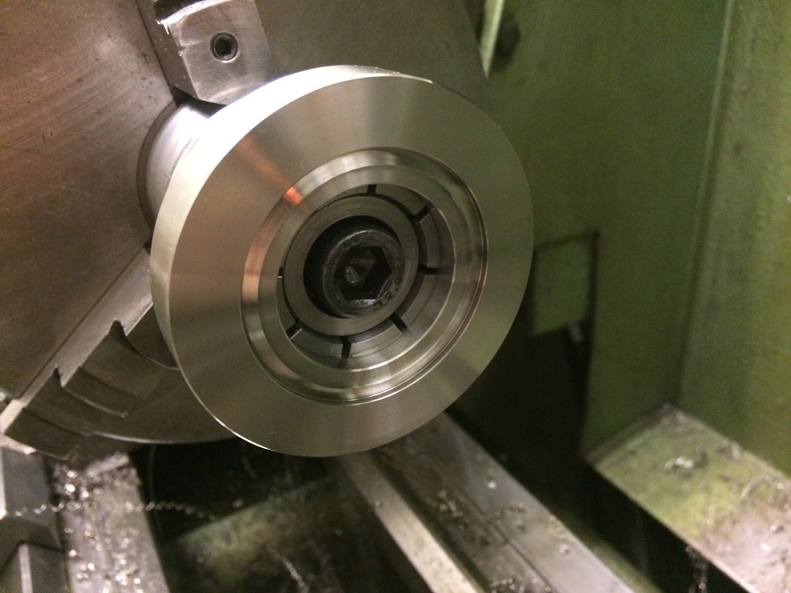

The arbor is then clamped vertically in the vise and centred under the spindle.
Using the bolt-circle function of the DRO, the bolt circle for the CF screws
was drilled; centring the arbor over the rotary table for fully-conventional
machining was too much hassle for one evening.

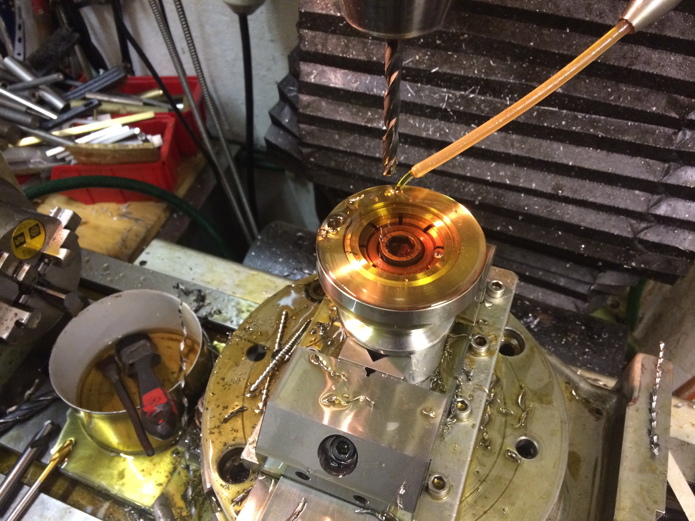

If you've cut the fits for the arbor a touch too snug, you occasionally have to
resort to drastic measures to swap the workpiece:

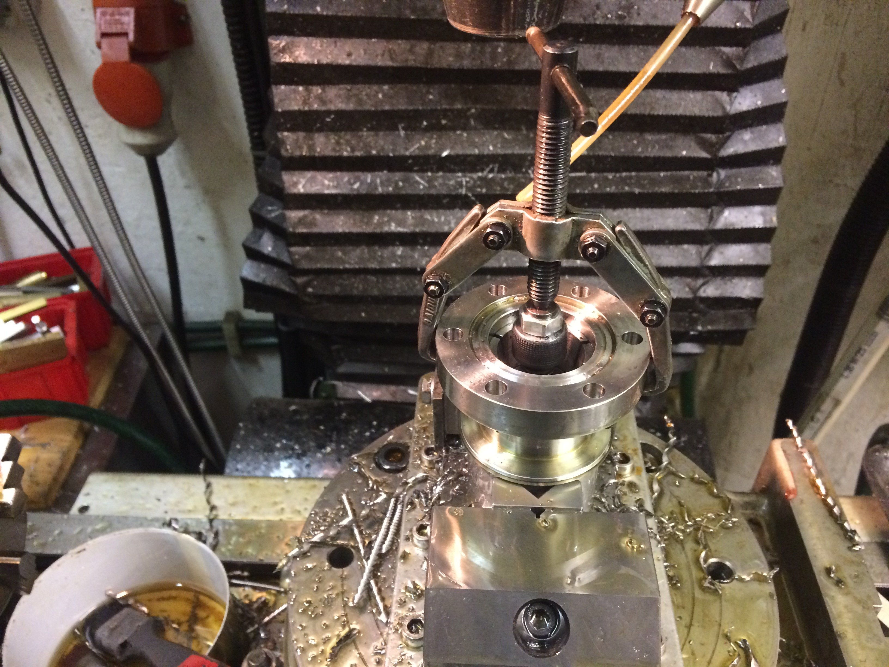

Finally, with the arbor clamped horizontally, the slot in the front face of the
CF flange was cut with a slot mill. Sadly there are no pictures of that step...

These slots let you blow helium at the joint during a leak test to find any leak.
Normally the faces of a CF flange sit closely against each other and it's a
matter of luck whether helium blown at the outside actually reaches the knife edge.
The helium would then find its way through the leak into the (partially-evacuated)
interior of the apparatus, where a mass spectrometer would detect it.

This test is still pending for the flanges shown.

In case anyone is interested, here is the drawing as a PDF as well.
Note that the inner dimension of the relief for the copper gasket must be
48.3 mm in diameter.

[KF40_CF40_korrigiert.pdf](KF40_CF40_korrigiert.pdf)
