## Adapterflansche KF40/CF40

Ich hatte über die Weihnachtstage mal wieder ein bisschen Zeit,
bei einem guten Freund in der Werkstatt ein paar Adapterflansche zu drehen.
Natürlich [gibt es diese auch zu kaufen](http://just-vacuum.de/index.php/de/uebergaenge/kf-cf-gerade/cf040xkf40),
aber dann gäbe es ja nichts zu berichten...

Hier sieht man schon mal die Endprodukte:

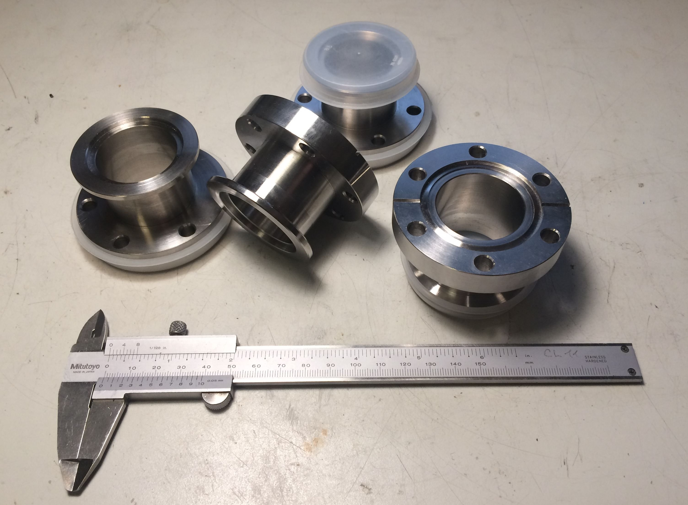

Die Abkürzungen stehen für KleinFlansch (Erfindung von Leybold) und ConFlat (Varian).
Die 40 bezieht sich jeweils auf den mit gegebener Flanschgröße maximal möglichen Rohrquerschnitt.
KF-Flansche werden üblicherweise nur bis in den Hochvakuum-Bereich verwendet, weil die Gummi-Dichtringe nicht gut genug abdichten und selbst ausgasen.
Daher geht man bei niedrigeren Drücken (Ultrahochvakuum) zu CF-Flanschen mit einer Schneidkante über, die sich in einem Dichtring aus Kupfer festbeißt.
Ein CF-Flansch ist üblicherweise bei richtiger Montage (Schrauben mit korrektem Drehmoment über Kreuz angezogen, nagelneuer Dichtring) für
mehrere Forschergenerationen dicht. Das KF-System hat dagegen den Vorteil, dass es mit Spannschellen sehr viel schneller
umbaubar ist.

Ich benötigte diese Übergangsstücke, um ein Plattenventil mit CF-Flanschen in einem Vakuum-Aufbau mit KF-Flanschen verbauen zu können.

Als Rohmaterial hatte ich mir bei eBay einige Reststücke 1.4305 bestellt.
Es stellte sich jedoch bereits bei den ersten Spänen heraus, dass das bei Leibe kein Automatenedelstahl sein kann.
Am Ende eines der Reststücke fand sich dann noch ein Aufkleber, der das Material als 1.4404 auswies...
Im Grunde ist mir das sogar lieber, weil das ein oft verwendetes Material für Vakuumanlagen ist; die Bearbeitung war halt ein bisschen mühsamer.

Zunächst wurden die grob zugesägten Stücke bis auf 0,5mm Schlichtaufmaß auf Länge gedreht:

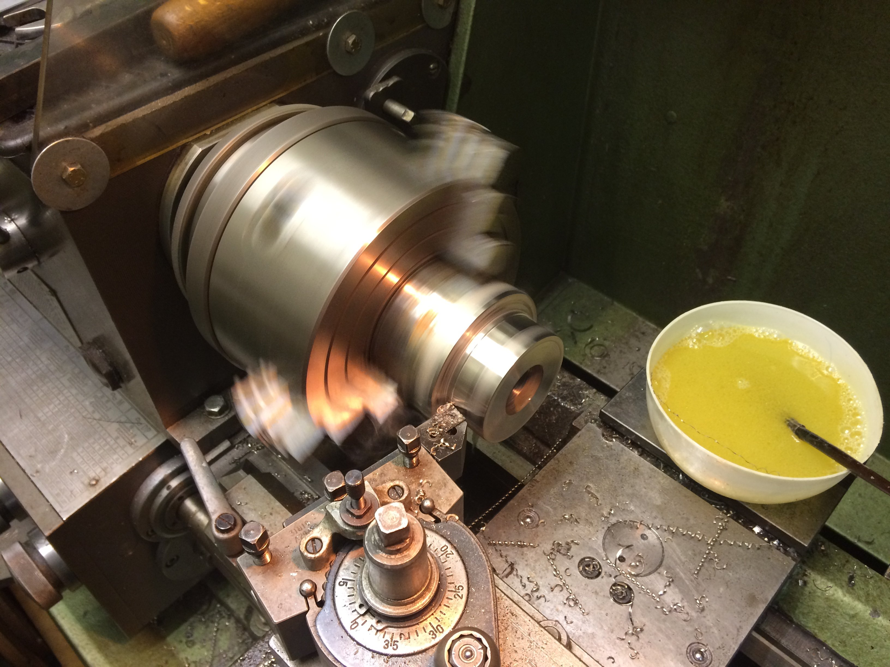

Weiterhin wurden die Teile auf 30mm mit einem Spiralbohrer durchbohrt und auf 35mm ausgedreht [leider kein Bild hiervon].

Für die weitere Bearbeitung wurde ein Spanndorn angefertigt. Durch Anziehen der Klemmschraube drückt das Klemmstück die Zinken auseinander
und das Werkstück wird mit gutem Rundlauf sehr fest gespannt:

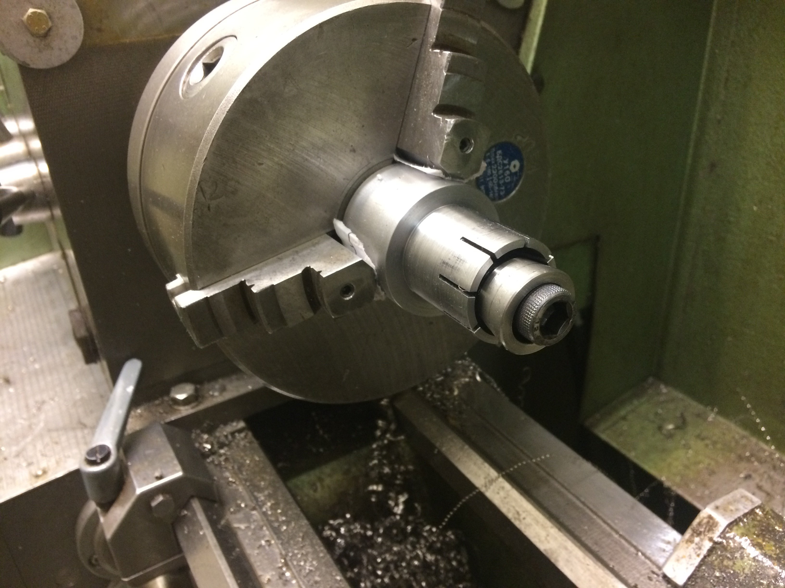

Die Bohrung für das Klemmstück enthält noch ein Abdrückgewinde, damit man das teilweise recht fest sitzende Klemmstück wieder herausbekommt:

Die Rohstücke wurden dann also nach dem Festspannen auf dem Klemmdorn auf den Außendurchmesser des CF-Flansches (70mm) vorgedreht.
Weiterhin wurde der Absatz bis zum Außendurchmesser des KF-Flansches (55mm) vorgeschruppt:

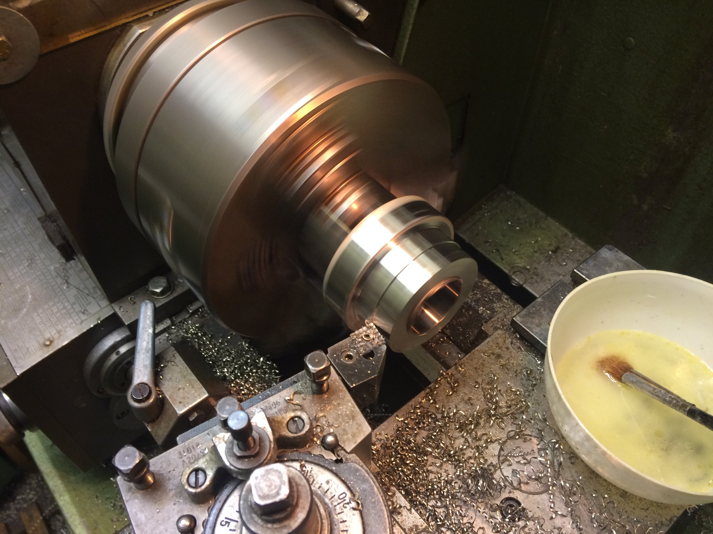

Als nächstes kommt die Ausdrehung für den innenzentrierenden Dichtring auf der KF-Seite dran:

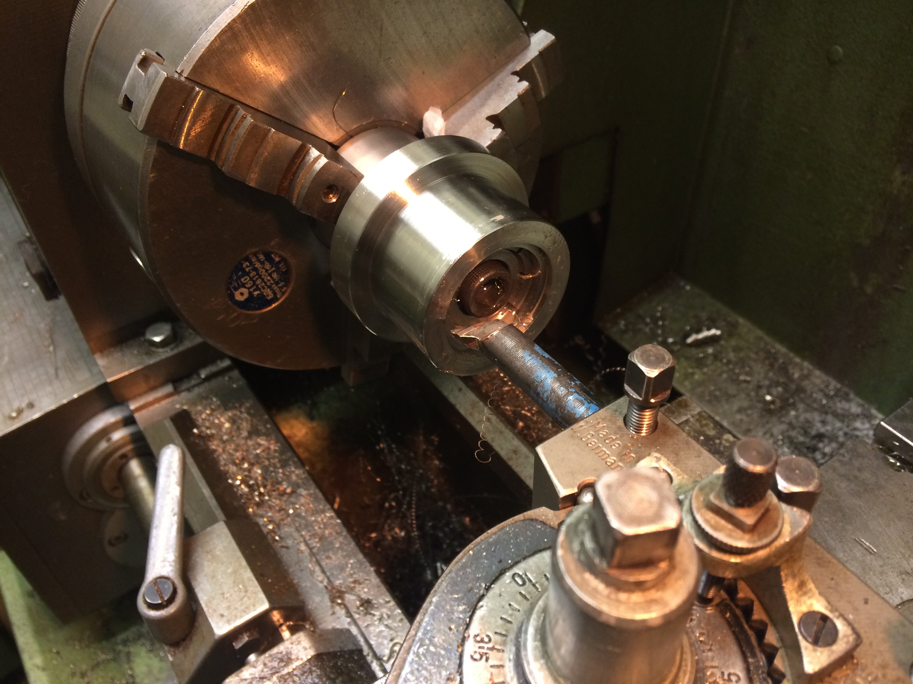

Zum Anfasen der Innenkanten habe ich denselben Ausdrehstahl verwendet und die Maschine linksherum laufen lassen:

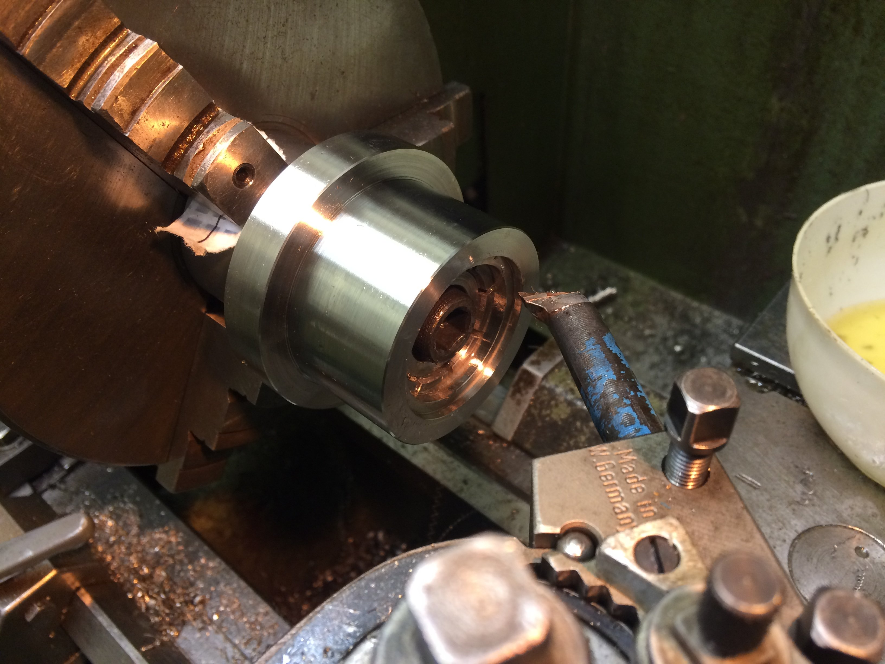

Mit einer VCGT wurde dann die Freidrehung zwischen den beiden Flanschen hergestellt.
Zunächst hatte ich es mit einem Stechschwert versucht, aber auf Grund des fiesen Materials hat sich das als nicht praktikabel erwiesen.

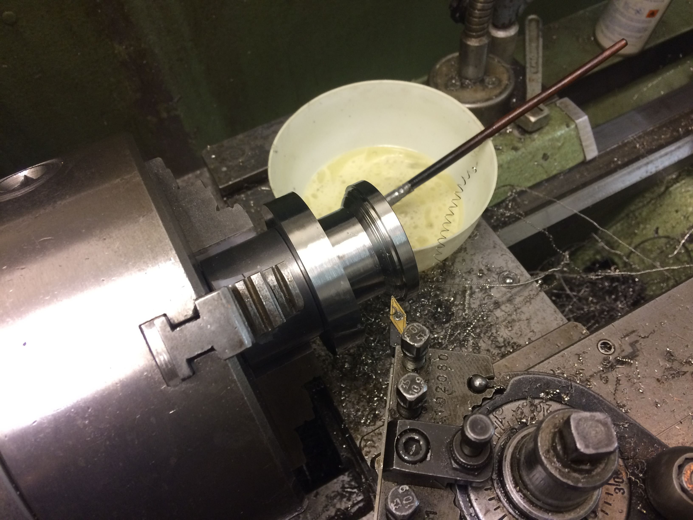

Die 15 Grad-Schräge des KF-Flansches wurde mit schräg gestelltem Oberschlitten gedreht und der Radius an der Außenkante
durch anfasen und Verrunden mit einer Feile hergestellt.
Diese Seite passt soweit schon mal:

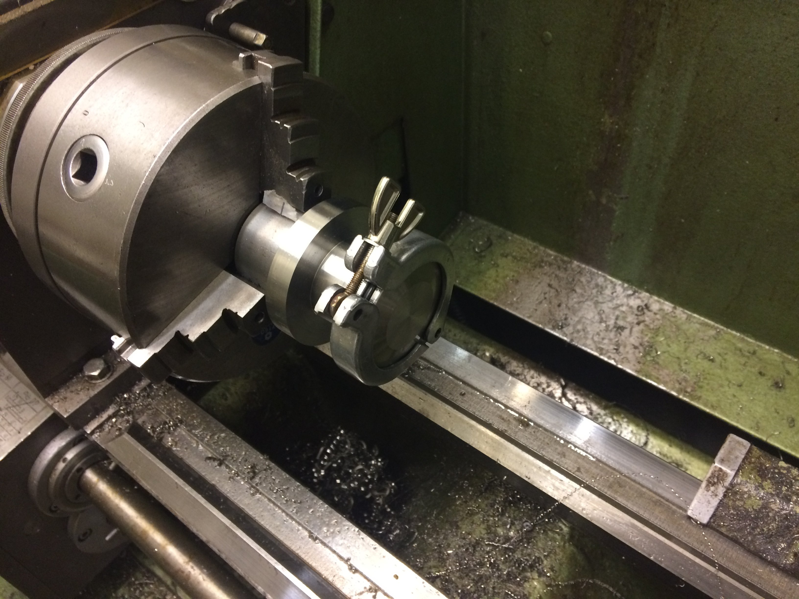

Daraufhin wurde das Werkstück auf dem Klemmdorn umgedreht und die CF-Seite in Angriff genommen.
Der Adapter wurde jetzt auf die korrekte Länge geschlichtet und die Schneidkante angedreht.

Hierzu habe ich mit geklemmtem Bettschlitten und auf 20 Grad verdrehtem Oberschlitten diagonal mit einer VCGT für Alu eingestochen.
Natürlich geht das nicht in einem Zug für die ganze Schneidkante. Daher habe ich nach und nach
den Bettschlitten in Richtung Spindelstock verfahren (in Schritten von ca. 0.2mm).
Da man hierbei von innen nach außen arbeitet, entsteht auch (fast) kein Grat an der Schneidkante.

Hier sieht man einen Zwischenschritt, bei dem etwa die Hälfte der Zustellung bereits geschafft ist:

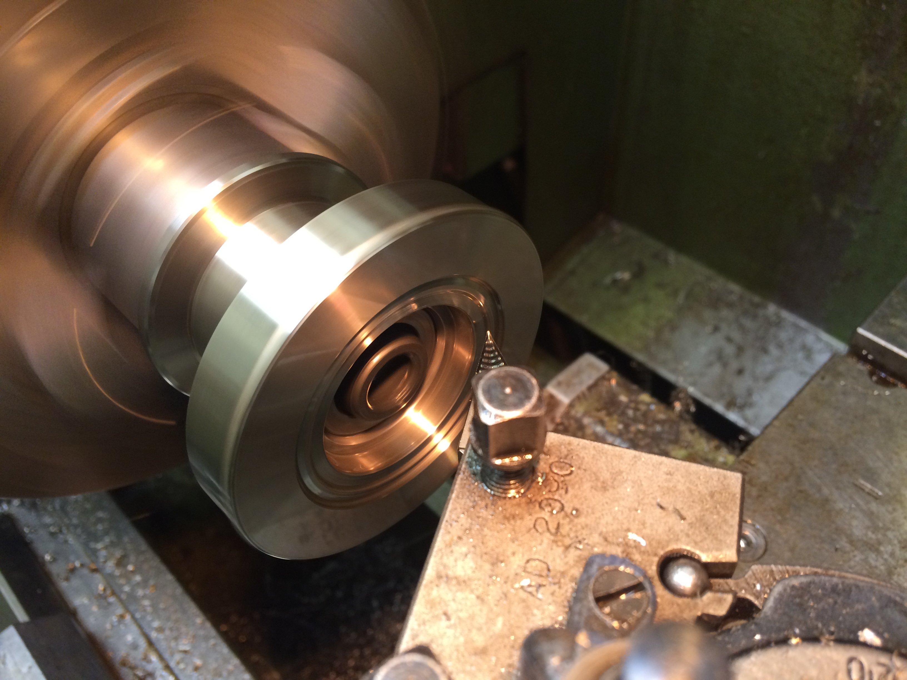

Und dann ist es irgendwann geschafft:

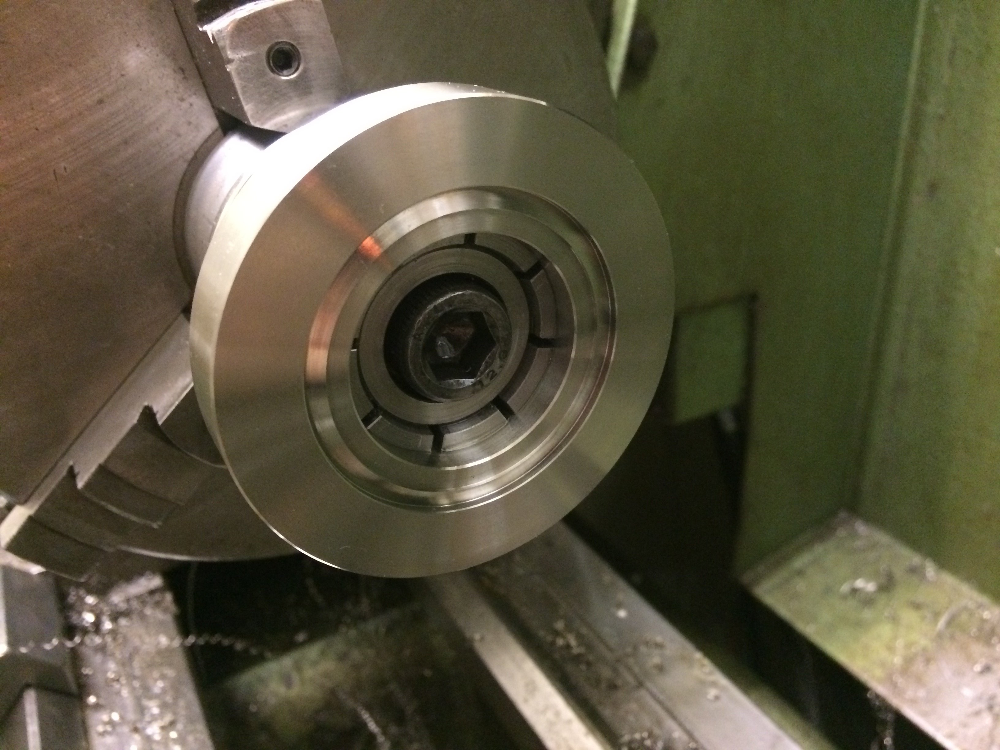

Der Spanndorn wird jetzt vertikal im Schraubstock gespannt und unter der Spindel ausgemittelt.
Über die Teilkreis-Funktion der Digitalanzeige wurde dann der Lochkreis für die CF-Verschraubung gebohrt;
das Ausmitteln des Spanndorns über dem Rundtisch für eine komplett konventionelle Fertigung war mir an dem Abend zu mühselig.

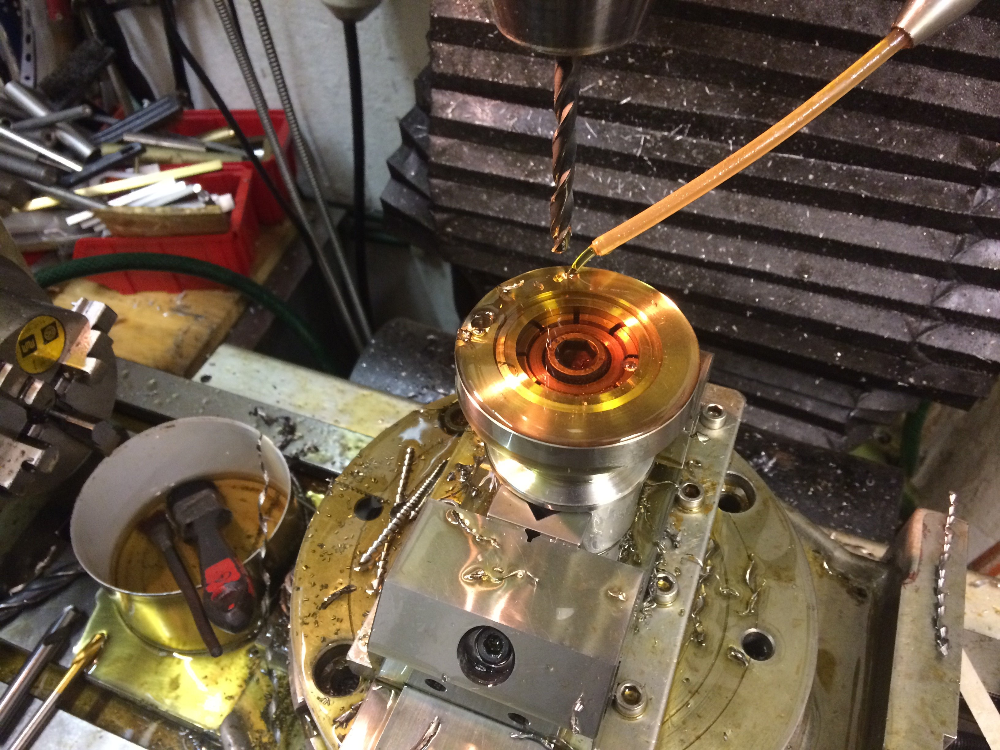

Wenn man es mit den Passungen für den Spanndorn etwas zu genau nimmt, muss man hin und wieder auch zu drastischen Maßnahmen greifen,
um das Werkstück wechseln zu können:

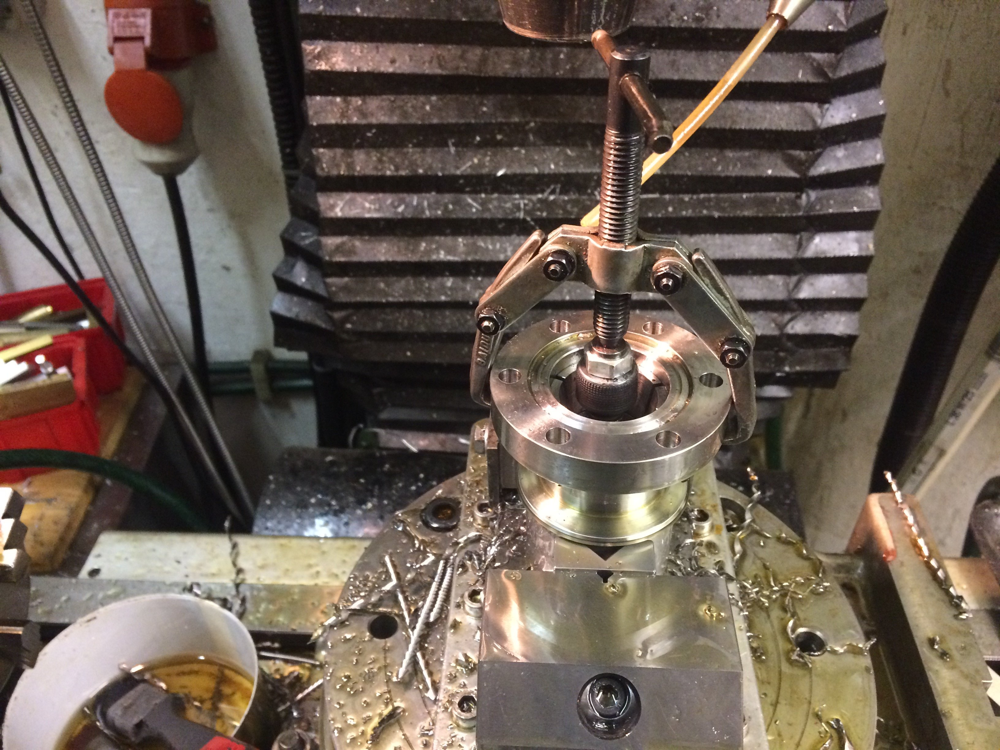

Ganz zuletzt wurde noch bei horizontal eingespanntem Klemmdorn der Schlitz in die Frontfläche des CF-Flansches gescheibenfräst.
Davon gibts aber leider keine Bilder mehr...

Durch diese Schlitze kann man bei einem Lecktest Helium an die Übergangsstelle spülen, um eine eventuelle Undichtkeit zu finden.
Normalerweise sitzen nämlich die Flächen des CF-Flansches dicht aneinander und es ist mehr dem Zufall überlassen, ob außen
hingeblasenes Helium auch wirklich bis an die Schneidkante kommt.
Das Helium würde dann seinen Weg durch das Leck in das (teilevakuierte) Innere der Apparatur finden und dort von einem Massenspektrometer detektiert werden.

Dieser Test steht jedoch bei den gezeigten Flansche noch aus.

Falls es jemanden interessiert, gibt es hier auch noch die Zeichnung als PDF.
Bitte beachtet, dass das Innenmaß der Freidrehung für den Kupfer-Dichtring 48.3mm Durchmesser haben muss.

[KF40_CF40_korrigiert.pdf](KF40_CF40_korrigiert.pdf)
