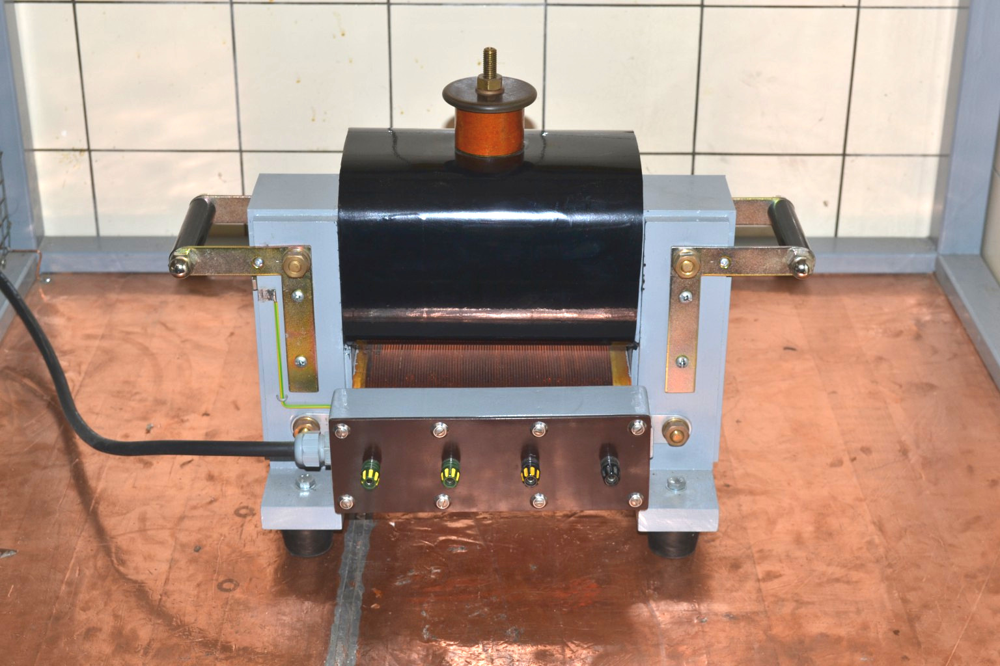
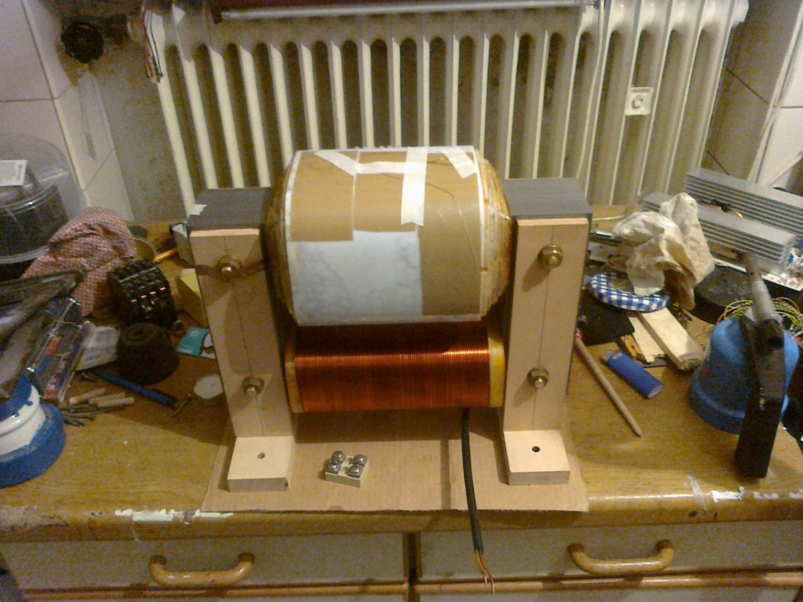
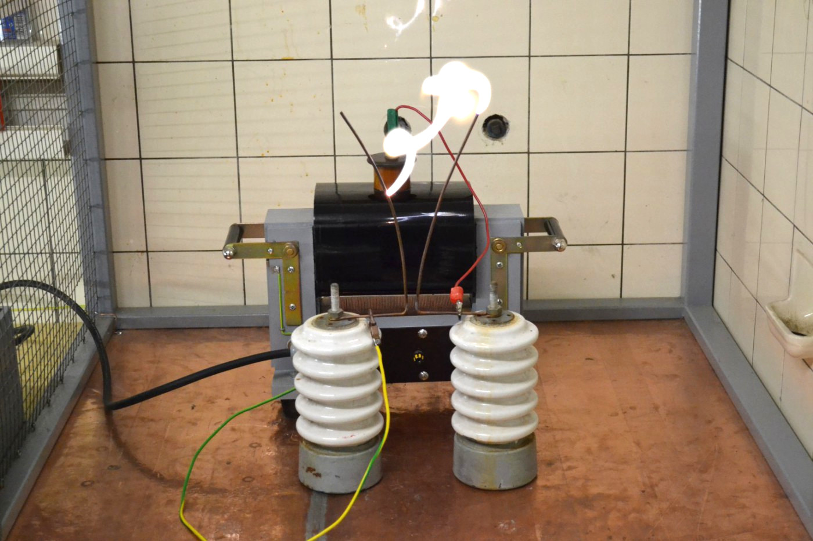

## 25kV-Transformator

Ich lese immer wieder, wie "unmöglich" und "mit Hausmitteln nicht machbar" der Bau eines Hochspannungstrafos doch wäre.
Daher möchte ich gerne hier den Bau meines 25kV-Trafos mit 2.4kVA vorstellen.
Ich habe diesen Trafo mit freundlichen Unterstützung eines Dipl.-Ing. der Ostfalia in Wolfenbüttel, wo ich damals wohnte, gebaut.
Das war in der Zeit vom Dezember 2010 bis etwa März 2011.

Hier ist er mal zu sehen: 

Die technischen Daten sind folgende:

   Kenngröße     | Kenndaten
-----------------|------------
Primärspannung   | 250V
Primärwicklung   | 177 Wdg. (CuL 2.0mm)
Sekundärspannung | 25kV, einseitig geerdet
Sekundärwicklung | 17466 Wdg. (CuL 0.224mm)
Nennleistung     | 2.4kVA
Kern             | UI210, 141 0.5mm-Bleche

Die Primär- und Sekundärwicklung sind auf verschiedenen Schenkeln gewickelt.
Das hat den Vorteil, dass man Lichtbögen ziehen kann und keine Strombegrenzungsdrossel wie bei Messwandlern braucht.
Bei Betrieb als Netztrafo für eine funkenstreckengesteuerte Teslaspule (SGTC, wie die meißten sagen)
tritt netterweise auch noch durch Resonanz mit dem Primärkondensator
eine Spannungsüberhöhung auf, die bei einem "hart gewickelten" Trafo
(Primär- und Sekundärwicklung übereinander) sehr viel stärkere Rückwirkungen
ins Netz hat.

## Kern

Es handelt sich um einen UI210-Kern, also mit einem Wickelfenster von 70x210mm. Bei 141 Blechen mit 0,5mm Dicke
ergibt sich ein Kernquerschnitt von ca. 7x7cm = 49cm². Anhand einer Faustformel lässt sich daraus
die zu erreichenden Leistung abschätzen: Man nimmt einfach den Kernquerschnitt in cm² ins Quadrat und erhält die
ungefähre Nennleisung in VA, in diesem Fall also 49² = 2401 VA ~ 2.4kVA.
Der Kern wurde später wechselseitig geschichtet, mit einem Holzhammer glattgeklopft und zwischen Buchenleisten
verschraubt. Dabei ist darauf zu achten, dass kein elektischer Kontakt zwischen den Gewindenstangen/Schrauben und dem Kern auftritt,
um Wirbelströme zu vermeiden. Weiterhin musste ich darauf achten, mit den Handgriffen keine Kurzschlusswindung zu erzeugen.
Die schwarzen Handgriffe sind daher Vollmaterial, in das auf jeder Seite auf der Drehbank ein M10-Gewinde geschnitten habe.
Die Hutmuttern sind dann jeweils mit kurzen Gewindestücken festgeschraubt.

Die Firma, von der ich mir die Kernbleche geholt habe,
heißt Bausch und hat ihre Internet-Seite hier: http://www.bausch.de

## Primärwicklung

Die Primärspannung sollte 250V betragen, da dies die maximale Ausgangsspannung meines Stelltrafos ist.
Bei der Nennleistung von 2,4kVA bedeutet dass, das ein Strom von ca. 10A fließt.
Bei einem maximalen Strom von 3A pro mm² Drahtquerschnitt kann ein 2mm-Draht mit
1² * Pi * 3A = 9,5A belastet werden. Ich denke, dass das reichen sollte, da der Trafo eben nicht
im Dauerbetrieb laufen soll.

Die Windungsanzahl habe ich nach der Formel
<tex>$$
N = \frac{\sqrt{2} \cdot U}{2 \pi f \cdot A \cdot B}
<tex>$$
mit U der Primärspannung, B = 1.3 T der Flussdichte im Kern, A = 0.0049 m^2 und f=50Hz der Netzfrequenz berechnet.

Dadurch kann der Draht in zwei Lagen gewickelt werden, was für die Wärmeabfuhr auch günstiger ist.
Zum Wickeln wurde mit zwei Malerböcken eine stabile Wickelvorrichtung gebaut, die mit einem 6-fach-Drehstern
mit ca. 40cm Durchmesser (aus Holz) gedreht werden konnte. Über eine kugelgelagerte Achse wurde dann
ein Hartholzklotz angetrieben, der genau den Maßen des Kerns entsprach. Die Wickelvorrichtung habe ich
dann an einem sonnigen Tag an einem Baum im Garten festgebunden, den Draht befestigt und gegen das Gewicht
eines Helfers, der sich mit seinem Gewicht an den Draht hängt, die Primärwicklung aufgebracht.

## Wickelkörper

Der genannte Hartholzklotz wurde eingeölt, sodass kein Kleber mehr an ihm haftet. Dann habe ich
aus 1mm-Pertinax Platten gesägt und diese um den Klotz mit Uhu Endfest 300 geklebt. Nach dem Trocknen
konnte man den Holzklotz mit einem beherzten Schlag entfernen.
Damit der Draht beim Wickeln nicht geknickt wird, habe ich an den Seiten, die nicht im Wickelfenster
oder unten unter dem Trafo sind, Balsaholz-Backen aufgeklebt, jeweils ca. 30mm.
Diese habe ich dann abgefeilt und geschmirgelt, damit sich der Draht schön anschmiegen kann.
Beim Wickeln wurde der Draht jeweils noch mit doppelseitigem Klebeband auf dem Balsaholz und (bei der zweiten Lage)
auf der unteren Lage fixiert. Da zwei Lagen gewickelt wurden, endete die Wicklung auf derselben Seite, wo sie angefangen hatte.

Ein Stück Isolierschlauch auf die beiden Drahtenden gesteckt verhindert das Zurückschnellen des Drahtes.
Zusätzlich habe ich dann den unbewickelten Rand (im Foto gelb schimmernd) mit Epoxidharz vergossen:
Ein Streifen Paketklebeband auf die Wicklung und die Primärspule auf die Seite gelegt und schon konnte das
Harz eingegossen werden. Die ganze Wicklung wurde dann noch mit Schelllack lackiert.

## Sekundärspule

Ich wollte einen Trafo für 25kV haben, also stand nach obiger Formel die Windungsanzahl mit ca. 17000 bereits fest.
Eine Lage sollte eine Dicke von 1mm haben, d.h. für die Isolierung blieben noch ca. 0,75mm übrig.
Diese wurden durch 3 Lagen einer 0.19mm starken PE-Isolierfolie mit einer Durchschlagsfestigkeit von ca. 100kV/mm gebildet.
Die Isolierfolie wird unter dem Namen Hostaphan vertrieben.
Die genaue Bezeichnung der Folie, die ich verwendet habe, lautet RN 190
und gibt es bei der W.Bath GmbH zu kaufen: http://www.bathgmbh.de/polyesterf.htm  
Es wird eine Durchschlagsfestigkeit von 100kV/mm angegeben.
Ich hatte eine Rolle von 50m bei 600mm Breite, das sind 8,4kg.
Den Verbrauch sieht man der Rolle aber nicht wirklich an; ich vermute mal, dass auf dem Trafo ca. 6m verbaut sind.

Der Spulenkörper wurde analog zum Primärwickelkörper gebaut, jedoch wurden die Balsabacken hier nur mit ca. 10mm Breite ausgeführt.
Der innere Spulenanschluss ist als ein Stück Kupferfolie ausgeführt, die vor Wickelbeginn auf den Wickelkörper geklebt wurde und beim Wickeln zwischen
dem Hartholzklotz und dem Wickelkörper steckte. So habe ich verhindert, dass sich da was vertüddelt.

Daran wurde dann der Draht angelötet und mit dem Wickeln begonnen.
Bei diesem Trafo bin ich folgendermaßen vorgegangen:
1. Eine Lage wickeln
2. Spulenkörper festsetzen, ich habe hier ein M10-Gewinde in den Hartholzklotz geschnitten, in das eine Schraube durch ein Loch
   in der Flanschplatte der Wickelvorrichtung geschaubt wurde.
3. mit Schelllack einpinseln, evt. vor 2., je nach Zugänglichkeit in der Wickelvorrichtung
4. Isolierfolie drumwickeln
5. Isolierfolie mit den Handen strammziehen, "drumstreichen".
   Durch den Schelllack haftet die Folie an der Wicklung. Wenn man jetzt die Folie um die Wicklung 3 mal herumgeschlungen hat,
   kann man mit den flachen Händen durch Haftreibung die Folie noch ein bisschen enger festziehen. Dadruch erst geht die meißte Luft aus der Wicklung !
6. Folie mit Tesa o.ä. festkleben und an der Seite einen kleinen Ausschnitt (ca. 3mm Breite) bis an den Wicklungsanfang einschneiden.
   Dieser Einschnitt sollte wirklich herausgetrennt werden, da sonst beim Festziehen der Draht abgeschert werden könnte.
   Dann kann die Schraube zum Festsetzen wieder gelöst werden und die nächste Lage beginnt.

Schelllack habe ich verwendet, weil ich mir bei dem sicher war, dass
er auf Grund seines natürlichen Ursprunges nicht die Lackschicht des Drahtes
angreift und beim Ausdünsten so dermaßen klebrig wird,
dass er vernünfitig an der PE-Folie klebt und nicht abperlt.

## Wickelvorrichtung

* Alle Achsen sollten (für die Sekundärwicklung: müssen) kugelgelagert sein. Ich habe die Achsen aus M10-Gewindestangen gemacht
  und daher 6000-2RS-Lager verwendet. Es muss peinlich genau darauf geachtet werden, dass alle Achsen parallel zu einander stehen
  und nicht eiern! Sonst kann es passieren, dass der Draht überspringt und die Wicklung wird fehlerhaft/muss wieder abgewickelt werden.
* Die Drahtrolle muss gebremst sein. Ich habe damals einen Pinsel genommen, der mit Laborklemmen fest an die Spule gedrückt wurde
  und sie so gebremst hat.
* Der Draht muss über eine Führungsrolle geführt werden. Das funktioniert folgendermaßen:
  Man nimmt ein Kabelschutzrohr aus Kunststoff z.B. mit 25mm Drm. und bewickelt es mit genau dem Draht, der auf die Spule später drauf soll.
  Der Draht wird an beiden Enden fixiert. Die Wickellänge sollte ca. 5cm mehr als die größte Wickelbreite der zu wickelnden Spule betragen.
  Auf diese Führungsrolle werden Papierringe gesteckt (am besten auch auf(nicht mit) ihr verklebt), die sich seitlich verschieben lassen.
  Diese Ringe dienen später als "Anschläge" und werden mit dem Lineal auf die Wicklungsbreite zurechtgeschoben.
  Die Führungsrolle befindet sich ca. 20cm vom Wickelkörper entfernt an zwei "Auslegern"/"Ohren" an der Wickelvorrichtung und ist ebenfalls kugelgelagert.
  Sie wird über einen Treibriemen synchron mit dem Wickelkörper angetrieben. Dazu eignet sich z.B. zu einem Ring verlötetes
  hochflexibles Messkabel. Es ist wichtig, dass sich der Riemen nicht dehnt, denn sonst käme es zu Wickelfehlern!
* Der Schelllack sollte in warmem Spiritus gelöst werden. Das dauert ungefähr 3 Tage für die notwendige Menge (ca. 200g) und ergibt
  weniger Krümel als wenn man es mit kaltem Spiritus versucht. Trotzdem sollte er vor Benutzung noch gefiltert werden,
  z.B. durch ein Teesieb o.ä.
* Vergesst Akkuschrauber, Motoren, o.ä. zum Drehen der Wickelvorrichtung. Die 17000 Windungen der Sekundärspule wurden von mir
  und besagtem Dipl.-Ing. in drei Tagen über Silvester 2010 von Hand gekurbelt. Bei dem dünnen Draht und der großen Vorratsrolle
  muss man das sehr feinfühlig angehen! Insgesamt sind ca. 2 kg Draht auf der Sekundärspule gelandet.

## Zusammenbau und Verguss

Die Lagenisolation der Sekundärspule steht an jeder Seite etwa 1cm über.
Die Wickelbreite verjüngt sich alle 5 Lagen um ca. 1cm.
Als Anschlusspunkt für die Sekundärwicklung habe ich mir ein Messing-Drehteil gemacht, im Wesentlichen ein Teller mit einem Pömpel drauf,
in dem ein M10-Gewinde ist. Der Draht ist (nach einer großen Schlaufe, um bei einem ungewollten Abreißen des Anschlusspunkts noch was
zum Anlöten zu haben) an den Teller gelötet. Dann ist der Teller mit doppelseitigem Klebeband auf die Lagenisolation geklebt.
Als letztes kam dann noch eine Isolierlage drum herum, die wieder über die volle Breite ging und die oben je Lage ein Loch hatte,
durch den der Pömpel ragte. Dadruch entstanden auf jeder Seite "Burggräben" mit dreieckigem Querschnitt, die zum Schluss,
als der rausgelaufene Schelllack nicht mehr klebte und der Kern eingeschachtelt war, mit Vergussmasse aufgefüllt wurden.
Der Kupferstreifen (innerer Sekundäranschluss) wurde zwischen Kern und Kernhalter (aus Buchenholz) eingeklemmt und dann auf
eine Rampa-Mutter gelötet.Dort ist eine M4-Schraube eingeschraubt, an die man Drähte direkt klemmen kann.
Zum Anschlusskasten führt ein auf den Streifen aufgelöteter Installationsdraht.

Hier ist noch ein Bild von dem Trafo:

Man sieht den Kupferstreifen, der noch (vor dem Abschneiden) von außen über die Schrauben gelegt ist. Der Streifen ist bereits
unter dem Holz einmal durchgelegt! Weiterhin sieht man den Isolierschlauch über den Primärdrähten und die zulaufenden Sekundärwicklung.
Als der Trafo so weit zusammengebaut wurde, kam der o.g. Anschluss oben drauf und dann die letzte Lagenisolation.
Die Vergussmasse floss dabei auch zwischen Kern und Wickelkörper (und unerwünschterweise dann unten raus). Das ist sehr wichtig,
denn es darf sich keinerlei Luft zwischen Kern und Wicklung befinden, sonst gibt es dort (zumindest auf der dem Erdanschluss entgegengesetzten Seite,
wo schon die einfache Lagenspannung anliegt) Korona-Entladungen, die die Isolierung stark schädigen.
Aus demselben Grund muss der "Burggraben" ausgegossen werden. 

## Kosten

Hier ist eine ungefähre Aufstellung der Kosten:

Komponente      | Preis
----------------|------------------
Kernbleche      | 80 Euro
Isolationsfolie | 200 Euro, allerdings noch Unmengen übrig
Primärdraht     | 10 Euro
Sekundärdraht   | 50 Euro
insgesamt       | ca. 350 Euro

## Experimente

Und das (und noch viel mehr) kann man mit einem solchen Trafo machen: 

