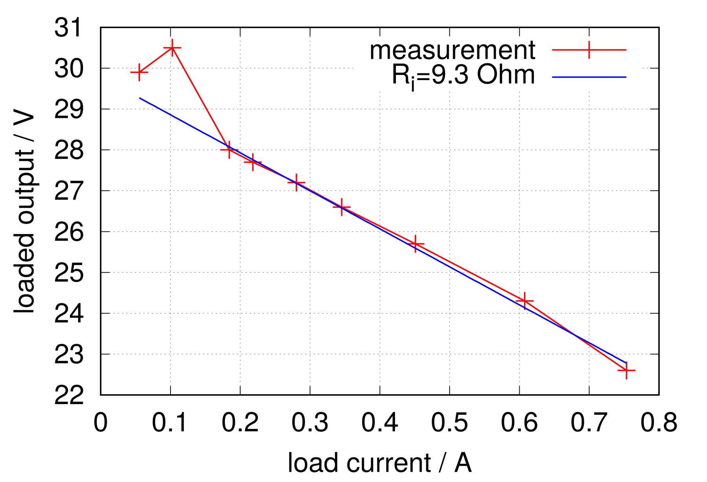

Aus einem alten Sciex QStar XL Flugzeit-Massenspektrometer konnte ich ein Pulser-Modul bergen:

Dieses enthält neben einigen feinen Bauteilen, wie MHV- und SHV-Buchsen, Hochspannungs-Relais, -Mosfets und
einem [OPA541](http://www.ti.com/product/OPA541) Power-Op-Amp auch ein Schaltnetzteil,
welches die Gatetreiber für die HV-Mosfets versorgt.

Um den rot umrandeten Bereich der beiden Platinen geht es hier:

Als Controller-IC kommt hier der [SG3526J](https://www.microsemi.com/existing-parts/parts/55269) zum Einsatz.
Der größere der beiden Trafos mit der Bezeichnung 024435 wurde von [Electronetics](https://www.electronetics.us/) hergestellt und ist wahrscheinlich ein von Sciex in Auftrag gegebenes Sondermodell.

Die folgende Tabelle gibt die Verbindung des Stromversorgunssteckers links oben (Pins 1-6) an den
[NIM-Stecker](http://www-bd.gsi.de/dokuwiki/lib/exe/fetch.php?media=misc:nim-standard.pdf) wieder:

Pin am Board | Kabelfarbe | NIM-Pin | Funktion
-------------|------------|---------|---------------
1            |   gelb     |   16    |   +12V
2            |   weiß     |   17    |   -12V
3            |   rot      |   10    |   +6V
4            |   blau     |   28    |   +24V
5            |   schwarz  |   34    |  power GND
6            |   grau     |   42    | high-quality GND

Wenn man jetzt zwischen Pin 1 und 5 ein 12V-Netzteil anschließt, erwacht
zumindest schon man das Schaltnetzteil zum Leben.
Es liefert für zwei Gatetreiber jeweils symmetrische 15V.
Für die weiteren Tests wurden die Gatetreiber-Schaltungsteile abgetrennt.
Verschiedene Lastwiderstände wurden zwischen +15V und -15V an die
parallelgeschalteten Ausgänge angeschlossen.
Die sich ergebende [Belastungskurve](Belastungskurve.dat) ist hier zu sehen:

Als Modell wurde eine ideale Spannungsquelle mit nachgeschaltetem (Innen-)Widerstand angenommen.
Der Fit an die Messungen (die Punkte für I&lt;0.15A wurden vernachlässigt)
ergibt einen Innenwiderstand von ca. 9.3 Ohm bei einer Leerlaufspannung von 29.7V.
Eine Messung ohne Last ergibt jedoch eine Leerlaufspannung von ca. 70V.
Hier spielt wahrscheinlich die Tatsache eine Rolle,
dass es bei der verwendeten SMPS-Topologie kein Feedback
von der Sekundärseite auf die Ansteuerung auf der Primärseite gibt.

Interessant ist das Netzteil aus dem Grund, dass es recht einfach (=robust, leicht reparierbar) aufgebaut ist
und die Isolation zwischen Sekundärseite und Primärseite einigermaßen hochspannungsfest sein müsste.
Zusammen mit dem brauchbaren Nenn-Ausgangsstrom ist es vielleicht
für die Gate-Ansteuerung in einer DRSSTC geeignet... ?
