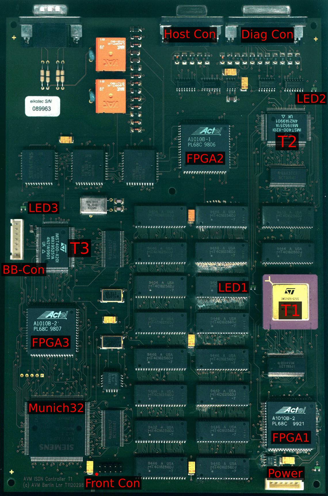
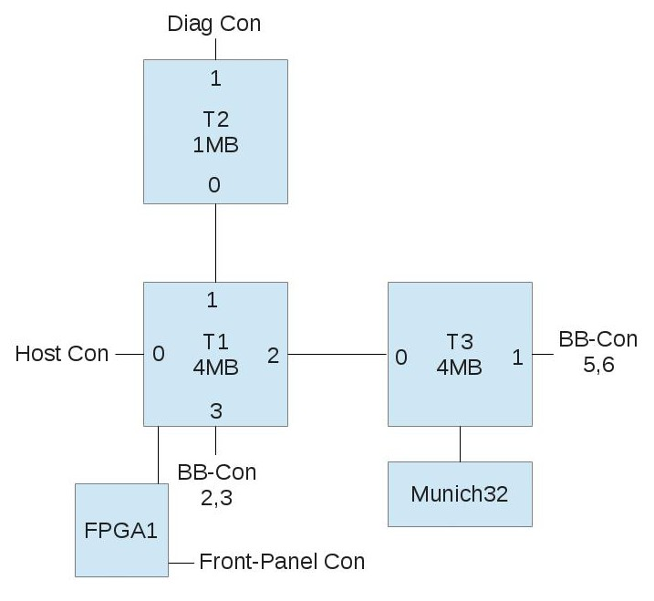
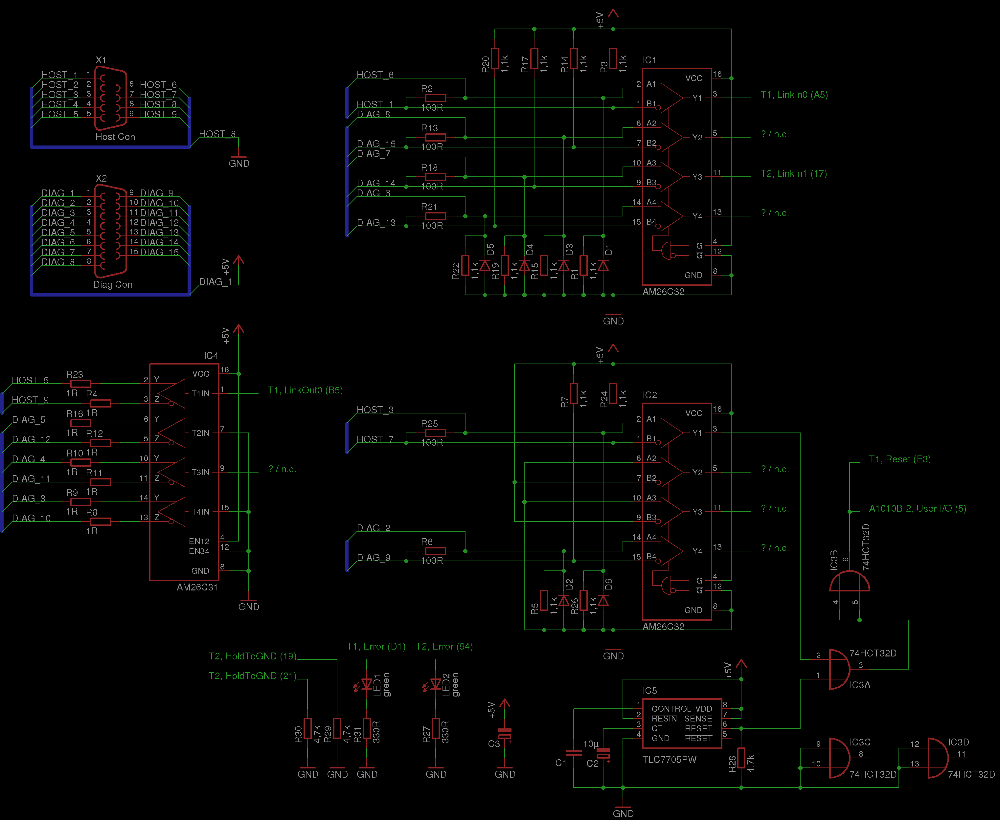
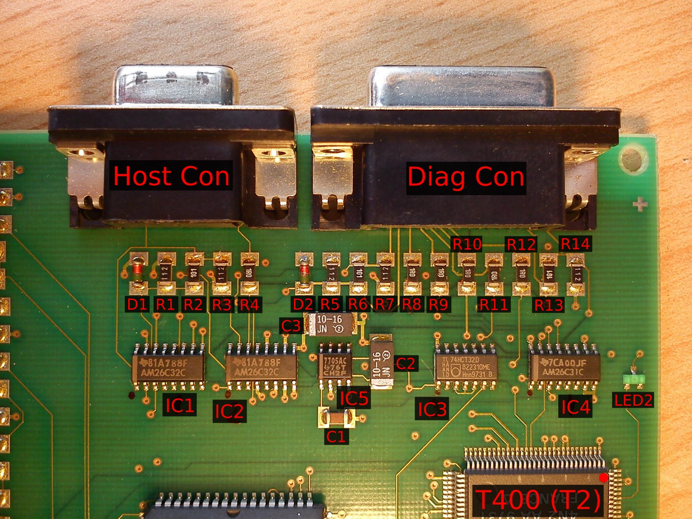
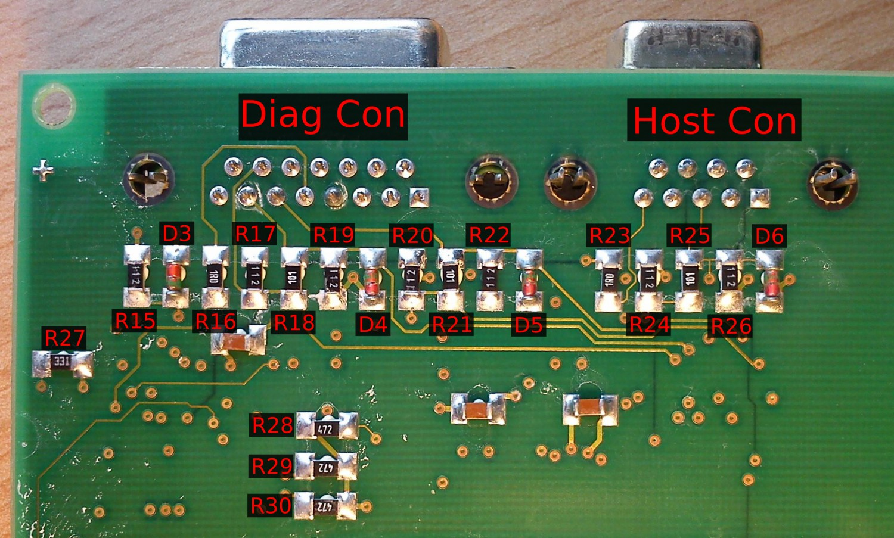
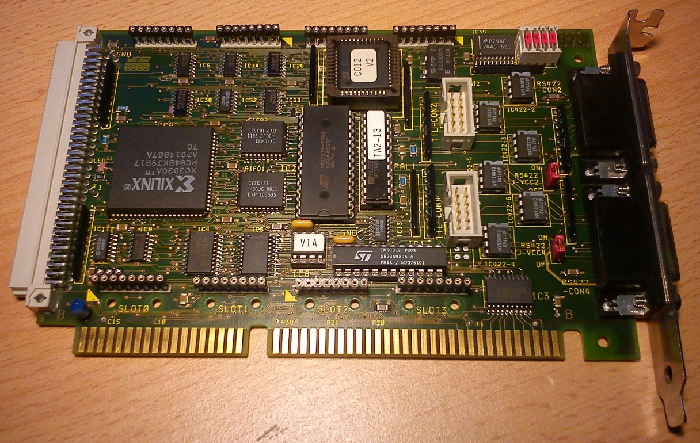
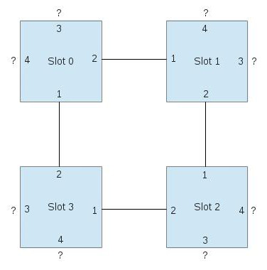

# AVM T1

Der AVM T1 ist ein ISDN-Controller, der in den 90ern des letzten Jahrhunderts dazu diente,
Server mit ISDN-Anschluss von der Last der ISDN-Verwaltung zu befreien.
Ähnliche Geräte oder Steckkarten für PCs bauten auch andere Firmen, wie z.B. Hermstedt und Eicon. Gemeinsamer Nenner
aller dieser "interessanten" Geräte ist, dass sie teilweise mehrere eigene Mini-Computer
mit eigenem Prozessor, eigenem RAM und eigener Peripherie "an Bord" haben. Dieser Ansatz war damals vermutlich
günstiger, als spezielle ASICs für jede Einzelentwicklung herzustellen.

Beim Start des Rechners wurde meißt der Prozessor angehalten, sodass
der Host-PC ungestörten Zugriff auf das RAM des Mini-Computers hatte. Sodann lud der
Treiber die Firmware in das RAM der Karte/des Geräts und startete den Prozessor.
Über z.B. dual-ported-RAM wurde dann die Kommunikation und der Datenaustausch zwischen Host
und Mini-Computer abgewickelt.

Der AVM T1 verwendet in erster Ausbaustufe ("T1") 3 Transputer (zwei T400, ein T425) mit insgesamt 9MB D-RAM und verfügt
zusätzlich über den Munich32-ISDN-Controller. Der "T1-B", bei dem das "B" für Booster Board steht,
verfügt über 4 weitere Transputer vom Typ ST20450 mit je 2MB D-RAM, sodass dieses Gerät dann insgesamt über
7 Transputer mit 17MB D-RAM verfügt.

Als ich auf der exzellenten Seite [www.geekdot.com](http://www.geekdot.com) vom T1 las,
war mein Interesse geweckt. Ich hatte vorher schon vom Konzept des Transputers gehört, aber
das was ich dort sah, versprach ein ähnliches Erlebnis
wie die [Leonardo XL](../../leonardo_xl) zu werden.

Als ich meinen ersten T1 dann von eBay bekam, habe ich zuerst das Gehäuse geöffnet und mal die Platinen begutachtet.
Die Bezeichnungen der Bauteile decken sich mit denen, die Axel Muhr auf [seiner Seite zum T1](https://www.geekdot.com/category/hardware/transputer/avm-t1/) verwendet.

Die Transputer auf der Platine sind so verdrahtet, wie auf folgendem Schema zu sehen ist:

Ein Kästchen ist jeweils ein Transputer bzw. größerer Chip, die Zahlen an den Kanten der Transputer
bezeichnen den jeweiligen Link.

Die Interface-Beschaltung rund um den "Host Con" und den "Diag Con" ist auf folgender Zeichnung zu sehen.
[Hier](files/elektrotechnik/computerbasteln/transputer/avm_t1/t1_interface/t1_interface.sch)
gibt es den EAGLE-Schaltplan, aus dem das Bild generiert wurde und [hier](files/elektrotechnik/computerbasteln/transputer/avm_t1/t1_interface/AM26C3x.lbr)
die dazugehörige EAGLE-Lib mit AM26C31 und AM26C32.

Die Bezeichnungen der Widerstände und Dioden im Schaltplan sind nach folgenden Bildern gemacht:

Meinen Messungen nach ist an jedem Error-Ausgang der Transputer eine kleine grüne LED nach Masse angeschlossen.
Die Anschlussbelegung des "BB-Con", der Verbindung zum Booster-Board, ist hier aufgezeichnet:

und [hier](files/elektrotechnik/computerbasteln/transputer/avm_t1/t1_bb_con/t1_bb_con.sch) gibt es den EAGLE-Schaltplan dazu.

In der Frontplatte des T1 sitzt eine lange Platine, die die Front-LEDs sowie ein paar Schieberegister trägt.
Es handelt sich dabei um 5 Stk. 74HC595. Die Platine besitzt zwei Stecker, einen für die Stromversorgung
und einen, über den die Daten gehen. Die Belegung des Stromversorgungsstecker ist folgende:

Pin | Bedeutung
----|----------
1   | n.c.
2   | +5V
3   | GND
4   | n.c.

Die Power-LED ist über einen 470 Ohm-Widerstand direkt an +5V angeschlossen.
Die Belegung des Datensteckers ist weiterhin:

Pin |         Bedeutung         | Ziel  |Pin
----|---------------------------|-------|----
1   | n.c.                      |       |
2   | n.c.                      |       |
3   | n.c.                      | FPGA1 | 17
4   | /OE aller HC595           | FPGA1 | 67
5   | n.c.                      | FPGA1 | 20
6   | Data In, Reihenfolge s.u. | FPGA1 | 30
7   | Storage Clock (STCP)      | FPGA1 | 46
8   | Shift Clock (SHCP)        | FPGA1 | 33
9   | n.c.                      |       |
10  | n.c.                      |       |

Das anzuzeigende Muster wird zunächst seriell in den Anschluss "Data In", Pin 6, geladen, wobei 
Pin 8 (Shift Clock) als Takt verwendet wird. Dann wird mit einer steigenden Flanke an Pin 7 (Storage Clock)
das gelesende Muster in die Ausgangs-Register übernommen. Wenn nun /OE (Pin 4) auf Low gezogen wird,
wird das Muster angezeigt.  
Die Reihenfolge der LEDs ist folgende:  
Zuerst in LEDs 1 bis 30, dann die System LED, dann die D-Channel-LED und zuletzt die Sync-LED.
Als nächstes ist noch herauszufinden, wie die Daten von einem der Transputer auf die Front-Schnittstelle gelangen.

Nach einiger Zeit sah ich bei eBay einen weiteren T1, der diesmal mit der PC-Interface-Karte verkauft wurde.
Für schmales Geld wechselte er den Besitzer und hier sehen Sie ein Bild der ISA-Interface-Karte für den T1:

Es handelt sich hierbei offensichtlich um eine Karte, die nicht von AVM entworfen wurde.
Vielmehr scheint hier die Firma hema Elektronik GmbH ihre Finger im Spiel zu haben, denn zum Stichwort "hema TA2"
(siehe die obere rechte Platinenecke) finden sich Verweise auf eine "ISA zu RS422-Link-Adapter-Karte".
Interessant an der Karte ist, dass sie neben je einem Inmos C011 und C012 einen Xilinx CPLD beherbergt,
der offensichtlich für die Verwaltung des "Linkbus" (lt. Platinenaufdruck auf der Unterseite) zuständig ist.
Mal sehen, was sich dahinter verbirgt...

Ansonsten sind auf der Karte noch 4 TRAM-Steckplätze vorhanden, wobei ich noch nicht ausgemessen habe,
wie die untereinander und mit den C011/C012 verschaltet sind.

In dem 8-poligen DIL-IC mit dem Aufkleber "V1A" steckt ein Two-Wire-PROM von Xilinx,
dass vermutlich die Konfiguration des XC3030A-CPLDs enthält. Wenn man dies entschlüsselt bekäme,
wäre es vermutlich möglich, den Aufbau des Linkbus zu verstehen und eine Anwendung dafür zu finden...

## 21.03.2013: Update

Die Belegung des Verbindungskabels zwischen T1 und Hostcard ist wie folgt:

Pin-Nr. T1 (D-Sub 9) | Pin-Nr. TA2 (D-Sub 15)
---------------------|-----------------------
1                    | 15
2                    | n.c.
3                    | 11
4                    | n.c.
5                    | 1
6                    | 7
7                    | 3
8                    | 6
9                    | 9
Abschirmung          | Abschirmung, 2
n.c.                 | 4
n.c.                 | 5
n.c.                 | 8
n.c.                 | 12
n.c.                 | 13

Im DOS-Treiber zum AVM T1 gibt es ein Programm names `CTA2.EXE`, das in diesem Zusammenhang von Interesse ist.
Allein der Name lässt schon auf die Funktion schließen: Control TA2.
Dadurch fand ich heraus, dass diese Karte einiges mehr kann, als ich zuerst vermutete:
Es gibt ja den C011 und den C012. Der C011 wird als "Fast Link" bezeichnet, der über die beiden
FIFO-RAMs gepuffert wird. Der C012 wird als "Slow Link" bezeichnet und verfügt über keinen FIFO.
Der "Slow Link" ist fest auf die untere 15-polige D-Sub-Buchse, als "CON4" bezeichnet, geschaltet.
Die obere Buchse, als "CON2" bezeichnet, kann wahlweise auf die TRAMs/den Linkbus oder den C011 geschaltet
werden, und zwar per Software. Weiterhin lässt sich per Software die Linkgeschwindigkeit der C011/C012 und der TRAMs
einstellen. Darüberhinaus bietet CTA2.EXE die Möglichkeit, die externen Anschlüsse zu testen.
Das lässt sich natürlich prima dazu verwenden, die geratene Pinbelegung zu verifizieren: 

Pin | Bedeutung
----|----------
1   | pos. RS-422 LinkIn
9   | neg. RS-422 LinkIn
7   | pos. RS-422 LinkOut
15  | neg. RS-422 LinkOut
3   | pos. RS-422 /Reset Out
11  | neg. RS-422 /Reset Out
4   | pos. RS-422 /Error In
12  | neg. RS-422 /Error In
5   | pos. RS-422 /Analyse Out
13  | neg. RS-422 /Analyse Out
8   | +5V, wenn J-VCC2/4 auf "ON", n.c. wenn auf "OFF"
2   | GND
6   | GND
10  | GND
14  | GND

Dazu wird ein 15-pol. Stecker mit folgender Belegung gebraucht:

Test Nr. |      Verbindung       |  Pins
---------|-----------------------|---------
1        | LinkIn <--> LinkOut   | 1 -- 7
1        | LinkIn <--> LinkOut   | 9 -- 15
2        | /Reset <--> /Error    | 3 -- 4
2        | /Reset <--> /Error    | 11 -- 12
3        | /Analyse <--> /Error  | 5 -- 4
3        | /Analyse <--> /Error  | 13 -- 12

Damit lässt sich nun auch die Belegung der TTL-CON-Stecker auf der Karte bestimmen:

Pin | Bedeutung
----|-----------
1   | LinkIn
2   | GND
3   | GND
4   | LinkOut
5   | /Error In
6   | /Analyse Out
7   | GND
8   | /Reset Out
9   | +5V
10  | +5V

Als nächstes habe ich dann die Verschaltung der TRAM-Sockel ausgemesse, wobei dies noch nicht abgeschlossen ist.
Die blauen Kästchen sind jeweils ein Slot, die Zahlen an den Kanten markieren die Link-Nr. der jeweiligen Verbindung.

