## Deckel FP1

Anfang Mai 2020, gegen Ende der ersten Covid-19-Welle, wurde auf eBay Kleinanzeigen diese Maschine für ca. 24 Stunden gelistet:

In diesem Beitrag geht es darum, wie ich diese Maschine Stück für Stück zerlegte, reinigte und wieder zusammenbaute.
Heute flogen dann nach gut einem Jahr zum ersten Mal wieder Späne:

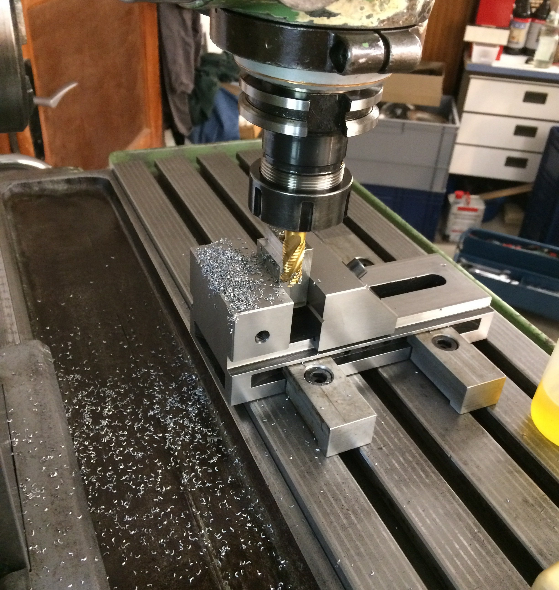

Alles begann damit, dass ich damals meine [kleine Drehbank](dlz450) so langsam betriebsbereit hatte
und somit der Wunsch nach einer Fräsmaschine immer größer wurde.
Diverse Online-Angebote auf eBay, eBay Kleinanzeigen, alibaba.com, etc. wurden begutachtet,
aber für meine Anwendungen (z.B. [Vakuumflansche](kf40_cf40)) schien mir mehr und mehr eine FP1 das Mittel der Wahl zu sein.
Als ich dann in der TU Braunschweig sogar mal auf einer von Franz Singer überholten FP1 probefräsen durfte
(Vielen Dank dafür nochmal hier!), war es um mich geschehen.

## Wer suchet, der findet.

Natürlich sind bezahlbare Angebote rar gesäht, und somit war klar, das ohne automatischen Suchauftrag gar nichts läuft.
Dieser schlug dann natürlich im Stundentakt Alarm, weil den Verkäufern ja durchaus auch geläufig ist,
wie begehrt eine "Deckel FP1" ist ;-)
Nach diversen anderen Angeboten, die auch durchaus verlockend waren, tauchte dann allerdings um 3:00 Uhr morgens zwischen Samstag und Sonntag in Hannover die oben gezeigte Maschine auf.
Diese passte perfekt in mein Beuteschema:
Vertikalkopf vorhanden mit SK40, Wahlräder für die Getriebe, kein Schaltschrank dabei
--> Elektro-Gebastel nötig (d.h. eingeschränkter Käuferkreis) und keine stundenlangen Autofahrten zur Abholung.
Ich verweilte damals bei meinen Eltern in Wolfenbüttel, sodass die Abholung aus Hannover passenderweise mit einer Fahrzeit von bloß einer Stunde pro Strecke ausfiel.

Eine direkte Nachricht um 3:05 Uhr, dass ich die Maschine kaufen würde (nach einer Besichtigung sobald als möglich), blieb allerdings unbeantwortet.
Tags drauf klärte jedoch ein Telefonanruf beim Verkäufer die Gegebenheiten:
Ich war tatsächlich mit meiner nächtlichen Nachricht der erste Interessent gewesen und er wäre jetzt (So ca. 10:00 Uhr)
bereits derart mit Nachrichten überhäuft worden, dass es ihm fast zuviel würde...
Umso besser, dass ich dann gleich für einen der folgenden Tage einen Besichtigungstermin mit ggf. Abholung vereinbaren konnte.
Mein langjähriger guter Freund Hartmut hatte spontan Zeit und ich konnte mir von einem anderen guten Freund names Felix
den VW Caddy leihen (den ich ihm später sogar abkaufen würde, aber das war zu dem Zeitpunkt noch nicht klar),
sodass der Tour de Force nichts mehr im Wege stand.

Mit einer recht massiven Sackkarre sowie einiges an (Mess-)Werkzeug ausgerüstet ging es dann auf den Weg.
Vor Ort konnten wir die Maschine kurz probelaufen lassen, was durch den fehlenden Schaltschrank spontan nur ging,
indem die blanken Aderenden direkt in die CEE-Kupplung eines Drehstrom-Verlängerungskabels gepfriemelt wurden.
Sollte man natürlich so nicht machen, aber an einen CEE-Stecker hatte ich blöderweise nicht gedacht und ein solcher war spontan auch nicht vor Ort aufzufinden.
Die Maschine lief recht ruhig und die Getriebe ließen sich (im Stillstand) auch problemlos ohne Hakeln durchschalten.
Der Vorschub war außer Betrieb, aber dies ließ sich auf einen abgescherten Abscherstift zurückführen (für den es auch einen Grund gab, s.u.).
Weiterhin fehlte der Vorschub-"Steuerknüppel", der sich allerdings (von einer anderen Maschine jedoch) in den folgenden Wochen ebenfalls über eBay Kleinanzeigen auftreiben ließ.

## Erste Begutachtung

Ein besonders kritischer Punkt beim Kauf einer FP1 sind die Spindellager, wie Interessierte sicherlich wissen.
Bei dem vorgestellten Baujahr sind diese durch Nadellager, die direkt auf der Spindelhülse und der Spindel selbst laufen, ausgeführt.
Damals war das sicherlich eine Konstruktion, die dem Stand der Technik entsprach (und evtl. auch aus diesem entwuchs),
aber heutezutage können diese Spindeln bei einem Defekt einen wirtschaftlichen Totalschaden der Maschine bedeuten.
Die Spieleinstellung erfolgt durch Auswahl der Nadeldurchmesser, sodass diese den Raum zwischen Spindel und Spindelhülse mit ca. 3..5µm Spiel ausfüllen.
Durch Fertigungsstreuung kommt es natürlich vor, dass der benötigte absolute Durchmesser der Nadeln von Maschine zu Maschine etwas variiert.
Wenn die Nadeln verschlissen sind oder Lauffläche(n) nachgeschliffen werden müssen, braucht man nun passende Nadeln in Durchmesser-Abstufungen von µm.
Diese sind (soweit ich informiert bin, bitte ggf. um korrigierende Worte!) aber heutezutage für diese Lagerbauart nicht mehr bzw. nur noch als Restbestände verfügbar.

Die Pinolenführung des Vertikalkopfes wurde also abgenommen und die Spindel von Hand durchgedreht.
Bingo, mehrere Rastpunkte zu spüren und insgesamt ein eher verdrecktes Inneres: 

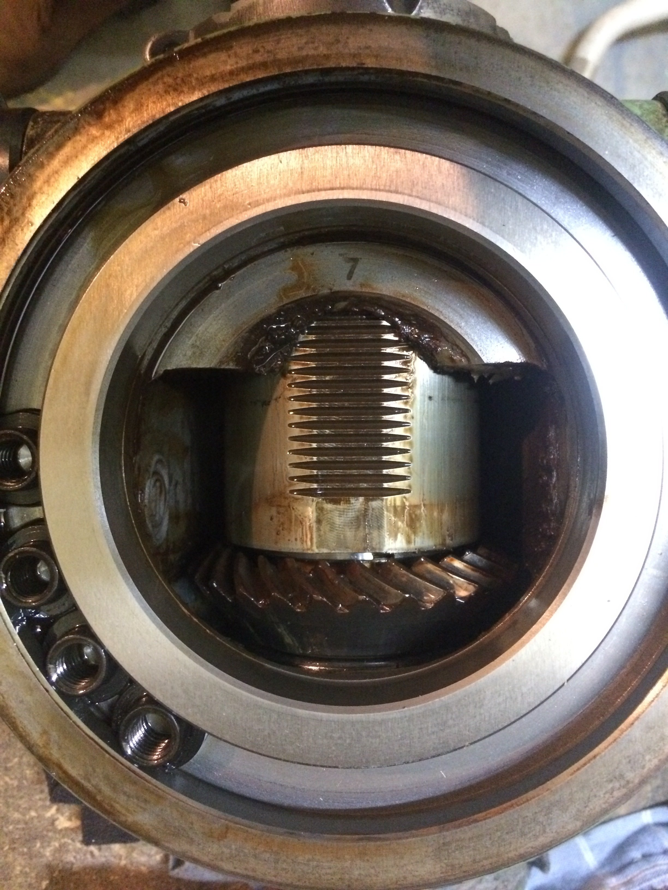

Ein weiser Mensch hätte jetzt wahrscheinlich geseufzt und wäre wieder nach Hause gefahren.
Ich hatte mich vorher etwas bei eBay etc. umgeschaut und war auf ein Angebot von Franz Singer gestoßen, wo es eine Überholung der Pinole um ca. 600-800€ gibt.
Dabei sollte man allerdings den Zusatz "Voraussetzung: Nadellaufbahnen dürfen keine Beschädigungen aufweisen." im Hinterkopf haben...
Ein weiterer Punkt ist allerdings, dass mehrere Leute bereits von kaputten Kugellagern für das Kegelrad oben in der Pinolenführung berichtet hatten.
Ich hatte aus Zeitdruck die Pinole selbst nicht aus dem Gehäuse genommen (und hätte selbst dann die Rastpunkte immer noch gespürt, s.u.), sondern nur die ganze Einheit durchgedreht.

Wie auch immer, die restliche Basis der Maschine (Führungen, Getriebe, genereller EIndruck) schienen mir gut genug, um das Restrisiko bzgl. Vertikalkopf einzugehen.
Gekostet hat mich die angebotene rohe Maschine am Ende 2000€ und etwa 3...6 Monate Suche.

## Transport

Jetzt war natürlich die Frage, wie das Schmuckstück nach Hause zu transportieren wäre.
Mit vereinten Kräften seitens des Verkäufers, seiner zwei Söhne, Hartmut und mir haben wir es gerade so geschafft,
die Maschine rücklings auf die Sackkarre zu stellen und dann mit dem "Kopf" voran ins Auto zu kippen.
Zwei Auffahrrampen unter den Rädern der Sackkarre holfen dann, auch den Fuß der FP1 ins Innere zu wuchten.
Geht schon verdammt viel rein in einen Caddy, aber die FP1 hat ihn schon ordentlich tiefergelegt.
Anzumerken sei noch, dass der orange Spanngurt während der Verladeaktion die FP1 an der Sackkarre festgezurrt hat.

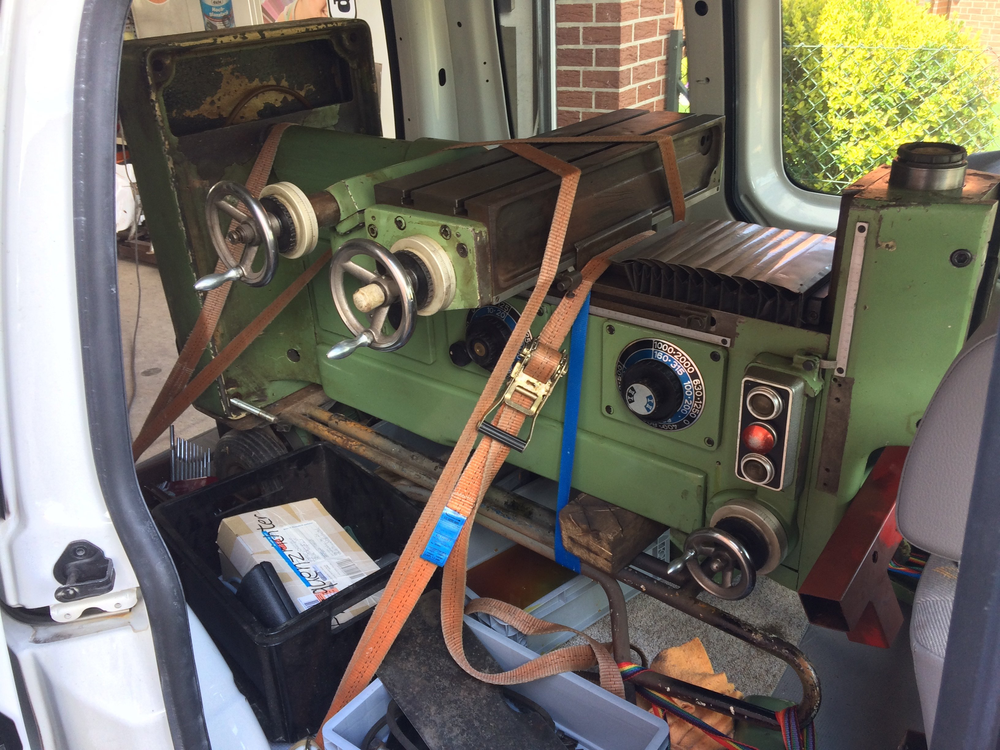

Latürnich suppten sämtliche noch vorhandenen Ölreste schlagartig auf die Ladefläche, sobald die Fräse es sich gemütlich gemacht hatte.
Eine flugs druntergestellte überzählige Euro-Box konnte jedoch größeren Katastrophen Einhalt gebieten.
For the recond: selbstverständlich wurde vorher über die vorhandenen Ölablassöffnungen eine Entleerung vorgenommen...

## Erste Inspektion

Zuhause angekommen hab ich mir dann als ersten den Vertikalkopf vorgenommen, um Gewissheit zu haben,
ob ich im Rest des Jahres mir noch was anderes als Nudelsuppe zu Essen würde leisten können oder ob die Nadellager wundersamerweise doch noch in Ordnung sind.

Als erstes den Sicherungsstift für die Kappe an der Anzugspindel herausgeklopft: 

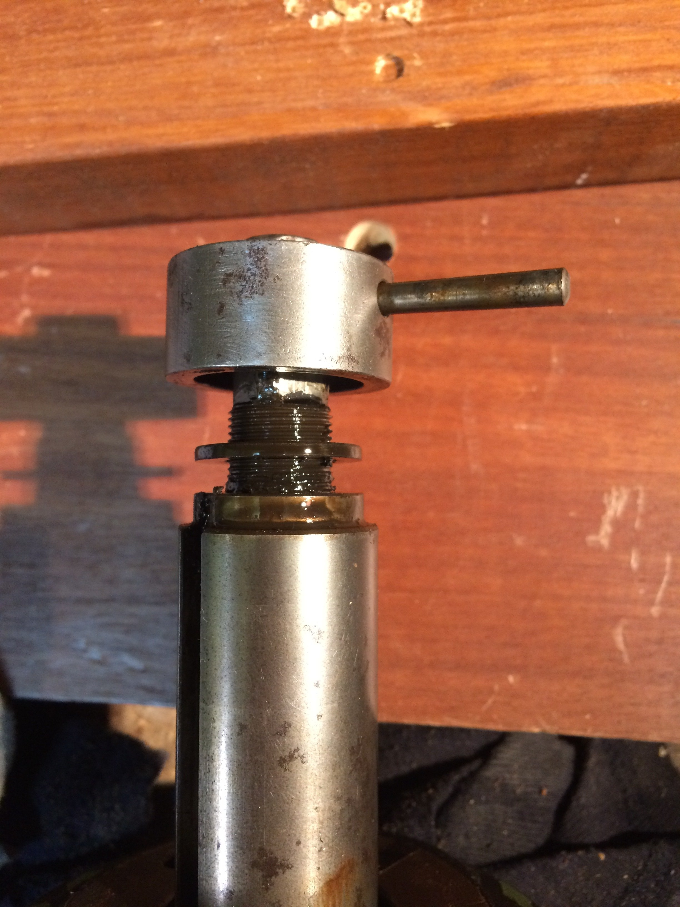

Die Zahnwelle für die Bohrzustellung kommt als nächstes raus: 

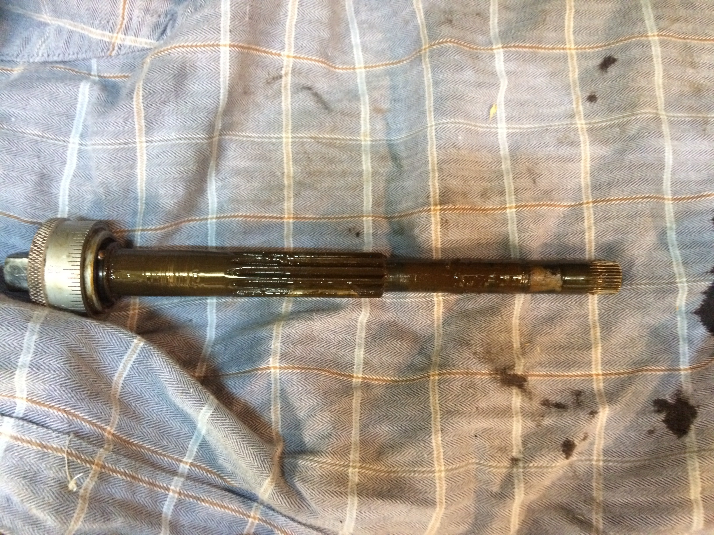

Und schwupps hat man die Pinole selbst in der Hand:

Die geklemmte Mutter lässt sich abschrauben und schon kommt man an die Axiallagerung heran:

Der ganze braune Gubbel lässt auf nichts Gutes schließen, aber einfach "Augen auf und durch":

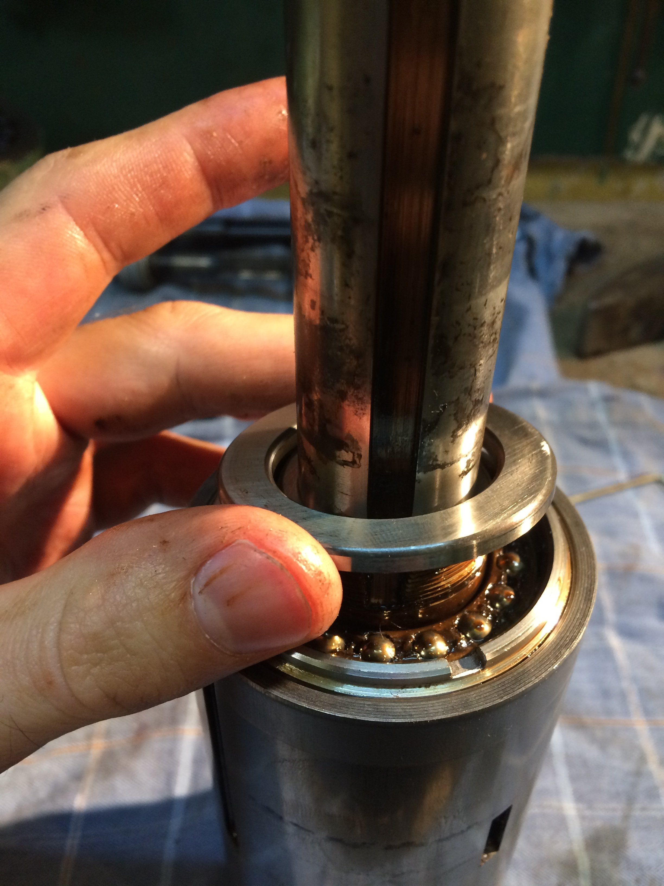

Glück gehabt !!!
Die Nadellager sind noch sauber und sehen sehr unverbraucht aus:

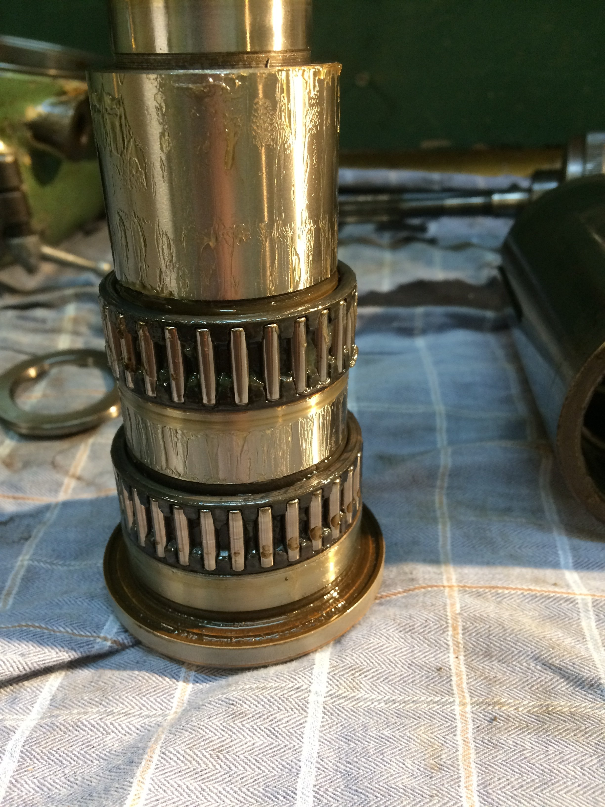

Ebenfalls die Laufflächen in der Pinole selbst sehen noch recht ok aus:

Die Ursache für die Rastpunkte der Pinole selbst waren in der Axiallagerung zu finden:

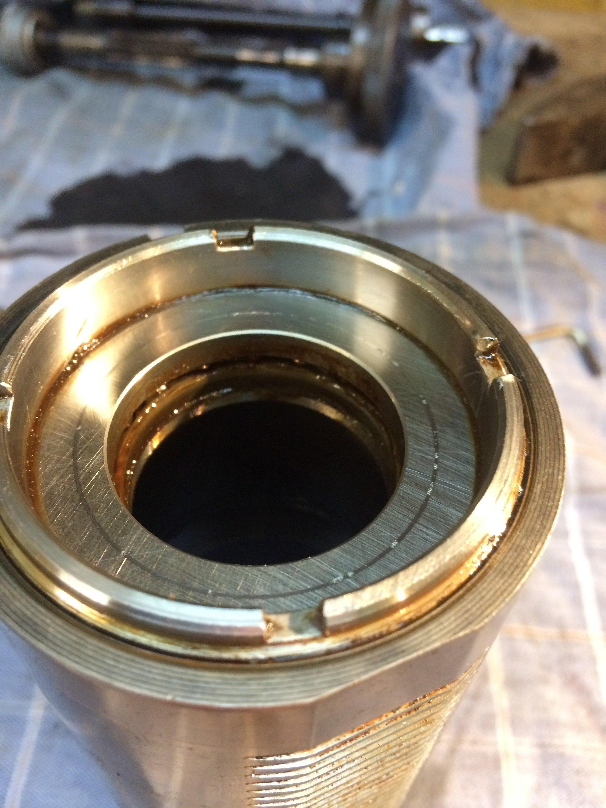

Die Axiallagerung besteht aus zwei Axial-Rillenkugellagern, die auf der einen Seite in den mitgelieferten "Rillenscheiben"
und auf der anderen Seite auf einer in der Pinole verankerten Scheibe laufen. Dort fehlt allerdings die Rille, was unter normalen Betriebsbedingungen
und -belastungen einer FP1 wohl auch zufriedenstellend funktioniert.
Die Scheibe ist mit einer vierfach genuteten Mutter in der Pinole befestigt:

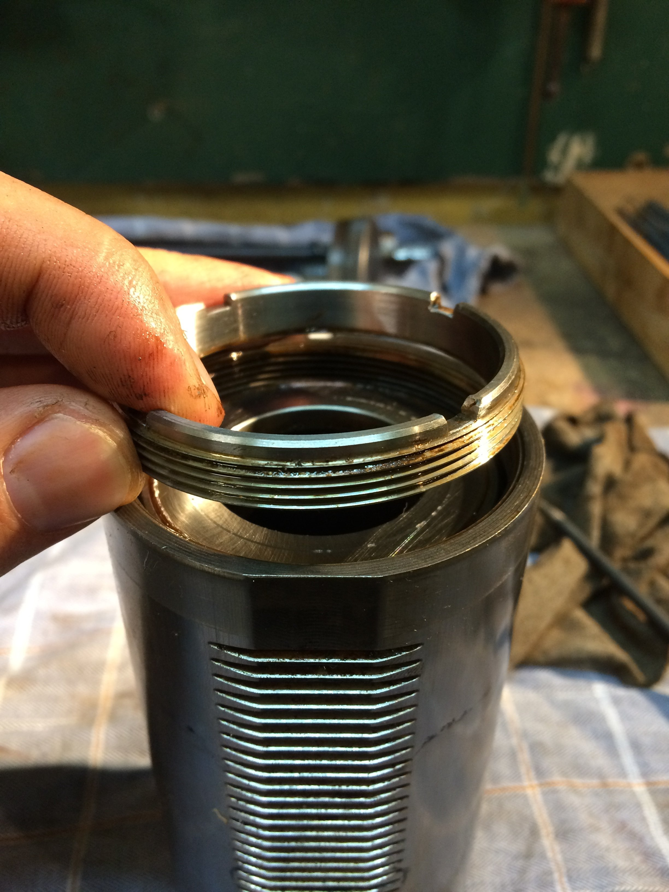

Interessanterweise sind die desaströsen Laufspuren auf der Oberseite der Scheibe zu finden, und nicht auf der Unterseite.
Beim Bohren drückt die Vorschubkraft nach oben, aber Fräser zieht es ja manchmal nach unten aus der Spannzange heraus.
Könnte dies also eine Folge von exzessiver Axialkraft durchs Fräsen sein?

Nimmt man die Scheibe dann heraus, kann auch die unten liegende Rillenkugellager-Hälfte entnommen werden:

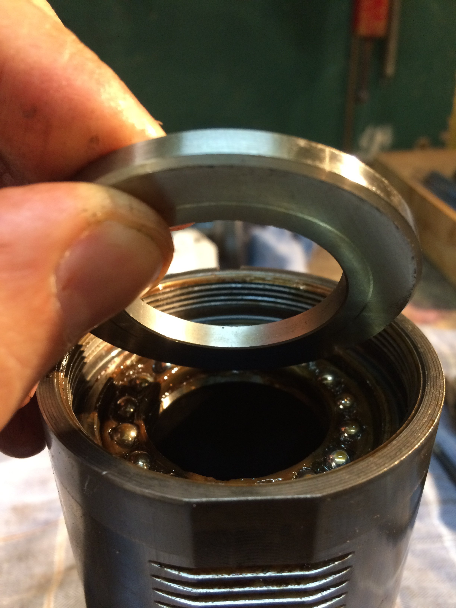

Alle Teile wurde in "Lampenöl" (Petroleum) aus dem Supermarkt gereinigt:

Insgesamt ist das eine recht merkwürdig konstruierte Angelegenheit, die auch hier in der ZB beizeiten zu etwas Verwirrung führte: [Thread #47254](https://forum.zerspanungsbude.net/viewtopic.php?t=47254)
Letzendlich brachte Franz (@opa12) Licht ins Dunkel: [Post #569220](https://forum.zerspanungsbude.net/viewtopic.php?p=569220#p569220)
Ebenso zeigte Franz die erfolgreiche Reparatur dieses Defekts, indem die "zentrale Lagerscheibe" mit der Laufrille entsprechend plangeschliffen und geläppt wird (?).
Vielen Dank für diese Infos nochmal an dieser Stelle!

Gleichzeitig wusste ich dadurch sofort, zu wem ich meine Pinole schicken würde ;-)
Eine einigermaßen übertrieben aufwendige Verpackung war fix gebastelt und nach kurzer telefonischer Rücksprache und einer Rücksendung durch die Post,
die es tatsächlich geschafft hatten, das Paket zu zerlegen, kam die Vertikalpinole dann bei Franz an, wurde dort überholt und vermessen,
und erreichte mich schlussendlich genauso wohlbehalten wieder in Greifswald.

Franz konnte die Laufspuren in der Scheibe beseitigen und hat auf meine Bitte hin die Nadellager mit Klüber "ISOFLEX SuperTEL" geschmiert, wie von Deckel gefordert.
Das gemessene Radialspiel lag bei ca. 3µm und das Axialspiel ist jetzt auch passend eingestellt.
Gerade da bei der FP1 die Vertikalpinole wohl das kritischste Teil ist, war es mir wichtig, dass diese Arbeit von jemandem gemacht wird, der weiß was er tut.
Die überarbeitete Pinole lässt sich jetzt wunderbar samtig-sanft durchdrehen und weckt Vertrauen, dass ich mit ihr viele Jahre gute Arbeit mit der FP1 erledigen werde können :-)

Hier sieht man nochmal die zusammengebauten Innereien der FP1-Vertikalspindel (aufgenommen vor der Überholung): 

In einem Anfall von Wahnsinn hatte ich die Einzelteile der Pinole schon in Inventor nachkonstruiert und versucht, eine alternative Lösung zu entwerfen,
die in den vorhandenen Bauraum passt, aber beide Rillenscheiben der Kugellager verwendet hätte.
Nachdem Franz allerdings versicherte, dass die vorgefundene Lösung ja durchaus eine serienmäßige Konstruktion von Deckel sei
und diese im Normalfall dann ja auch funktionieren sollte, hab ich es dann bei der ursprünglichen Konstruktion belassen.

## Zerlegen

Als nächstes in chronologischer Reihenfolge stand weiteres Zerlegen der Maschine auf dem Plan.
Während ich beim Verkäufer ja direkt vor die Garage vorfahren konnte, muss ich bei mir zuhause halb am Haus vorbei zum Kellereingang.
Daher wurde alles, was nicht niet- und nagelfest war, abgeschraubt und begutachtet:

Die Führungsflächen haben erfreulicherweise auch bei dieser etwas genaueren Inspektion keine riesigen Fresser zu präsentieren gehabt:

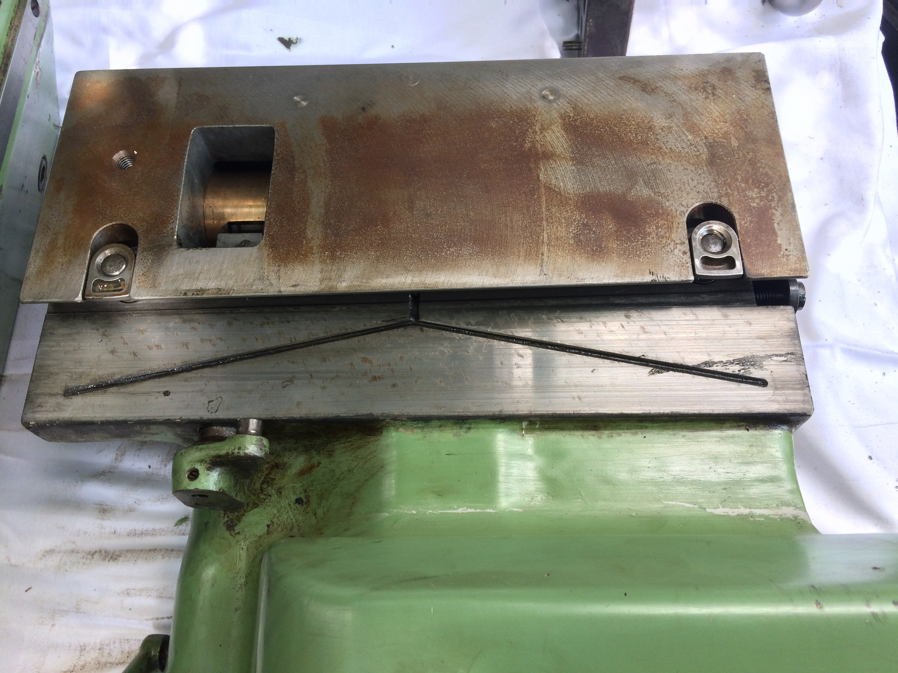

Der Maschinenkorpus blieb dabei im Auto, um das erneute Aus- und Einladen zu umgehen:

Netterweise hatte ein(e) Vorbesitzer(in) mir die unsägliche Reinigung des Kühlmittelsumpfes abgenommen:

So vorbereitet ging es dann auf die Heimreise nach Greifswald.

## Ausladen

Zuhause in Greifswald angekommen, sicherte ich mir die Unterstützung von drei Kollegen zum Ausladen der Maschine.
Links ich, Thomas in der Mitte und Peter rechts. Hannes hat das Foto aufgenommen und ist daher leider nicht mit drauf.
Danke euch dreien auch nochmal ganz herzlich für die helfenden Hände!

Gemeinsam konnten wir den Maschinenkorpus samt der abgebauten Anbauteile in meine Werkstatt bugsieren:

Alle vormals freigeräumten horizontalen Flächen sind restlos belegt:

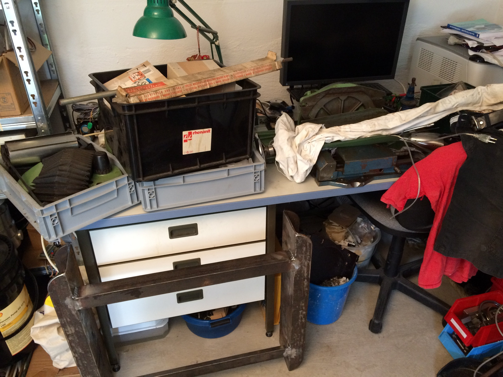

Das ist nun die Aussicht der FP1:

## Aufarbeitung

Zunächst erfolgte eine Begutachtung des Fräs-/Hauptgetriebes ...

... sowie des Vorschubgetriebes: 

Alle Zähnchen sind noch da, alle Zähnchen, alle :-)

Weiter ging es dann an der Rückseite, wo auch wieder genug Dreck und Siff auf Bereinigung warteten:

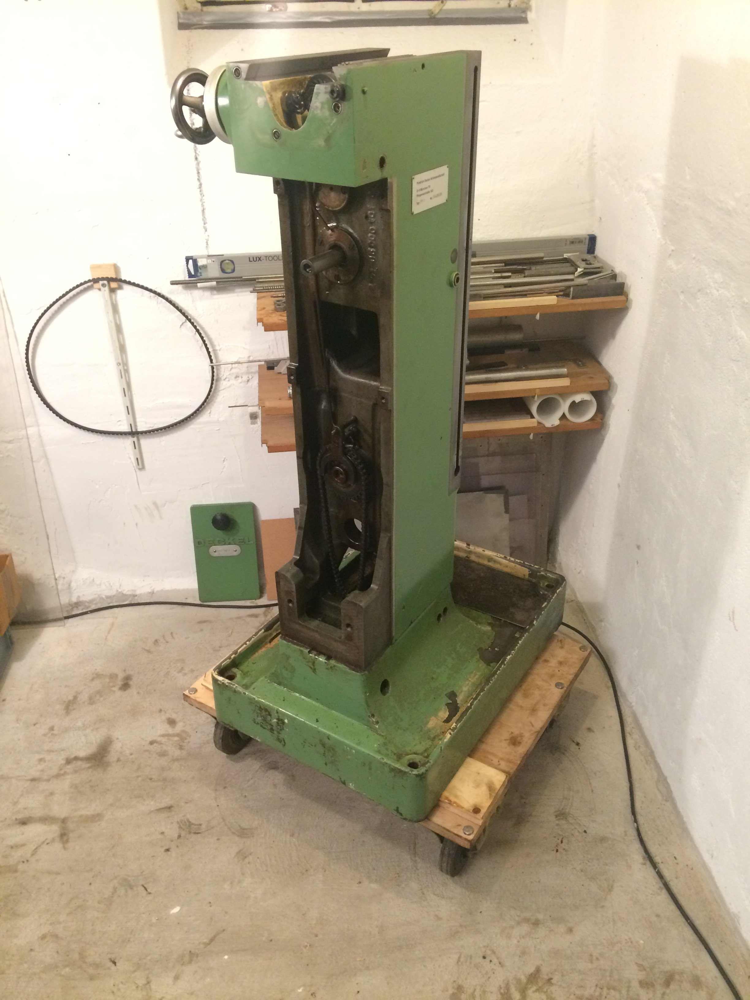

Der Bref Backofenreiniger sowie ein bisschen Petroleum/Lampenöl wirken jedoch Wunder und schon bald sieht die Rückseite wieder halbwegs ansehlich aus:

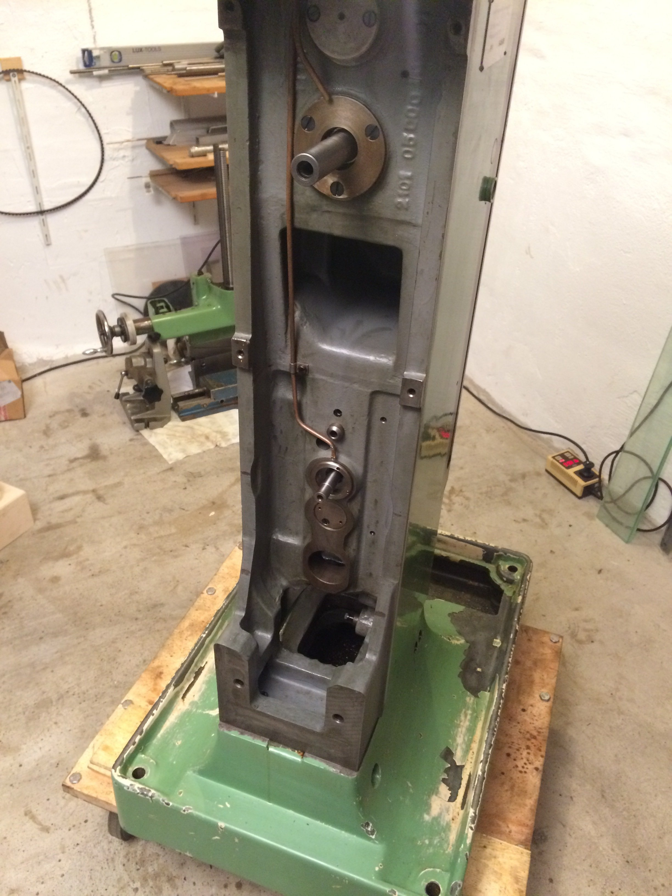

Oben im Hauptgetriebe lässt sich ein Ölschwallblech(?) ausbauen, um besser an die darunter liegenden Innereien zu kommen:

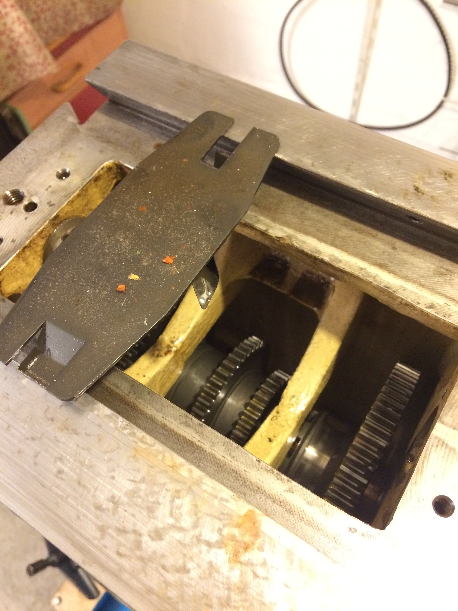

Nach einem Nachmittag mit Abzieher, Ratschenkasten und Zapfenschlüssel liegt das Hauptgetriebe in Einzelteilen auf der Werkbank:

Der nun zugängliche Platz im Getriebegehäuse lädt zu einer Reinigung desselben ein:

Ein kompletter Satz Wälzlager (mit Ausnahme der selektierten Spindellager) wurde schon mal auf Halde beschafft:

Die Preise beziehen sich auf das Angebot bei Agrolager; ich bin mit denen weder verwandt oder verschwägert, sondern hab dort einfach gute Erfahrungen gemacht.
Keine Ahnung warum der Simmering auf der Bestellliste fehlt; wahrscheinlich ist der mir auch erst relativ spät aufgefallen.

Auch das Vorschubgetriebe wurde zerlegt.
Die Einzelteile der Getriebe habe ich von Hand im Petroleumbad mit Pinsel, Draht- und Zahnbürste sowie Schleifvließ gereinigt und eingeölt.
Für die Montagereihenfolge verweise ich auf [den zweiten Teil von Marcs Bericht](http://bymm.de), der extrem detailliert die einzelnen Schritte beschreibt.

Bei der Montage geht es jetzt los mit der untersten Welle im Vorschubgetriebe:

Zwei weitere Wellen folgen:

"Klappe zu, Affe tot"; das Vorschubgetriebe ist wieder zusammen :-)
Die Wählscheibe mit Skalen etc. war auch auseinander und hat ein Petroleumbad genommen.
Die fehlende Skala mit "I/II" für den inneren Schaltgriff muss ich noch bestellen... 

Im nächsten Schritt kann die Kette zum Antrieb der KSS-Pumpe wieder montiert werden:

Jetzt beginnt die Blasphemie, und ich entschuldige mich schon im Voraus bei den Teilen der Leserschaft,
die ob des nun Folgenden in Ohnmacht fallen könnten!

Für mich stand bereits zu Beginn dieser Aktion fest, dass dies keine vollständige geometrische Überholung werden wird.
Zum Einen, weil ich beim Zerlegen eher milde Verschleißspuren gefunden habe und zum Anderen,
weil mir momentan schlicht die Zeit dafür fehlt.
Ich habe auch auf ["benutzten"](https://youtu.be/MW5WUejMZHU?t=267) Maschinen bisher immer mein Ziel erreicht und bin recht zuversichtlich,
dass ich auch mit dieser FP1 die nächsten Jahre viele schöne Werkstücke werde fertigen können,
ohne sie komplett von Grund auf geometrisch aufgearbeitet zu haben.
Nicht falsch verstehen, ich möchste das auf jeden Fall irgendwann in der Zukunft noch nachholen,
aber dafür muss die Zeit da sein und ich muss mich noch deutlich weiterentwickeln, was die Schabefähigkeiten angeht.

Im aktuellen Zustand waren allerdings die Schabemarken bereits größtenteils verschwunden und daher habe ich mich entschlossen,
alle Gleitflächen zumindest einmal kreuz und einmal quer mit dem Biax aufzubrechen, um dem Öl etwas Halt und Platz zu geben.
Hier zu sehen an der Y-Führung ... 

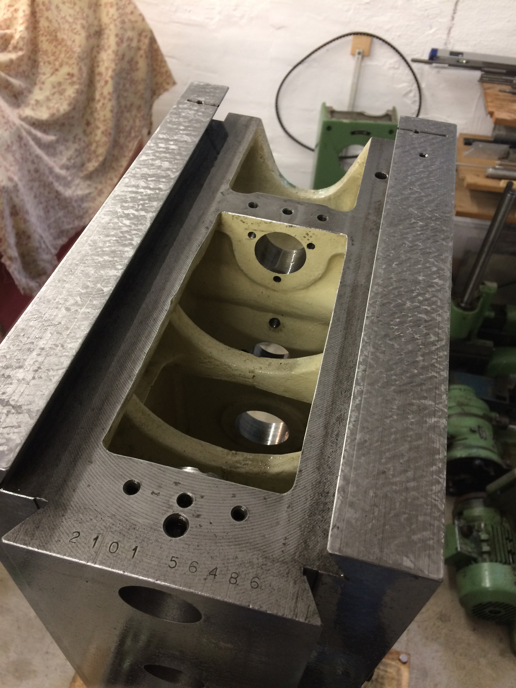

... sowie an der Z-Führung:

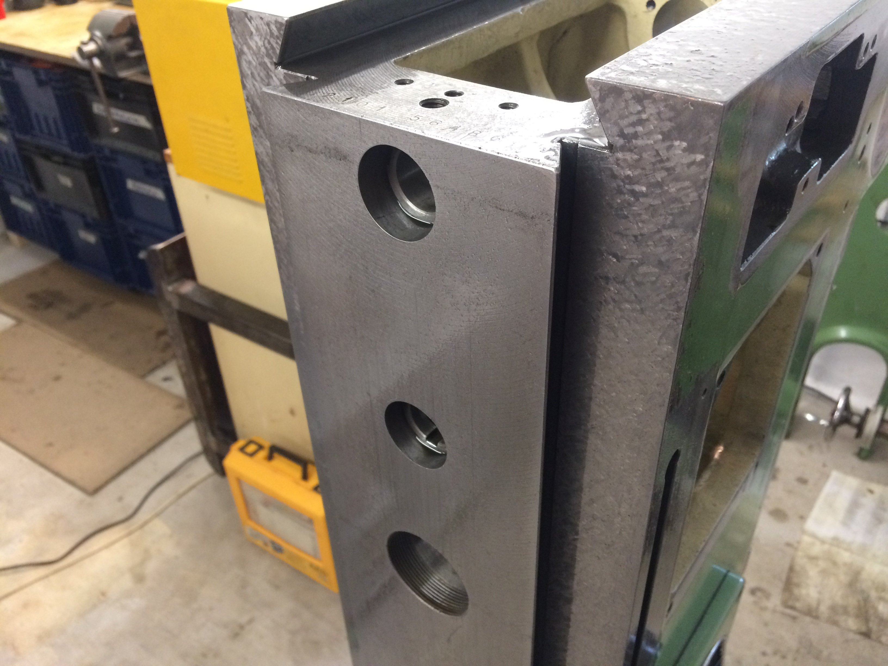

Die KSM-Pumpe habe ich auch wieder montiert, obwohl ich sie wahrscheinlich nicht großartig verwenden werde
(eine Dynacut MMKS ist vorhanden):

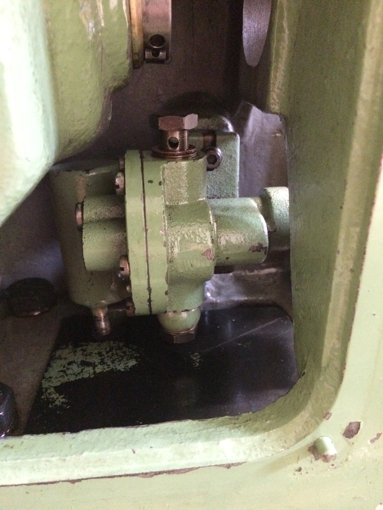

Dann wurde das Hauptgetriebe wieder montiert und mit Öl befüllt.
Durch die Rotation der Zahnräder wird das Öl nach oben transportiert und schmiert auch die Y-Achse.
Ich habe daher hier CGLP-68 (Gleitbahnöl) eingefüllt, welches für Führungen gedacht ist,
aber eben auch die Zahnräder gut schmiert:

Getriebedeckel drauf und auch das Hauptgetriebe ist wieder fit für den Einsatz:

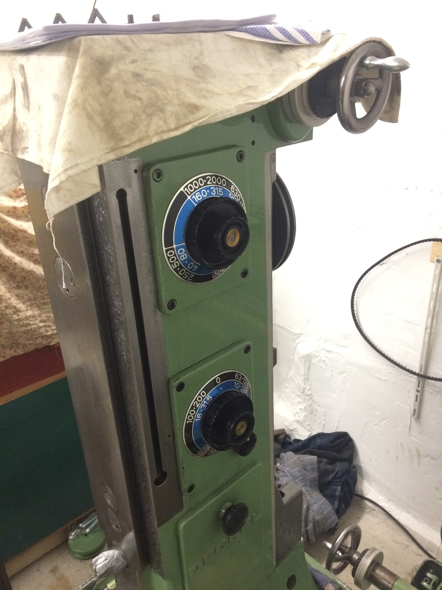

Die Spindelmutter für die Y-Achse wurde wieder von hinten in die hohle Zahnwelle eingebaut
und das entsprechende Handrad montiert:

Vorn unten an der Säule schließt das Umlenkgetriebe/Knie an, in welches die Z-Spindel und die Zugspindel eintauchen,
die unten aus dem Konsolschlitten herausstehen.
Das waagerechte Kegelrad in dieser Baugruppe war übrigens mit der Bronzebuchse zusammengegammelt, in der es laufen soll.
Dies hatte zur Blockage des Vorschubs und damit zum Abscheren des Abscherstifts geführt.
Hier hatte sich durch frühere Benutzung einiges an KSS-Gubbel gesammelt und dieser dann nach und nach das Öl verdrängt...

Damit wäre der Korpus weitestgehend abgeschlossen.

Die nächste Baugruppe an der Reihe war der Y-Schlitten mit Horizontalspindel.
Hier wurde zunächst die Horizontalspindel samt Lagerung zur Begutachtung ausgebaut:

Einiges an Dreck war vorhanden, aber die Nadelkäfige und zugehörigen Laufflächen sahen soweit noch ganz ok aus.
Hier gibt es noch einen Blick von oben in den Y-Schlitten:

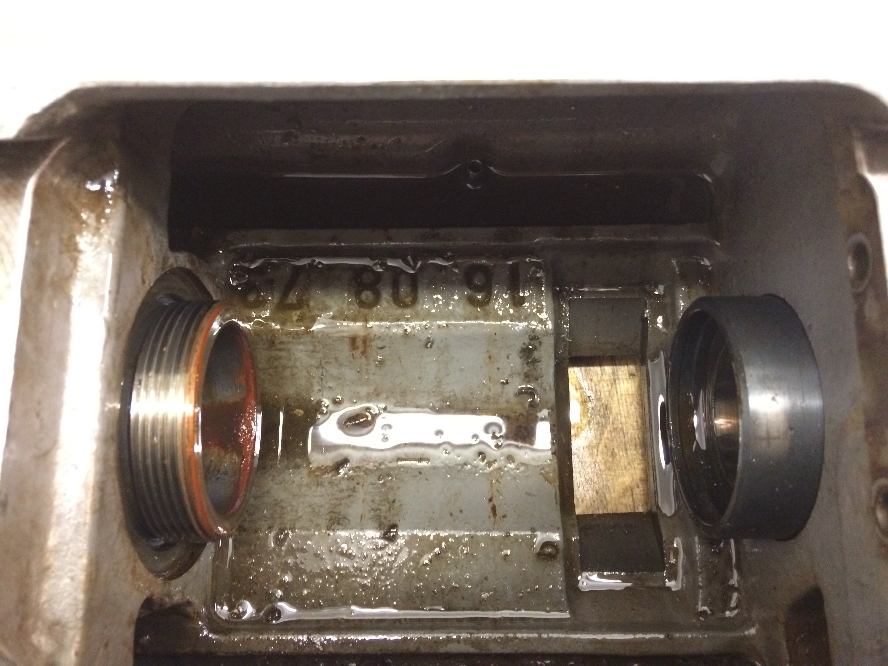

Die Einzelteile wurden einzeln verpackt und warteten auf die Rückkehr der Vertikalpinole aus Österreich,
da der Rücklieferung eine Tube LDS18 beigelegt würde, wie ich aus sicherer Quelle wusste.

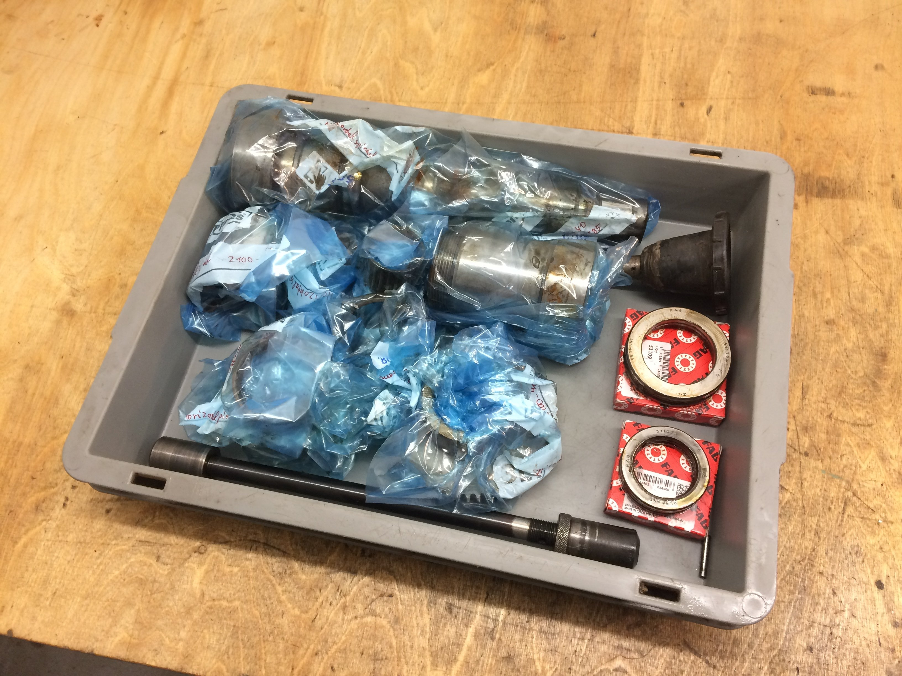

Dieses ist zwar nicht das SuperTEL welches Deckel urprünglich für die nadelgelagerten Spindeln vorgeschrieben hat,
aber wohl das nächstbeste, aktuell verfügbare Produkt.
Die Horizontalspindel brauche ich deutlich weniger und sie wurde wahrscheinlich
auch beim Vorbesitzer deutlich weniger zum Fräsen verwendet,
sodass ich davon ausgehe, dass die Lager noch gut in Schuss sind und wahrscheinlich auch noch lange leben werden,
wenn sie nur das zweitbeste weltweit verfügbare Fett für diese Anwendung bekommen...

Als nächstes wurde der Konsolschlitten ausgeräumt und gesäubert.
Auch hier wurden die Führungen wieder durch kreuzweises Schaben aufgebrochen:

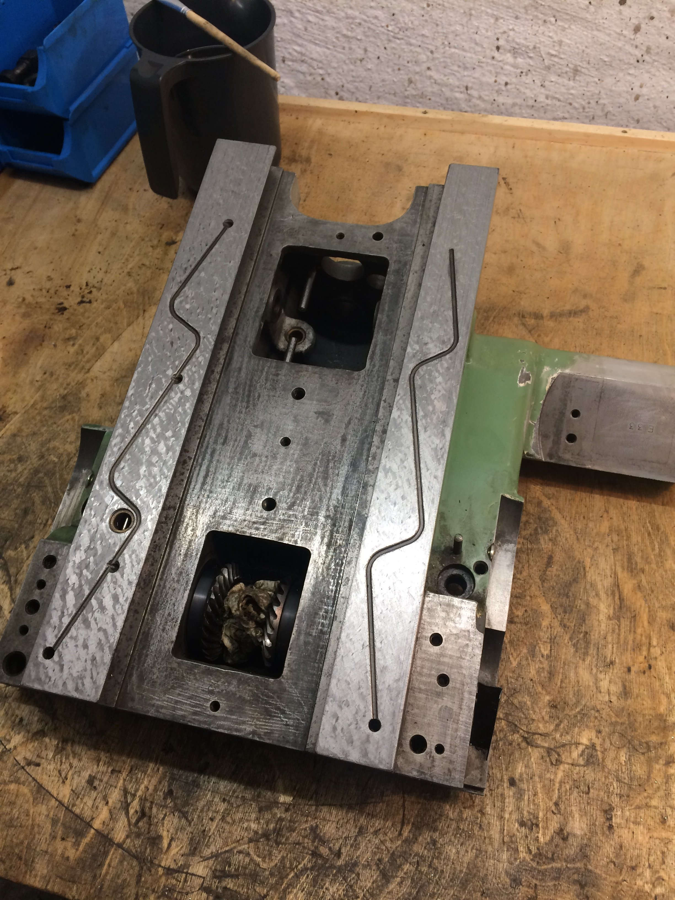

Der Konsolschlitten ist (nicht nur) meiner Meinung nach die anspruchsvollste Baugruppe einer FP1.
Dies sieht man schon allein an der schieren Anzahl der darin verbauten Einzelteile:

Blöd ist nur, wenn man sich die Montagereihenfoge nicht ordentlich überlegt...

Schlussendlich kommt aber wieder alles an seinem angestammten Platz zu sitzen:

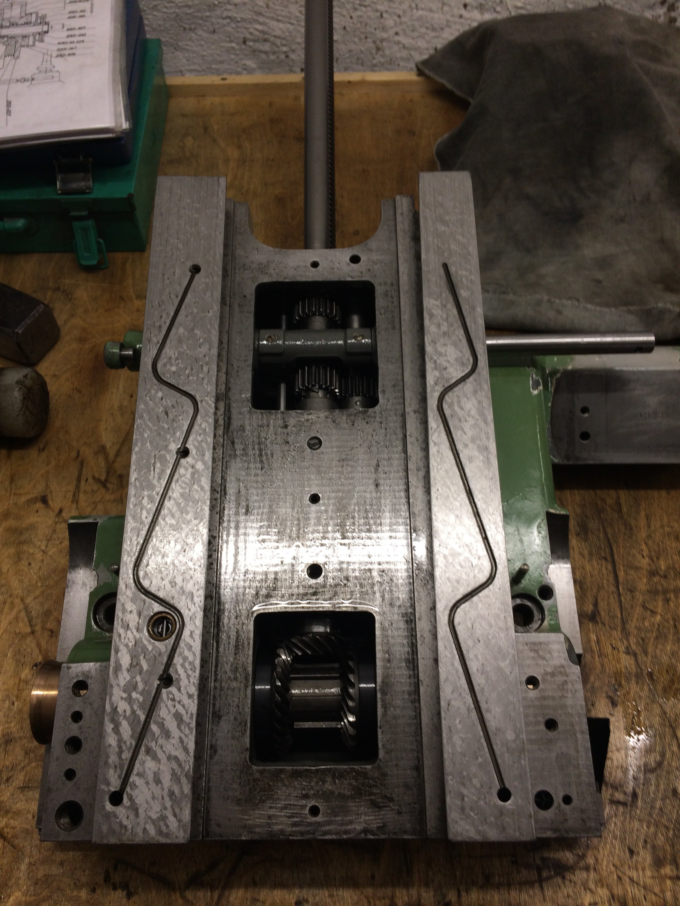

Hach, das sieht doch gleich viel einladender aus:

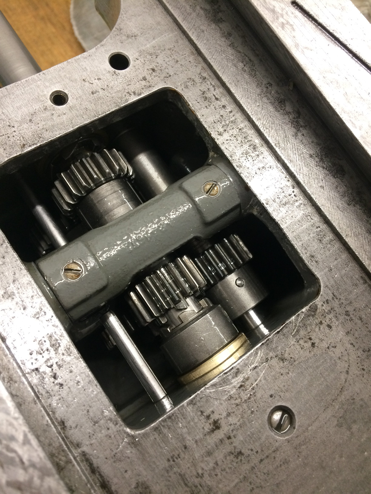

Noch ein paar andere Kleinigkeiten und der Konsolschlitten kann wieder auf die Z-Achse der Säule aufgefädelt werden:

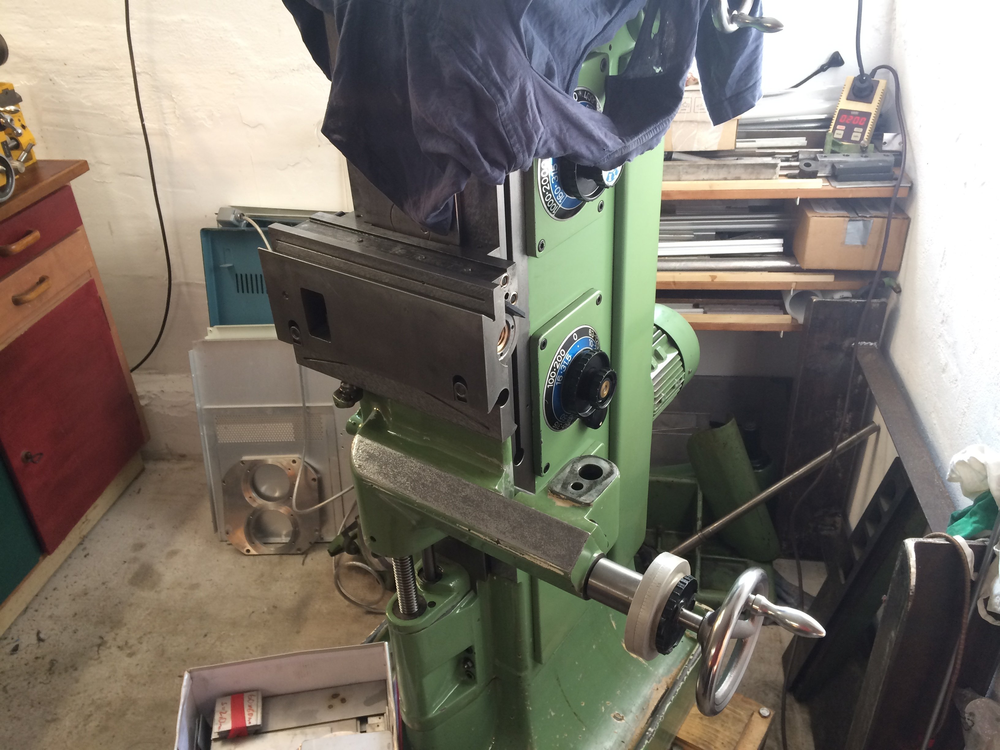

Nach dem Einbau der Horizontalspindel in den Y-Schlitten kann auch dieser wieder auf der Maschine Platz nehmen:

Der X-Schlitten ist auch noch mal ein Stück Arbeit.
Hauptsächlich ist es erforderlich, den Dreck der Vergangenheit zu entfernen und Grate/Dellen zu egalisieren.
Die Gleichflächen hab ich auch am X-Schlitten kreuzweise je einmal übergeschabt, um dem Öl etwas Platz zu geben.
Montiert an der Maschine sieht das schon fast wieder nach einer Fräsmaschine aus:

Ein paar hübsche neue Faltenbälge gab es in der Zerspanungsbude zu kaufen:

Der feste Winkeltisch war erfreulicherweise im Paket enthalten und erstrahlt jetzt auch wieder in neuem Glanz:

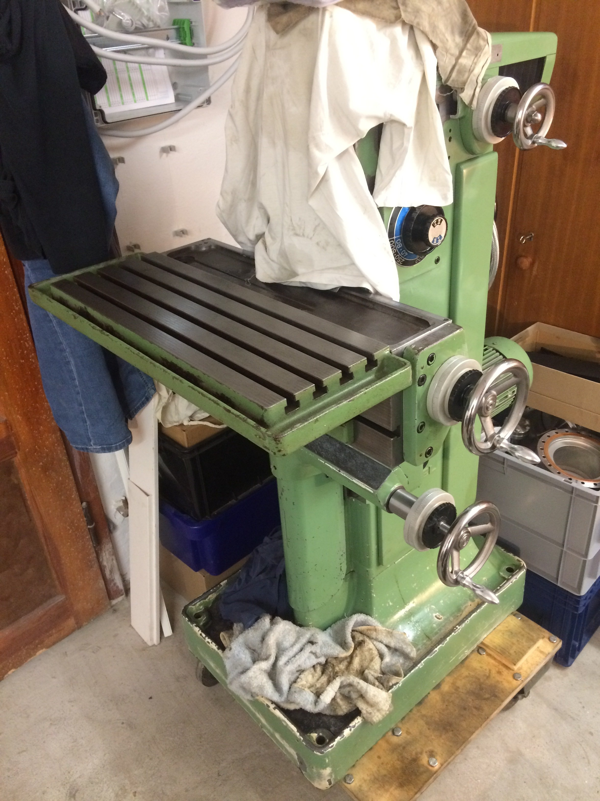

Der Universal-Winkeltisch ist derzeit noch zerlegt, da die Tischoberfläche doch einiges an Macken aufweist.
Hier möchte ich die Tischplatte zum Überhobeln schicken, bin aber noch nicht dazu gekommen...

## Vertikalspindel

Der Vertikalkopf war die letzte Baugruppe, die noch ausstand.
Das "Hauptteil" war recht überschaubar zu säubern und hat nach der Reinigung mal schnell probehalber Platz genommen:

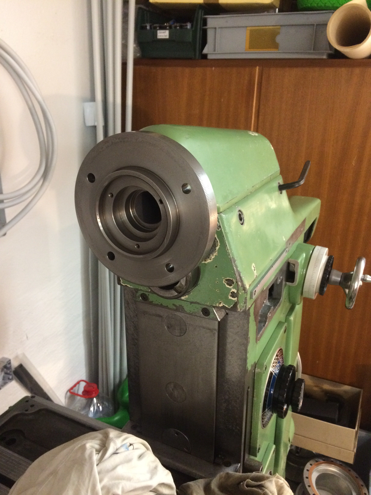

Im Inneren fehlt es natürlich noch etwas an Gestänge, welches zu diesem Zeitpunkt noch beim Waschen herumtrödelte:

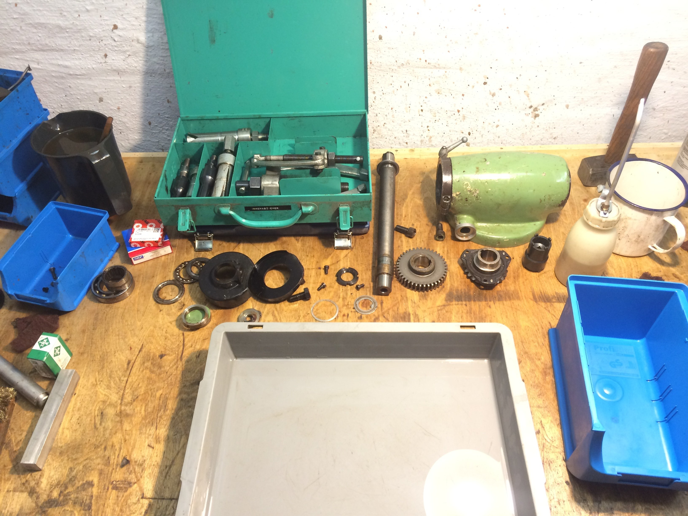

Zum sicheren Festziehen und Lösen der Schrauben, die die Zahnräder auf der Welle halten, war etwas Kreativität gefragt:

Und dann machte es "plopp" (Warum? Na weil es halt "plopp" machte ...)
und der horizontale Teil des Vertikalfräskopfes war wieder auf der Maschine:

Die Pinolenführung bzw. das Winkelstück brauchten noch ein Bad in Nitro-Verdünnung
um sich häutenderweise von einer Schicht Billiglack zu entledigen:

Nach dessen Montage ist die FP1 wieder einsatzbereit:

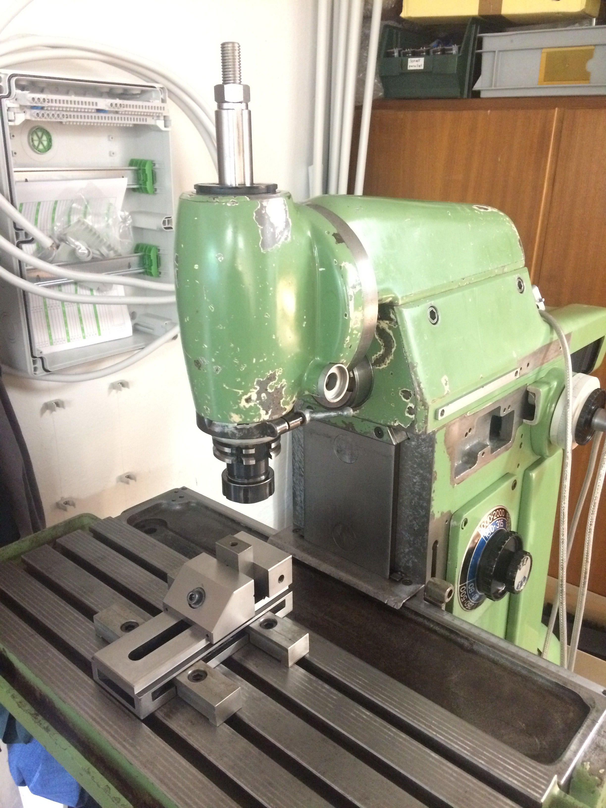

Als Abschluss dieses Berichts noch ein Bild von mir bei der Vorreinigung der Baugruppen.
Manchmal sind dreckige Hände (und weiteres...) eben doch schwer zu vermeiden

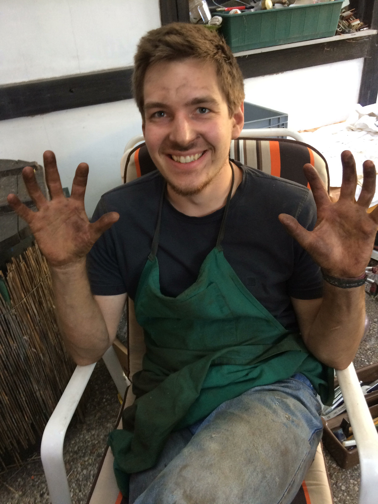

## Zubehör

Für die SK40-Werkzeuge gab es eine Reihe von Kunststoffeinsätzen bei eBay:

Diese wurden dann (angelehnt an ähnliche Konstruktionen, die in der Zerspanungsbude gezeigt wurden) in ein Regal eingepasst:

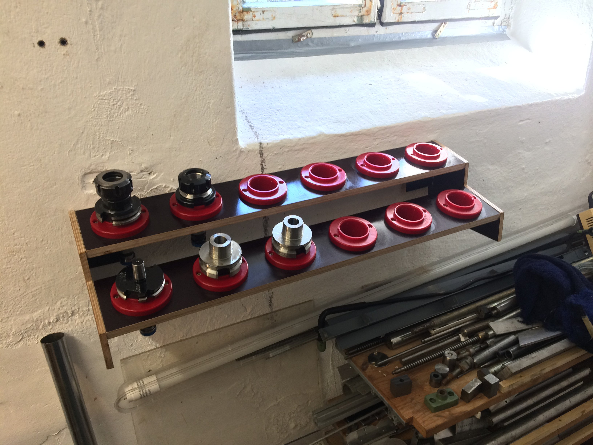

Weiterhin hat sich ein SK40-Montagestand eingefunden, in dem sich Spannzangen etc.
sehr handlich einbauen und festspannen lassen.
Gerade bei den ER32-Haltern, die man ja doch einigermaßen anknallen muss,
ist mir das so lieber als direkt in der Maschinenspindel.

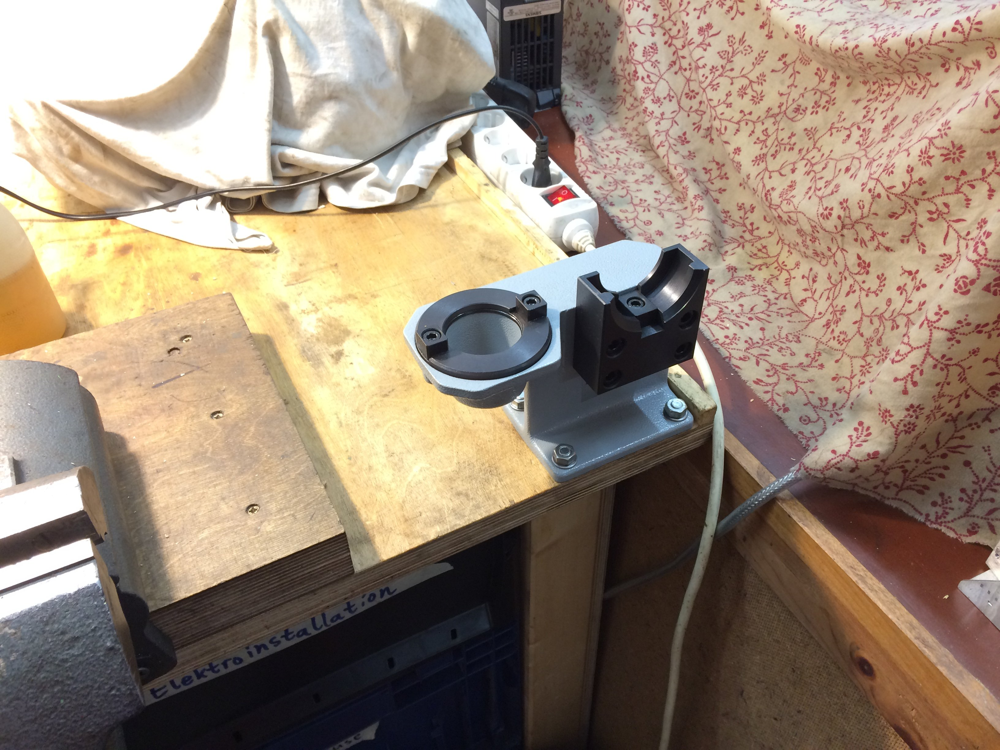

Einen SK40-Teilapparat mit Gegenhalter (nicht auf dem Bild) und Zentrierspitze,
dafür ohne Montagewinkel, konnte ich günstig ergattern.
Hier steht noch eine gründliche Reinigung an.
Den Montagewinkel werde ich wohl als Stahlkonstruktion bauen und auf eine überzähliche Schraubstock-Drehplatte setzen.

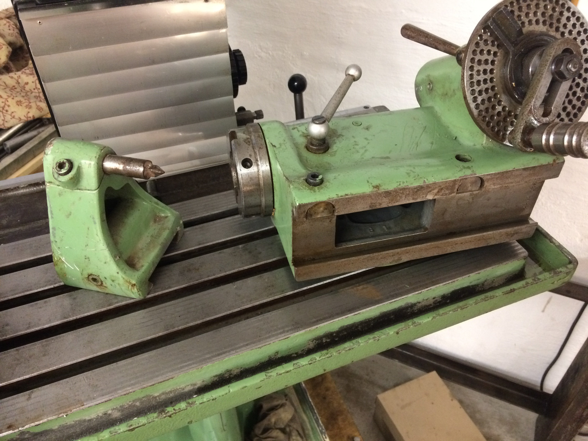

Weiterhin ziert ein 250er Rundtisch seit neuestem meine Werkstatt.
Zugegebenermaßen ist das auf dem Tisch der FP1 ein ganz schöner Klopper,
aber immerhin ist er immer noch kleiner als das 380mm-Monster von Deckel.
Auch hier wieder: auseinandernehmen, Teile säubern und frisch geölt wieder zusammenbauen --> stay tuned... 

Damit war dann auch keine Ausrede mehr möglich, die Minimalmengenschmierung noch länger lose herumfliegen zu haben.
Diese wurde daher fest an der Wand montiert und steht jetzt für Drehbank und Fräsmaschine gleichermaßen zur Verfügung.

## Untergestell

Ein Untergestell für die FP1, um sie später mal per Hubwagen einfach umsetzen zu können
und um die Bedienelemente auf angenehme Höhe für mich zu bringen, stand schon seit einiger Zeit bereit:

Neulich hat es dann ein grünes Kleid angezogen bekommen und war damit einsatzbereit:

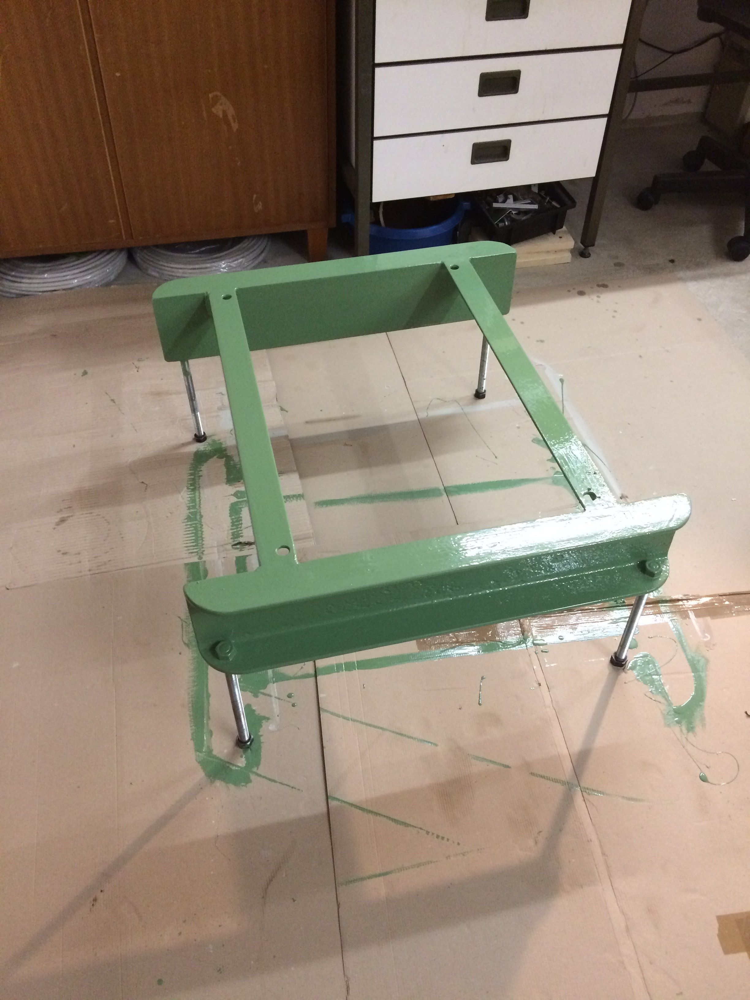

Ein provisorischer Portalkran aus Holz samt Kettenzug hat mir dann beim Umsetzen geholfen:

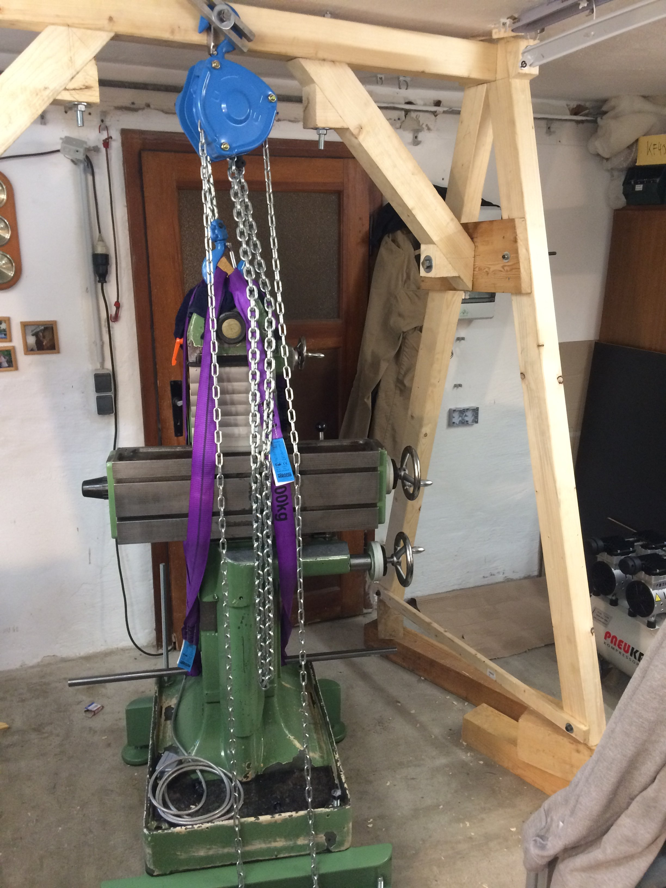

Sieht doch gleich viel zivilisierter aus als ein Rollbrett:

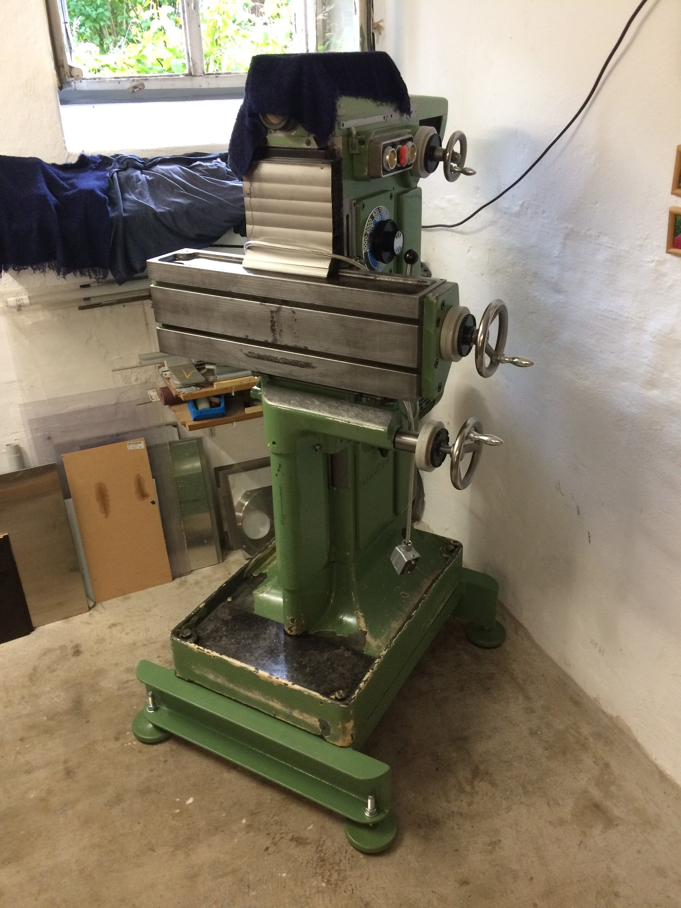

## Anzugstange

Zu guter Letzt wurde soeben eine neue Anzugstange mit M16-Außengewinde
(statt S20x2-Innengewinde wie im Original) fertiggestellt.
Hier noch beim Ausrichten zum Fräsen der letzten Schlüsselflächen für einen Vierkantschlüssel:

Passt soweit:

Und so sieht die Anzugstange in der Totalen aus; zusammen mit einem Provisorum aus einer M16-Gewindestange.
Der Durchlass in der Vertikalpinole hat einen Durchmesser von 15mm.
Daher musste die Gewindestange auf dem größten Teil der Länge auf 15mm abgedreht werden.
Für die Kontermuttern oben hat das gerade noch so an "Rillentiefe" gereicht.
Ich hab kein einziges S20x2-Werkzeug im Haus und musste daher von Anfang an auf M16 setzen.

Montiert sieht man davon natürlich am Ende nichts mehr,
aber immerhin ist die Fräse damit jetzt wieder einen deutlichen Schritt weiter:

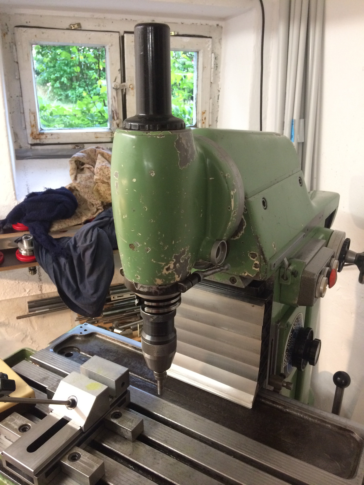

