## neue alte Drehmaschine erstanden (2021-04-03)

Ich hatte vor ein paar Tagen das grosse Glück, auf eBay meine erste eigene Drehmaschine
zu ersteigern. Ich habe bisher nur auf fremden Maschinen in den Unternehmen, in denen
ich Praktika gemacht habe, arbeiten können.

Zu den Einzelheiten der Maschine komme ich im Verlauf dieses Beitrags.

Hier ist erstmal ein Bild von der Maschine, wie sie bei eBay angeboten wurde:

Mit bei der Maschine war ein Motor mit 0,37kW der Firma Georgii-Kobold, der auf
diesem Bild zu sehen ist:

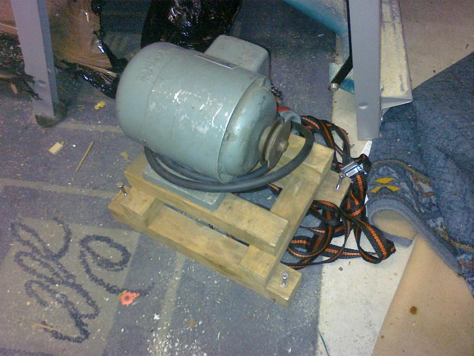

Heute kam dann der Herr von der Spedition und brachte eine Palette mit der Maschine
und dem Motor vorbei.

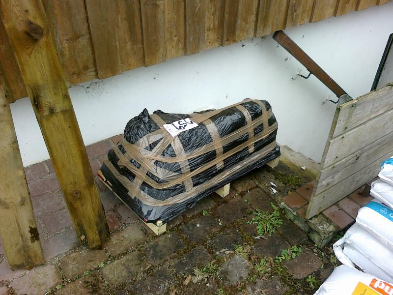

Dann musste die Palette über ein Paar Holzplanken die Kellertreppe herunter...
aber man ist ja noch jung :-)

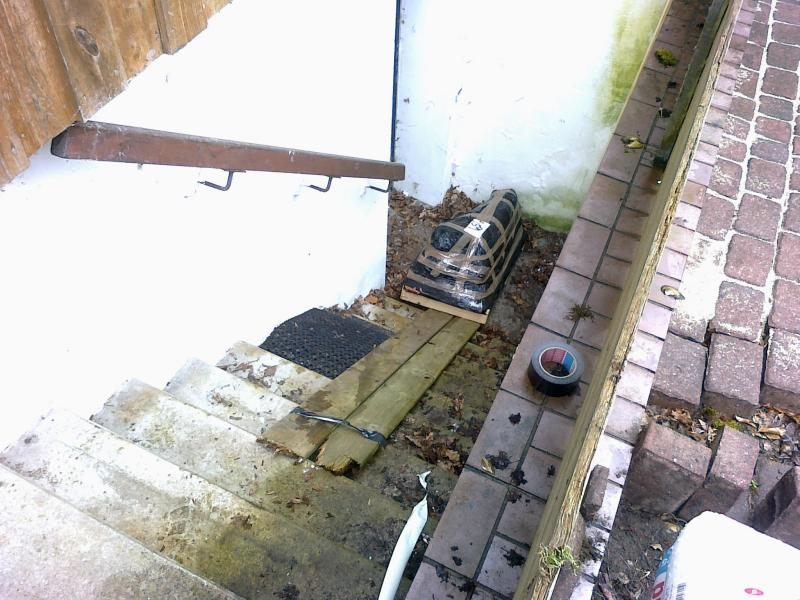

Daraufhin wurde ein kurzer Testlauf gestartet, um den Zustand der Maschine einschätzen zu können.

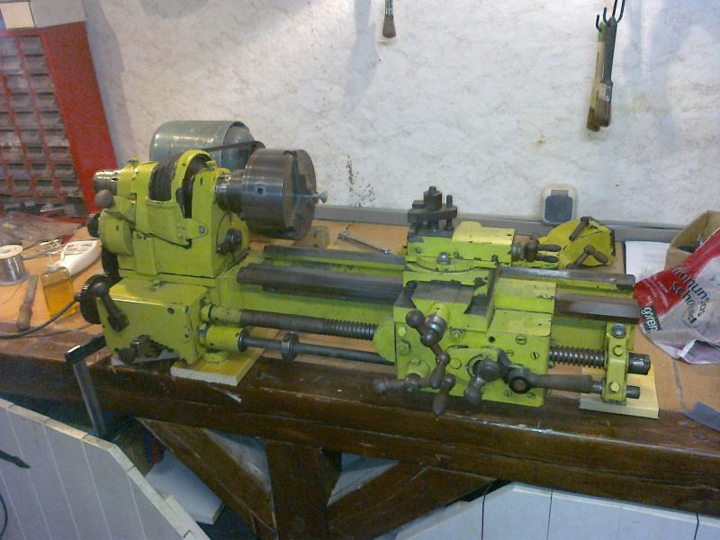

Dabei konnte ich folgendes feststellen:

 * Die Spindellagerung ist soweit in Ordnung.
 * Das Vorgelegegetriebe funktioniert.
 * Der Kreuzsupport lässt sich einwandfrei bewegen.
 * Der Reitstock ist stark exzentrisch (mehrere mm) eingestellt.
 * Das Dreibackenfutter (135mm) läuft nicht rund.
 * Der mitgelieferte Keilriemen passt nicht zu den Riemenscheiben im Spindelstock.
 * Das Vorschubgetriebe inkl. Wendeherz funktioniert bis zum Getriebekasten.
 * Die Zahnräder im Getriebekasten vorne am Spindelstock sind leider zum grossen Teil verschlissen.
 * Leit- und Zugspindel lassen sich noch drehen.
 * Auf der Zugspindel sitzt ein Anschlag, der, wenn der Support dagegenfährt, die Zugspindel automatisch auskuppelt (sehr praktisch :-).
 * Im Schlosskasten fehlt das Zahnrad, das auf der Planspindel sitzen müsste um den automatischen Planzug auszuführen.
 * Die Schlossmutter für die Leitspindel ist noch intakt und lässt sich leichtgängig ein- und ausklinken.
 * Der Morsekegel im Reitstock müsste nachgerieben werden. Eine passende MK2-Reibahle ist aber vorhanden.
 * Das Maschinenbett ist in einem guten Zustand und wurde schon vom Flugrost befreit.

Ich denke mal, dass das eine Basis ist, von der aus man die Maschine restaurieren kann.

Hier kommen noch ein paar Detailaufnahmen.

Der Schlosskasten:

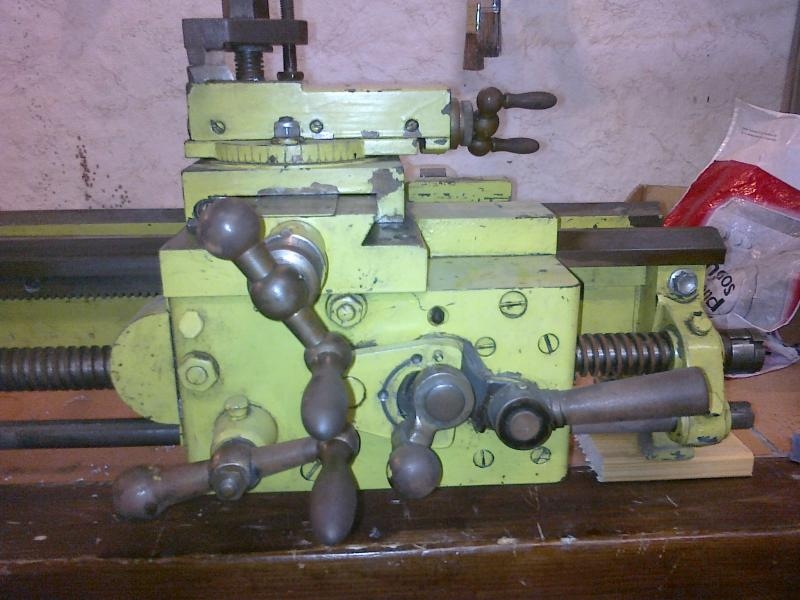

Der Hebel mit dem Knubbel schaltet zwischen (oben) Längs- , (unten) Planzug über Zugspindel und (mitte) Leitspindel um.

Der Spindelstock:

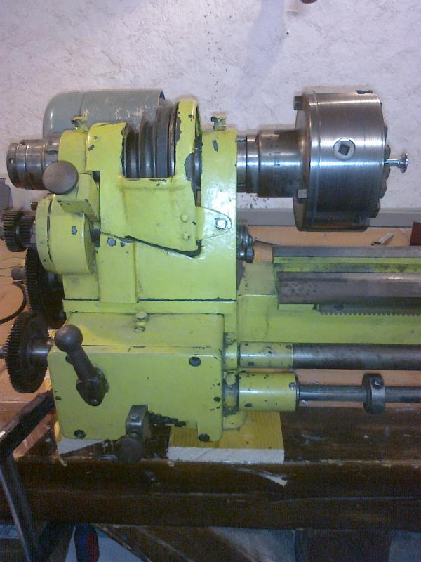

Die Wechselräder:

Mehr waren leider nicht dabei :-(

Alsdann ging es auch schon mit dem Auseinandernehmen los.
Ich habe die einzelnen Schritte nicht sehr detailliert fotografiert,
weil ich zu sehr mit dem Bewundern der Maschine beschäftigt war... :-)

Das Maschinenbett (noch mit Spindelstock):

Der erste Schwung an Einzelteilen, u.a. Leit- und Zugspindel, Getriebekasten, Dreibackenfutter, Kreuzsupport, Reitstock, Wechselräder:

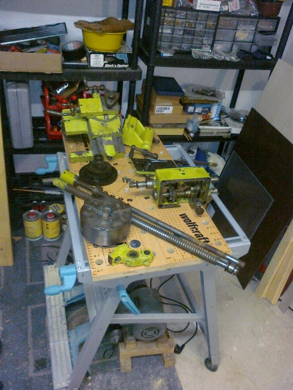

Der zweite Schwung an Einzelteilen: s.o. und Vorgelegegetriebe, Wendeherz, Abdeckung für Vorgelege:

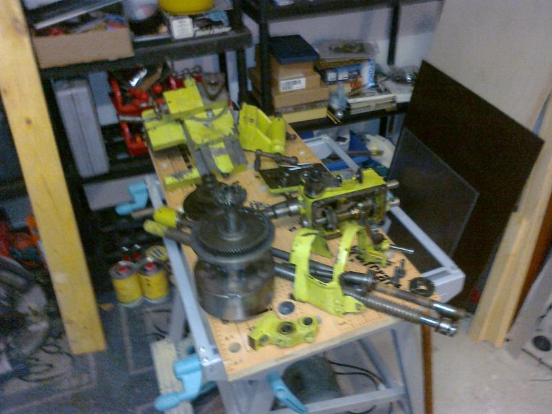

Innenansicht des Schlosskastens:

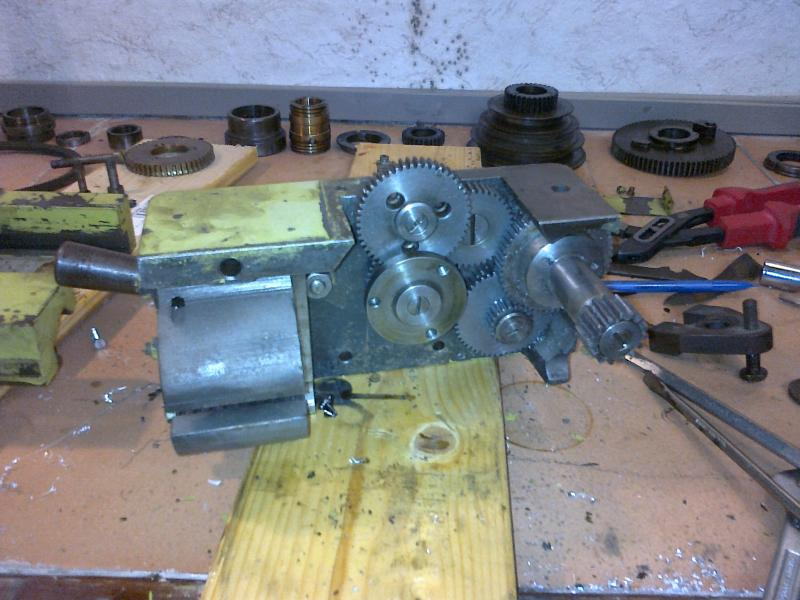

Das hintere Zahnrad (mit der grossen Schlitzschraube) wird mit dem Knubbelhebel
nach oben, mitte oder unten geschwenkt und treibt so entweder den Längs- oder Planzug an.
Der Hebel an der linken Seite dient zum Schließen der Schlossmutter.
Im Hintergrund (an der Wand) erkennt man die Einzelteile der Spindellagerung.

Zum Abschluss noch ein paar allgemeine Infos:

Kenngröße                             |    Kennwert
--------------------------------------|--------------------------------------
Spitzenweite                          | ~400mm
Spitzenhöhe                           | ~110mm
Verfahrweg Support                    | ~230mm
Verfahrweg Planschlitten              | ~100mm
Verfahrweg Oberschlitten              | ~75mm (sollte fürs Drehen eines MK2 ausreichen)
Untersetzung durchs Vorgelegegetriebe | 32/76 * 32/76 (also ungefähr 250 Upm bei 1400 Upm an der Riemenscheibe)
Leitspindelsteigung                   | ??? mm (Modul 2)
automatischer Vorschub                | ??? mm/U (3*6 Stufen im Getriebekasten + Wechselräder)
Spindeldurchlass                      | ~20mm
Pinolenhub vom Reitstock              | ~60mm
Gesamtmaße der Maschine (BxHxT)       | ~ 900 x 400 x 400 mm
Gesamtmasse der Maschine              | ~50kg (liess sich per Muskelkraft auf den Tisch heben...)

Ich habe leider keine Angaben zum Hersteller auf der Maschine gefunden.
Sie scheint jedoch mal grau mit roter Grundierung lackiert gewesen zu sein,
bevor ihr jemand dieses schreckliche grün antat.
Grau (RAL 7031) soll sie auch wieder werden!

Ich habe eine Maschine mit dieser Ausstattung (Leit- und Zugspindel, Schaltgetriebe
für Vorschübe, Vorgelegegetriebe, automatischer Längs- und Planzug, getrennte Führungen
für Support und Reitstock, etc.) vorher noch nie in dieser Grösse gesehen.
Das war auch der Grund, warum ich sie kurzentschlossen und unter Missachtung
aller anderen anstehenden Projekte  gekauft habe.

Ich werde hier, soweit ich dazu komme, die Restauration dokumentieren.

Für die Maschine habe ich etwa 400€ plus Versand bezahlt.
Die Maschine stammt aus dem Schwarzwald und wurde per Spedition geliefert.
Ich denke, das ist angemessen.
Ich weiß, dass ich mir zu dem Preis eine Chinadrehe hätte
anschaffen können. Ich wollte aber eine Maschine, die
Charakter hat.

Die Führungen sehen noch nicht sehr abgenutzt aus, teilweise
sieht man noch die Spuren vom Einschaben.

Die Spindellager machen auch einen guten bis sehr guten Eindruck.
Man sieht zwar, dass die Maschine gelaufen ist, aber größere Riefen,
wie etwa von Lagerfressern sind nicht zu sehen. Die Ölschwämme(?)
unten in den Spindellagern waren auch noch gut mit Öl getränkt.
Ich denke nicht, dass ich dort allzu viel zu machen haben werde.

Die Zahnräder im Schlosskasten haben Modul 1 mit gängigen Zähnezahlen;
ich denke, dass ich die größtenteils ersetzen werde.
Die Zahnräder im Getriebekasten muss ich nochmal ausmessen;
ich tippe dort auf Modul 0.7 oder 0.5. Die sollte man also auch
nachbekommen.

## Spindelstock und Lackauswahl (2012-04-05)

Ich habe inzwischen geschafft, den oberen vom unteren Teil des Spindelstocks
zu trennen und auch das Bett vom Spindelstock abzuschrauben.

Dabei fiel mir die interessante Lösung für die Ausrichtung des Spindelstocks auf:

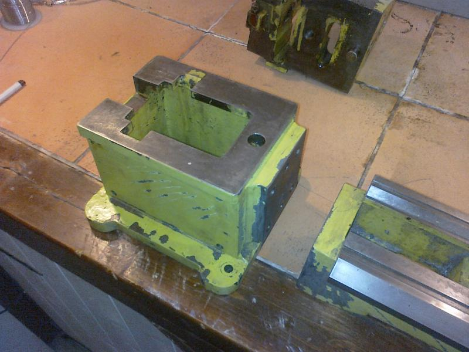

Im oberen Teil des Spindelstocks steckt ein Zapfen, der auf Höhe der rechten
Spindellagerung im unteren Teil des Spindelstocks sitzt.
Auf Höhe des linken Spindellagers ist dagegen im unteren Teil des Spindelstocks
eine Nut, in der eine Schraube sitzt, die durch einen Ansatz am oberen Teil
des Spindelstocks geschraubt ist.
Dadurch kann man durch Verdrehen der Schraube die Parallelität der Spindel
und des Maschinenbettes sehr gezielt vornehmen.

Als nächstes geht es an das Entlacken.
Der hellgrüne Lack lässt sich relativ gut mit einem Spachtel runterschaben;
der daruntersitzende alte Lack (grau) lässt sich mit Aceton
einfach herunterwaschen.

In der Zwischenzeit überlege ich mir schon mal die spätere Lackierung.
Ich werde mich dabei wahrscheinlich an diesem
Thread aus einem anderen Forum orientieren:

http://www.diy-community.de/showthread.php?24682-Restauration-einer-Weiler-LZ-280/page6

Die Farbe (RAL6011) gefällt mir besser als das ursprüngliche Grau (wahrscheinlich RAL7031).

Ich habe bis jetzt schon den Spindelstock und ein paar Kleinteile
entlackt. Morgen kommt dann das Bett dran und dann werde ich
schon die ersten Teile lackieren.
Ich habe mir dazu eine Mischung aus ca. 4 Teilen Nitro-Verdünnung,
5 Teilen Aceton und 1 Teil Terpentin-Ersatzt angerührt.
Das habe ich dann in ein altes Marmeladenglas gefüllt und die Teile dazugetan.
Nach ein paar Stunden pellte sich der Lack wunderschön ab und ließ sich
bis auf den letzten Rest mit einer Stahldrahtbürste abbürsten.
Eine Atemschutzmaske ist dabei selbstverständlich.

Für die größeren Teile (Spindelstock, Support, Schlosskasten) habe ich
die Giftmischung in einen innen lackierten Blumentopf gegossen
und den dann mit einer Plastiktüte, die sich erstaunlicherweise nicht aufgelöst hat,
abgedeckt. Offenbar reichten die Dämpfe schon aus, um den Lack anzulösen,
denn auch oberhalb des "Giftspiegels" löste sich der Lack an.

Bei den größeren Flächen habe ich dann mit der Handdrahtbürste die Lackreste
abgeputzt, in den Ecken hat mir mein Dremel mit runder Stahldrahtbürste sehr geholfen.

Eben sah ich das folgende Bild auf eBay:

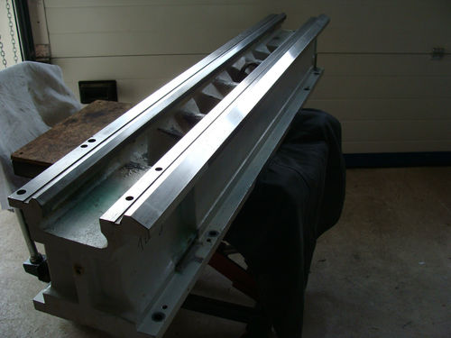

Auch bei meiner Maschine ist das vordere Prisma, auf
dem der Supportschlitten läuft, nach vorn flacher
als nach hinten. Auch bei meiner Maschine ist die
innere Führung (für den Reitstock) "normal", also
der prismatische Teil symmetrisch.
Kennt jemand noch andere Maschinen,
bei denen die Führung asymmetrisch ist, ausser welchen von Weiler?
Ich weiß, dass das noch kein Beweis ist, dass meine Maschine
eine Weiler ist, aber zumindest ein Ansatz.

Ich habe inzwischen entdeckt, dass diese Bauart wohl bei Maschinen dieses Alters üblich war,
und zwar aus folgendem Grund:
Da die Betten noch ungehärtet waren, sollte die Fläche, die die meiste Presskraft durch den Schnittdruck
aushalten musste (und mit automatischem Vorschub auch noch unter dieser Last verfahren werden sollte)
möglichst groß sein. Deshalb hat man das Prisma geneigt. Scheint also eher normal zu sein...

Das Bett und die Masse der Kleineteile ist inzwischen zum Lackieren vorbereitet.

## Vorbereitungen zum Lackieren (2012-04-14)

Nachdem ich nun lange Zeit mit dem Entlacken beschäftigt war,
gibt es heute mal weider ein paar Bilder vom Projekt Drehmaschine.

Hier sieht man die Teile, die demnächst lackiert werden sollen.
Ich habe sie schon mal abgeklebt und in den Heizungskeller gelegt,
damit sie sich ein bisschen aufwärmen (in der Werkstatt ist es kalt genug).

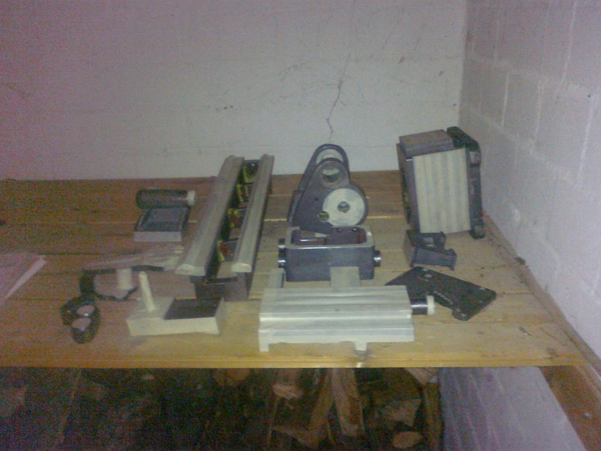

Ich habe mich doch nochmal zurückentschieden zu 2K-EP-Lack von Mipa.
Also wird die Maschine mit RAL6011 lackiert.

Des weiteren habe ich mir mal das Dreibackenfutter vorgenommen.
Innen fanden sich einige Späne an und eingeölt werden musste es auch mal wieder.

Ansonsten habe ich mir noch die zahlreichen Kleinteile vorgenommen und
sortiert, tw. schon entrostet und wieder neu eingeölt.

## Lackieren (2012-04-17)

Mit Mipa EP Grundierfiller:

Die Maschinensäule in diesem Bild gehört zu meinem ersten großen
Maschinenbauprojekt, einer kleinen Fräsmaschine:

Das Ganze in grün (Mipa EP Decklack halbglanz RAL6011):

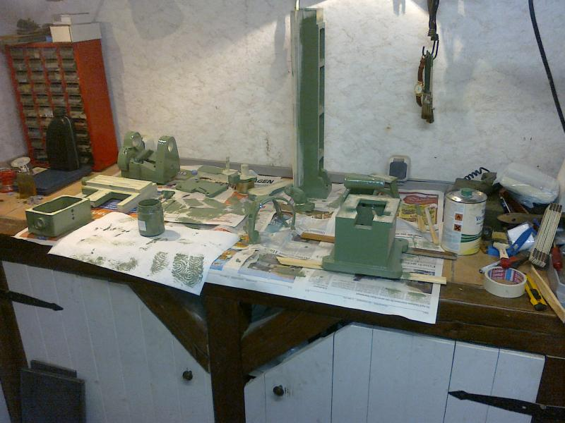

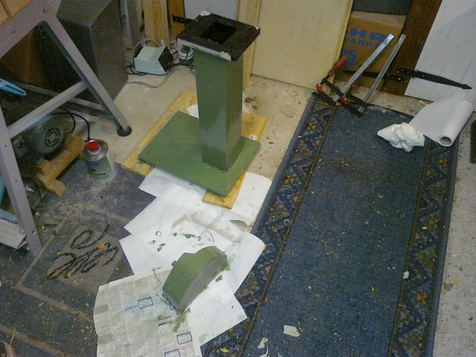

## Kippeliger Bettschlitten (2012-04-30)

Ich habe die Maschine inzwischen wieder so weit zusammengebaut,
dass man schon wieder erste Späne machen kann. Im Vorschubgetriebe
müssen noch ein paar Zahnräder erneuert werden; ich hoffe, dass ich das
schon mit dieser Maschine "von Hand" machen kann.

Allerdings sind nun auch ein paar Probleme deutlich geworden:

1.)
Der Support hat merkliches Spiel auf dem Maschinenbett:

Hier ist der Support in rot gezeichnet und die Gleitleiste (?) in grün.
Meine Idee wäre, ein paar Zehntel vom Support unten abzufräsen.
Dann könnte man mit Unterlagfolien zwischen Leiste und Support
das Spiel sehr genau einstellen.

2.)
Die Spindellagerung lässt sich einstellen.
Wenn ich die Lagerung so einstelle, dass die Spindel
vom Motor (0,37kW) noch angetrieben werden kann, hat sie mehr als 3/10 Spiel.

Wenn ich die Lagerung so einstelle, dass ich weniger als 1/10
Spiel habe, schafft der Motor es nicht mehr, die Spindel zu drehen.
Das Lagerspiel habe ich dabei gemessen, indem ich eine Stahlstange ins
Futter gespannt habe, mit der Messuhr dagegen gefahren bin und dann
am Ende der Stange gedrückt habe. Natürlich beigt sich dabei auch die Stange,
aber es ist deutlich zu sehen und zu spüren, dass die Spindel im Lager wackelt.
Während das Spiel in x-Richtung (vorn-hinten) sich auf ein paar 100stel einstellen lässt,
klappert die Spindel beim Wackeln von Hand in y-Richtung(oben-unten).
Gemessen habe ich hier ein Spiel von ~12/100.

Dabei ist mir dann auch Problem 3.) aufgefallen:
Das Futter spannt nur noch im hinteren Teil; vorn sind zwischen Werkstück
und Backe bis zu 2/10 Luft. Das sollte allerdings durch Ausschleifen zu beheben sein.

## Zusammenbau (2012-05-24)

Im Moment tritt das Projekt ein bisschen auf der Stelle,
weil ich es einfach nicht hinbekomme, die Spindellagerung
vernünftig einzustellen. Entweder sitzt sie so lose dass bei
niedrigen Drehzahlen ein zu großes Spiel auftritt und die
Maschine schon bei 1/10 Spanabnahme rattert wie verrückt,
oder ich stelle es zu fest und die Spindel sitzt beim Abschalten des Motors fest.
Schwieriges Unterfangen...

Na ja, hier noch ein paar Bilder vom aktuellen Zustand:

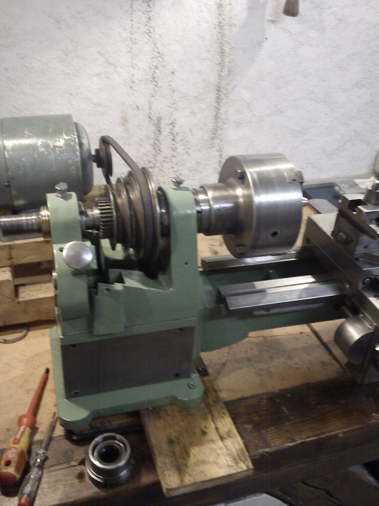

Ich habe beim Drehen der Spindel das Gefühl, dass sie krumm sein müssten,
weil sie in einem Bereich merklich schleift und sonst leicht läuft.
Ich vermute, dass das vordere Lager u.a. deshalb dermassen ausgenudelt war.
Sollte ich jetzt eine neue Spindel drehen? Material- und Maschinenmäßig
wäre das kein Problem, aber vielleicht habt ihr ja andere Ideen...

Der Bettschlitten läuft jetzt (nach dem Abfräsen) übrigens
butterweich und dank einer Unterlegorgie mit Alufolie-Streifen
auch ziemlich spielfrei. Leider klemmt er im vorderen Bereich
(wo im Moment das Futter drüber sitzt. Beim Arbeiten mit Spannzangen
könnte das ein Problem werden.
Im Moment ist aber erstmal die Spindellagerung wichtiger.

Ich habe den Motor neu gelagert mit SKF-Lagern 6002-ZZ.
Die alten Lager waren offen und mit einer Metallstaub-Fett-Drecksschicht
dermaßen zugekrustet, dass der Motor im Betrieb sich sehr unschön anhörte.
Jetzt mit den neuen Lagern und mit FU schnurrt der wie ein (großes) Kätzchen :-)

Da sich die alten Bronzelager auch nach dem Ausdrehen nicht
spielfrei (<1/10mm) einstellen liessen, habe ich jetzt beschlossen,
Kegelrollenlager einzubauen, und zwar 32006 (30x55x17) als vorderes
und 30205 (25x52x16.25) als hinteres Spindellager.

Des weiteren will ich die Keilriemenscheibe, die beim Betrieb mit Vorgelege
vorher auf der Haputspindel lief jetzt mit Nadellagern vom Typ HK3016 (30x37x16)
auf der Spindel lagern.

Ich habe mich hauptsächlich für den Umbau entschieden,
weil beim Direktteilen auf der Drehbank
ein Gleitlager prinzipiell nicht geeignet ist, da es nur bei ausreichender Drehzahl
spielfrei durch den Ölfilm ist.

Die axiale Lagerung der alten Spindel besteht in einer
Reiblagerung von dem Bund an der Spindelnase auf der nebenliegenden
Lagereinstellmutter (komisches Wort ...). Das umzubauen, und dabei die
Gleitlager zu erhalten ist mir zu kompliziert. Dann lieber richtig.

## Motorhalter (2012-06-21)

Leider gibt der Motor keinen genaueren Aufschluss darüber, wo die Maschine
herkommen könnte, da er nicht der Originalmotor ist. Der mitgelieferte Riemen und die
Riemenscheibe auf dem Motor passen zwar zusammen, aber nicht zur Drehmaschine.
Ausserdem war der Motor bei Lieferung auf ein Holzgestell geschraubt, das
ganz sicher nicht zum Originalzustand dazugehört.

Um eben dieses Holzgestell entsorgen zu können, habe ich heute auch weitergebaut:
ein neuer Motorhalter ist es geworden.

Es beginnt alles ganz einfach mit einer alten Platte, die ich mal aus irgendeiner Maschine
vom Schrott ausgebaut habe:

Die wird noch schell parallel gefräst, damit ich sie flach in den Schraubstock spannen kann,
um den Zwischenraum der "Lager"klötze auch parallel auszufräsen.

Gesagt, getan und es geht weiter mit dem Rohmaterial für den Halter, der an die Maschine
geschraubt wird.

Erstmal ein bisschen Rohmaterial ablängen und planen:

Dann abstechen:

Ein bisschen planfräsen:

Und mit zwei Stahlstücken zusammenschweissen:

Ich habe dann noch 4 8.5mm-Löcher in die Ecken der Grundplatte zur Befestigung gebohrt
und in die Hülse oben zwei M5-Gewinde geschnitten, um die unten zu sehende Stange festzusetzen.

Ohne Bilder entstand dann noch eine kleine Hülse, die ebenfalls mittels einer Querbohrung M5
auf der Stange festgesetzt werden kann und genau in den geradegefrästen Bereich
zwischen den Lagerklötzen an der Motorplatte passt.

Zusammengebaut sieht das dann an der Maschine so aus:

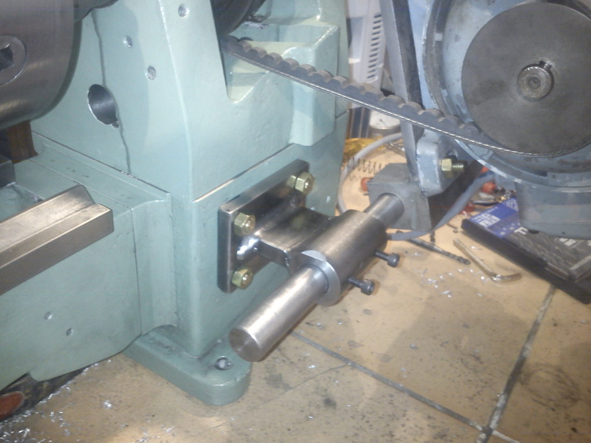

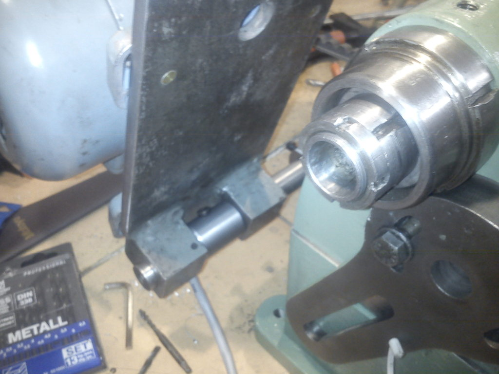

Gespannt wird der Riemen im Moment noch durch das Gewicht des Motors;
wenn ich wieder weiterbaue wird das aber noch geändert.
Ich dachte dabei an folgendes:
Zwischen dem Loch, das in der Motorplatte oben drin ist, und einer Lasche,
die ich am Spindelstock festschraube, setze ich eine Spannschraube;
diese Spannschraube hat als Kopf eine Kugel, die im Loch am Motorhalter sitzt
und das Gewinde geht durch ein Loch in der Lasche, an der sich die Schraube
mit einer Mutter (evt. mit Gummiunterlegscheibe zur Dämpfung) abstützt.
Wenn das unklar ist, kann ich gerne eine Zeichnung machen.

## Spindellager-Umbau (2012-08-13)

Heute bin ich endlich dazu gekommen, die neuen Lagersitze in den Spindelstock einzubringen.
Wie ich oben geschrieben hatte, verwende ich folgende Lager:
32006 als vorderes Lager und 30205 als hinteres Lager.

Leider ist die neue Spindel noch nicht fertig, also erstmal ein paar Bilder vom Spindelstock
mit den Lagersitzen:

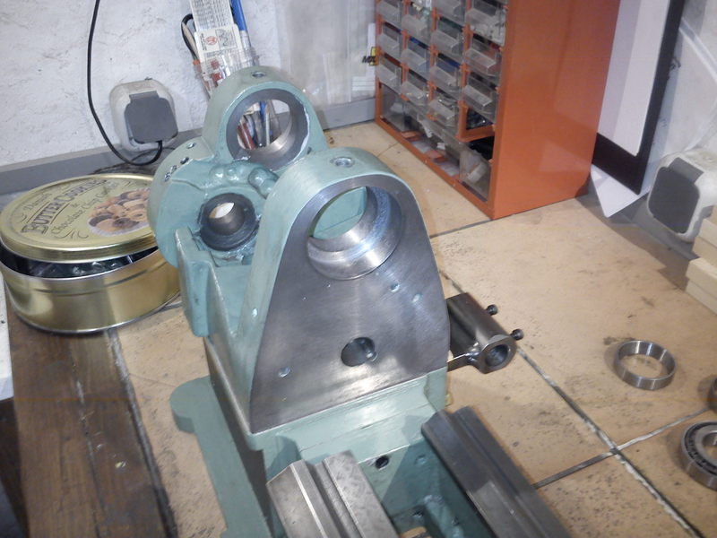

Kleine Anmerkung noch zur Fertigung:
Der Spindelstock wurde dazu auf einer großen Drehbank auf die Planscheibe
gespannt und dort ausgedreht. Als ich ihn grad aufgespannt hatte, hab ich auch
die Stirnseiten des Spindelstocks plangedreht, deshalb ist da die Farbe wieder runter.

Die neue Spindel soll als Spindelnase einen Kurzkegel 3 bekommen
und innen einen MK3 für alles mögliche andere. Bei einem hinteren Lagersitzdurchmesser
von 25mm müsste ein Spindeldurchlass von 18mm gerade noch drin sein.

Dann soll noch eine Indexvorrichtung mit wechselbaren Indexscheiben angebaut werden,
über deren Konstruktion ich mir aber noch nicht ganz im klaren bin.
Der einzige Ort wo man meiner Meinung nach so etwas sinnvoll an dieser
Maschine anbringen kann ist aussen neben dem hinteren Spindellager.

Ich hatte dann noch eine bebilderte Mail an Tony von lathes.co.uk geschickt, aber
bis heute noch keine Antwort bekommen. Falls jemand noch Hinweise oder Ideen
zur Herkunft dieser Maschine hat, wäre ich dafür sehr dankbar.

## Erste Drehversuche (2012-09-13)

Gestern hatte ich Gelegenheit, die alte Spindel mal ein bisschen zu misshandeln, damit sie in die neuen Lager passt:

Tja, was soll ich sagen: Ich bin maßlos begeistert von den neuen Lagern:
Spanbreite von 8mm bei Alu, Einstechen am Umfang: kein Rattern
Spanabnahme 1mm bei St37, "Schruppen" am Umfang längs: kein Rattern
Bronze schruppen, schlichten am Umfang: kein Problem, spiegelglatte Oberfläche.

Hier mal ein Bild von einer geschlichteten Stahloberfläche:

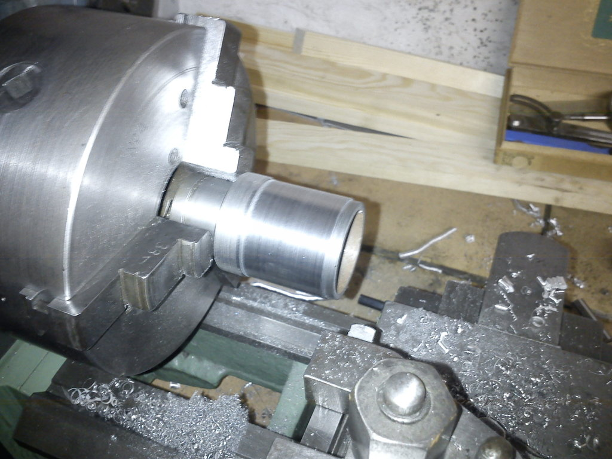

Mit den alten Langern war das mMn definitiv nicht drin.

Späne kann man mit der Maschine also machen:

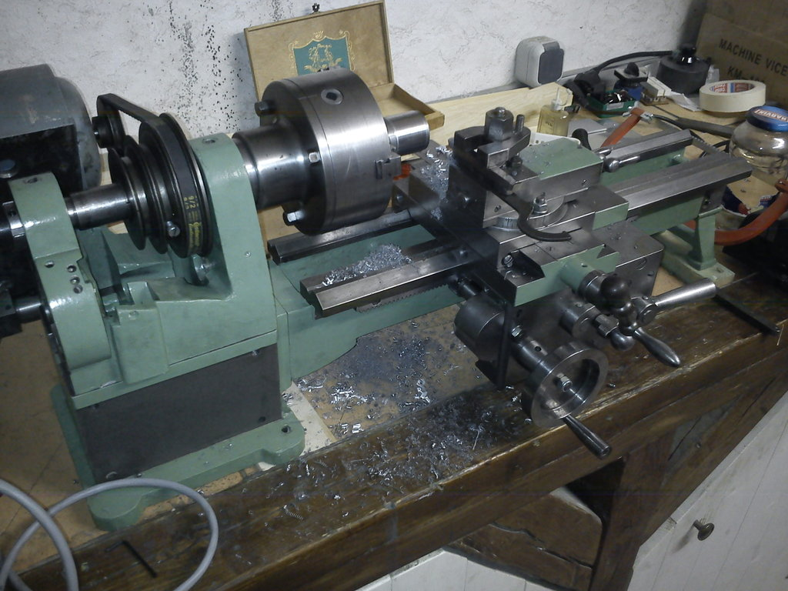

Da ich nun in der Lage bin, daheim Stahl zu drehen, kann ich endlich (!!!) die benötigten Kleinteile machen,
die das Vorschubgetriebe so dringend für den Zusammenbau braucht. In der Werkstatt,
in der ich den Klopp restauriert habe, war da irgendwie nie Zeit zu...

Hihihi, ich freu' mich !!!

## Umzug (2012-11-16)

Da ich vor ein paar Wochen umziehen musste, ist meine "Kleine" nun in meine Ursprungswerkstatt im elterlichen Keller gewandert,
sodass es erst über Weihnachten, wenn ich da bin, weitergehen wird.

Vor dem Umzug hatte ich allerdings noch ein paar Sachen gemacht:
Mit einer Messuhr am Support war es möglich, eine präzise Passung auf einer Hülse aus dem Vorschubgetriebe zu drehen.
Dort habe ich dann ein passend ausgedrehtes Zahnrad aufgepresst und das Vorschubgetriebe wieder zusammengebaut.
Leider passte das Modul 0.75 des neuen Zahnrades nicht richtig zu den vorhandenen Zahnrädern im Nortongetriebe,
sodass der Vorschub leider noch nicht funktioniert...

Mein Plan ist jetzt, ein neues Vorschubgetriebe zu entwerfen und zu bauen, das auch nicht so klapprig und unpräzise
zu schalten sein soll wie das jetzige; selbst, wenn die Zahnräder passen würden, hätte die Ratsche so viel Spiel,
dass die Zahnräder überspringen könnten :-(

Ausserdem wird es nötig sein, eine neue Hauptspindel zu drehen, weil die jetzige keine Zentrierpassung am Ende
des Gewindes hat und daher das Futter locker mal 0.5 ... 1 mm exzentrisch draufsitzt.

Allerdings ist es zuletzt mit den neuen Spindellagern möglich gewesen, ratterfrei echt nette Oberflächen zu drehen :-D

## Benutzung (2013-11-06)

Die Fotos sind schon etwas älter, hier sind mal ein paar aktuellere:

Es ist jetzt ein 100er Röhm-Futter montiert, das ich in der Zwischenzeit bekommen habe. Da die Spindel eh neu soll,
hab ich am alten Flansch "nur mal schnell" den Zentrierbund kleiner gedreht und den jetzt nicht aufwendig überarbeitet.

Ein neuer Spindelstock ist in Planung.
Ich lasse einfach mal das CAD sprechen:

Verschiedene Neuerungen:
1. Hauptspindellagerung durch X-angeordnete Kegelrollenlager als Festlager, Loslager mit RiKuLa
2. kein Wendeherz, sondern Schieberadgetriebe mit Keilwelle
3. Ölsumpfschmierung, auch für Lager
4. Teileinrichtung durch 60Z-Zahnrad auf Hauptspindel (eig für Vorschub) mit Rastbolzen
5. KK3 als Spindelnase
6. MK3 Innenkegel für weitere Vorrichtungen/Werkzeug
7. Kastenform --> mit Seitenwänden nimmt der Spindelstock die Bearbeitungskräfte besser auf als wenn der als U gegossen ist (nur der vordere Schenkel leitet die Kraft ab; ausserdem biegt die Lagervorspannung die Schenkel zusammen --> Lager werden winklig belastet --> (schneller) kaputt)
8. neue Spindel gehärtet und geschliffen --> bisschen präziser und verschleißfester (Futterwechsel etc) usw.

Wer Interesse an den Zeichnungen (Inventor 2009) hat:

[Spindelstock_2013-10-25.zip](Spindelstock_2013-10-25.zip)

die Spindeln haben Trapezgewinde, Planzug links, Oberschlitten rechts.
Die werde ich erstmal nicht auswechseln, weil ich dann den ganzen Schlosskasten
gleich mit machen wollen würde. Sind auch noch halbwegs ok; wenns genau sein muss,
papp ich halt ne Messuhr an den Schlitten.

Da das Wechselradgetriebe ja eine neue Übersetzung von der Hauptspindel bekommt, muss
ich mir auch das Vorschubgetriebe neu ausdenken (ist sowieso defekt), um da vernünftige Vorschübe
und Gewindesteigungen rauszubekommen. Dabei mache ich dann gleich noch den Schlosskasten,
weil die Rastung des Plan- und Längszuges mir absolut nicht gefällt (man klemmt sich sehr leicht die Finger).
Mit den neuen Spindeln kann ich dann gleich die Übersetzungen ordentlich berechnen.
Als Skalenringe schweben mir welche a la Schaublin vor, richtig schön groß und matt verchromt...

"Kommt noch..."
