## Klopp 550

Heute hat es auch bei mir geKLOPPt.
Weil ein Projekt ja nicht genug ist und durch
die nette Vermittlung von mechanobernd bin ich in den Besitz eines Klopp 550
Schnellhoblers gekommen:

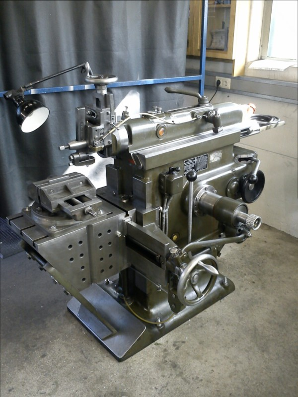

Aber der Reihe nach...

Beim Einladen in den Transporter:

Netter Mitfahrer; ich hab aufgehört zu zählen, wie oft ich als Beifahrer nach hinten geschaut habe:

Er stammt aus BW-Beständen, ist daher oliv gemalert und stand wohl einige Zeit nur rum,
daher fand sich auch eine dicke Staubschicht auf den Führungen etc.
Die Stösselführungen weisen nach eingehender Untersuchung, die in den nächsten Tagen
natürlich noch fortgeführt wird, leider doch ein paar Verschleisserscheinungen auf.
Ein Glück sind grad in SH Semesterferien, sodass ich die nächsten zwei Wochen
nonstop an der Maschine arbeiten kann.

Heute habe ich schon die "kleineren" Anbauteile (Schraubstock, Stosskopf, Klapperbox, Lampe,
Handräder, etc.) abgebaut, um sie einzeln in Ruhe zu säubern und einzustellen.

Diese Maschine wird erstmal nicht lackiert; der Originallack ist noch relativ gut erhalten und
gibt der Maschine eine richtig schöne Patina :-D

Hier ist der Hobler schon halb zerlegt zu sehen:

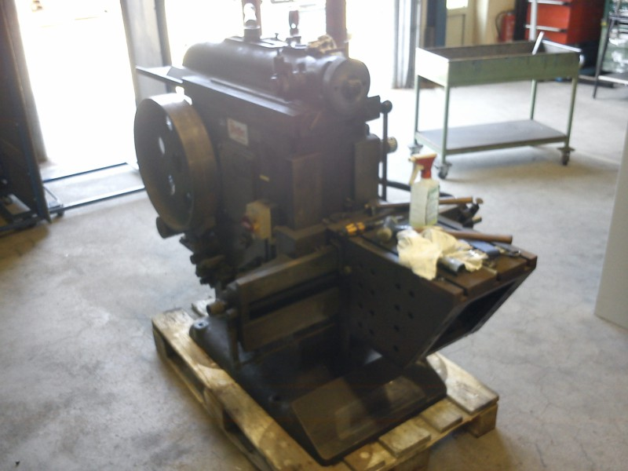

Noch eine schöne Seitenansicht:

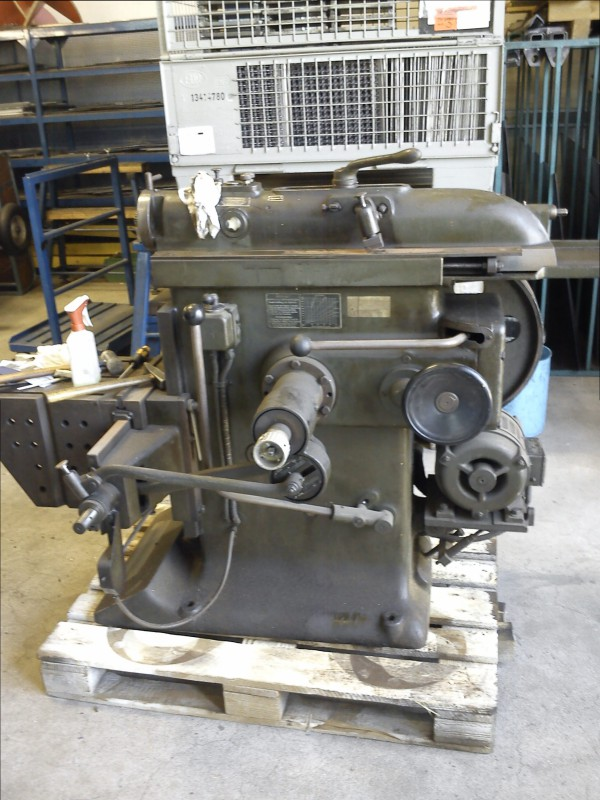

Und noch die vordere Stösselführung:

Leider fehlten die vorderen Abstreifer bzw. die Lederstücke darin und der Hobler ist damit
offensichtlich auch einige Zeit gelaufen. Auf dem Grund der Stösselführung sind daher recht
"schöne" Riefen zu sehen (Fotos kommen morgen).

Zuerst habe ich heute morgen das Öl (ca. 30l) mit einer Handpumpe, wie in der Anleitung beschrieben, abgepumpt:

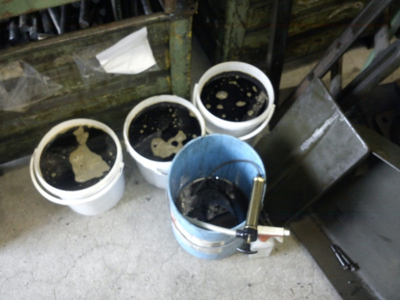

Dann kam ich an das untere Ende der Schwinge dran und konnte die Achse, auf der die Schwinge unten
geführt wurde, austreiben. Die Schwinge konnte dann in den Sockel weiter herabgelassen werden, sodass sich dann
auch der Stössel ausbauen liess.

Dadurch wurde der Blick auf das Kulissenrad frei; die Hubweiteneinstellung sieht aber noch sehr gut aus:
weder Verschleisserscheinungen (Schabemuster noch vollständig vorhanden) noch Spuren grösserer Kollisionen.

Durch den abgenommen Stössel konnte ich auch die Stösselführung in der Mitte untersuchen.
Hier finden sich relativ starke Freßspuren. Leider habe ich weder die Zeit noch die Fähigkeit, diese Führung
nachzuschaben. Ich hoffe, dass mit ordentlicher Schmierung (der Ölvorrat im Stössel war _trocken_)
und nach Egalisierung der Riefen mit bisschen Schmirgelleinen der Hobel noch lange hält.
Wenn man erstmal weiß, wie man den Stössel ausbaut,
kann man das auch später wieder machen, wenn mehr Zeit zur Verfügung steht.

Dann habe ich das Öl aus dem Getriebe abgelassen und es geöffnet.
Die Zahnräder sehen alle noch super aus, im Öl waren auch nur wenige Späne zu finden.
Die dürften aber eher von den ehemaligen Werkstücken als der Maschine stammen.

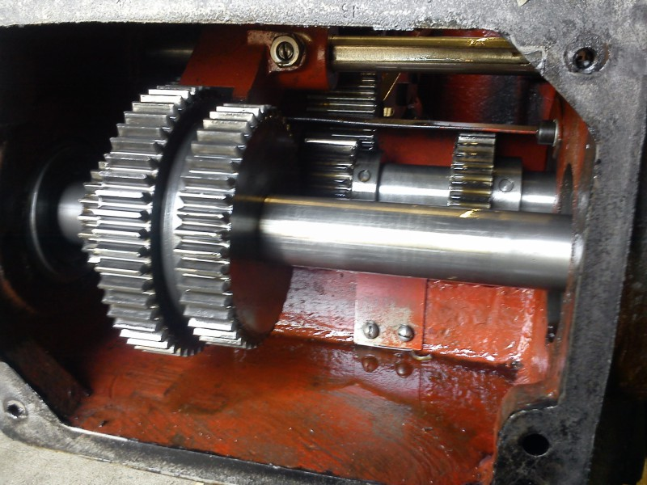

So sah die Maschine dann aus:

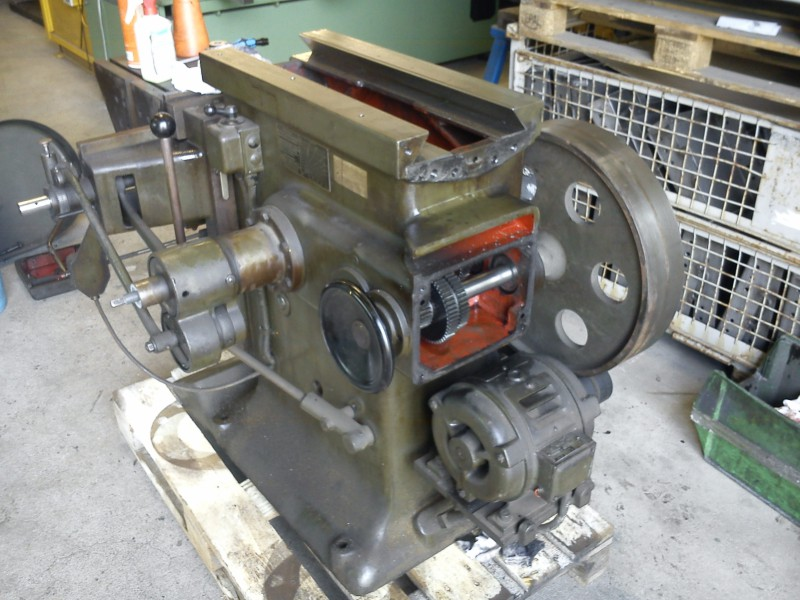

Dann wurde das große Schwungrad blankgeschmirgelt und abgezogen.
Dazu fehlte leider ein passender Abzieher, sodass er schnell improvisiert wurde:

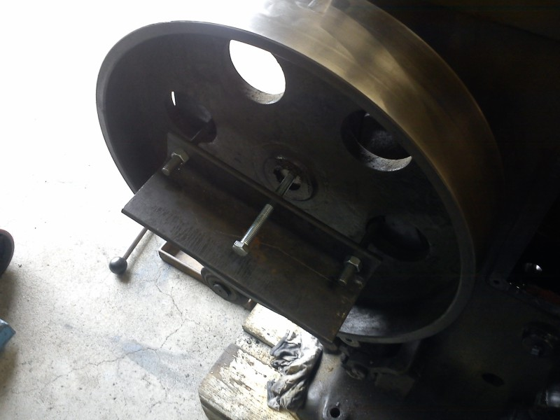

Ohne Schwungrad sah der Wellenstummel folgendermaßen aus:

Dabei fiel dann auch der Augenschein auf folgendes schmutzige Detail:

Hier noch ein Bild von der Ratsche für den Horizontalvorschub.
Das Zahnrad scheint glücklicherweise kaum abgenutzt zu sein.

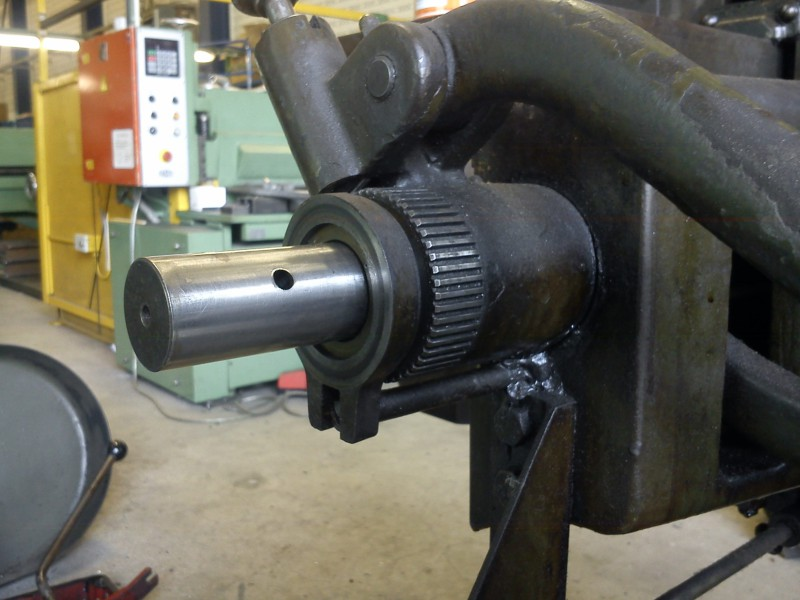

Neue Lager für das Getriebe sind schon gekauft und werden mit neuen Simmeringen morgen eingebaut.
Die alten rasselten schon zum Fürchten.
Leider steht auch noch der Ekeligste Teil der Reinigung auf dem Plan, und zwar der Ölsumpf unter der Schwinge.
Den gröbsten Schmodder habe ich zwar schon rausgeschaufelt, aber es ist immer noch was drin.

Die Betriebsanleitung schreibt "SHELL Vitrea Oel 100, 68 c St (9E) 50°C" vor.

Zuerst habe ich mich mit Widerwillen daran gemacht, die Maschine äußerlich weiter zu putzen.

Noch größer wurde der Widerwillen als es dann an das Innere ging.
Hier mal ein Bild von vorher:

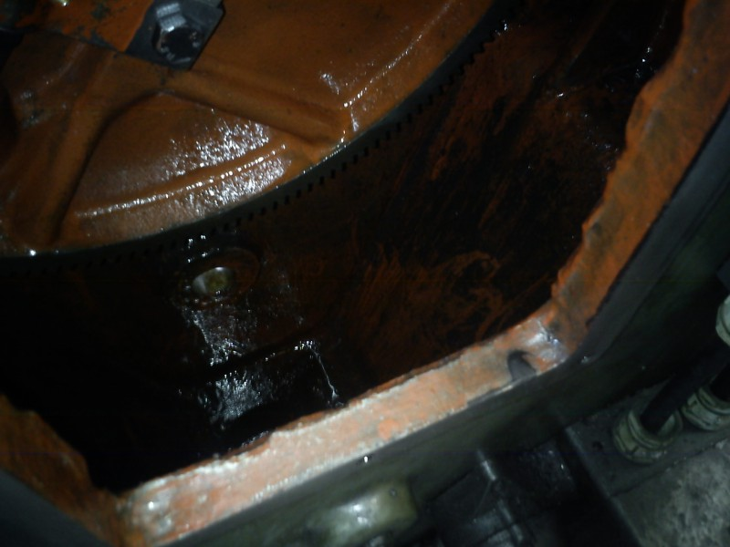

und nachher:

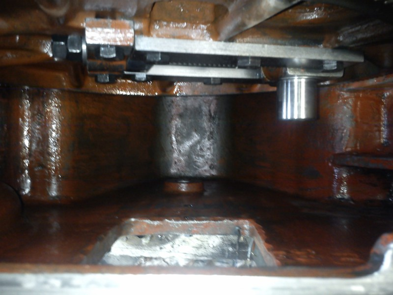

Die immer noch vorhandenen Flecken sind Guss, der unter der abgeblätterten Farbe rausschaut.
Lose Stückchen sollten jetzt nicht mehr in der Maschine sein und auch der ganze Schmodder ist endlich raus.

Dann habe ich weiter das Getriebe zerlegt, um hier neue Lager einzubauen. Es handelt sich dabei um 4 Stk. des Typs 6307 (80x35x21).
Gleichzeitig werden sie Simmeringe, die die Schwungradwelle abdichten, erneuert.
Leider bekomme ich die zweite Getriebewelle nicht raus, da die Zahnräder mit Kegelstiften verstiftet sind und ich
die Stifte nicht herausbekomme. Ich versuche es ganz sicher zur richtigen Seite (mit dem Meßschieber nachgemessen), aber da rührt
sich auch nach Anwendung von WD40 und Caramba nichts. Geklopft wurde auch schon mit einem Vorschlaghammer.
Morgen will ich es nochmal mit Wärme und einem extra angefertigten Austreiber mit gehärteter Spitze versuchen.

Zum Feierabend sah die Maschine dann so aus:

Der Aufspanntisch bietet übrigens eine hervorragende Abstellfläche für viel benötigtes Werkzeug und bereits
rausgerissene Teile. Hier sieht man z.B. das verschiebbare Dreifachzahnrad aus dem Getriebe:

Oben im Stößel findet sich eine kleine Kammer mit Ölschauglas.
Hier hab ich das mal angekreidet:

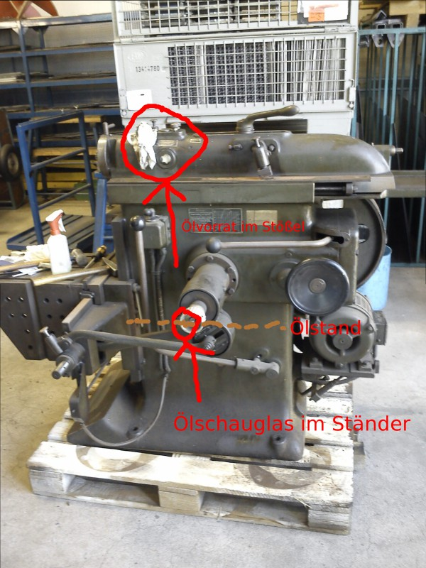

Von dort geht (durch zwei Dosierventile in Form von angespitzten Rändelschrauben, die
in die Rohröffnungen geschraubt werden können) ein gebogenes Rohr weg.
Das sind die "Ventil"-Spindeln, mit denen der Ölfluss aus der Ölkammer im Stößel zu den Stößelführungen
gesteuert wird.
Das Rohr ist also quasi
an beiden Enden am Ölvorrat angeschlossen. Ungefähr in der Mitte des Stößels kann das Öl durch
T-Stücke zur Stößelführung flie0en. In der Mitte der Rohrlänge (also ganz hinten an der Hublagenverstellung;
das Rohr ist relativ lang) ist noch ein Loch, sodass die Spindel für die HLV gleich mitgeschmiert wird.
Kompliziert zu beschreiben; hier mal ein Bild von der Unterseite des Stößels:

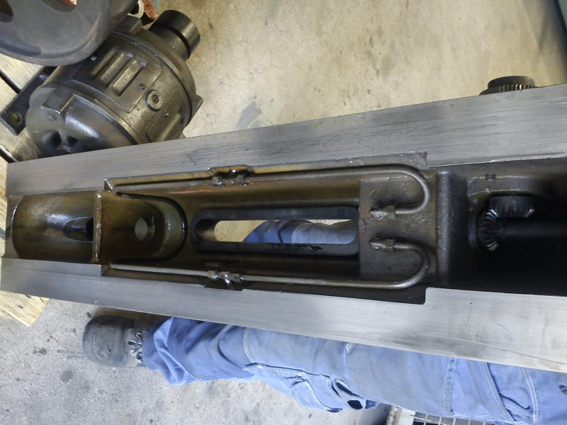

Man sieht deutlich das Rohr, das in einer Schlinge an dem Öltank angeschlossen ist, mit den T-Stücken
für die Zuführung zur Führung ( :-) ). In der Mitte der Länge des Rohres (ganz links im Bild, wo der Öltropfen am Rohr hängt)
ist noch ein Loch, aus den Öl auf die Hubverstellspindel fließen kann. Vielleicht soll da aber auch nur Luft nachgezogen werden können
oder so was ähnliches...
Schmiernippel gibt es da auch noch, allerdings nur für das Gleitlager am Ende, wo der Vierkant ist;
nicht mitten an der Spindel.

Leider ist mein Klopp scheinbar zu alt. In den neueren Versionen wird dann wohl eine Ölpumpe eingebaut sein.
Das Kulissenrad schleudert einen Teil des Öls hoch; das wird in einer Blech"rinne" aufgefangen und u.a ins Getriebe geleitet.
In der ["Betriebs- und Schmieranweisung"](Klopp_375-550.pdf), dem einzigen Dokument, dass ich zum Hobler habe, steht was
von einer Tauchschleudereinrichtung. Die Beschreibung jener stimmt ziemlich genau mit dem überein,
was ich in der Maschine vorgefunden habe.

Für den bevorstehenden Transport an den vorläufigen Aufstellort habe ich noch den Endabschalter abgeschraubt;
hier mal ein Bild vom Aufbau desselben:

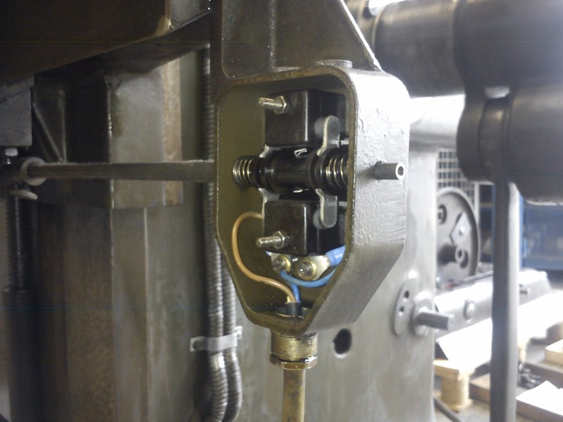

Nachdem ich gestern solche Probleme mit den Kegelstiften im Getriebe hatte und die über Nacht in dem aufgesprühtem Caramba
gebadet hatten, liessen sie sich heute mittels eines großen Hammers völlig ohne Probleme austreiben.

Damit hat sich auch schon ein ganz ansehlicher Berg Kleinteile angesammelt; hier mal ein paar Impressionen:

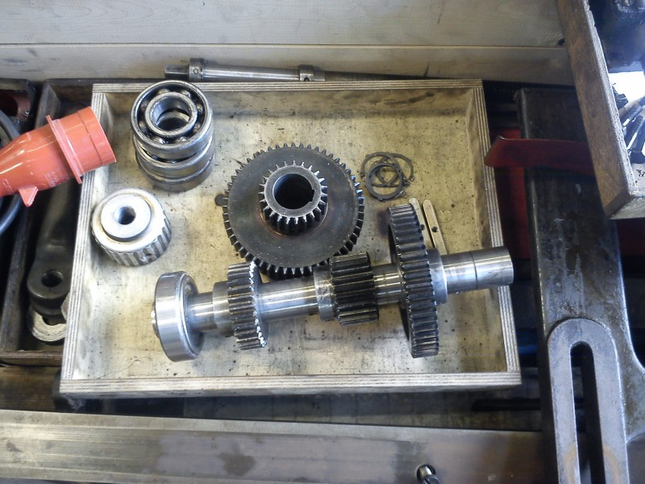

Dann wurde die Bremse/Reibkupplung mit Unmengen Kaltreiniger eingejaucht. _Danach_ war es kein Problem
mehr, den Dreck abzuwischen:

Als nächstes habe ich mich zusammen mit einem netten Helfer an das abschmirgeln des Tisches gemacht.
Ich denke, das Ergebnis kann sich sehen lassen:

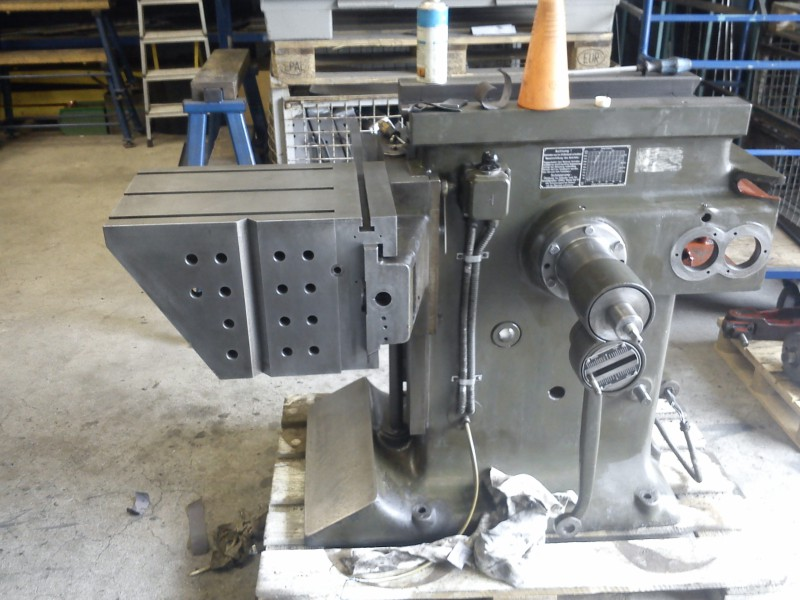

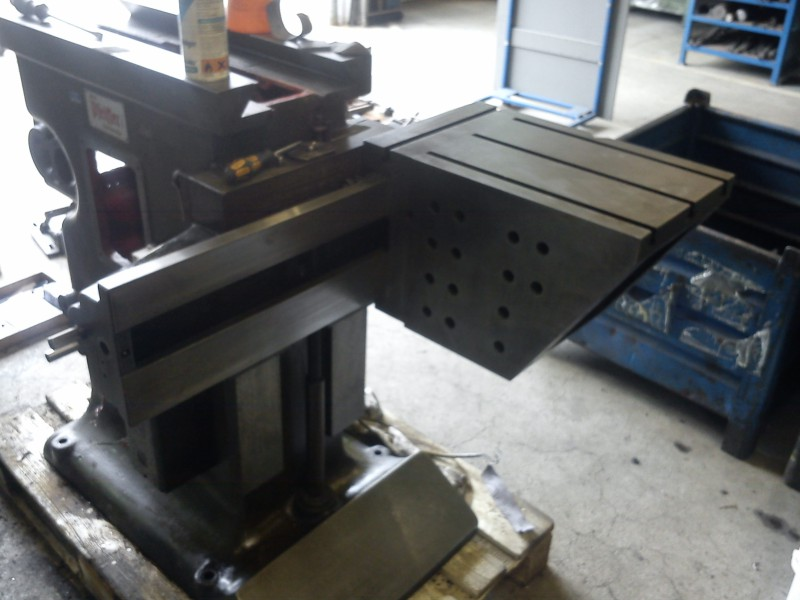

So macht es wieder Spaß, Teile aufzuspannen und abzuspanen :-D

Da ich im Moment keinen Platz in meiner Heimwerkstatt habe, kann ich glücklicherweise
den Hobel erstmal in der Werkstatt aufstellen und benutzen, in der ich ihn im Moment restauriere.
Zuerst mit dem Hubwagen (der Klopp stand noch immer auf der Palette von der Abholung) ans Ende der Kranschiene:

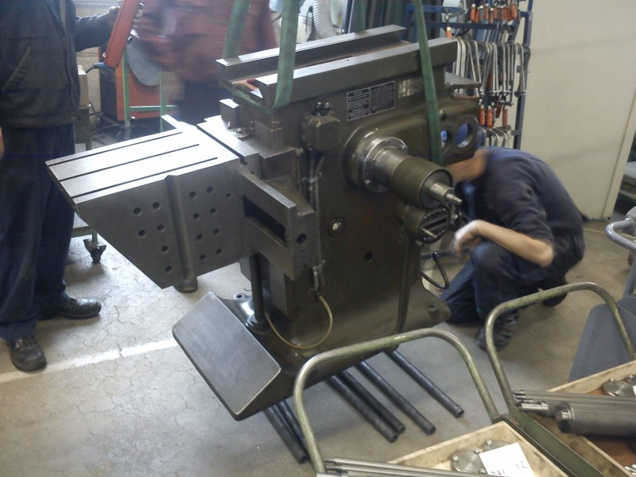

Dann auf Rohre umsetzen und an den Bestimmungsort fahren. Auf dem Tisch liegen schon die Zuganker, mit denen der Klopp dann im Boden verankert wird:

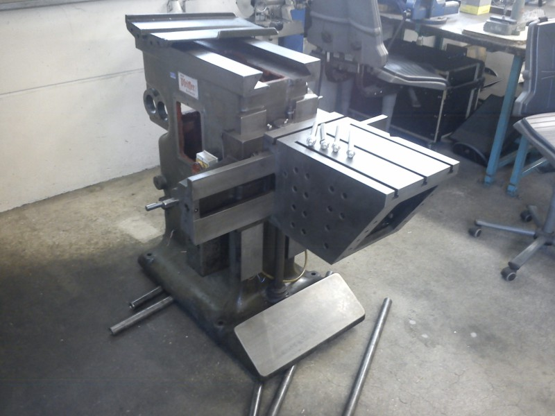

Nach Anzeichnen und Bohren der Löcher wurden die Zuganker mit einem Montagekleber
für solche Fälle (ähnlich Montageschaum) im Boden verklebt.
Da der Kleber aufquillt und ich die Maschine irgendwann mit nach Hause nehmen wollte,
mussten die Anker ohne draufstehende Maschine
verklebt werden. Ich denke, man kann sehen, wieviel Kleber hochgequollen ist:

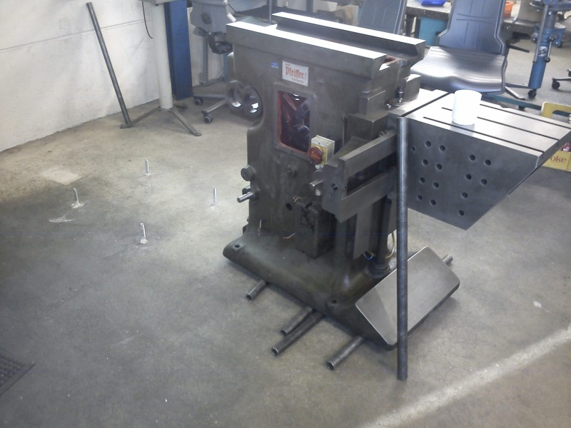

Dadurch tritt aber ein Problem auf: Wie kriegt man jetzt den (immer noch) sehr schweren Maschinenkorpus auf die Schrauben gehoben,
wenn der Kran nicht bis in diesen Teil der Halle fahren kann?

Ganz einfach: Mittels Wagenheber, Brechstange, U-Stahl und Stahlrohren und vielen Helfern konnte die Maschine auf Schienen gestellt werden;
dadurch ließ sie sich problemlos über die Schrauben fahren und dann duch Hin- und Herkippeln und stufenweises Absenken durch Einlegen von verschiedenen
Rohren bis auf den Boden absenken. Bitte habt Verständnis dafür, dass ich hiervon keine Bilder gemacht habe, ich war da ein wenig im Stress ;-)
So steht sie jetzt da; der Tisch wurde zwecks Gewichtsersparnis auch noch abgenommen, sodass die Spindelmutter auch noch
schön gereinigt werden kann.

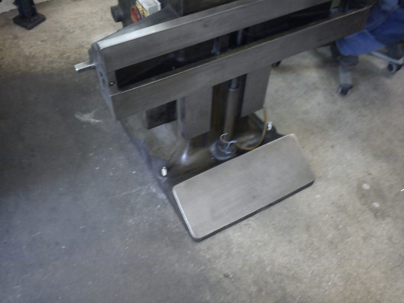

Morgen und in der nächsten Woche geht es dann an das Reinigen der Kleinteile und das Zusammenbauen und Einstellen.
Glücklicherweise wird die Maschine auch noch vom Elektriker der Werkstatt durchgemessen und abgenommen, sodass ich mich
darum nicht groß sorgen muss :freu:

An dieser Stelle möchte ich mich auch ganz herzlich bei den Meistern und Mitarbeitern der Werkstatt für die großartige Unterstützung
und ständige Offenheit für Fragen bedanken. Ohne sie wäre eine solche Aktion mir nicht möglich gewesen. Punkt.

Die Maschine wurde fertig ins Wasser gestellt (nicht im wörtlichen Sinne ;-) ) und am Boden verschraubt. Ich hab versucht,
an ihr zu rütteln, aber die Blase der Maschinen-WW hat sich nicht mal gerührt. Das sollte für den Betrieb ausreichen :pfeif:

Dann habe ich die Horizontalspindel auf die Drehbank gespannt und mit Drahtbürse und (bei stehender Maschine natürlich)
Lappen sie ein bisschen blank gemacht. Ausserdem wurden die Keilleisten für den Tisch gereinigt und wieder eingesetzt.
Grob eingestellt lässt sich schon sagen, dass der Tisch auf der rechten Seite (von vorn gesehen) etwas schwerer läuft als
auf dem Rest der Führung. Das Schabemuster ist dort auch noch am besten erhalten. Irgendwann muss wohl jemand (ich) das
mal nachschaben..

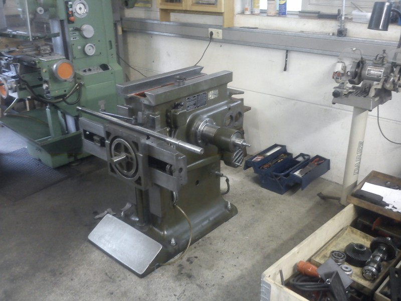

Übers Wochenende hab ich mir dann noch den Stösselkopf mit dem Vertikalschlitten mitgenommen. Ich glaube, ich bin
süchtig nach öligen und verharzten Findern geworden :-)

Nachdem das Wochenende mal Klopp-Pause war, ging es heute wieder in vollen Zügen weiter :-D

Als ersten hab ich den Tisch wieder befestigt und eingeölt. Die Indexstifte zum Ausrichten auf 0° sind auch
schon wieder drin:

Ausserdem hab ich das Handrad für die Horizontalverstellung wieder montiert und die Ratsche sitzt auch schon wieder:

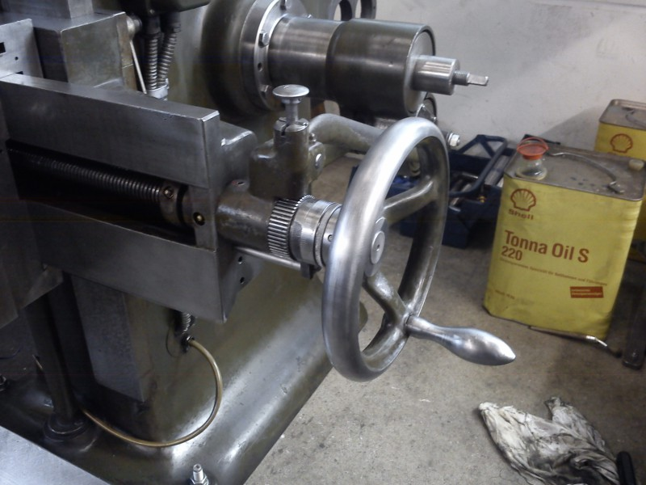

Ausserdem sitzt schon die erste, innere Welle im Getriebe samt Zahnrädern und neuen Lagern im Gehäuse.
Leider muss ich morgen aufpassen, dass die Handwerker unsere neue Haustür richtigrum einbauen und kann daher nicht
in die Werkstatt fahren. Daher muss leider der Bericht morgen ausfallen.

Neues Öl ist auch bestellt, das sollte dann pünktlich Mittwoch geliefert werden.

Auch heute ist wieder viel passiert.
Leider begann der Tag damit, dass ich meine Kamera zu Hause liegen gelassen habe :imstupid: :wall: , sodass
es heute leider keine Fotos gibt. Die werden aber morgen natürlich nachgereicht.

Der Tag begann damit, dass ich das Getriebe zu Ende zusammengesetzt habe. Die neuen Lager laufen
wunderbar leicht und sanft. Ich habe die äußeren Dichtringe (2RS-Lager) drin gelassen, sodass das Getriebeöl
die Lager mitschmiert, aber nicht rauskommt. Zudem ist die Welle, auf der das Schwungrad läuft, noch zusätzlich
mit den neuen Simmeringen abgedichtet. Der Getriebedeckel wurde dann auch wieder angebracht.
Er war mit einem schwarzen, Lack-ähnlichen Zeug abgedichtet. Ich habe jetzt aus einer Gummimatte
eine schöne Dichtung ausgeschnitten und hoffe, dass das erstmal reicht.

Dann wurde das schwarze Handrad zum manuellen Durchdrehen wieder blitzeblank(=blitzeschwarz, da Bakelit) gemacht und montiert.
Auch die Hebel für Kupplung und Schaltung wurden wieder blank gemacht und montiert.
Als nächstes habe ich die Motorwippe und Bremsmechanik wieder zusammengebaut.

Der Motor war dann dran und wurde geöffnet. Innen wurde er ausgesaugt. Leider ließ sich
das Reibrad nicht ohne weiteres Abziehen; über Nacht wirkt da jetzt Caramba drauf ein - mal sehen, ob sich morgen da was rührt.

Ach so, und heute sind noch 40l frisches Öl gekommen.

Zuerst mal ein paar Bilder, auf den man die gestern erfolgten Zusammenbauten erkennen kann:

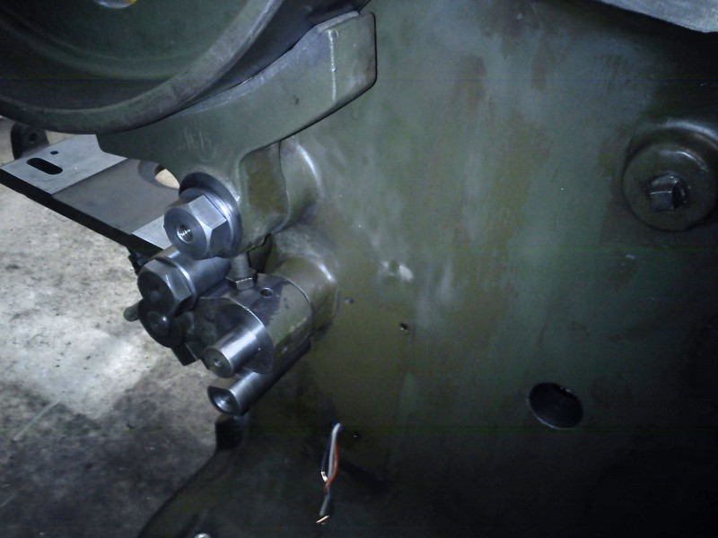

Ich hatte ja gestern die Motorwelle in Caramba ersoffen, um heute das Gummirad abzuziehen.
Leider hatte ich damit auch heute morgen keinen Erfolg und hab dann mal etwas kräftiger zugepackt.
Das Ende vom Lied: ka-pling, und der Deckel hatte einen Riss:

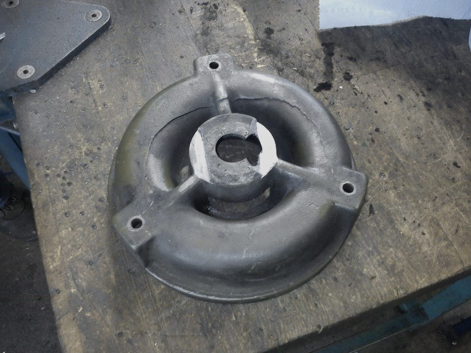

Nachdem der kleine Abzieher zu klein war und der große, den ich dann später auch genommen habe, zu dicke
Krallen hatte, um zwischen Motor und Nabe zu greifen, hab ich den Deckel (mit Flachstahl unterstützt)
in eine großen Handhebelpresse gelegt und mal zugelangt.

Die Sägemarken am Lagersitz stammen von danach, als der Abzieher Platz haben musste,
um die Stahlnabe der Reibräder zu greifen.
Schon doof ... :-(

Leider hat sich der innere Teil beim rausbrechen verkantet, sodass man das Teil nichtmal spannungsfrei gerichtet bekommt. Was man auf
dem Foto gar nicht sieht ist ein zweiter Riss an einem der Befestigungslöcher im äußeren, zylindrischen Teil,
der sich nach unten hin aufweitet. Evt. hätte man den Deckel also schweißen oder löten können,
aber nicht so spannungsarm, dass ich ihm weitere 20+ Jahre am Motor gegeben hätte; insbesondere, weil evt.
das vordere Lager unter der verdrehten Montageposition gelitten hätte.

Na ja, die Welle ist jedenfalls raus und die Gummiräder auch.
Hier sieht man den Übeltäter, der die Räder festgehalten hat:

Offensichtlich ist beim Zusammenbau vor ~50 Jahren ein Span in die Nut für den Sprengring gekommen und reingezogen worden.
Mit einem großen Abzieher, den ich mir freundlicherweise von einer benachbarten Werkstatt ausleihen konnte,
gingen dann aber die Räder ab.

Dann war es ein leichtes, die ollen Lager auch noch abzuziehen. Die neuen sind schon gekauft (je 1x 6205 u. 6206; jeweils 2RS):

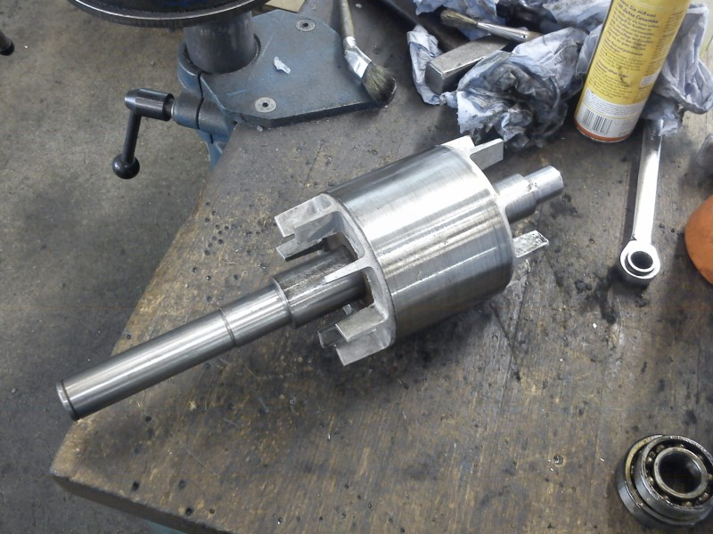

Für den kaputten Motordeckel ist schon eine Ronde Strangguss bestellt; die wird Dienstag geliefert. Wofür hat man schließlich
Fräs- und Drehmaschine mit Teilapparat und Planscheibe?

Ausserdem hab ich noch die Keilleiste für die Stößelführung wieder blank gemacht und eingeölt;
die Kurbelschwinge hängt auch schon wieder in der Maschine und wartet auf den Stößel, den ich heute zum Ende hin zu putzen angefangen habe.

Dann war noch kurz der Elektriker da und hat sondiert, was neu gemacht werden muss:
 - Motorschutzschalter
 - Wiederanlaufschutz
 - Tastschalter für Kupplungs/Bremshebel
 - evt. neuer Schaltkasten

Den Stößel habe ich heute fertig geputzt.
Erfreulicherweise waren beide Ölleitungen (bzw. die gesamte eine) noch frei,
sodass ich sie zum Ausblasen nicht ausbauen musste.
Auch den Vertikalvorschub hab ich wieder ein bisschen aufgehellt, hier zu sehen:

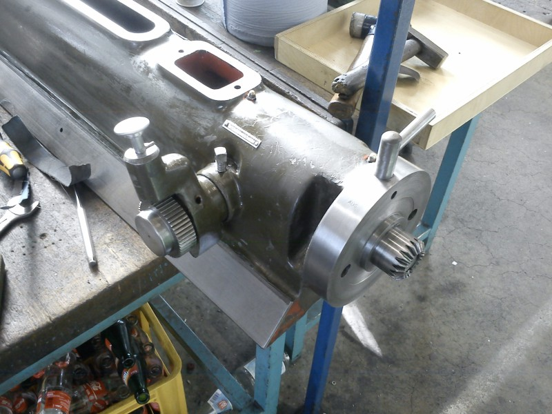

Dann konnte der Stößel auch wieder eingebaut werden. Die Kurbelschwinge saß ja schon gestern drin.
Man bekommt leider den Stößel weder raus noch rein, wenn man nicht die Welle, auf der die Schwinge
unten geführt ist, rauszieht. Um die Distanzstücke, die den Gleitstein unten auf Position halten, auf diese Welle aufzuschieben,
muss man leider mit dem Arm bis zur Schulter in die Maschine kriechen :-D Hat für viel Heiterkeit bei den Kollegen gesorgt ;-)
Der Ölvorrat im Stößel wurde dann auch wieder mit Bettbahnöl aufgefüllt.

So sieht das doch schon wieder ein bisschen nach Stossmaschine aus, oder ?

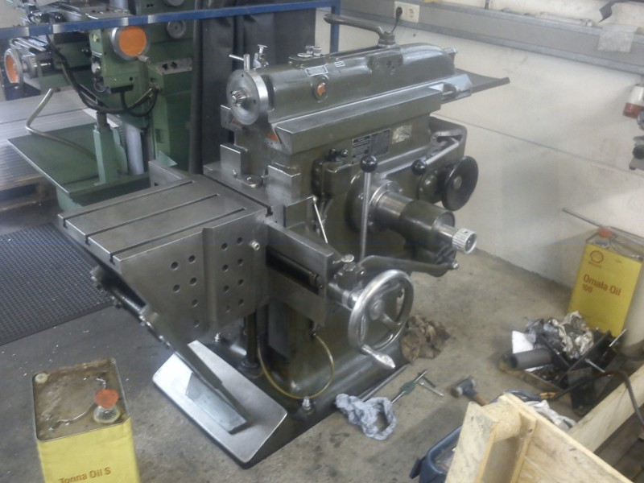

Die blanken Stellen sind größtenteils mit Schmirgelleinen bearbeitet;
bis auf die Führungen, da war ein Ölstein dran.
Für die Fettverkrustungen hat abwechseld Kaltreiniger und ein Zeug names Multi-Öl geholfen, jeweils kombiniert mit ordentlich Muskelschmalz.
Allerdings war auch nicht viel Rost dran. Das meißte war einfach Dreck und Flugrost, der schon beim Anschauen abgegangen ist.

Der Antrieb des Stößelschlittens funktioniert wie folgt:

An der Seite des Stößels ist eine Ratsche, die beim Rückzug "ausgelöst" wird. Die treibt über eine gebremste Welle mit zwei Winkelgetrieben
(eins um von quer nach längs zum Stößel umzulenken und eins in der Verbindung Vertikalschlitten-Stößel) die Vertikalspindel am Stößelkopf an.
Das Zahnrad, das man an der Stößelnase sieht, ist Teil des zweiten genannten Getriebes. Es lässt sich per Hebel vor- und zurückschnappen,
sodass der Vorschub auch ausgekuppelt werden kann.

Die Ratsche fährt gegen eine längs zum Stößel verschiebbare "Auffahrt-Leiste".
Das ist einfach ein Stück Flachstahl, der nach vorn hin flacher wird (auf den vorderen 50mm etwa 10mm von der Oberkante).
Dadurch "läuft" die Ratsche beim Stößelrücklauf diese "Auffahrt" hinauf und löst bei einem bestimmten Punkt aus.
Unten ist diese Auffahrt-Leiste längs geschlitzt und kann auf einem fest angeschrauben Stück Flachstahl mittels Klemmschrauben
an einer beliebigem Position arretiert werden. Dadurch kann man den Vertikalvorschub bei jeder Hublage und -länge nutzen.

Hier hab ich mal zwei Fotos vom Vertikalvorschub, den ich heute wieder montiert habe:

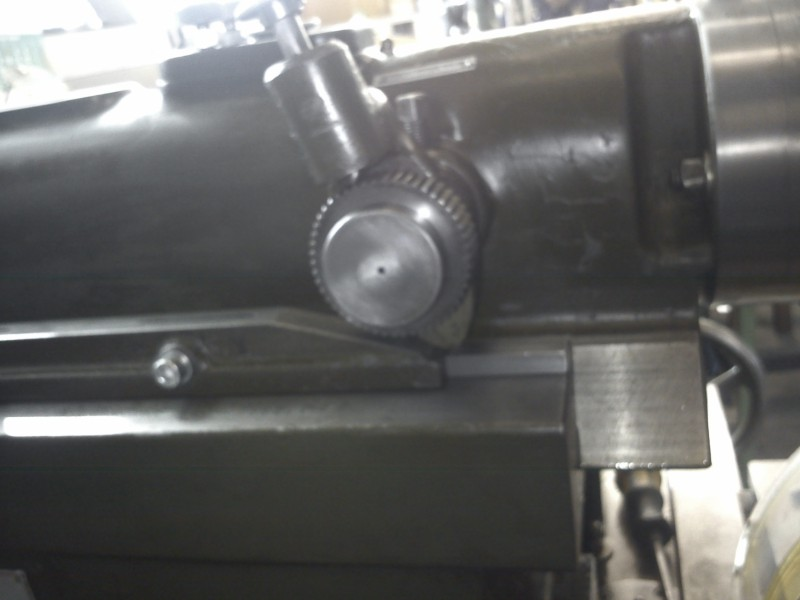

Der Stößelschlitten (oder heißt das Ding anders?) war dran bzw. ist es jetzt:

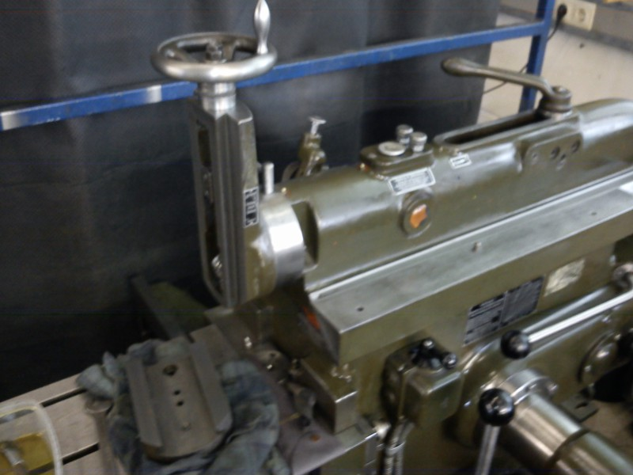

Leider hat das Kegelzahnrad auf der Spindel ein bisschen Verschleiß, aber ich denke, das funktioniert noch:

Hier sieht man auch noch schön die Schabung an der Führung, die meiner Meinung nach für DAS Alter noch recht ordentlich ist.

Dann noch den Schlitten druff und dat wars auch schon:

Die Meißelklappe bzw. Clapperbox ist heute wieder dran gekommen:

Auch der Endabschalter für den Horizontalvorschub ist wieder gesäubert und montiert:

Der Lampenhalter ist auch wieder dran:

Die Lampe muss ich noch machen; kommt noch...

Dann war der Meisselabheber dran, bzw. die Mimik, die dazu gehört:

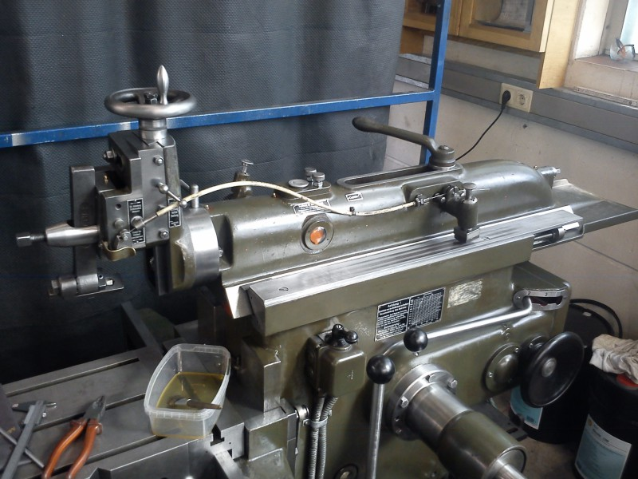

Hier nochmal der Stahlhalter (ein Comet FH-2), leider der einzige, den ich im Moment habe.
Dafür kann man in diesen 12*12mm-HSS-Drehlinge einspannen und fährt somit sehr günstig.
Zum Größenvergleich mal mit GMS daneben:

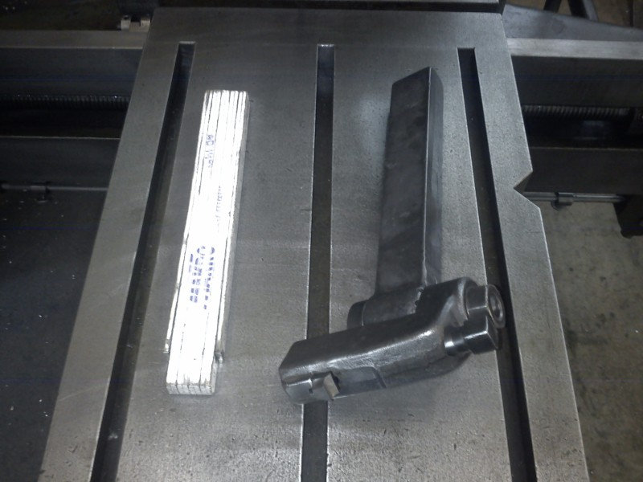

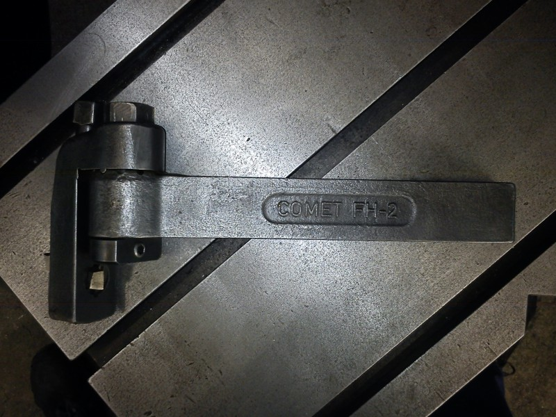

Als dann (bis auf Motor und Lampe) alle Anbauteile wieder dran waren, wurde auch wieder Öl eingefüllt.

Und hier die ganze Maschine noch mal in voller Pracht, deshalb auch in der höchsten zugelassenen Auflösung (Modem-Nutzer mögen mich steinigen):

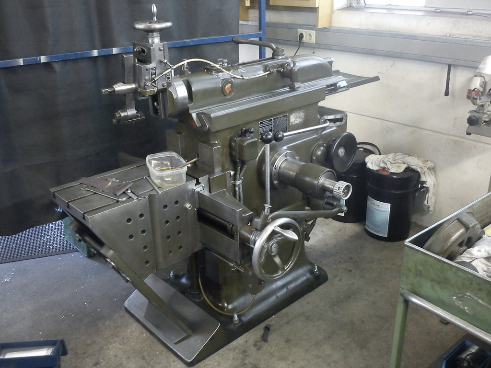

Die Gussronde ist heute gekommen, Drm. 250, l 80, GG25 :-)

Heute hab ich erstmal den Stator des Motors und den hintere Deckel zu Ende geputzt:

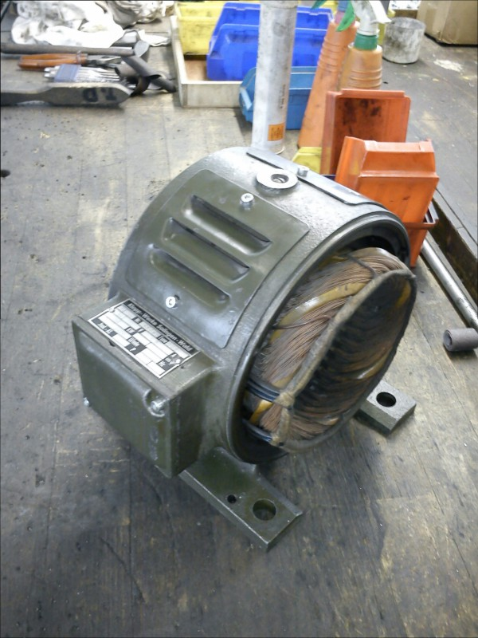

Dann ging es mit dem vorderen Motordeckel los, den ich ja komplett neumachen muss.

## Motordeckel

Die Geschichte beginnt mit 28,7 kg GG-25 in Form einer Ronde von 250mm Durchm. und 80mm Länge:

Ich habe die Ronde ø250, l80 bei [Richter Kiel](http://richter-kiel.de/) für 77,nochwas € gekauft.

BTW, dies ist die Maschine, auf der ich den Deckel und sonstige Sachen fertige:

Dann hab ich extra das große 250er Vierbackenfutter aufgesetzt und den Klotz aufgespannt:

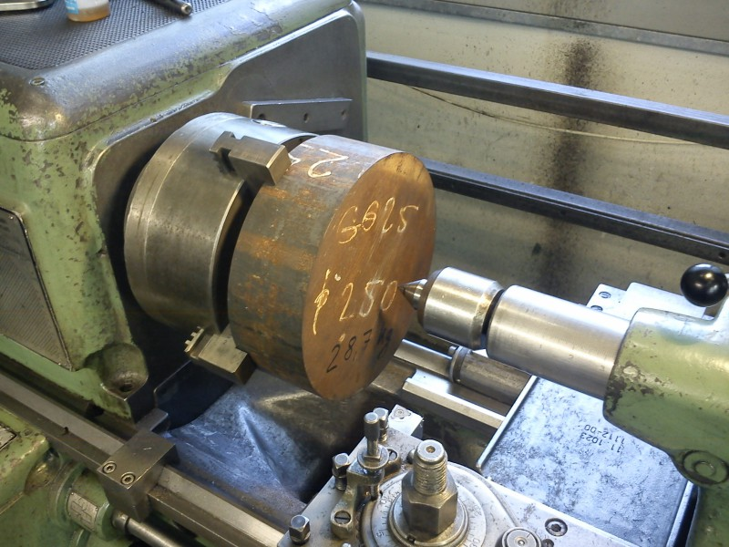

Erstmal außen überplanen:

Auch an der Stirnseite:

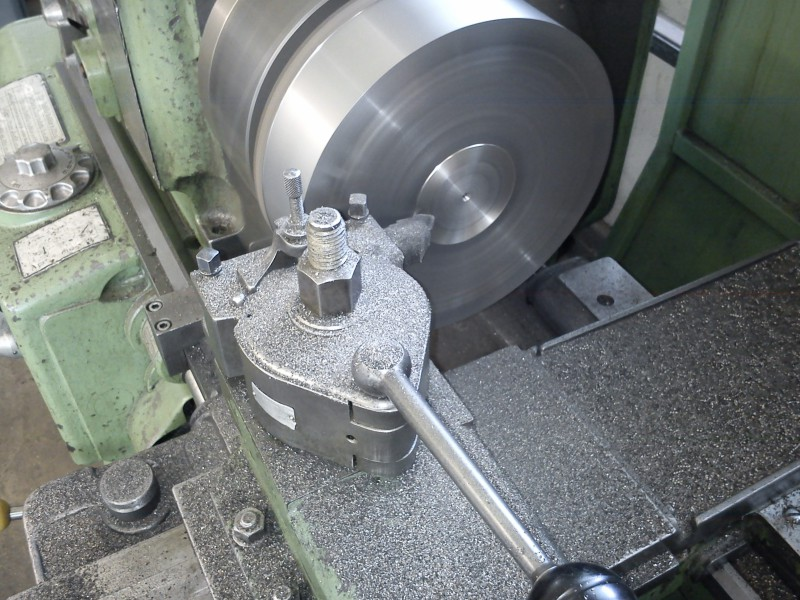

Dann das Ganze umdrehen, Absatz und andere Stirnseite planen:

Außenmaß fertig gedreht:

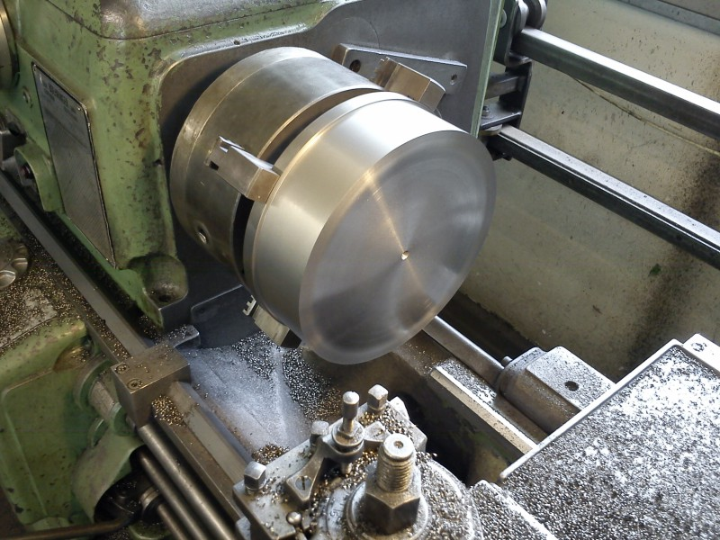

Durchbohren; keine Sorge, ich hab mit was kleinerem angefangen:

Bohrung ausdrehen:

Gehäusesitz vorbereiten:

Absatz, in den später das Kugellager eingesetzt wird, stirnseitig planen:

Mal eine Zwischenbilanz, was heute an Spänen geflogen/-spritzt ist:

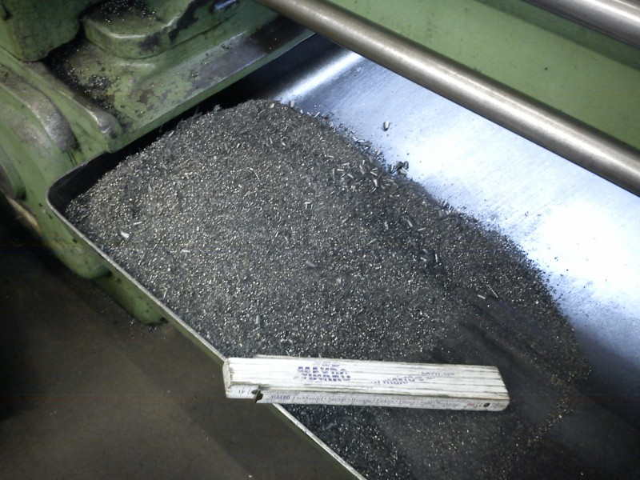

Da soll es mal hingehen:

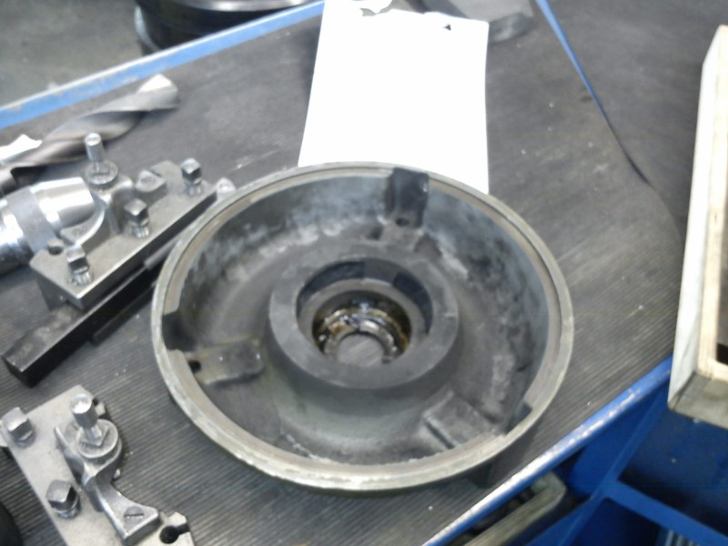

Fazit: Guss ist immer ekelig zu drehen, aber in den Mengen hatte ich bis heute noch nicht damit zu tun.
Also eine neue Herausforderung...

Die Innenseite des Deckels werde ich inklusive der beiden Passungen in einer Aufspannung (der jetzigen) auf der Drehbank machen.
Dann kommt das Teil mit der Innenseite nach unten auf den Rundtisch auf der Fräse und dort werden dann
die komplette Außenseite und die Lüftungsschlitze gefräst.

Heute hab ich mich dann dran gemacht, den Platz für die Wicklungen freizudrehen
und die äußere Gehäusepassung gefertigt.
Es begann damit, mit einem Abstechmesser eine Stufung einzubringen, um dann von innen nach außen
mit einem Bohrstahl den Raum auszuarbeiten:

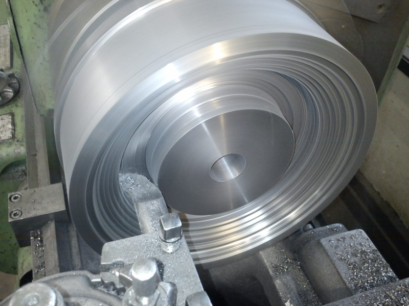

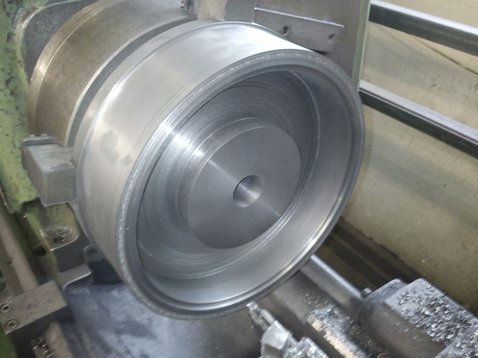

Dann wurden mit einem 8mm-Radius-Formstahl die Ecken nachgearbeitet, um Risse im Guss durch zu scharfe
Ecken zu vermeiden:

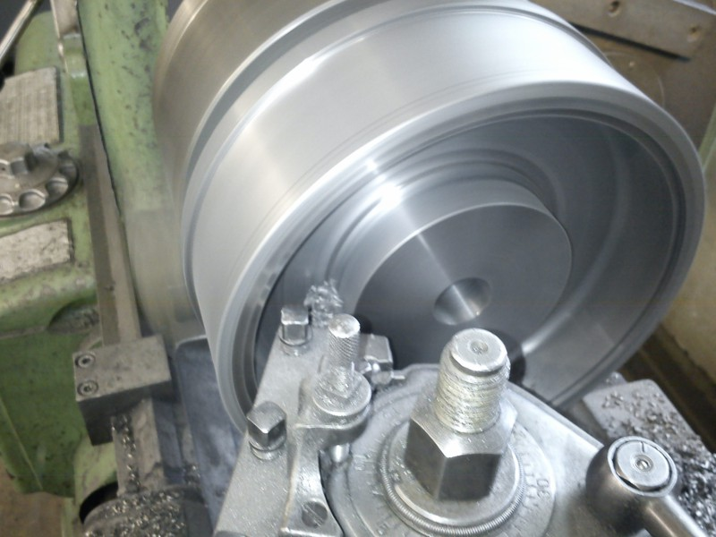

Die Aushöhlung, die später von außen angefräst wird für die Lüftungsschlitze:

Wieder ein paar Späne angefallen:

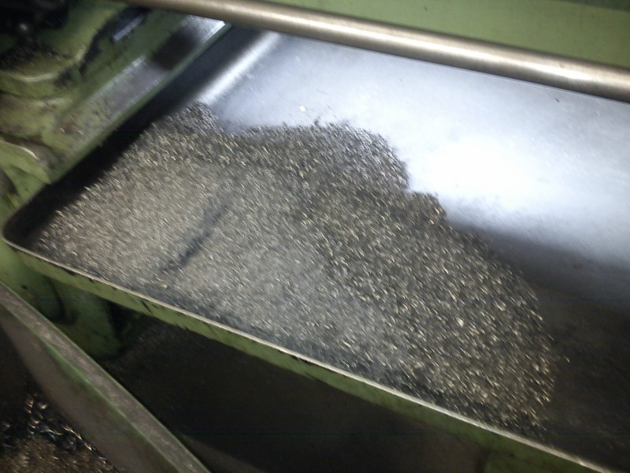

Endstand fürs Wochenende; Montag kommt dann der Lagersitz noch rein und dann geht es nach ein paar Fasen
auf die Fräsmaschine:

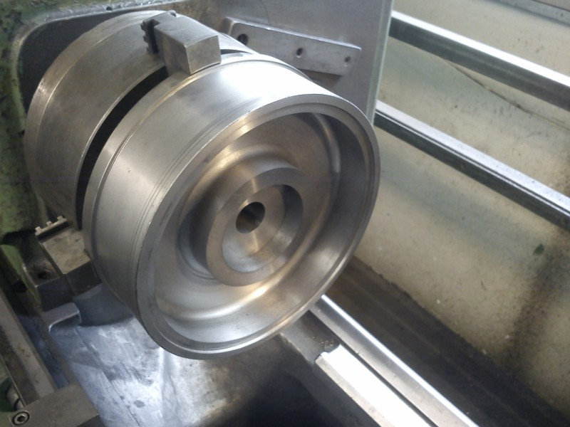

Erstmal in der alten Aufspannung den Lagersitz gedreht:

Dann mal anprobiert: Welle lässt sich problemlos drehen und klappert nicht;
Deckel geht stramm auf das Gehäuse drauf:

Dann umgespannt und auf Länge gedreht:

Ich habe den Reitstock trotz der geringen Ausspannung benutzt,
weil innen der Deckel ja schon ausgedreht war.
Daher hab ich die Backen nicht voll angeknallt, um die "Wandung" nicht nach innen einzudrücken.
Die hat zwar noch 10mm Dicke, aber besser Vorsicht als Neumachen.
Ausserdem musste ich immerhin 20mm Dicke mit 250mm ø zerspanen.
Da ich da nicht bis morgen dransitzen wollte,
hab ich ein bisschen Gas gegeben und lieber mit Reitsock gearbeitet.

Ein paar Radien sehen immer besser aus:

Wieder paar Späne gemacht; das war's dann von der Drehbank:

Auf der Fräse wurden 3 Befestigungslöcher gebohrt:

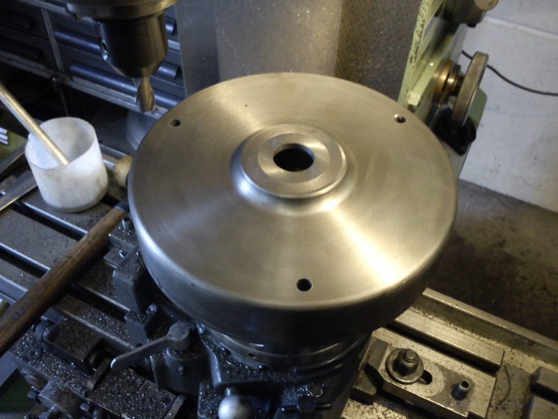

Lüftungsschlitze gefräst; leider hab ich mich beim ersten mit der Dicke des innen stehenden
Wulstes verschätzt und hab zu weit außen gefräst; wird aber funktionieren:

Das Ganze von innen:

Morgen dann noch die Befestigungslöcher innen freistellen (die liegen halb in der Wandung und der Bohrer hatte sich bisschen weggedrückt)
und die Löcher ansenken; dann noch ein bisschen Farbe und fertig ist das Teil.

Soo, und fertig ist das Teil.

Ich hab eben noch die letzten Ausfräsungen für die Befestigungsgewindestangen gemacht und
den Deckel mal probeweise montiert:

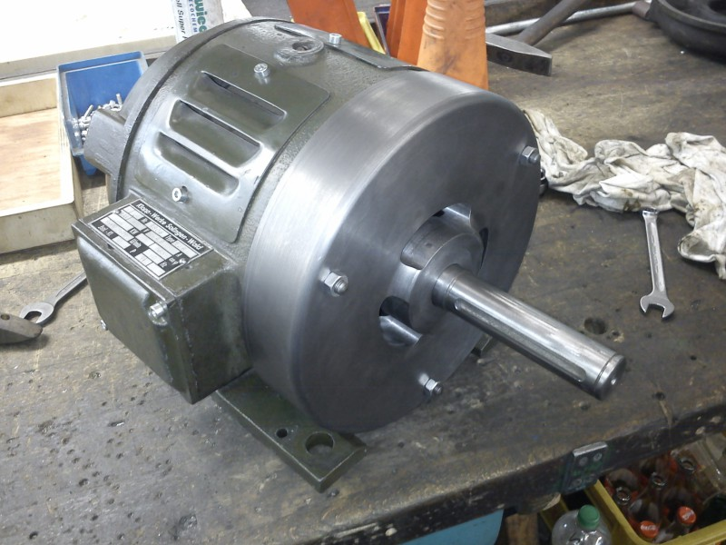

Passt!

Dann noch einmal abnehmen und Reseda drüber (als Anfang, damit ich den bei der kompletten Neulackierung nicht
nochmal neu lackieren muss). Das fällt im Moment auch nicht auf, weil da im Betrieb das Schwungrad und
ein riesiger Deckel drüber sind.

Nachdem der neue Motordeckel jetzt fertig ist, hab ich mal die Filzabstreifer, die ich freundlicherweise
vom Mitgleid "Tyler D." bekommen hatte, montiert und die Lampe geputzt und auch wieder angebracht:

Dann hab ich mich zum Ende hin noch an den Schraubstock gemacht; zerlegt ist er schon,
aber noch nix Vorzeigbares geputzt. Der ist das letzte Teil, das noch von Rost und Dreck befreit werden muss.

Was heute passiert ist:

Motor montiert: (ja, ich weiß, dass die Farbe der Maschine einen Stilbruch zum Deckel darstellt)

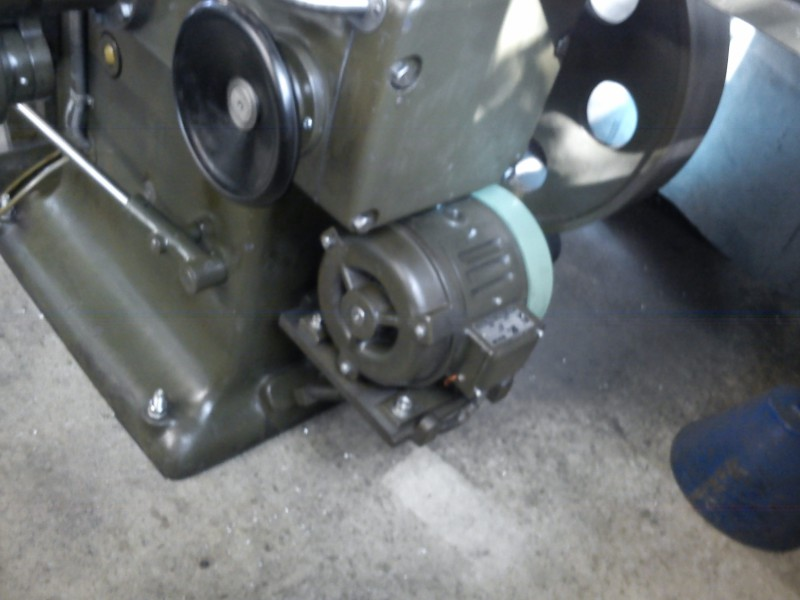

Schraubstock geputzt und montiert:

Dann mal per Handantrieb ein paar Hübe gestoßen: im Prinzip funktioniert die Maschine,
aber auf Grund der Schnittgeschwindigeit, die per Hand nicht vorhanden ist, war die Oberfläche
eher bescheiden.

Elektrik fehlt immer noch, kommt hoffentlich morgen:

So steht er jetzt da, mein Klopp:

Möge er treue Dienste leisten!

Diese Teile sind bei der Aktion übrig gebliegen:

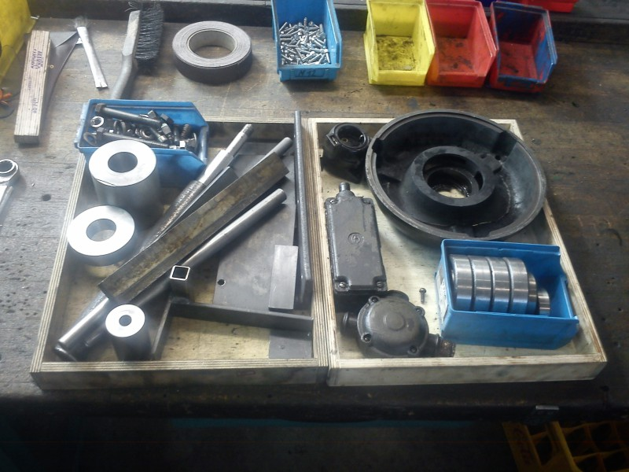

u.a.: alte Lager aus Getriebe und Motor; Abzieher fürs Schwungrad; gehärteter Mega-Austreiber für die Kegelstifte im Getriebe;
Hülsen und Ringe, um die neuen Getriebelager verzugsfrei einzupressen; Vorrichtung, um die Zuganker senkrecht im Boden zu verkleben;
alte Elektrik; alte, ausgetauschte Schrauben und sonstiges Befestigungsmaterial; der kaputte Motordeckel, usw.

## Vertikalvorschub

Ich hab mal auf Bitte eines Forenmitglieds eine Zeichnung von der Leiste für den Vertikalvorschub gemacht und möchte euch die nicht vorenthalten.
Verwendet hab ich dazu Inventor 2009, falls es Versionsprobleme geben sollte.

[Vertikalvorschubleiste.pdf](Vertikalvorschubleiste.pdf)

[Vertikalvorschubleiste_Inventor.zip](Vertikalvorschubleiste_Inventor.zip)

## erweiterte Unterlagen

ich hab gestern von einem netten eBay-Mitglied eine Kopie seiner Unterlagen zu einem
zu verkaufenden Klopp 550 bekommen :-D
Damit ihr auch was davon habt, hab ich mal ein paar Scans gemacht und die zusammen
mit der schon vorhandenen Betriebs- und Schmieranweisung in ein pdf gepackt:

[Klopp_375-550_erweitert.pdf](Klopp_375-550_erweitert.pdf)

Neuerungen:
 - hübschere Deckblätter
 - Schaltplan
 - Maschinenkarte
 - Hobelstähle von Hauser & Ruppert (Katalogseiten)
 - mMn sinnvollere Reihenfolge der Seiten

## Umzug

Nachdem hier ein halbes Jahr lang nichts mehr passiert ist, erzähle ich mal die Geschichte
meines Klopp 550 weiter.

Aus persönlichen Gründen musste ich im Oktober letzten Jahres umziehen, und damit
auch meine Stoßmaschine. Durch Zufall wurde ich in Kiel, wo ich jetzt wohne, auf ein kleines
Museum aufmerksam, in dessen Werkstatt ich die Maschine unterstellen kann. Nebenbei habe
ich dadurch auch wieder eine richtige Werkstatt zur Verfügung (Studentenbude ist zum Spänemachen
nicht soo der Hit).

Als erstes habe ich ein Untergestell für den Klopp zusammengebraten, damit man ihn im Fall der Fälle
mit einem Hubwagen umsetzten kann:

Dann habe ich mich an die letzte zu erledigende Sache (vor dem Neuschaben aller Führungen),
nämlich die Elektrik, gemacht. Also erstmal ohne Sinn und Verstand den alten Kram abgerissen:

und Neues eingekauft:

Dann die Wellschläuche (gibts sogar beim großen C :o ) angedengelt und Kabel durchgestopft:

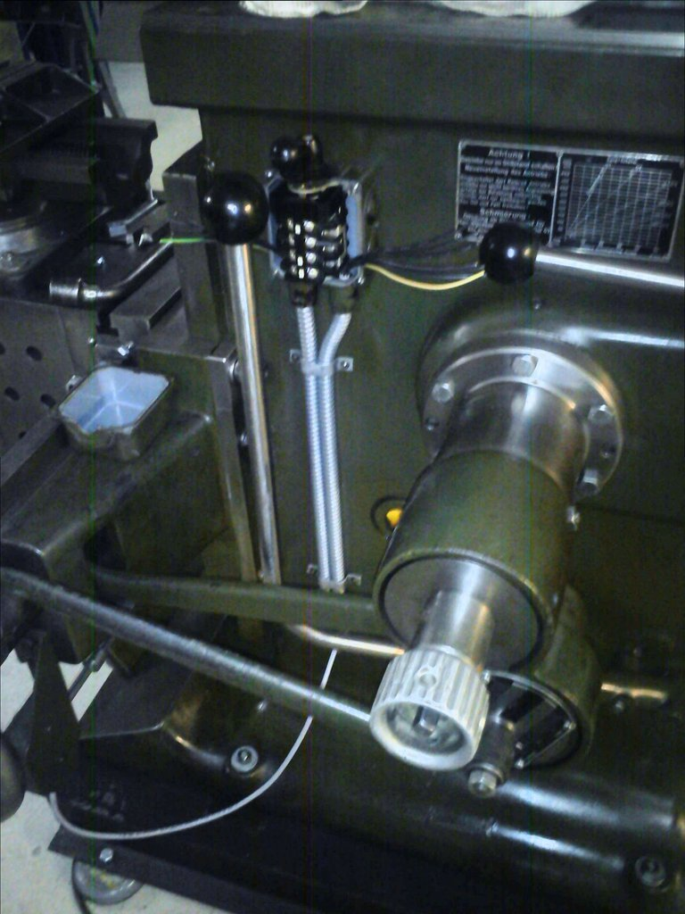

Als nächstes stand dann die Verdrahtung der Schalttafel an, die ich eben abgeschlossen habe:

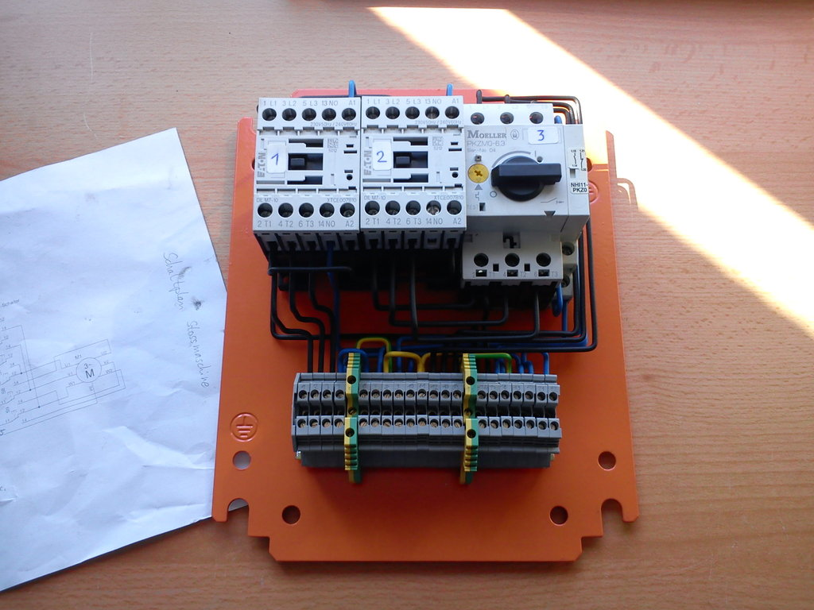

Diese wird in dem kleinen Schaltschrank montiert.
Ich habe die originale Schaltung etwas modifiziert, u.a. gibt es jetzt einen Wiederanlaufschutz nach Stromausfall,
eine zweite, mit dem Motor zusammen geschaltete Steckdose (wofürauchimmer ;-) ) und Schütze,
die die nächsten 10 Jahre nicht anfangen zu brummen sollten sowie natürlich
Kabel mit einer Isolierung, die nicht vom Schief-Ansehen abfällt.

Für die Interessierten gibt es hier noch den neuen Schaltplan:

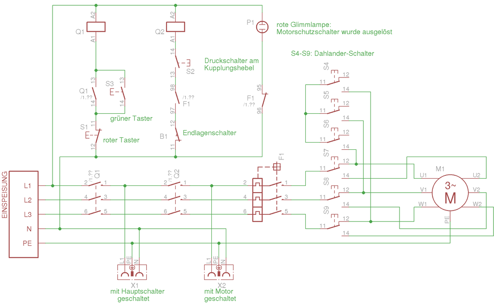

Bevor ich die Elektrik völlig zerlegt hatte, konnte ich es mir nicht verkneifen, direkt an den Dahlander-Schalter mal
ein Drehstromkabel anzuklemmen und die Stoßmaschine laufen zu lassen.
Ich muss schon sagen, dass einem das Ding gehörig Respekt einflößt!
Aber Späne macht das Maschinchen, ich kann euch sagen ...
